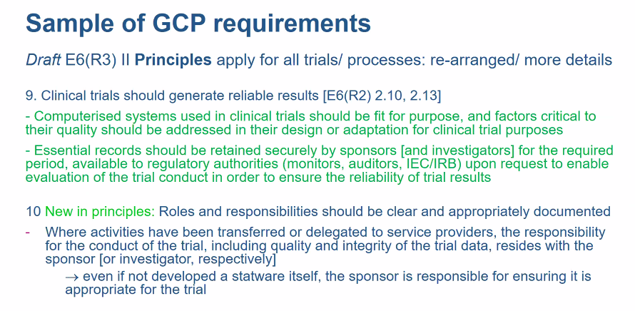

```{r setup, include=FALSE, echo = FALSE,message = FALSE, error = FALSE, warning = FALSE}
knitr::opts_chunk$set(echo = TRUE, fig.width = 10, fig.height = 6)

# <!-- ---------------------------------------------------------------------- -->
# <!--                    1. load the required packages                       -->
# <!-- ---------------------------------------------------------------------- --> 

## if(!require(psych)){install.packages("psych")}

packages<-c("tidyverse", "kableExtra", 
            "gtsummary","inTextSummaryTable",
            "Hmisc","htmltools","clinUtils")

ipak <- function(pkg){
  new.pkg <- pkg[!(pkg %in% installed.packages()[, "Package"])]
  if (length(new.pkg)) 
    install.packages(new.pkg, dependencies = TRUE)
  sapply(pkg, require, character.only = TRUE)
}
ipak(packages)
 


# <!-- ---------------------------------------------------------------------- -->
# <!--                        2. Basic system settings                        -->
# <!-- ---------------------------------------------------------------------- -->
setwd(dirname(rstudioapi::getSourceEditorContext()$path))
getwd()
Sys.setlocale("LC_ALL","English")


## Open the folder
# open_folder <-function(dir){
# 	if (.Platform['OS.type'] == "windows"){
# 	shell.exec(dir)  
# 	} else {
# 	system(paste(Sys.getenv("R_BROWSER"), dir))
#   }
# }
# open_folder(getwd())

## convert backslash to forward slash in R
# gsub('"', "", gsub("\\\\", "/", readClipboard()))

### get the path
# rstudioapi::getSourceEditorContext()$path
# dirname(rstudioapi::getSourceEditorContext()$path)

### set working directory
# getwd()
# setwd("c:/Users/zbai/Desktop")
# Sys.setlocale("LC_ALL","English")

### get the R Version
# paste(R.Version()[c("major", "minor")], collapse = ".")

### convert backslash to forward slash 
# scan("clipboard",what="string")
# gsub('"', "", gsub("\\\\", "/", readClipboard())) 

## Load all r functions
## The directory where all source code files are saved.
source_code_dir <- "C:/Users/baiz/Downloads/Data-Analyst-with-R/00 R Function/ZB Function/"  
file_path_vec <- list.files(source_code_dir, full.names = T)
for(f_path in file_path_vec){source(f_path)}

# <!-- ---------------------------------------------------------------------- -->
# <!--                         3. Import the datasets                         -->
# <!-- ---------------------------------------------------------------------- -->

# <!-- ---------------------------- -->
# <!-- --3.1 Import csv data ------ -->
# <!-- ---------------------------- -->

# pfad <- "~/Desktop/SASUniversityEdition/myfolders/Daten"
# mydata1 <- read.csv(file.path(pfad, "yourcsv_data.csv"), 
#                     sep=";", 
#                     header=TRUE)   

## Import all csv data from folder
# list_csv_files <- list.files(path = "./csvfolder/")
# do.call(rbind, lapply(list_csv_files, function(x) read.csv(x, stringsAsFactors = FALSE)))

# <!-- ---------------------------- -->
# <!-- --3.2 Import xlsx data ----- -->
# <!-- ---------------------------- -->

# library(readxl)
# mydata2 <- read_excel("C:/Users/zbai/Documents/GitHub/R-Projects/SAS/Yimeng/results-text.xlsx")

# <!-- ---------------------------- -->
# <!-- --3.3 Import sas7dbat data - -->
# <!-- ---------------------------- -->

# library(sas7bdat)
# mydata3 <- read.sas7bdat("~/Desktop/SASUniversityEdition/myfolders/Daten/uis.sas7bdat")

## Import all sas7dbat data from SASfolder
# ZB.import.sas.folder("./SASfolder/")

# <!-- ---------------------------- -->
# <!-- --3.4 Import from copyboard --->
# <!-- ---------------------------- -->
# copdat <- read.delim("clipboard")
# Data_D01 <- copdat

# <!-- ---------------------------------------------------------------------- -->
# <!--                           4. Some Tools                                -->
# <!-- ---------------------------------------------------------------------- -->

## To check out vignettes for one specific package
# browseVignettes("sjPlot")      ## sjPlot for Models Summary
# browseVignettes("gtsummary")


# <!-- ---------------------------------------------------------------------- -->
# <!--                           5. Citation                                -->
# <!-- ---------------------------------------------------------------------- -->
# citation("gtsummary")
# <!-- ---------------------------------------------------------------------- -->
```

<!-- ----------------------------------------- -->

<!-- -----------Mind Map of ToC--------------- -->

<!-- ----------------------------------------- -->

```{r mind map,echo = F,message = FALSE, error = FALSE, warning = FALSE}
library(mindr)
input <- rstudioapi::getSourceEditorContext()$path 
input_txt <- readLines(input, encoding = "UTF-8")
## Widget Output
mm_output <- mm(input_txt, 
                output_type = c("widget"),
                root = "")
mm_output$widget
```

<!-- ----------------------------------------- -->

<!-- --------------CSS Define----------------- -->

<!-- ----------------------------------------- -->

```{=html}
<style>
.bold-list-257f96 + ol {
    font-weight: 900;
    color: #257f96;
}
.bold-list-ff9900 + ol {
    font-weight: 900;
    color: #ff9900;
}
</style>
```

<!-- ----------------------------------------- -->
# Session 4: Patient preferences

*Chairs: Heidi Mestl (NOMA, NO; SAWP member) and Giulia Zigon (GSK, IT)*

## S4-Talk 1: Industry case study. How a patient preference study impacted the approval/SmPC. 

*Speaker: Brett Hauber (Pfizer, US)*

### Case Study Overview {-}

- **Condition of Focus**: Alopecia areata, a significant inflammatory condition leading to hair loss not only on the scalp but potentially also on other parts of the body. Understanding the impact of this condition on patients is crucial for developing effective treatments.
- **Treatment Development**: The treatment in question involves a new molecular entity, with a submission made for marketing authorization to the CHMP (Committee for Medicinal Products for Human Use). The treatment involves a class of medications known as Janus kinase (JAK) inhibitors.
- **Objective**: To understand and integrate patient preferences regarding the trade-offs between the benefits of the treatment and its potential risks, including serious side effects known to be associated with JAK inhibitors.
- **Discrete Choice Experiment**: A key method used in this study to elicit patient preferences. This type of experiment allows researchers to quantify the value patients place on different aspects of treatment, such as efficacy and side effects.
- **Benefit-Risk Trade-offs**: The results from the discrete choice experiment are applied to clinical data to illustrate the perceived benefits and risks from the patients’ perspectives. This approach helps to demonstrate the value of the treatment in terms that are meaningful to patients and align with their preferences.
- **Risk Profile**: As with other treatments in the JAK inhibitor class, there are significant potential risks, including serious infections, thromboembolic events, and malignancies. Part of your work involves assessing whether the new treatment shares these risks to the same extent as other drugs in the class.
- **Long-term Data**: There is an acknowledged gap in long-term safety data, which poses challenges for fully understanding the risk profile of the new treatment.


**Research Objectives**

1. **Elicit Patient Preferences**: Understanding what attributes of treatments for alopecia areata (AA) are most important to patients. This involves quantifying how patients value different aspects of treatments including efficacy and side effects.

2. **Estimate Maximum Acceptable Risks (MAR)**: Determining the level of risk patients are willing to accept from JAK inhibitors, given their potential side effects such as blood clots, serious infections, and cancer, relative to the treatment benefits.

3. **Preference Shares**: Estimating the proportion of patients who would prefer a specific treatment dose (ritelcitinib 50 mg once daily) over no treatment or other dosages based on their assessed benefits and risks.

4. **Rank Probabilities**: Comparing the benefit-risk profiles of different treatment dosages (ritelcitinib 50 mg once daily vs. placebo and vs. ritelcitinib 30 mg once daily) to determine which might be preferred by patients under varying scenarios of efficacy and risk.

### Research Methods {-}

```{r , echo=FALSE, fig.align="center", out.width = '75%'}
knitr::include_graphics("./02_Plots/S41_Casestudy.png") 
```


- **Discrete Choice Experiment (DCE)**: Utilizing DCE to gather data on patient preferences, where patients are presented with hypothetical treatment scenarios featuring different combinations of benefits and risks.

- **Statistical Models and Analyses**:
  - **Interacted Error-Components Multinomial Logit Model (IEC-MNL)**: A sophisticated choice modeling approach that accounts for variations in patient responses based on the attributes presented.
  - **Stochastic Multicriteria Acceptability Analysis (SMAA)**: Used to calculate the probabilities of different treatment options ranking highest for individual patients, considering the uncertainty in patient preferences.

- **Application of Data**:
  - The efficacy and safety data from clinical trials are combined with the preference weights derived from the DCE. This integration allows for the calculation of MAR and the estimation of preference shares and rank probabilities for different treatment options.

**Visualization and Decision Support**

- The diagrams illustrate how different data inputs (efficacy and safety) and analytical methods (DCE, IEC-MNL, SMAA) interconnect to produce outputs that directly inform regulatory and clinical decision-making:
  - **Maximum Acceptable Risk and Preference Shares**: These outputs inform how much risk is acceptable to patients in exchange for the benefits provided by the treatment.
  - **Rank Probabilities**: These help quantify how likely it is that patients would prefer one treatment option over another, providing a clear picture of patient-centered benefit-risk assessment.

### Discrete Choice Experiment (DCE) {-}

The Discrete Choice Experiment (DCE) that you described is a powerful tool used in health economics and outcomes research to understand patient preferences regarding different treatment options. 

1. **Survey Methodology**:
   - **Purpose**: DCEs are conducted to elicit preferences from respondents (patients, healthcare providers, etc.) about various attributes of treatments or healthcare interventions.
   - **Structure**: Respondents are presented with a series of hypothetical scenarios or profiles that describe different treatment options. Each profile differs based on attributes such as benefits, risks, mode of administration, and cost.

2. **Attributes and Levels**:
   - **Attributes**: These are the characteristics of the treatments being evaluated. For instance, in a study for a medication, attributes might include efficacy, side effects, dosage form, and cost.
   - **Levels**: Each attribute has different levels, which represent varying degrees of that characteristic. For example, efficacy might be categorized into low, medium, and high.

3. **Experimental Design**:
   - **Profile Construction**: Profiles are created based on the attributes and their levels. A fractional factorial design is often used to reduce the number of profile combinations that respondents must evaluate, making the experiment feasible without losing the essential variability needed for robust analysis.
   - **Choice Tasks**: Respondents choose their preferred option from a set of profiles in each choice task. This choice reflects their trade-offs among the different attributes.

**Statistical Analysis and Utility Estimation**

- **Modeling Choices**: The choices made by respondents are analyzed using a multinomial logit model or other suitable econometric models to estimate the utility derived from each attribute level.
- **Preference Weights**: These are the coefficients obtained from the statistical model, indicating the importance of each attribute level in the decision-making process.
- **Relative Importance**: By manipulating the preference weights, researchers can calculate the relative importance of each attribute, helping to understand which characteristics are most and least important to patients.


```{r , echo=FALSE, fig.align="center", out.width = '75%'}
knitr::include_graphics("./02_Plots/S41_Attributes.png") 
```

- **Scenario Construction**: For a condition like alopecia areata, you might construct scenarios that vary in terms of hair regrowth (efficacy) and risk of side effects (e.g., mild, moderate, severe).
- **Utility of Treatment Options**: By analyzing choices made in these scenarios, you can infer the utility patients place on different levels of regrowth and their tolerance for side effects, guiding treatment recommendations and clinical trial designs.

**Statistical Modeling and Results Interpretation**

- **Model Estimation**: The utility for each attribute level is estimated using a more advanced form of a multinomial logit model, which accounts for the fact that the dependent variable (the chosen option) is limited to the available choices.

- **Utility and Preference Weights**: The results show how changes in the risk levels (e.g., reduction in the probability of blood clots) and benefits (increased probability of hair regrowth) impact patients' utility. These preference weights are crucial for understanding the trade-offs that patients are willing to make.

- **Relative Importance**: By examining the biggest versus smallest preference weights for each attribute, you derive a measure of relative attribute importance. This metric helps quantify how much each attribute (and changes within these attributes) matters to patients compared to others.

- **Sample Characteristics**: The typical challenges of such studies include having a sample that might not fully represent the general population, often skewing towards higher education levels or certain demographics more likely to participate in research studies. Acknowledging these limitations is crucial for interpreting the results appropriately.

- **Generalizability**: The findings, while robust within the context of the study, need careful consideration when extrapolating to broader populations, especially given the potential educational and demographic biases.


### Benifit Risk Analyses {-}


Benefit-risk analysis in pharmaceuticals is a critical process that systematically evaluates the positive and negative effects of a medical product to determine whether its benefits to patients outweigh the associated risks. This analysis is foundational in regulatory decision-making, ensuring that only those products that provide a net positive impact on health are approved for use. 
 
**Steps in Benefit-Risk Analysis**

1. **Identification of Benefits and Risks**:
   - **Benefits**: These often include clinical endpoints such as improvement in disease symptoms or patient-reported outcomes. In your example, the benefit is the increased probability of hair regrowth on the scalp, eyebrows, and eyelashes.
   - **Risks**: These are potential adverse effects associated with the treatment, such as serious infections, thromboembolic events, and malignancies.

2. **Quantitative Assessment**:
   - **Discrete Choice Experiment (DCE)**: This method quantifies how patients value different attributes of a treatment. In your case, attributes include various levels of hair regrowth and different risks (blood clots, infections).
   - **Maximum Acceptable Risk**: Calculating how much increase in risk (of serious infections, for example) patients are willing to accept to achieve the benefits (hair regrowth).

3. **Statistical Modeling**:
   - **Utility Function**: The utility of each treatment option (e.g., 50 mg vs. 30 mg of the medication vs. placebo) is estimated based on the preference data obtained from the DCE.
   - **Stochastic Multi-criteria Acceptability Analysis (SMAA)**: This method is used to incorporate uncertainty in the preference data and clinical outcomes to estimate the probability that one treatment option is preferred over another based on utility calculations.

4. **Estimation of Preference Shares**:
   - Using the utility functions, calculate the probability that an individual would choose one treatment option over another. For instance, how likely a patient would choose a 50 mg dose over a placebo or a 30 mg dose, considering both efficacy and side effects.

5. **Risk Tolerance and Trade-offs**:
   - Determine how much additional risk is tolerable for the added benefits provided by a higher dose of the medication. This involves mathematical calculations to balance incremental benefits against incremental risks.

6. **Incorporating Uncertainty**:
   - Assess how uncertainties in clinical data and patient preferences affect the robustness of the benefit-risk balance. For example, calculating the probability that the benefits outweigh the risks under different assumptions about the variability in patient responses.


```{r , echo=FALSE, fig.align="center", out.width = '75%'}
knitr::include_graphics("./02_Plots/S41_Benifit.png") 
```

**Practical Implications**

- **Regulatory Submission**: The results of the benefit-risk analysis are critical for regulatory submissions, helping agencies decide whether a new drug should be approved based on its overall value to patients.
- **Decision Making**: Such analyses help healthcare providers and patients make informed choices about whether to use a new treatment, considering both its effectiveness and potential side effects.
- **Policy and Labeling**: Results from benefit-risk analyses can influence drug labeling, where the identified benefits and acceptable risks are clearly stated to guide clinical use.

### CHMP Assessment


1. **Acknowledgement of Patient Preferences**:
   - The CHMP noted the high value that patients with severe alopecia areata (AA) place on scalp hair regrowth, which was a critical factor in their positive assessment of the drug. This reflects a broader shift toward incorporating patient-reported outcomes and preferences in regulatory evaluations.

2. **Quantitative Benefit-Risk Assessment**:
   - The analysis indicated that more than half, or a small majority, of adult patients with AA would prefer ritelcitinib 50 mg over no treatment. This preference underscores the significance of the drug's benefits as perceived by the target patient population, even when informed about potential risks.

3. **Dose Comparison (50mg vs 30mg)**:
   - The preference study showed that the predicted choice probability for the 30 mg dose was similar to or lower than the 50 mg dose, suggesting no compelling patient preference for the lower dose over the higher one. This finding helped clarify the dose selection for optimal efficacy while considering patient tolerance and preference.

**Insights from the CHMP Review**

1. **Acknowledgement of Patient Preferences**:
   - The CHMP noted the high value that patients with severe alopecia areata (AA) place on scalp hair regrowth, which was a critical factor in their positive assessment of the drug. This reflects a broader shift toward incorporating patient-reported outcomes and preferences in regulatory evaluations.

2. **Quantitative Benefit-Risk Assessment**:
   - The analysis indicated that more than half, or a small majority, of adult patients with AA would prefer ritelcitinib 50 mg over no treatment. This preference underscores the significance of the drug's benefits as perceived by the target patient population, even when informed about potential risks.

3. **Dose Comparison (50mg vs 30mg)**:
   - The preference study showed that the predicted choice probability for the 30 mg dose was similar to or lower than the 50 mg dose, suggesting no compelling patient preference for the lower dose over the higher one. This finding helped clarify the dose selection for optimal efficacy while considering patient tolerance and preference.
   
## S4-Talk 2: ICH E22 General Considerations for Patient Preference Studies. 

*Speaker: Dr Francesco Pignatti (EMA, NL)*
 
### Why Preference Studies? {-}

Why preference studies are crucial in developing more systematic and quantifiable approaches to value judgments in drug development and regulatory decisions. 

1. **Systematic Value Judgments**: Preference studies help integrate systematic methods to quantify how patients value the benefits and risks associated with medical treatments. This systematic approach provides a clear, quantifiable framework that aids in making informed regulatory decisions.

2. **Understanding Trade-offs**: By quantifying patient preferences, these studies make explicit the trade-offs that patients are willing to make between the benefits of a drug and its potential harms. This is vital in understanding the real-world implications of treatment choices and ensuring that these choices align with patient values.

**Benefit-Risk Balance Formulations**

- **Implicit Formulation**:
  - Traditional benefit-risk assessments often implicitly compare the benefits and risks of a drug against a placebo or an active comparator without quantitatively defining the trade-offs between them.

- **Explicit Formulation (Preference Studies)**:
  - The explicit formulation uses a mathematical approach where the benefits and risks are weighted according to their importance to patients. These weights (\(w\) and \(v\)) are determined through preference studies and are used to calculate the overall benefit-risk balance.
  - The formula:
    \[
    \sum w \times (\text{benefit}_{\text{drug}} - \text{benefit}_{\text{placebo}}) \geq \sum v \times (\text{harm}_{\text{drug}} - \text{harm}_{\text{placebo}})
    \]
    This indicates that the sum of the weighted benefits should be greater than or equal to the sum of the weighted harms for the drug to be considered preferable to the placebo.

**Practical Applications**

- **Regulatory Decisions**: In regulatory contexts, these studies provide evidence that supports or refutes the approval of new drugs based on a balance that reflects patient-centered outcomes.
  
- **Drug Development**: During the drug development process, understanding the weights that patients place on different outcomes can guide clinical trial design, such as choosing endpoints that align with patient priorities.

- **Personalized Medicine**: Over time, these methods can contribute to more personalized approaches to treatment, where decisions about drug use are tailored to individual preferences and risk tolerances.


### Two Primary Models of Decision-Making {-}


Role of patient preferences in benefit-risk decisions within healthcare, distinguishing between two primary models of decision-making: Directive and Informed Choice. Here’s a breakdown of each model and its implications for regulatory practices and patient care:

Both models stress the importance of aligning information and communication strategies with patient values:

- **Risk Management and Communication**:
  - Patient preferences inform risk management plans and help develop communication strategies that resonate with patient values, potentially improving treatment adherence and satisfaction.
  
- **Development of Decision Aids**:
  - Understanding patient preferences aids in the development of tools and resources that help patients make informed decisions about their care, acknowledging the heterogeneity in patient values and preferences.
  
```{r , echo=FALSE, fig.align="center", out.width = '75%'}
knitr::include_graphics("./02_Plots/S42_PR Decision.png") 
```

**1. Directive Decision Making ("Regulator knows best")**

This model assumes that regulators have the best understanding of what constitutes acceptable risk levels and appropriate treatments based on scientific and medical evidence.

1. **Directive Decision-Making** ("Regulator knows best"):
   - In this model, the regulator uses their expertise to interpret data and make decisions they believe best serve patient interests, often based on a comprehensive understanding of clinical data.
   - **Patient Preferences' Role**:
     - Even in this directive context, patient preferences can provide context for regulatory judgments, helping to define what levels of risk are acceptable and influencing precautionary measures.
     - Patient preferences can sometimes tip the balance in close calls, enhancing public trust by showing that regulatory decisions consider patient perspectives.

2. **Informed Choice** ("Patients and doctors know best"):
   - This approach values the autonomy of patients and healthcare providers, emphasizing the importance of their personal and informed choices in treatment decisions.
   - **Patient Preferences' Role**:
     - Patient preferences inform individual treatment choices and are crucial in settings where personal values significantly impact the perceived benefit-risk balance.
     - Preferences can guide patient information and risk management strategies, ensuring that patients are well-informed and able to make choices consistent with their values and risk tolerance.


### E22: New ICH Guideline on Patient Preferences {-}

The detailed overview you shared captures the evolving landscape of integrating patient preferences into regulatory frameworks, specifically under the new ICH guideline E22. This guideline aims to formalize the approach to using patient preference studies in drug development and regulatory decision-making. 

**Objectives of E22**

- **Standardization**: Develop high-level principles to guide the inclusion of patient preference studies in a manner that aligns with existing regulatory standards.
- **Integration**: Ensure that patient preference data complements traditional clinical evidence rather than replacing it.
- **Focus**: Emphasize the use of patient preferences systematically throughout drug development, aiding both regulatory decisions and strategic drug development planning.

**Expected Developments**

- **Draft and Consultation**: A draft of the E22 guideline is anticipated to be ready for public consultation by the end of next year, suggesting a proactive timeline for stakeholders to engage with the new standards.
- **Guidance Sources**: Leverages existing frameworks and recommendations from various authoritative sources like IMI PREFER, MDIC, FDA, and ISPOR, which have already laid substantial groundwork in this area.

**Implementation Challenges**

- **Learning Curve**: There will be a learning curve associated with understanding and applying these new methods systematically within existing drug development processes.
- **Methodological Diversity**: Balancing the simplicity of the guidelines with the complexity introduced by diverse patient preference methodologies presents a significant challenge.
- **Labeling and Claims**: The guideline will deliberately avoid addressing how patient preference data can be used in product labeling or claims, which remains under the jurisdiction of regional regulatory bodies.

**Broader Implications for the Pharmaceutical Industry**

1. **Enhanced Drug Development**:
   - By systematically integrating patient preferences, companies can more effectively align their development strategies with the needs and values of end-users, potentially improving patient outcomes and satisfaction.

2. **Regulatory Strategy**:
   - Understanding and implementing these guidelines will be crucial for regulatory strategy, particularly in jurisdictions that adopt these ICH guidelines. Companies will need to be proactive in adapting their regulatory submissions to include patient preference data where relevant.

3. **Stakeholder Engagement**:
   - Early and ongoing engagement with the development of E22 will be crucial for pharmaceutical companies to ensure that their perspectives and experiences are considered in the final guidelines.

4. **Educational Efforts**:
   - Companies may need to invest in training and development for their teams to understand and implement the guidelines effectively, ensuring that the integration of patient preference data into regulatory submissions is both scientifically robust and strategically sound.
     

## S4-Talk 3: Summary of Product Characteristics, section 5.1; what can the industry statistician do to ensure patient relevant data is included? 

*Speakers: Elina Asikanius (fimea, FI; SAWP member) and Mouna Akacha (Novartis, CH)*


**Focus on Relevance and Reliability**
- **Relevance**: The data must pertain directly to the patient benefits and treatment efficacy to be considered for inclusion in Section 5.1.
- **Reliability**: Data should be trustworthy, robustly analyzed, and free of bias to guide healthcare professionals and patients in treatment decisions effectively.


**Statistical Assessor's Role:**
- Assessors are tasked with verifying the reliability of information in Section 5.1, focusing primarily on the data's statistical integrity rather than its clinical relevance, which is typically determined by clinical experts.

**Common Challenges in Data Reliability:**
- **Study Design**: Assessors begin by evaluating whether the study's design adequately addresses the research question, ensuring that the study can validly analyze the intended endpoints.
- **Data Collection and Analysis**: Alignment with the study's objectives is crucial, along with appropriate handling of multiplicity and bias through well-established scientific methods like randomization and blinding.
 
- Sensitivity analyses and supplementary analyses should be preplanned to anticipate different outcomes and provide a comprehensive understanding of the data.

**Evaluation of Results:**
- Strong, clear treatment effects are more convincing and can mitigate concerns about minor procedural uncertainties.
- Imbalances in patient disposition and adverse events should be routinely reported and analyzed to provide a full picture of the treatment's impact and safety profile.

**Impact of Study Design on Data Inclusion**
- A suboptimal study design can significantly affect whether study results are included in Section 5.1. If the design does not adequately address the research question or if it leads to compromised data integrity, the data may not be included.
- Adjustments during the study, such as allowing changes in treatment dosing or protocol deviations, need to be carefully managed to prevent compromising the study's integrity.

```{r , echo=FALSE, fig.align="center", out.width = '75%'}
knitr::include_graphics("./02_Plots/S43_Look.png") 
```

 


# Session 5: Openstatsware - How can we build a scalable ecosystem?

*Chairs: Lukas Aguirre Dávila (PEI, DE; SAWP member) and Pierre Mancini (Sanofi, FR)*

## S5-Talk 1: General GCP principles with focus on software. 

*Speaker: Sarianne Päivike,(fimea, FI)*


### Critical components and processes involved in regulatory inspections and audits {-}

1. **Inspector Expectations and Pre-Inspection Requirements:**
   - Inspectors expect to receive a full package of clinical study reports prior to inspection. These reports contain detailed information about the trials, methodologies, and outcomes. The preparation for an inspection also includes providing access to organizational charts to clarify roles, responsibilities, and the blinding status of personnel involved in the study.

2. **Computerized Systems and Validation:**
   - A comprehensive list of all electronic and computer systems used in the study is required. This list should include details such as what each system is used for, system ownership, validation status, and when each system was validated. The interface and quality control measures of these systems are also of interest to ensure that they meet regulatory standards for security, accuracy, and reliability.

3. **Traceability and Quality Control:**
   - Traceability of all processes and quality control steps used in the study is vital. Inspectors need to confirm that all data can be traced back to its source and that all necessary quality controls are in place to maintain the integrity of the data throughout the study.
 
4. **Introduction of GCP Guidelines:**
   - About 30 years ago, the first GCP guidelines were introduced. These guidelines set the framework for clinical trials, outlining the roles and responsibilities of three main parties: the Ethics Committee, the investigator, and the sponsor. This establishment of roles was crucial for defining accountability and ensuring ethical conduct throughout the trial process.
   - The guidelines also included sections that were particularly relevant to academic settings, providing templates, protocols, and documentation procedures. These elements are essential for standardizing the investigative process, ensuring consistency, and maintaining rigor in research practices.

5. **Revision and Addendum in 2016 (R2 Version):**
   - By November 2016, an updated version of the guidelines, referred to as R2, was released. This version wasn’t just an editorial update but included significant additions that expanded the original guidelines. The focus of these updates was on integrating advanced concepts of quality management within the clinical trial framework.
   - The R2 addendum emphasized the need to identify critical processes and data in clinical trials. It introduced methodologies for coloring or marking processes to control risks associated with these critical elements. This shift towards a more risk-managed approach indicates a maturation in the handling of clinical trials, aiming to preemptively address potential issues before they arise.

```{r, echo=FALSE, fig.align="center", out.width = '75%'}
knitr::include_graphics("./02_Plots/S51_GCPScope.png")  
```


### ICH E6 (Good Clinical Practice) guidelines, focusing on the development of the next revision, R3.{-}

1. **Diverse & Complex Study Types/Data Sources:**
   - This point highlights the evolving nature of clinical trials which now incorporate a wider variety of study types and data sources than ever before. This includes traditional clinical data as well as data from new technologies like wearable devices, real-world data, and big data analytics. This diversity necessitates updates to guidelines to ensure they remain relevant and effective.

2. **ICH E6 (R3) Development:**
   - The R3 revision of the ICH E6 guidelines is currently under development, focusing on:
     - **Modernization:** Updating the guidelines to reflect current and emerging practices in clinical research.
     - **Adaptability:** Making the guidelines flexible enough to be applicable to a wide range of new technologies and methodologies.
     - **Flexibility:** Ensuring that the guidelines can accommodate the specific needs of different types of studies and data sources.
     - **Risk-Based Approaches:** Increasing the focus on strategies that prioritize and manage risks based on their impact on clinical trial quality and outcomes.

3. **Encouragement of Fit-for-Purpose Approaches:**
   - The slide advocates for approaches that are 'fit-for-purpose,' emphasizing proportionality and risk-based strategies. This means that the measures and processes employed in a clinical trial should be tailored to the specific risks identified, ensuring that resources are allocated efficiently and that participant safety and data integrity are prioritized.

The continued evolution of the ICH E6 guidelines underlines a shift in the clinical research paradigm towards more dynamic and responsive practices. By focusing on adaptability and risk-based approaches, the guidelines aim to ensure that clinical trials can effectively incorporate technological advances and innovative methodologies, while still safeguarding participant safety and ensuring the reliability of trial results.

### R3 with Focus on Software {-}

```{r, echo=FALSE, fig.align="center", out.width = '75%'}
  
  
knitr::include_graphics("./02_Plots/S51_R3c.png")  
knitr::include_graphics("./02_Plots/S51_R3d.png")  
knitr::include_graphics("./02_Plots/S51_R3e.png") 
```

1. **Role of Computerized Systems:**
   - **Fit for Purpose:** Computerized systems used in clinical trials must be fit for the purpose, ensuring that they are appropriately designed or adapted for the specific needs of a clinical trial. This includes being able to handle the complexity and confidentiality of the data processed.
   - **Quality of Design:** Factors critical to the quality of these systems must be identified and addressed during the design and operational phases, ensuring they meet all required standards for clinical trials.

2. **Data and Records Management:**
   - **Security and Retention:** Essential records should be securely retained by sponsors and investigators for the required period. This is crucial for audits, inspections, and regulatory reviews to ensure the reliability of trial results.
   - **System Validation and Ownership:** Details such as system ownership, validation status, and dates of validation must be documented. This ensures that systems are up to date and continue to meet the necessary standards over time.

3. **Sponsor Oversight and Vendor Management:**
   - **Responsibility Despite Delegation:** Even if certain tasks are delegated to service providers, the ultimate responsibility for the quality and integrity of the trial data resides with the sponsor. This includes ensuring that any software or system used, even if not developed by the sponsor, is appropriate for the trial.
   - **Vendor Assessment:** Sponsors are responsible for assessing the suitability of service providers, including software developers, and must ensure transparency in software development and performance metrics.

4. **Quality Management and Assurance:**
   - **Risk Management with Software:** Risks associated with using computerized systems must be manageable. This includes regular quality assurance and control measures, with systems needing to be audited and assessed for compliance.
   - **System Failure and Technical Support:** Contingency procedures must be in place for system failures, and periodic reviews of system issues should be conducted to ensure that problems are resolved promptly based on their severity.

5. **Data Governance Specific to Software:**
   - **Training and Security:** Users of the statistical software must be adequately trained, and the systems must be secure, including regular updates and monitoring.
   - **System Validation:** Validation of software should be based on a risk assessment that considers its intended use, ensuring that all functionalities are tested and meet the trial's requirements.
   - **System Updates and Maintenance:** It's crucial to maintain a log of system changes, updates, and functionalities to ensure consistency and integrity throughout the trial's duration.
   
### Summary {-}   

1. **System Definition and Risk Management:**
   - **Define System:** It's essential to clearly define the system's specifications and functionalities. This helps in understanding the scope and the capacity of the software being used in clinical trials.
   - **Assess/Control/Mitigate Risks:** Conduct a thorough risk assessment to identify potential issues that might affect the integrity and reliability of the data. Implement control measures to mitigate identified risks.
   - **Test System:** Testing the system against predetermined specifications ensures that it operates as intended and meets the required standards.
   - **Fit for Purpose Confirmation:** After testing, confirm that the system is suitable for the specific needs of the trial, ensuring that it can handle the required tasks without compromising data integrity or security.

2. **Ongoing Risk Review and System Updates:**
   - **Regular Risk Reviews:** Continuously monitor and review risks associated with the system to identify any new threats that may arise due to changes in the trial's environment or in the technology itself.
   - **New System Defects and Version Validation:** Stay vigilant about new system defects. Ensure that any new versions of the software are thoroughly validated before deployment.

3. **Validation and Audit Preparedness:**
   - **Validation Records for Audits/Inspections:** Maintain comprehensive validation records that can be readily presented during audits or inspections. These records should demonstrate the thoroughness of the validation process and the system's compliance with all applicable standards.
   - **Show and Tell:** Be prepared to explain and justify the validation process during audits, whether you conducted the validations internally or assessed a third-party provider’s performance.

4. **Quality Management System for Computerized Systems:**
   - **Quality System Maintenance:** Develop and maintain a robust quality management system specifically for managing computerized systems. This system should include defined standards and processes to support the consistent and compliant use of software throughout the trial.

5. **Documentation of Decisions:**
   - **Justified Decision-Making:** Document all decisions related to the system’s use, including the justification for each decision. This documentation is crucial for demonstrating compliance and rational decision-making in response to audits or regulatory scrutiny.
   

## S5-Talk 2: From openstatsware & pharmaverse, to a full R Submission. 

*Speaker: Juha-Pekka Perttola (Roche, CH)*

### Introduction {-}

[openstatsware](https://www.openstatsware.org/goals.html) is a scientific working group of the American Statistical Association (ASA) Biopharmaceutical section (BIOP) and a European Special Interest Group (SIG) sponsored by Statisticians in the Pharmaceutical Industry (PSI) and the European Federation of Statisticians in the Pharmaceutical Industry (EFSPI).

Goals are to:

* Engineer selected R-packages to fill in gaps in the open-source statistical software landscape, and to promote software tools designed by the working group through publications, conference presentations, workshops, and training courses.

* Develop good SWE practices for engineering high-quality statistical software and promote their use in the broader Biostatistics community via public training materials.

* Communicate and collaborate with other R software initiatives including via the R Consortium.


 

**Brief history of R submissions**

“Just because they say it’s impossible doesn’t mean you can’t do it.”
— Roger Bannister

- **Use of Open Source languages in FDA NDAs (by Phil Bowsher)**  
  GitHub - philbowsher/Open-Source-in-New-Drug-Applications-NDAs-FDA

- **Novo Nordisk's Journey to an R based FDA Submission (September 12th 2023)**

- **Roche's End-to-End R Journey to Submission (September 10th 2024)**

**What other pieces of the puzzle were needed? (Roche/GNE perspective)**

[pharmaverse](https://pharmaverse.org/)

A connected network of companies and individuals working to promote collaborative development of curated open source R packages for clinical reporting usage in pharma, in a space where previously we would only ever have worked in silos on our own closed source and often duplicative solutions. Adopting shared solutions in this post-competitive space should ultimately ease regulatory review, resulting in bringing new treatments to patients faster.


```{r , echo=FALSE, fig.align="center", out.width = '75%'}
knitr::include_graphics("./02_Plots/S52_Package.png") 
knitr::include_graphics("./02_Plots/S52_Package2.png") 
```

### Assesmbling {-}

```{r , echo=FALSE, fig.align="center", out.width = '75%'}
knitr::include_graphics("./02_Plots/S52_Assembling.png")  
```


1. **Long-term Commitment and Robust Teams:**
   - The company began by hiring talented individuals over 10 years ago, aiming to create robust teams capable of sustainable development. This approach contrasts with some companies that rapidly build teams that disintegrate after short-term projects.

2. **Sustainable and User-Friendly Systems:**
   - The goal is to make submission packages and review processes more user-friendly for employees and reviewers alike. Sustainability is emphasized rather than simply reducing costs.

3. **Upskilling and LLM Tools:**
   - The company has been enhancing its data centers with new toolkits, including tools for large language models (LLMs). New employees are trained to use these tools effectively, helping them to learn programming tasks through guided interaction with the tools.

4. **Support from Upper Management and Legal Departments:**
   - The initiative received backing from upper management and the legal department, which was crucial. The legal team assisted in choosing appropriate open-source licenses, facilitating a smoother implementation process.

5. **Language Agnostic Statistical Computing Environment - "Ocean":**
   - The company developed a statistical computing environment that works across different programming languages, simplifying the integration of various software components into the regulatory workflow.

6. **Automation and Parallelization:**
   - New tools have improved capabilities for automation and parallelization, streamlining processes and enhancing efficiency. The system emphasizes fairness and blocks disruptive activities through a layer called “Coral Reef.”

7. **Collaboration and Open Source:**
   - The passage highlights a shift towards collaboration and openness, moving away from lengthy legal documents to a more open-source approach. This is seen as a more effective way to build collaborations and share innovations.

8. **Engagement with Regulatory Bodies and Other Companies:**
   - The company is actively involved with regulatory bodies like the FDA and other companies through initiatives like the Consultants Submission Working Group. This group aims to define best practices and standards across the industry.

9. **Comparison Tools and Learning from Differences:**
   - Tools like “Camis” compare results across different languages and systems to understand discrepancies and learn from them.

10. **Industry-Wide Collaboration:**
    - The broader industry is embracing a collaborative approach to learn and improve collectively. This shared mindset is crucial for developing better practices and technologies.


### Validation/Risk Management {-}

1. **Confidence in Solution**:
   - The organization feels confident that they have effectively addressed validation and risk management issues for their specific needs. This suggests that they have developed a robust system that meets their standards for safety, reliability, and compliance.

2. **New Complexity with R**:
   - Incorporating R programming into their processes has introduced new complexities. However, they consider these complexities manageable, which implies that while the introduction of R has made processes more intricate, the organization is capable of handling these challenges without significant issues.

3. **Cost and Benefits**:
   - Although there is an additional cost burden from managing a validated R repository (ensuring that the code complies with required standards and practices), this cost is deemed offset by the benefits it brings. This could refer to improvements in efficiency, capabilities, or compliance that R facilitates.

4. **Unit Testing and Reproducibility**:
   - The organization highlights improvements in unit testing and general reproducibility, indicating that these areas are now more robust than before. Unit testing ensures that individual units of source code (like functions or methods) work correctly, while reproducibility means that results of analyses can be consistently replicated. Enhanced performance in these areas suggests higher software quality and reliability.

5. **Risk Management and Business Validation**:
   - Rigorous risk management and business validation are emphasized as critical components of their processes. Business validation here might involve traditional methods like double programming—writing the same functionality in two different ways to ensure accuracy and reliability. The organization also mentions the use of different programming languages for this purpose, which helps identify discrepancies and strengthens the validation process.

6. **Oversight and Continuous Improvement**:
   - The organization is committed to adapting and improving its processes as new learnings emerge. This ongoing adaptation underlines a proactive approach to risk management and compliance, ensuring that the system remains effective and up-to-date with the latest standards and technologies.

### Cost {-}

```{r , echo=FALSE, fig.align="center", out.width = '75%'}
knitr::include_graphics("./02_Plots/S52_Cost.png")  
```


1. **Adaptability and Continuous Improvement:**
   - The organization emphasizes its strong foundational approach to risk management and validation. They are confident in their solutions but remain open to adapting and improving processes as new learnings arise. This adaptability is seen as essential to maintaining robust risk management practices.

2. **Use of Open Source R Packages:**
   - While new complexities arise from using contributed R packages, these are considered manageable. There's an acknowledgment of the additional burden, particularly in terms of costs, but these are viewed as offset by the long-term benefits, such as increased efficiency and potentially lower entry barriers due to the lack of licensing fees.

3. **Misconceptions About Open Source:**
   - There's a clarification that using open-source tools isn't about choosing random packages from the internet for critical filings. Instead, there is a structured approach involving rigorous risk management and business validation practices like reprogramming and double programming, which serve as safety nets to ensure reliability and accuracy.

4. **Enhanced Unit Testing and Reproducibility:**
   - Improvements in general reproducibility and unit testing are highlighted, suggesting that these practices are now performed at a higher level of quality and scale than before. This enhances the reliability of outputs and eases certain operational processes.

5. **Strategic Benefits of Open Source:**
   - The narrative shifts to the strategic advantages of using open-source tools beyond cost savings. These tools help streamline submissions, reduce the workload on staff, and prevent burnout by simplifying complex tasks. This not only boosts efficiency but also helps in quicker delivery of submissions, which is critical in the regulatory environment.

6. **Industry Collaboration and Regulatory Efficiency:**
   - The organization sees significant value in industry collaboration and the shared use of common tools. This approach is believed to facilitate faster approvals and better communication with regulators, ultimately speeding up the delivery of medicines to patients and driving revenue.

7. **Training and Retraining Benefits:**
   - A reduced need for training and retraining is noted as a key advantage. When many companies use the same tools, it becomes easier to onboard new staff, especially during critical periods like high-pressure filings. Familiarity with commonly used tools can reduce stress and errors among programmers, leading to more efficient and error-free submissions.

8. **Overall Business Impact:**
   - The benefits of adopting these tools and strategies are framed not just in terms of direct cost savings or process efficiencies but also in the broader context of business growth, revenue generation, and faster delivery of value to patients and stakeholders.

### Collaborate {-}

```{r , echo=FALSE, fig.align="center", out.width = '75%'}
knitr::include_graphics("./02_Plots/S52_Collaboration.png")  
```

1. **Community-Driven Development:**
   - The focus is on the vibrant community that has shifted from developing company-specific tools to contributing to open-source projects. This demonstrates a shift towards more collaborative and shared tool development which can leverage collective expertise and reduce redundant efforts across organizations.

2. **Advantages of Open-Source in R:**
   - The narrative suggests that the R programming language provides a conducive environment for this type of collaborative development at the moment. This could be due to R's strong community support, comprehensive package ecosystem, and its prevalence in statistical computing.

3. **Collaboration Enthusiasm:**
   - The speaker identifies as a "collaboration enthusiast" and expresses hope that other communities and languages will adopt similar collaborative practices, learning from the successes within the R community.

4. **Building Openly and Empowerment:**
   - A key lesson shared is the importance of open development and not prescribing how contributors should use the new tools. This approach encourages innovation and adaptation as different users may find unique ways to leverage tools effectively. The empowerment of statistical programming groups within companies is highlighted as crucial for fostering this kind of open innovation.

5. **Internal and External Networks:**
   - Effective collaboration requires robust networks, both internally (within an organization) and externally (across organizations and fields). The text mentions the need for statistical programmers to work closely with other departments like IT to ensure cohesive progress and integration of new tools and practices.

6. **Structural Support for Innovation:**
   - The text acknowledges that some organizational structures may not adequately support innovative practices like open-source collaboration. It suggests that realigning or empowering certain groups or departments may be necessary to facilitate these advances.

7. **Personal and Broad Impact:**
   - Individuals involved in collaborative efforts often find the work enjoyable and fulfilling because it not only benefits their direct projects but also contributes to a greater good—advancing healthcare and patient outcomes globally.

8. **Call to Action:**
   - The speaker encourages the audience to engage with and contribute to these collaborative efforts, whether by raising awareness, facilitating contributions within their own companies, or directly participating in development. The overarching goal is to enhance the quality of care and treatment available to patients everywhere through better statistical methods and software tools.


### To do the Right {-}

1. **Leveraging Open Source Tools:**
   - The discussion mentions the use of "fixed ropes," symbolizing pre-established tools and frameworks, specifically open source programs. By utilizing these resources, the organization can significantly reduce costs related to software development and acquisition, as these tools are generally free and supported by a community. This also potentially speeds up development and reduces time to market.

2. **Enhancing Accessibility and Efficiency:**
   - Improved "public transport" metaphorically points to making entry points or initial steps easier for team members. By improving accessibility (e.g., through better tools, training, or processes), the organization can reduce the time and cost associated with bringing team members up to speed and making them productive.

3. **Balancing Investment and Gain:**
   - A key point of the discussion is how to balance the cost of investment against the expected benefits. This involves strategic planning to ensure that investments are directed toward areas that yield the greatest returns in terms of both productivity and the quality of outcomes. It’s important to align investments with strategic goals to ensure that spending drives tangible improvements.

4. **Managing Risk and Stress in Innovation:**
   - When venturing into new territories or adopting new technologies, there is an inherent risk and increased stress due to unknowns. Managing these aspects effectively involves recognizing the challenges upfront and preparing the team through training and support. Acknowledging the need for "forgiveness" suggests a need to accommodate learning curves and potential setbacks, which can be viewed as an investment in future stability and growth.

5. **Internal Consensus on Investment Direction:**
   - The speaker notes that their organization did not face internal contention regarding the direction of investments, which can be a significant advantage. When an organization is aligned on its investment strategy, it can more efficiently allocate resources and reduce costs associated with indecision or internal conflict.

6. **Support and Training:**
   - Ensuring that the team is well-trained and supported reduces the likelihood of costly mistakes and rework. Investing in proper training and development can be upfront costly but ultimately leads to better efficiency and higher quality work, reducing long-term costs.

7. **Adapting to Feedback:**
   - Responding to feedback, such as the complaint about public transport, indicates the importance of adapting processes and infrastructure to meet the needs of the team and stakeholders. This adaptation, while potentially requiring upfront costs, can lead to greater satisfaction and efficiency, which translates to cost savings over time.


## S5-Talk 3: Experiences from FDA with open-source submissions. 

*Speaker: Paul Schuette (FDA, US, Virtual)*

### Statistical Software {-}

[Statistical Software Clarifying Statement](https://www.fda.gov/media/109552/download)
 
FDA does not require use of any specific software for statistical analyses, and statistical software is not explicitly discussed in Title 21 of the Code of Federal Regulations [e.g., in 21CFR part 11]. However, the software package(s) used for statistical analyses should be fully documented in the submission, including version and build identification. 

```{r , echo=FALSE, fig.align="center", out.width = '75%'}
knitr::include_graphics("./02_Plots/S53_SubmissionProgram.png")  
```

The information presented highlights various aspects of regulatory requirements and best practices for the use of software in clinical trials, specifically under the guidance of the FDA and relevant regulations. 

1. **FDA's Software Policy:**
   - The FDA does not mandate the use of any specific software for statistical analysis in clinical trials. This approach ensures flexibility and allows sponsors to choose software that best fits their specific needs, as long as the chosen software is reliable and properly documented.

2. **Documentation Requirements:**
   - Software packages used in the submission must be fully documented. This documentation includes details such as the software version and build identification. Such documentation is crucial for ensuring transparency and traceability in data analysis, allowing for reproducibility and verification of results by regulatory reviewers.

3. **Guidance on Software Reliability and Testing:**
   - According to ICH E9 guidelines, the software used for data management and statistical analysis must be reliable, and documentation of appropriate software testing procedures must be available. This ensures that the software functions as intended and is free from defects that could impact the integrity of the trial data.

4. **Consultation with FDA:**
   - Sponsors are encouraged to consult with FDA review teams, particularly FDA statisticians, early in the product development process about the choice and suitability of statistical software packages. Early consultation can help prevent potential compliance issues later in the trial or during the review process.

5. **Technical Conformance Guide:**
   - The FDA's Study Data Technical Conformance Guide, updated biannually, outlines specifics regarding the submission of source code for creating datasets, tables, and figures related to primary and secondary efficacy analyses. This guide ensures that there is consistency in how data is submitted and reviewed.

6. **Source Code Submission:**
   - Sponsors must submit source code in plain ASCII text format. This includes the source code for generating all datasets as well as for producing labeling instructions. Clear guidelines on acceptable file formats and extensions are provided to avoid any ambiguity in submissions.

7. **File Extensions and Formats:**
   - From 2021, certain file extensions are specified for submissions in different modules of the submission system. For example, `.R`, `.Markdown`, `.Rmd`, `.py`, `.jl` are accepted in specific modules, highlighting the FDA's adaptability to contemporary statistical programming languages and tools.

8. **Encoding Specifications:**
   - ASCII text codes, primarily UTF-8 encoding, are standard. However, any potential issues with system compatibility or encoding must be addressed, ensuring that the text files are readable and do not cause errors during the review process.

9. **Naming Structures:**
   - The FDA also provides guidance on acceptable naming structures for files and data, which has been in place for over 20 years. These guidelines help in organizing and identifying files, which facilitates easier review and retrieval.
   
### R Submission   

The description paints a picture of R’s evolving role in regulatory submissions, highlighting the collaborative efforts within the R community to standardize and validate its use for FDA submissions. This includes developing frameworks and tools that ensure the reliability and regulatory compliance of R packages and applications, supporting their use in critical areas like pharmaceuticals. This collaborative effort, supported by structured governance and active community involvement, helps maintain R's relevance and utility in statistical and regulatory applications.

- **R Governance**: There is an organized structure governing the use of R, including the R Core Team and the R Foundation, which supports the broader R ecosystem.
- **ART Consortium**: This group supports the R Foundation and includes members from pharmaceutical companies, technology firms, and the American Statistical Association.

**Working Groups and Initiatives:**

- **R Validation Hub**: Focuses on validating R packages for regulatory compliance.
- **Recommended Packages**: Efforts to curate a set of recommended R packages for reliability and standardization.
- **Regulatory Submission Tables**: A working group dedicated to developing R tools for creating tables suitable for regulatory submissions.
- **R Submissions Working Room**: A group that has launched pilot projects to demonstrate how R can be used in FDA submissions.

**Pilot Projects:**

- **Pilot 1**: Involved generating tables, graphs, and analyses from ADaM datasets using R.
- **Pilot 2**: Featured a submission incorporating an interactive Shiny app component.
- **Pilot 3**: Focused on deriving datasets directly from SDTM using R.
- **Pilot 4**: Currently exploring the use of container methods and WebAssembly components for submissions, indicating a technical advancement towards more dynamic and interactive R applications in regulatory environments.

Pilot Projects Using R:
- **Pilot 1**: Utilized a standard Kaplan-Meier survival plot. Kaplan-Meier plots are used to estimate survival functions from lifetime data and are fundamental in clinical trial analysis for assessing treatment effects over time.
- **Pilot 2**: Featured an interactive Kaplan-Meier plot developed using a Shiny application. Shiny is an R package that allows for building interactive web apps straight from R. This interactive feature likely enables users to manipulate variables and filters to view different aspects of the data dynamically.


```{r , echo=FALSE, fig.align="center", out.width = '75%'}
knitr::include_graphics("./02_Plots/S53_RConsortium.png")  
knitr::include_graphics("./02_Plots/S53_RConsortium2.png")  
```

**Concerns with Exploratory Analysis:**

- **Regulatory Guidance**: The slide references ICHE 9 section 5.7, which discusses the nature of subgroup and interaction analyses as typically exploratory unless specified otherwise. These analyses should be interpreted with caution and clearly labeled as exploratory to avoid any misinterpretation regarding treatment efficacy or safety based solely on these results.
- **Use of Shiny Apps**: There was a mention of Shiny apps reporting P-values, which could be a concern if these results are perceived as conclusive rather than exploratory. This highlights the need for clear communication in submissions that any exploratory analysis, including those presented via interactive apps, should be distinctly marked as such to avoid regulatory pushback.

### Community Engagement and Conferences {-}

- **Conferences and Events**:
  - **R Pharma Conference**: An upcoming event at the end of October, likely focusing on applications of R in pharmaceutical research.
  - **R in Medicine Conference**: An event typically held in June, which focuses on R's applications in medical research.
  - **UseR! Conference**: An annual conference discussing broader uses of R, which took place in July for the current year.
  - **R Foundation Efforts**: Mention of ongoing efforts by the R Foundation, which supports the R programming environment and its user community.
  
  
### Challenges with Opensource {-}

**Usage of Python in Statistical and Data-Driven Applications:**

- **Python's Role**: The discussion highlights that Python, while not as widely adopted in statistical applications as R, has found significant utility in areas such as natural language processing (NLP), text modeling, optical character recognition (OCR), data science, and web scraping. These applications benefit from Python's extensive libraries and frameworks that are well-suited for handling large datasets, complex manipulations, and text data.
- **Commercial and Internal Use**: Python is also used within commercial packages, likely due to its versatility and the strong support ecosystem. Internally, companies might use Python to develop custom solutions for data-related tasks that require more programmability or integration with web technologies.


```{r , echo=FALSE, fig.align="center", out.width = '75%'}
knitr::include_graphics("./02_Plots/S53_Challenge.png")  
```

 
- **Rate of Change**: One major challenge with open-source software, including Python packages, is the rapid rate of updates and changes. This can pose problems for stability and continuity in a commercial or regulatory environment where consistency is crucial.
- **Support Issues**: Unlike commercial software that comes with vendor support, open-source software relies on community support, which can vary in responsiveness and expertise. This raises the question of who to contact ("Who are you going to call?") when technical issues arise, especially in a critical setting.
- **Cost Implications**: While open-source software is free to use, the total cost of ownership may not be minimal. It includes the burden of maintaining, updating, and supporting the software, especially when used in environments that require rigorous compliance and uptime.
- **Reliability of Packages**: With a vast number of available packages, determining which are reliable and suitable for professional use becomes a significant challenge. This includes assessing the quality, security, and maintenance record of each package.
- **Dependency and Version Control**: Managing dependencies and maintaining version control are highlighted as critical issues. Open-source projects often rely on a network of other packages, each of which may update at its own pace, potentially leading to compatibility issues.

### Reflections on Regulatory Submissions {-}


- **R-based Submissions**: The Cedar's recent experience with fully R-based submissions indicates a growing acceptance of open-source tools for critical regulatory processes. However, this shift also brings to light new challenges such as ensuring compatibility across different computing environments (e.g., discrepancies between FDA Windows environments and sponsor Linux environments).
- **Hybrid Workflows**: The trend towards hybrid workflows combining proprietary and open-source tools reflects a pragmatic approach to leveraging the strengths of both types of software. This approach is particularly prevalent among recent graduates who are more familiar with open-source tools.
- **Proactive Engagement**: It is recommended that sponsors proactively engage with FDA review divisions during software development to anticipate and resolve potential issues, particularly those related to software compatibility and operational consistency.
- **AI and Machine Learning**: Open-source tools are frequently the first choice for developing applications in artificial intelligence and machine learning, showcasing their robust capabilities and flexibility in handling innovative and emergent technologies.
- **Digital Health Technologies**: Similar to AI, open-source tools play a significant role in the burgeoning field of digital health, where they help manage and analyze large datasets generated by devices like medical-grade wearables.
- **Statistical Practices and Ethics**: With the powerful capabilities of open-source tools comes the responsibility to use them ethically. The potential for P-hacking and cherry-picking in statistical analysis underscores the need for vigilance in maintaining good statistical practices to ensure credible and reliable results.


## S5-Panel Discussion 

### Q1 {-}

The discussion revolves around the use of open-source software for regulatory submissions, specifically focusing on enhancing the presentation and interactivity of data outputs such as tables and figures. Here's a summary of the key points and perspectives shared during the session:
 
1. **Flexibility and Interactivity in Outputs**:
   - The conversation opens with a consideration of moving away from traditional static outputs, like lengthy tables, towards more dynamic and interactive formats. This could potentially involve software solutions similar to Shiny (an R package for building interactive web apps), which allow data to be manipulated and explored directly by the reviewer.

2. **Enhancing Reviewer Experience**:
   - There's a strong interest in improving how outputs are presented to regulatory reviewers. The idea is to provide outputs where data can be more easily navigated, such as through searchable tables or configurable visualizations, enhancing the reviewers' ability to analyze the data efficiently.

3. **Pilot Projects and Innovation**:
   - The possibility of running pilot projects to test these innovative approaches is discussed. These pilots could explore the feasibility and benefits of implementing interactive data presentations in regulatory submissions, offering a practical way to evaluate their effectiveness.

4. **Regulatory Acceptance**:
   - There's an ongoing effort and a past precedent where HTML slides, including visualizations, were submitted, indicating some level of regulatory openness to more innovative data presentation formats.

5. **Community Engagement and Experimentation**:
   - The discussion underscores a willingness within the community to participate in these pilots, reflecting a collaborative approach to problem-solving in the regulatory space. This collaborative spirit is aimed at crafting solutions that are not only technologically advanced but also aligned with regulatory standards and helpful to reviewers.


### Q2 {-}

The discussion appears to focus on addressing questions regarding the documentation and risk management practices associated with using open-source software packages within a consortium-led project. Here's a summary of the key points raised:
  
1. **Vendor and Consortium Role**:
   - The conversation touches on how a vendor or consortium is responsible for validating and managing the risks associated with the software packages used in submissions. This role involves thorough risk management evaluations to ensure the reliability and safety of the packages.

2. **Documentation Practices**:
   - There is an emphasis on the importance of documentation in managing these open-source packages. The consortium seems to play a critical role in not only selecting and vetting these packages but also in documenting the processes involved. This documentation likely includes details on how each package meets regulatory standards and is safe for use in a regulated environment.

3. **Access to Risk Evaluations**:
   - It is mentioned that there is accessible documentation regarding the risk management evaluations of all included packages. This access allows users or stakeholders to review the evaluations and understand the basis for each package's inclusion in the consortium’s resources.

4. **Communication and Transparency**:
   - The speaker points to external resources (likely hospital-related or educational materials) that explain these processes in detail. This suggests an effort to maintain transparency and provide educational resources to help users understand the consortium's methodologies and standards.

5. **Inclusion Criteria for Packages**:
   - The attempt to include as many packages as possible is mentioned, indicating a comprehensive approach to building a robust set of tools. However, this also implies a need for stringent validation and risk assessment processes to manage the potential increase in complexity and risk associated with a larger pool of software tools.


### Q3 {-}

 I think one point that maybe didn't really clearly come across is that that's quite an achievement for the overall community. If we think we're generally overall community started maybe something like 10 years ago, nobody was lots of.People are not seeing that this is possible and but some people believe conservation and actually made it possible, which I think speaks a lot about this community.I think that also shows that we can do much, much bigger thing. And there's one thing that kind of is in my mind when this is all open source and this is not.Competitive anymore like competitive proprietary macros that are developed internally. What do you think is a burden of a hurdle to make the whole documentation of a filing publicly available?

 
- **Shift from Proprietary to Open Source**: There's a noted shift from competitive proprietary software, developed internally, to more open-source solutions. This transition is significant because open-source software fosters collaboration and shared advancements rather than competitive secrecy.
- **Public Documentation of Filings**: The discussion raises a thought-provoking question about making the documentation of regulatory filings publicly available. This transparency would allow external parties to fully understand the methodologies and analyses conducted, rather than just having access to protocols and results.
 
- **Construction Pilot Projects**: In response to the question about public documentation, it’s mentioned that the ongoing pilot projects are designed to address this issue of openness and transparency. These pilots aim to make both the software and the data sets accessible to the public.
- **GitHub and Accessibility**: The projects utilize GitHub for sharing software and data, enhancing accessibility and enabling external parties to see exactly how analyses are performed.
- **Evolution of Reporting Practices**: The discussion also touches on how these projects are evolving in terms of documentation and reporting. There is an ongoing dialogue on how to best document and share the learnings from these pilots, including both exploratory steps and recommended practices.


### Q4 {-}

**Questions Raised:**

1. **Trust in Open vs. Closed Source Software**:
   - **Question**: Is there a consideration that the open and collaborative nature of open-source tools could engender more trust than current closed-source solutions?
   
2. **Validation and Transparency of Open-Source Software**:
   - **Question**: Given that open-source software allows users to examine and validate the underlying code, isn't this a significant advantage over closed-source software where such transparency isn't possible?

**Answers Provided:**

1. **Familiarity and Documentation**:
   - **Answer**: Open-source tools, such as R, are becoming more familiar to new graduates from universities, enhancing the accessibility and usability of these tools in regulatory functions. However, the level of documentation is critical and not inherently superior in open-source software, with closed-source solutions like SAS also offering comprehensive documentation that is accessible online without needing a license.

2. **Reproducibility and Accessibility**:
   - **Answer**: It was mentioned that a pilot project successfully reproduced outputs in R that were initially generated in SAS, showcasing the capability of open-source software to match the output of proprietary tools. The open-source nature adds a layer of transparency since anyone can access and review the code without cost, improving trust in the software's functionality and the integrity of its outputs.

3. **Verification and Open Code**:
   - **Answer**: Open-source software provides the ability not just to use the tools but also to verify and check the underlying code. This possibility for users to validate the software themselves is seen as a major advantage, enhancing the trustworthiness and security of open-source solutions.

4. **Broader Reproducibility Across Agencies**:
   - **Answer**: Open-source tools facilitate broader reproducibility of analyses. Since the code and methodologies are openly available, different regulatory bodies and even applicants can theoretically reproduce the analyses, ensuring that findings are not just valid within one system but universally verifiable.
   
# Session 6: Regulatory and HTA updates

*Chairs: Aysun Cetinyurek Yavuz (Dutch Medicine Evaluation Board, NL) and Julie Jones (Novartis, CH)*


## S6-Talk 1: EMA Methodology Working Party update – bridge to the future. 

*Speaker: Kit Roes (Chair of MWP EMA, NL)*

### Efficacy of Single-Arm Trials {-}

Question: Considering the community's progress, the question arose regarding the decision-making process behind the guidance on establishing efficacy based on single large trials. There is a curiosity about whether this approach, while sometimes seen as inferior, was thoroughly considered given its potential limitations.

1. **Guidance Development and Rationale**:
   - **Answer**: The guidance for single-arm trials was developed after significant discomfort and discussion, acknowledging the trial design's limitations from many perspectives. The reflection paper, recently adopted, was shaped by these considerations, focusing on the need for rigorous justification when opting for single-arm trials if randomized controlled trials are not feasible.

2. **Documentation and Transparency**:
   - **Answer**: The process of developing this guidance involved public consultation and internal comments, ensuring that the guidance was robust and considered various viewpoints. The result is a document that not only sets out the conditions under which single-arm trials may be considered but also emphasizes the careful evaluation of such trials' design and context.

3. **Implementation of the Estimand Framework**:
   - **Answer**: In revising the guidance, there was a deliberate effort to incorporate the estimand framework more rigorously, helping clarify several issues related to trial design. This framework aids in defining what is being measured and addressed in the trial, providing a clearer basis for evaluating trial results.

4. **Future Considerations and Methodological Discussions**:
   - **Answer**: There is ongoing discussion about how the guidelines can be used in future evaluations and what methodological improvements might be included. These discussions involve methodological experts and are aimed at enhancing the utility and applicability of the guidelines for future trials.

5. **Practical Challenges with Treatment Initiation Definitions**:
   - **Answer**: The discussion also touched on practical issues like the definition of treatment initiation, which is not always straightforward in single-arm trials. Implementing the estimand framework has allowed for more precise handling of such definitions, tailoring them to the specific context of the trial.


### Update {-}

1. **Awareness of Global Regulatory Context**:
   - There’s an increasing recognition of the connection between marketing authorization decisions (when a drug is approved for sale) and subsequent decisions related to reimbursement (how and when patients will receive the treatment). The speaker stresses the need for awareness of existing guidelines globally and the intention to avoid unnecessary complexity when developing European-specific regulations. Rather than developing new, Europe-specific guidelines, the focus is on identifying gaps in global regulations and contributing unique perspectives only when needed to avoid complicating global development processes.

2. **Real-World Data and Guidelines**:
   - The discussion highlights an ongoing focus on real-world data (RWD), which refers to health data gathered outside of controlled clinical trials, such as through patient records or observational studies. The speaker refers to an "infection paper" (likely a guidance or consultation document) on using real-world evidence, and mentions a closed public consultation on this topic. The goal of such documents is to provide structure and guidelines for interpreting messy, observational data that are common in real-world studies. The speaker encourages involvement from the audience, suggesting they should have already reviewed or commented on the paper.

3. **Interdisciplinary Effort and Role of Statistics**:
   - Developing these guidelines involves a broad, multidisciplinary effort, particularly with input from statisticians. The involvement of experts from various fields, including pharmacology and statistics, underscores the complexity of interpreting real-world data. Statistics plays a central role in structuring research questions and interpreting data from observational studies, especially when trying to establish causal relationships rather than just associations.

4. **Research Question Structure**:
   - The speaker emphasizes that the structure of studies should be based on research questions rather than study designs. The focus is on ensuring that the observational study design is capable of answering the core research question, which often revolves around determining causality rather than just associations. This highlights a shift towards more rigorous frameworks that aim to infer causal relationships from real-world data.

5. **Causal Inference Framework**:
   - The speaker mentions the use of causal inference frameworks and the "target trial approach," which is a methodological framework for designing observational studies as if they were randomized trials. This approach helps improve the clarity of the research question and the choice of data sources, ensuring that the design of observational studies is aligned with the ultimate goal of understanding causal effects, not just associations.

6. **Public Consultation and Ongoing Work**:
   - The speaker mentions that if members of the audience have not yet read or commented on the paper, they should take the opportunity to do so. There’s also an indication that ongoing work and consultations are a key part of the regulatory process, which includes public input and multidisciplinary collaboration.

### Ongoing and Upcoming Biostatistics Workplan for the Period 2025–2028 {-}


1. **Bayesian Concept Paper** – A stakeholder workshop is planned to discuss this concept.
2. **Platform Trials Reflection Paper** – Likely focusing on the methodology and guidelines for platform trials.
3. **Multiplicity Guideline Update** – Revision or update of guidelines dealing with issues of multiplicity in statistical analyses.
4. **Revision of Non-inferiority / Switching Guidelines** – Guidelines related to non-inferiority trials and switching between treatment arms or groups will be updated.
5. **Q&A on Small Populations, including Indirect Comparisons** – Guidelines or clarifications related to the study of small populations, possibly with techniques like indirect comparisons.
6. **MWP Full Review of SmPC Guidance (public consultation closed)** – Review of the Summary of Product Characteristics (SmPC) guidance, with public consultation already concluded.


**Details**

1. **General Approach to Patient Populations in Drug Development**:
   - There is a strong need for a more unified approach across drug development regarding patient populations, particularly how they are defined and studied. The speaker suggests that this is something that needs to be discussed broadly and will likely be addressed in upcoming workshops, where stakeholders can provide input on the methodology.

2. **Platform Trials and Multiplicity Issues**:
   - **Platform Trials**: These are trials that allow multiple treatments to be tested within the same framework. The speaker mentions that the reflection paper on platform trials is more advanced in its development. These trials often introduce complex statistical and design challenges, especially regarding how outcomes are measured and interpreted.
   - **Multiplicity Issues**: This refers to the statistical problem that arises when multiple comparisons or outcomes are analyzed simultaneously. There’s concern about how these issues should be handled in the context of platform trials. The guidelines being developed for platform trials are being co-developed with those for multiplicity issues, suggesting a close connection between the two topics. The goal is to ensure that the multiplicity guidelines address the unique challenges posed by platform trials without creating conflicting rules.

3. **Q&A on Small Populations**:
   - This refers to addressing methodological concerns when studying small populations, such as pediatric trials or rare disease studies. Indirect comparisons (when head-to-head clinical trial data is unavailable) are mentioned as being particularly important for these populations, where robust data might be limited.

4. **SmPC (Summary of Product Characteristics) Guidelines**:
   - The **SmPC** is a document that provides information on how a drug should be used and what data supports its safety and efficacy. There has been a public consultation on revisions to the SmPC guidelines, and the speaker acknowledges feedback from some of the participants. The European Medicines Agency (EMA) appears to be working on how to refine this document to ensure that it represents relevant and reliable data.

5. **Control of Type I Error and Decision-Making**:
   - **Type I Error Control**: This is a fundamental statistical concept, referring to the probability of falsely rejecting a true null hypothesis (a false positive). While controlling Type I error is straightforward in individual trials (for example, through hypothesis testing), the speaker points out that decision-making becomes much more complex when looking at a broader body of evidence across multiple trials, especially in platform trials. 
   - The speaker suggests there is little guidance available for managing errors in decision-making when combining evidence from multiple sources or trials. Most guidelines focus on individual trials, but there is a need for a more holistic approach that considers a broader basis of evidence.

6. **Relevance and Reliability in Evidence Communication**:
   - The speaker highlights the distinction between decision-making (e.g., whether to approve a drug) and communication (e.g., how to present evidence in the SmPC). These are viewed as statistically different tasks:
     - **Decision-making**: This is generally hypothesis-driven and involves testing whether a drug works or not.
     - **Communication**: This is more about presenting information to help stakeholders (doctors, patients, etc.) understand how the drug works and its characteristics. The speaker emphasizes that the task of communicating evidence, especially in documents like the SmPC, is an "information exercise" rather than a strict hypothesis test.

7. **Broader Reflections on Methodology**:
   - The speaker concludes that some of the issues being faced, particularly with platform trials, require more fundamental rethinking of the methodological approaches. They advocate for an expansion beyond current guidelines, which are typically focused on individual trials, towards a broader consideration of total evidence.

### Stakeholder Input for the New 2025-2028 Workplan {-}

The speaker is outlining how feedback from statisticians and other stakeholders has shaped the direction of the **2025-2028 workplan** for clinical trials and biostatistics. Key focus areas include the use of **external controls**, the development of guidelines for **synthetic covariates**, and complex modeling approaches for pharmacology-based studies. While these topics are high-priority, there are other areas, such as **bioequivalence** and **biosimilarity**, that will be addressed in the coming years. The speaker emphasizes the need for statisticians to stay engaged in these areas, as their input is critical to developing robust, scientifically sound methodologies for drug development.

1. **Causal Inference in Clinical Trials**:
   - Developing methods and approaches to determine causal relationships in clinical trials, helping ensure that the observed outcomes are due to the treatment being studied rather than external factors.

 2. **Covariate Adjustment in Randomized Clinical Trials**:
   - Using covariate adjustment to improve the precision of estimates in clinical trials by accounting for pre-existing differences between groups.

3. **Multiplicity Adjustments in Multi-Armed Trials with Inferentially Independent Hypotheses**:
   - Addressing the statistical challenges when testing multiple hypotheses in trials with multiple treatment arms, ensuring that results are valid and not affected by the issue of multiple comparisons.

4. **Designing Clinical Trials with a Delayed Treatment Effect**:
   - Considering how to design trials when the treatment effect may not appear immediately but develops over time, which can complicate the assessment of efficacy.

5. **Meta-Analyses and the Estimand Framework**:
   - Integrating meta-analytic methods with the **estimand framework**, which focuses on aligning the objective of a trial with the method of analysis, especially when synthesizing data across multiple studies.

6. **Augmented Controls in the Confirmatory Setting**:
   - Utilizing additional data or control groups (augmented controls) to enhance the rigor of confirmatory trials, which aim to provide conclusive evidence on the effectiveness of a treatment.

7. **Dynamic Borrowing for Clinical Trials**:
   - Incorporating data from external sources (e.g., historical data) into a trial design dynamically, to strengthen the analysis and reduce the need for large control groups.

8. **Extrapolation Across Related Diseases**:
   - Developing guidelines on when and how it is appropriate to extrapolate findings from clinical trials across related diseases, which could reduce the need for separate trials for each disease.

9. **Dose Recommendations Across Related Indications**:
   - Formulating dose recommendations that can apply across related indications, helping streamline treatment guidelines and improving efficiency in drug development.


## S6-Talk 2: Statistical Updates from the United States Food and Drug Administration (FDA) Center for Drug Evaluation and Research (CDER). 

*Speaker:Greg Levin (FDA, US, Virtual)*

   - The FDA is responsible for protecting and promoting public health in the United States by regulating a wide range of products, including:
     - Human and veterinary drugs
     - Biologic products
     - Medical devices
     - Food
     - Tobacco
     - More (likely covering cosmetics, dietary supplements, etc.)

   - CDER (Center for Drug Evaluation and Research) ensures that **safe and effective drugs** are made available to the public. It is one of the key centers within the FDA that focuses on drug regulation.
 
   - The Office of Biostatistics (OB) provides statistical leadership, expertise, and advice to support CDER’s mission. Specifically, it is involved in:
     - **Reviews of sponsor submissions**: Statisticians review data and submissions from pharmaceutical companies throughout the drug development process.
     - **Research and support**: OB provides internal and external research support and is involved in the development and dissemination of policy and guidance.
   - An article mentioned in the **Spring 2024 ASA Biopharmaceutical Report** provides insights into OB's approach to developing statistical policy and guidance, including **opportunities for external engagement**.


### Break Down {-}

1. **Covariate Adjustment: Updates**
- **FDA Final Guidance**: Published in May 2023, this guidance reflects FDA’s recommendations on adjusting for covariates in the statistical analysis of randomized clinical trials (RCTs) during drug development programs. The document outlines the importance of adjusting for baseline covariates to improve precision and power in clinical trials.

2. **Covariate Adjustment: Notable Principles**
- **Pre-specified Adjustment**: It is acceptable to pre-specify adjustments for baseline covariates in primary analyses to improve precision and statistical power.
- **Prognostic Covariates**: The adjustment for covariates that are likely to predict the outcome is recommended. Covariate adjustment can still be used even if the covariates are not strongly associated with the outcome or with each other.
- **Linear Model Adjustment**: Adjusting covariates in a linear model provides valid inferences about the average treatment effect, even if the model doesn’t fully capture relationships with the outcome. The "sandwich" standard error method is recommended.
- **Non-linear Model Adjustment**: Additional considerations apply for non-linear models, such as whether the interest is in conditional or unconditional treatment effects.

3. **Real-World Evidence (RWE): Updates**
- **FDA Program**: In 2018, the FDA created a program to evaluate how Real-World Evidence (RWE) can support new indications for approved drugs and fulfill post-approval study requirements.
- **Guidance Publications**: Several FDA guidances are related to the use of Real-World Data (RWD) and RWE, including assessments of electronic health records, medical claims, registries, and the use of RWE in externally controlled trials.
- **Further Resources**: Links are provided for further information about the FDA's RWE program.

4. **Real-World Evidence: Notable Principles**
- **Uses of RWD and RWE**: RWD and RWE can be leveraged in various study designs, such as informing trial designs, within randomized controlled trials (RCTs), externally controlled trials, and observational studies.
- **Context-Specific Use**: The context of how RWD and RWE are used is critical for its application. Randomization remains the gold standard for generating reliable drug safety and efficacy data.
- **RWE in Trials**: RWE can play a vital role in randomized trials to improve efficiency, generalizability, and patient-centric designs.

5. **Master Protocols: Updates**
- **Draft Guidance**: FDA released draft guidance on master protocols in December 2023, focusing on confirmatory umbrella and platform trials.
- **Public Comments**: The public can submit comments, and one notable request was for additional guidance on basket trials.

6. **Umbrella and Platform Trials: Notable Principles**
- **Concurrent Controls**: Primary analyses should generally use concurrent controls unless a strong justification exists for non-concurrent controls.
- **Randomized Comparisons**: It's important to maintain the integrity of randomized comparisons, especially when eligibility criteria are drug-specific, or when randomization ratios change over time.
- **Blinding Strategies**: Different blinding strategies may be used depending on the trial context.
- **Multiplicity Adjustments**: While it is generally unnecessary to control the overall Type I error rate across comparisons of multiple drugs, it is essential to manage error rates for each individual drug comparison.

7. **AI and ML: Notable Principles**
- **Uses of AI and ML**: Artificial Intelligence (AI) and Machine Learning (ML) can be used in various stages of drug development, such as drug discovery, clinical trial design and analysis, safety surveillance, and regulatory applications (e.g., site selection for inspection).
- **Key Considerations**: Important factors include human oversight, transparency, reproducibility, and the validity of AI/ML applications.
- **Risk of Use**: The risk and the evidence required for AI/ML applications depend on the context. For example, if AI is used for prognostic score adjustments, it must be pre-specified and robustly validated.

8. **Diversity in Clinical Trials: Updates**
- **FDA Guidance**: The final FDA guidance on enhancing diversity in clinical trial populations was published in November 2020, focusing on eligibility criteria, enrollment practices, and trial designs to ensure diverse representation in trials.
- **Draft Diversity Action Plans**: Draft guidance, published in June 2024, suggests strategies to improve the enrollment of participants from underrepresented populations in clinical studies.

9. **Diversity in Clinical Trials: Notable Principles**
- **Inclusive Enrollment**: Trials should include populations that reflect those likely to use the drug post-approval, to ensure results are generalizable and patient differences in safety and effectiveness are considered.
- **Diversity Approaches**: Recommendations include reducing unnecessary exclusion criteria, making trials less burdensome for participants, and ensuring diverse populations at trial sites.
- **Diversity Action Plans**: These plans, including goals for different demographic groups, are required for Phase 3 trials and will be enforced 180 days after the publication of the final action plan.

10. **Adaptive Designs and Complex Innovative Designs (CIDs): Updates**
- **Adaptive Designs Guidance**: The final FDA guidance on adaptive designs was published in 2019, followed by guidance on interacting with FDA on CIDs in 2020.
- **CID Meeting Program**: The FDA CID Meeting Program encourages interaction on proposed innovative trial designs, with five case studies highlighted.
- **Ongoing Work**: The FDA is currently working on the ICH E20 guideline for adaptive designs, along with Bayesian guidance.


### 1. **Covariate Adjustment** {-}

   - **Background**: The speaker mentions the development and publication of the FDA’s final guidance on covariate adjustment in May. This guidance highlights FDA’s recommendations for adjusting covariates in randomized clinical trials (RCTs) during drug development programs.
   - **Key Principles**:
     - **Pre-specified adjustment** for baseline covariates in the primary analysis is encouraged because it improves precision and statistical power. Although unadjusted analyses are also acceptable, the emphasis is on the benefits of covariate adjustments.
     - **Prognostic Covariates**: Covariates expected to predict the outcome should be used for adjustments. Adjustments are still valid even if covariates are not prognostic or are strongly correlated with each other.
     - **Robust Methods**: The guidance encourages using robust standard error methods (e.g., sandwich estimators) and ensuring proper treatment of stratified randomization.
     - **Linear vs. Non-linear Models**: Covariate adjustment in linear models provides valid inferences even if the model is misspecified. Non-linear models require additional consideration, including whether interest lies in conditional or unconditional treatment effects.

### 2. **Real-World Evidence (RWE)**{-}
   - **FDA Program**: The FDA created a Real-World Evidence (RWE) program in 2018 to evaluate RWE for new drug indications and post-approval requirements.
   - **Key Principles**:
     - **Applications**: RWE can be used in various contexts, including informing trial designs, as part of randomized controlled trials (RCTs), in externally controlled trials, or within observational studies.
     - **Randomization as Gold Standard**: Randomization remains the recommended gold standard for generating reliable evidence on drug safety and efficacy. However, RWE can also be integrated into randomized trials to increase efficiency, patient-centricity, and generalizability.
     - **C3TI Program**: The FDA’s Center for Clinical Trial Innovation (C3TI) is running projects on streamlined trials embedded in clinical practice, incorporating more pragmatic elements with the use of RWE.

### 3. **Umbrella and Platform Trials**{-}
   - **Master Protocol Guidance**: In December 2023, the FDA published draft guidance focused on umbrella and platform trials, specifically for confirmatory late-stage products. There is ongoing review of public comments, including interest in basket trials.
   - **Key Principles**:
     - **Concurrent Controls**: Primary analyses should generally include only concurrent controls, unless justified otherwise.
     - **Randomized Comparisons**: Extra care must be taken to preserve the integrity of randomized comparisons, especially when different drugs may have unique eligibility criteria. Only eligible control subjects should be used in comparisons for any given drug.
     - **Blinding Strategies**: Different blinding strategies, including partial blinding, may be used depending on context.
     - **Multiplicity Adjustments**: FDA guidance does not recommend multiplicity adjustments to control Type I error across multiple drug comparisons, but it does encourage controlling for multiple comparisons within each drug (e.g., multiple doses, endpoints, or subpopulations).

### 4. **AI and Machine Learning (ML)**{-}
   - **FDA Discussion Papers**: The FDA has released several discussion papers in 2023 addressing the use of AI and ML in drug development and manufacturing.
   - **Key Principles**:
     - **Use Cases**: AI/ML applications range from drug discovery and clinical trial design to safety surveillance and regulatory uses (e.g., site selection for inspections).
     - **Governance and Transparency**: Human oversight, transparency, reproducibility, and validity are critical considerations for AI/ML use.
     - **Regulatory Risk**: The level of evidence required for regulatory decisions depends on the context of AI/ML application. For example, using AI for baseline prognostic score adjustments in a linear model (like ANCOVA) is acceptable if pre-specified. However, using AI-derived models to predict counterfactual outcomes in single-arm trials is higher risk and requires rigorous validation of the model’s performance.

### 5. **Diversity in Clinical Trials**{-}
   - **FDA Guidance**: The FDA published guidance on enhancing diversity in clinical trial populations in November 2020. In June 2024, draft guidance was released on Diversity Action Plans to improve the enrollment of participants from underrepresented populations.
   - **Key Principles**:
     - **Diverse Enrollment**: Trials should include populations that reflect those likely to use the drug if approved. This ensures generalizability and allows for assessing differences in safety and efficacy across different patient demographics.
     - **Enhancing Diversity**: Sponsors are encouraged to:
       - Review and eliminate unnecessary exclusion criteria.
       - Use inclusive enrollment practices that account for age, sex, race, and ethnicity.
       - Make trial participation less burdensome for diverse populations.
       - Ensure clinical trial sites include locations with diverse populations.
     - **Diversity Action Plans**: These plans must include enrollment goals and rationales, and will be required for Phase 3 trials starting 180 days after the final guidance publication.

### 6. **Adaptive Designs and Complex Innovative Designs (CIDs)**{-}
   - **FDA Guidance**: The FDA published guidance on adaptive designs in 2019 and on interacting with the FDA on CIDs in 2020. The CID Meeting Program offers sponsors additional opportunities to engage with the FDA on innovative trial designs.
   - **Key Principles**:
     - **Adequate Planning**: Trials should be carefully planned to ensure reliable estimation of treatment effects while maintaining trial integrity.
     - **Pre-specification**: Adaptive designs should include pre-specified adaptation rules, even if they aren’t necessary for valid inference.
     - **Bias Reduction**: Estimation methods that account for adaptive designs, such as those from the group sequential space, should be used to reduce bias.
     - **CID Proposals**: Proposals should include detailed documentation, rationale for the design, simulations of operating characteristics, and justification of prior distributions for Bayesian approaches.
 


## S6-Talk 3: Update on Methodological Guideline Development from the HTA Coordination Group. 

*Speaker: David McConnell (National Centre for Pharmacoeconomics, IE)*


# Session 7: Innovative Methods for Indirect Treatment Comparisons in EU HTA: Key Considerations form Trial Design to Implementation

*Chair: Katrin Kupas (BMS, CH)*

## S7-Talk 1: What innovations in ITC methodology do HTA bodies want to encourage? 

*Speaker: David McConnell (National Centre for Pharmacoeconomics, IE)*

```{r , echo=FALSE, fig.align="center", out.width = '75%'}
knitr::include_graphics("./02_Plots/S81_JCAProcess.png")
```


## S7-Talk 2: Considerations for Methodological Innovation for Indirect Treatment Comparisons in EU HTA. 

*Speaker: Antonio Remiro Azócar (Novo Nordisk, ES)*

The necessity of **covariate adjustment** in **indirect treatment comparisons (ITCs)**, especially in the context of the evolving **EU HTA framework**. The challenge lies in advancing the **methodological innovations** while ensuring proper **implementation and reporting**. The distinction between **anchored** and **unanchored** comparisons is critical, with covariate adjustment playing a pivotal role in addressing biases and enhancing the robustness of ITCs. By improving the application of **fit-for-purpose** methods and promoting transparent reporting, ITCs can provide more reliable comparisons, leading to better decision-making in regulatory and HTA processes across Europe.

strongly supports the need for **covariate adjustment** in **ITCs**, particularly under the **EU HTA regulation**. The regulation introduces complexities, such as variability in comparators and target populations across member states, that can only be adequately addressed through **robust covariate-adjusted methods**.

Covariate adjustment is essential to:
   - Relax the unrealistic assumption of unconditional exchangeability.
   - Reduce bias due to differences in baseline covariates.
   - Generate more relevant and precise estimates for **specific target populations**, which are crucial for policy and reimbursement decisions.
   - Address uncertainty from cross-study differences, thereby providing more reliable estimates.

As you pointed out, despite **methodological advances**, there’s still a gap in implementation, and **standardization** of covariate-adjusted ITCs across Europe will be critical. The next steps should focus on refining these methods, ensuring **transparent reporting**, and aligning the approaches used across different HTA bodies to meet the specific needs of **EU member states**.

1. **Covariate adjustment** is crucial for handling the **heterogeneity** across studies, especially in sparse networks and small sample sizes, but it introduces **complexity** and **researcher degrees of freedom** that need to be transparently reported.
2. The lack of **clear reporting** standards has led to mistrust in covariate-adjusted methods, and this mistrust is compounded by **publication bias**, where results that favor these methods may be overrepresented.
3. While **simpler methods** are often preferred for their transparency and familiarity, **covariate-adjusted ITCs** offer the potential for more accurate and relevant estimates for **specific target populations**.
4. To move forward, **implementation** and **reporting standards** need to improve, ensuring that covariate-adjusted approaches are both **credible** and **transparent**. This will help balance the development of new methodologies with the need for practical, trustworthy application in HTA.

By improving the transparency and robustness of **covariate-adjusted methods**, the field can better support **reimbursement and policy decisions** across diverse healthcare settings in Europe, ultimately enhancing the quality and relevance of **indirect treatment comparisons**.

While **covariate adjustment methods** continue to evolve, the challenge is to balance **methodological innovation** with **transparency and trustworthiness** in **HTA decision-making**. Methods like **MLNMR** and **doubly robust frameworks** provide a path forward by offering improved robustness and flexibility, but they come with challenges related to complexity, subjectivity, and transparency. **Data-adaptive estimators** bring additional power to this framework, but must be applied with careful consideration to avoid overcomplicating the analysis and introducing new sources of bias. Ultimately, the key to successful implementation of these methods lies in improving **reporting practices**, conducting rigorous **sensitivity analyses**, and ensuring that decision-makers have the information they need to trust the results produced by these advanced methodologies.

### Covariate Adjustment in ITCs {-}

1. **Importance of Covariate Adjustment in ITCs**:
   - **Covariate adjustment** is crucial for indirect comparisons, particularly when head-to-head trials are unavailable. In trials that lack direct comparisons between treatments, ITCs allow us to evaluate treatment efficacy and safety by comparing the **relative effects** of treatments across trials.
   - While **covariate adjustment** may not be necessary for all individual trials, as per **FDA's Greg Levin**, it becomes essential in the context of **ITCs** because these comparisons are made across different trials with varying populations, treatments, and outcomes.

2. **Challenges with Perception and Implementation of Covariate Adjustment**:
   - **Poor perception** of covariate adjustment in ITCs stems from suboptimal **implementation** and **reporting** in the past.
   - Methods that adjust for differences in **baseline characteristics** across trials have not been consistently applied or reported, leading to concerns about their robustness.
   - Additionally, **poor reporting** of how covariate adjustment is performed, and which covariates are considered, limits transparency and trust in the results.

3. **Need for Fit-for-Purpose Covariate Adjustment Methods**:
   - Current **covariate adjustment methods** for ITCs have limitations. There is a gap between the **methodological innovations** and their actual **implementation** in real-world scenarios.
   - **Fit-for-purpose methods** are needed to address specific issues such as the failure to **preserve randomization** in some cases, time-related biases, and differences in study populations.
   - **Methodological innovations** have advanced, but their implementation has not kept pace, making it critical to focus on applying these methods effectively.

4. **Anchored vs. Unanchored ITCs**:
   - **Anchored ITCs**: These comparisons are based on a **common comparator** between trials (e.g., a shared control arm). The benefit of an anchored ITC is that the **relative treatment effects** from different trials can be transferred, preserving some aspects of randomization.
   - **Unanchored ITCs**: In this case, there is no common comparator, making the comparison more problematic. Without the preservation of randomization, **unanchored ITCs** resemble single-arm trials with external controls, increasing the risk of **biases** (e.g., time-related biases).
     - **Unanchored ITCs** are particularly vulnerable to biases, and care must be taken to ensure robust covariate adjustment to make the comparisons more reliable.

5. **Terminology and Distinctions**:
   - In some **guidance documents**, the terms **adjusted** and **unadjusted** can be confusing. It's essential to make a clear distinction:
     - **Adjusted analyses** refer to methods that explicitly account for **covariate differences** between trials.
     - **Unadjusted analyses** do not adjust for these differences and instead rely on standard **meta-analytical approaches** such as fixed-effects or random-effects models. These approaches may be **naïve** and lead to biased results, especially in **unanchored comparisons**.
     
```{r , echo=FALSE, fig.align="center", out.width = '75%'}
knitr::include_graphics("./02_Plots/S72_ITC Type.png")
```

6. **Covariate-Adjusted ITCs**:
   - **Covariate adjustment** in ITCs refers to methods that adjust for differences in the **distributions of covariates** across trials.
   - Methods such as:
     - **Matching Adjusted Indirect Comparisons (MAIC)**: Based on **propensity score weighting**, where the covariate distribution of one study is matched to another.
     - **Simulated Treatment Comparisons (STC)**: An approach based on **outcome modeling** where the treatment effect is adjusted based on the predicted outcomes in one trial compared to another.
     - **Network Meta-Regression**: A regression-based method that adjusts for **covariates** while estimating relative treatment effects across multiple trials.
     - **G-computation**: Used when individual subject-level data is available from multiple studies, allowing for more traditional **causal inference** approaches, including **propensity score weighting**.

7. **Recommendations for Future Methodological Innovation**:
   - While there has been progress in **methodological innovations** for ITCs, there is still a need to:
     - **Improve the implementation** of covariate-adjusted ITCs in practice.
     - **Enhance transparency** in how covariate adjustments are reported and applied.
     - Refine methods to ensure they are **fit-for-purpose**, especially in **unanchored comparisons** where biases are more prevalent.
     - Promote **standardized reporting** to ensure that HTA bodies and regulatory agencies can assess the robustness of the adjustments.
 
8. **Covariate Adjustment in the Context of the EU HTA**:
   - The **new EU HTA regulation** aims to streamline health technology assessments across **Europe**, making it critical to adopt **innovative methods** like covariate-adjusted ITCs to improve the quality of **joint clinical assessments**.
   - Given the diversity of healthcare systems across EU member states, **covariate adjustments** can help ensure that **treatment comparisons** are relevant and meaningful across varied **populations** and **contexts**.
   - This is particularly important for addressing the **heterogeneity of populations** in different trials and ensuring that **indirect comparisons** are valid for different **treatment landscapes** across Europe.


### Why Covariate Adjustment is Critical {-}

1. **Why Covariate Adjustment is Critical**:
   - **Without Covariate Adjustment**:
     - When we don’t adjust for covariates, we rely on the assumption of **unconditional exchangeability** of evidence across studies, meaning that the studies are assumed to be directly comparable without taking into account the differences in patient populations or trial conditions. This assumption is often too strong and unrealistic.
     - Not adjusting for covariates can introduce **bias** in cases where there are imbalances in **effect modifiers** (variables that alter the magnitude of a treatment's effect) or **prognostic variables** (variables that predict the outcome regardless of treatment).
     - Standard approaches that don’t adjust for covariates ignore important **heterogeneity** between trials and fail to provide estimates for any specific **target population**. This is especially problematic in the **EU HTA regulation** context, where decisions need to be relevant to different countries and populations.
     - These methods also don’t account for the **uncertainty** introduced by differences in baseline covariates across studies, potentially leading to overconfidence in the results.

   - **With Covariate Adjustment**:
     - Covariate adjustment allows us to shift from unconditional exchangeability to **conditional exchangeability**, meaning that studies are comparable **given** the covariates.
     - It helps reduce **bias** by accounting for differences in baseline covariates across studies, making the results more reliable.
     - **Target population estimates** become possible, which is particularly crucial for the **EU HTA** as each member state may need results that apply specifically to its population.
     - Covariate adjustment also accounts for **uncertainty** across studies, providing a more precise and reliable estimate of treatment effects.
     - Methods that don’t adjust for covariates often lead to over-precise estimates, which could mislead decision-makers.
     
2. **ITCs for HTA and Reimbursement Decisions**:
   - ITCs are particularly relevant in the context of **HTA** and **reimbursement** decisions, where policy makers need to make decisions based on specific health care settings, populations, and outcomes.
   - The regulation and reimbursement decisions are made for **specific research questions**, focusing on **specific treatment versions**, **target populations**, and **comparators**. This makes it essential to minimize heterogeneity and bias in the resulting treatment effect estimates.
   
3. **EU HTA Regulation**:
   - The **EU HTA regulation** introduces a centralized framework for the **joint clinical assessment** of medicines across 27 EU member states.
   - The **PICO scope** (Patients, Interventions, Comparators, Outcomes) is determined by EU states, but there’s significant variability in the PICO questions across states due to differences in clinical practice, reimbursement policies, and available treatments.
   - This variation, particularly in subpopulations and comparators, drives the need for **indirect comparisons**, as many of these comparators are not directly compared in clinical trials.

4. **Current Perception of Covariate Adjustment in Europe**:
   - Historically, the perception of **covariate adjustment** in **ITCs** has been poor, mainly due to inadequate implementation and poor reporting practices.
   - According to reviews of HTA reports on **oncology treatments** in countries like England, France, Germany, Italy, and Spain, the use of covariate adjustment in **ITCs** has not been widespread, and where it has been applied, the methods have not always been transparent or rigorous.

5. **Why Covariate Adjustment is Necessary in Sparse Networks**:
   - **Covariate adjustment** becomes even more crucial when dealing with **single-arm trials** or **sparse networks** (i.e., limited comparisons between treatment arms across studies).
   - In these situations, unadjusted comparisons can introduce significant **bias** due to differences in populations, treatments, and settings, making covariate adjustment essential to provide reliable and relevant treatment effect estimates.
   - Despite the clear need for covariate adjustment in these areas, it's surprising that covariate-adjusted ITCs have not been more widely accepted by **HTA agencies**, particularly in therapeutic areas where small sample sizes and sparse networks dominate.

### Common Criticisms of Covariate-Adjusted ITCs {-}

There are three main criticisms of covariate-adjusted ITCs:
   
   **1. Increased Complexity and Researcher Degrees of Freedom**:
   - Covariate adjustment introduces additional complexity, requiring multiple decisions about methods and models. Some of these decisions include:
     - Whether to use **weighting** or **outcome modeling**.
     - Which **covariates** to adjust for, and whether to adjust **means** or **higher-order moments**.
     - Deciding on the **specification of the outcome model**, handling missing data, or imputing covariates.
   - These decisions, referred to as **researcher degrees of freedom**, are often seen as subjective and introduce a level of flexibility that, when not properly reported, can lead to **distrust** in the results.

   **2. Poor Reporting Standards**:
   - Increased complexity should necessitate **clearer and more transparent reporting**, but in practice, reporting of covariate adjustments has been lacking.
   - Issues include:
     - **Lack of transparency** on how covariates are selected (i.e., whether they are **effect modifiers** or **prognostic variables**).
     - Covariate selection is often based on **availability** from published data rather than being rigorously pre-specified or justified.
     - There is often little detail about the **model selection process**, the **diagnostics** of the model, or whether the model fit was checked.
     - Failing to provide this critical information leaves questions about whether the models are correctly specified and whether the **extrapolation** of these models is valid.

   **3. Publication Bias**:
   - A significant issue is **publication bias** in favor of covariate-adjusted approaches, where researchers may selectively report **favorable results** for these methods.
   - The review you cited shows a **standardized difference** between **unadjusted** and **covariate-adjusted** approaches, with a noticeable bias toward the latter. This could be because **covariate adjustment** does not always require **subject-level data**, making it easier to perform, while unadjusted methods may favor **simpler, familiar approaches** that are less complex but more transparent.
   - This bias further complicates the trust in covariate-adjusted methods, particularly when they are applied to datasets that don’t have complete or high-quality covariate data.
   
**Why Simpler Methods May Be Preferred**:
   - **Assessors and HTA bodies** may prefer **simpler methods** like **unadjusted meta-analyses** or **risk of bias tools** because they are more familiar, perceived as transparent, and involve fewer subjective decisions.
   - These methods are often easier to explain and provide **clear, downgraded evidence** when biases are found, whereas **covariate adjustment** methods introduce complexities that can be harder to communicate and justify, especially when the model is not fully reported.

**Need for Improved Implementation and Reporting**:
   - While covariate-adjusted methods have evolved, **implementation** and **reporting** have not kept up. To improve trust in these methods, the focus should be on:
     - **Better reporting standards**: Clearly explaining how covariates are chosen, how models are specified, and ensuring that diagnostics and robustness checks are adequately performed and reported.
     - **Balancing complexity**: While the methodology must continue to evolve, it's crucial to also promote clear, understandable reporting practices so that covariate-adjusted methods don’t lose credibility due to their perceived opacity.
   - By addressing these gaps, covariate adjustment can be integrated more effectively into **ITC** methodologies, especially within the context of **EU HTA** and similar regulatory frameworks.


### Methodology {-}

1. **Two Paradigms for Covariate Adjustment**:
   - **Outcome Modeling Approaches**:
     - These methods model the **conditional outcome expectation**, meaning that the expected outcome is modeled as a function of **covariates** and **potential treatment**.
     - **Advantages**: Outcome modeling approaches tend to be **more precise** and **efficient**, providing **smaller standard errors** and **narrower confidence intervals**. However, this precision comes from **extrapolation**, which can sometimes mask **true uncertainty** in real-world data.
     - **Challenges**: The precision gained might come at the cost of **robustness**—it’s hard to validate whether the outcome model is correctly specified, especially when **extrapolating** to different populations.

   - **Weighting Approaches**:
     - In this method, **trial or study assignment** is modeled as a function of specific baseline covariates, and **weighting** is used to adjust for imbalances.
     - **Advantages**: Weighting approaches do not rely on extrapolation and therefore provide a **more honest reflection** of the **uncertainty** in the analysis. This is crucial for **HTA decision making**, where acknowledging uncertainty is key.
     - **Challenges**: Weighting methods often lead to **wider confidence intervals**, meaning less precision but more robust uncertainty estimation. Additionally, **small sample sizes** and **limited covariate overlap** can reduce the effective sample size, making it difficult to balance the covariates properly. This can lead to convergence issues, especially when trying to balance **higher-order moments**.

     
```{r , echo=FALSE, fig.align="center", out.width = '75%'}
knitr::include_graphics("./02_Plots/S72_Methodology.png")
```

2. **Trade-Off Between Precision and Robustness**:
   - **Outcome modeling** provides more precision but relies on **extrapolation**, which can be hard to justify or validate in real-world data.
   - **Weighting approaches** are more **transparent** and allow checking for covariate balance, which is a **direct way** to assess bias reduction. However, the precision suffers, and **small sample sizes** can severely reduce their effectiveness.

3. **Limitations of Existing Methods**:
   - **Strong parametric assumptions**: Both the outcome modeling and weighting methods are largely based on **parametric assumptions**, meaning that they rely on specific statistical models. If the model is mis-specified, the resulting estimates will be **biased**, and increasing the sample size does not mitigate this bias.
   - **Singular robustness**: Some methods are **singly robust**, meaning they rely on the correct specification of only one model—either the **trial assignment** model or the **outcome model**. But if that model is wrong, the analysis becomes flawed.
   - **Bias increases with sample size**: When a parametric model is incorrectly specified, the bias persists and may even worsen as the sample size increases. The probability of confidence intervals containing the true value decreases as the sample grows.
   
4. **Challenges with Specific Methods (e.g., MAIC, STC)**:
   - **MAIC (Matching Adjusted Indirect Comparison)** and **STC (Simulated Treatment Comparison)** were developed for scenarios where **subject-level data** is unavailable, making it difficult to generate estimates for populations that differ from the **comparator study population**.
     - The **comparator study sample** might not represent the **target population** (especially in jurisdictions with differing clinical practices), leading to estimates that are not relevant for decision-making in specific regions.
     - This limitation is especially problematic when the study population does not align with the **target population** relevant for policy decisions, such as those in **HTA**.
     
5. **Limitations of Current Covariate Adjustment Methods**:
   - **Parametric assumptions** in covariate adjustment methods are a significant limitation. Many approaches, such as **Matching Adjusted Indirect Comparisons (MAIC)** and **Simulated Treatment Comparisons (STC)**, are based on **single robustness** (i.e., they rely on the correct specification of one model—either the trial assignment model or the outcome model).
   - **Bias risk**: If the parametric model is mis-specified, bias will persist regardless of sample size. This leads to poor **interval coverage**, meaning that as sample size grows, the probability that the confidence interval contains the true effect diminishes to zero.
   - **Target populations**: These methods often have difficulties producing estimates for **target populations** that differ from the study sample, particularly when **subject-level data** is unavailable or when there’s **non-random** treatment assignment in the comparator study sample.

6. **Multi-Level Network Meta-Regression (MLNMR)**:
   - **MLNMR** is a promising new method that allows for the integration of **treatment effect estimates** across a network of studies and treatments, even in **external target populations** not necessarily included in the original meta-regression.
   - **Marginalization over target populations**: This method adjusts for differences in populations across studies, which is crucial for generating relevant treatment effect estimates in **real-world settings** (such as different healthcare systems under the EU HTA regulation).
   - **Challenges**: While MLNMR shows promise, it remains a **single robust estimator**, relying on parametric assumptions. If either the trial assignment or outcome model is mis-specified, bias will still persist.

7. **Doubly Robust Methods (DRM)**:
   - **Doubly robust methods**, such as **Augmented Inverse Probability Weighting (AIPW)** or **Targeted Maximum Likelihood Estimation (TMLE)**, provide more robustness by combining two models—one for the **conditional outcome expectation** and another for the **trial assignment**.
     - These methods only require **one of the models** to be correctly specified to achieve unbiased estimates.
     - **Reduced sensitivity to mis-specification**: Since the doubly robust framework provides two opportunities for correct model specification, it is less prone to bias caused by moment specification errors.
   - **Limitations**: Despite the added robustness, these methods are still vulnerable if **both models** are mis-specified, which is likely in complex real-world data.

8. **Data-Adaptive Estimation and Machine Learning**:
   - **Data-adaptive estimation** methods (e.g., machine learning approaches) show promise when combined with the **doubly robust framework**. They offer flexibility by adapting to complex data patterns without needing strict parametric assumptions.
   - **Advantages**:
     - Improved **precision** and **efficiency** by limiting the need for **unwarranted extrapolation**.
     - They perform well in **finite samples**, especially when there is **limited overlap** between covariates.
   - **Challenges**:
     - **Slower convergence**: Data-adaptive estimators often converge more slowly to the true parameter values compared to parametric models, which can lead to poor performance in small samples.
     - **Researcher degrees of freedom**: Introducing machine learning increases the number of subjective decisions (e.g., algorithm choice, hyperparameter tuning, random seed selection). This opens up more room for **researcher bias** and makes the process less transparent to regulators and decision-makers.
     
9. **Transparency and Reporting Challenges**:
   - One of the major concerns with sophisticated methods like doubly robust estimators and machine learning is the introduction of additional **researcher degrees of freedom** (i.e., the number of choices researchers make that could affect the results).
   - **Lack of transparency**: Poor reporting practices can lead to opacity in how models are built, what algorithms are chosen, and how hyperparameters are tuned.
   - **Sensitivity analysis** and **cross-validation**: While these approaches can mitigate some of the subjective choices, they also add complexity and must be transparently reported for credibility.

### Conclusion {-}

The **EU HTA regulation** will introduce significantly greater **analytical complexity** due to the increased number and sophistication of **Indirect Treatment Comparisons (ITCs)**. A major focus will be on developing **covariate-adjusted ITCs**, particularly to address highly variable **PICO** requirements across different target populations and subpopulations. 

There is an urgent need to:
- Promote the development of **more bias-robust methods** for covariate-adjusted ITCs.
- **Train statisticians** in advanced ITC methods, both in industry and within HTA bodies, to ensure they keep pace with evolving methodologies.
- Strengthen and **update best-practice guidelines** and improve reporting recommendations regularly.
- Expand **capacity and resources** in ITC methodologies within industry and HTA bodies.
- Enhance the **capabilities** of HTA staff and committee members in assessing ITC methodologies.

**Prospective ITC planning**—incorporating ITC methods at the **trial design stage** as part of an HTA-specific analysis plan—could help manage the complexity. By pre-specifying approaches early on, statisticians can ensure that their methods are transparent and their choices clear, facilitating reproducibility and reducing researcher degrees of freedom.

Lastly, ongoing **engagement between HTA agencies and industry** will be essential in ensuring a smooth transition into this more complex regulatory framework, fostering collaboration, and improving the transparency of the PICO selection process.

# Session 8: Opportunities and barriers for innovative methodology in EU HTA

*Chair: Sandro Gsteiger (Roche, CH)*


## S8-Talk 1: Proper Prior Planning for Pre-specified Post-hoc (Analysis of) PICOs: How Statisticians can address the opportunities and challenges of EU HTA. 

*Speaker: Lara Wolfson (MSD, CH)*


### Key Themes {-}

1. **Regulatory Assessments** focus on answering the question "Is it good?" from a perspective of absolute safety and efficacy.
2. **HTA Assessments** concentrate on "How good is it?" by evaluating the effectiveness and value of a health product relative to alternatives.

**Regulatory**

- **Common Source of Outcome (Absolute)**: Regulators ask whether a product is safe and effective in absolute terms. Their goal is to ensure that the product itself meets the basic standards of safety, efficacy, and quality.
  
- **Requirements are transparent and minimal**: Regulatory processes are designed to be transparent and relatively straightforward, with predefined standards. They acknowledge that clinical trials may have limitations by design, but focus primarily on ensuring the product is fundamentally safe and effective. 

  - **Focus**: 
    - Safety and efficacy.
    - Clinical trials are typically designed to meet a clear regulatory threshold.

**HTA (Health Technology Assessment):**

- **Outcome is Contextual (Relative)**: HTAs take a broader and more relative view, comparing the new product to existing alternatives. They ask how much more effective or safer a product is compared to others, and whether it is suitable for specific healthcare settings.

- **Opaque and Intensive Requirements**: HTA processes tend to be more complex, with intensive evaluations. They dig deeper into aspects like increased benefit, cost-effectiveness, and meaningful added value.

  - **Focus**:
    - Is the product’s added benefit meaningful?
    - How does it compare to alternatives in terms of cost and effectiveness?
    - Does it justify its use in a particular healthcare setting?

HTA processes may also involve requests for additional analysis or reanalysis of clinical data to understand these outcomes more contextually.

**Summary:**

- **Regulators** focus on whether a product is **safe and effective**, aiming for clarity and minimum regulatory hurdles. They ask, "Is it good?" from an absolute perspective.
     - **Regulatory Decisions**: These decisions are about whether a drug or therapy has a **favorable benefit-risk profile**. The regulatory body is focused on whether a product is **safe and effective**, using clinical trial data to answer this. The decision framework is often **absolute**—either the product is safe and effective, or it isn’t, compared to one alternative that's already available.

- **HTAs** are more complex, analyzing the **added value, cost, and effectiveness** of a product in comparison to alternatives, often requiring additional data or complex evaluations. Their question is "How good is it?" in a relative context.
   - **HTA Decisions**: HTA goes beyond the simple "Is it good?" question and moves towards **"How good is it?"** compared to all other alternatives. Here, the decision is **relative**—how effective or safe the product is in comparison to all other available treatments. It’s not just about safety or efficacy but also about **appropriateness, costs, and value**.

### The HTA Process {-}

   - HTAs are an **integral part of the pathway** toward **patient access**. They come after regulatory approval and inform decisions about **pricing and reimbursement**.
   - The decisions made by HTAs are a **multi-stakeholder process**, involving both internal (healthcare systems) and external players (industry, patients, etc.). Different countries have different HTA frameworks:
     - **Germany** focuses on **clinical effectiveness**—can the drug demonstrate an added clinical benefit?
     - **UK** focuses on **cost-effectiveness**—is the drug cost-effective within a certain threshold?
     - There are also **hybrid systems** that combine both clinical and cost-effectiveness approaches.
     
```{r , echo=FALSE, fig.align="center", out.width = '75%'}
knitr::include_graphics("./02_Plots/S81_Path.png")
```

 
- **HTA Systems** vary widely across countries in terms of **data requirements, timing, binding nature of recommendations**, and their relationship with regulatory processes, pricing, and reimbursement decisions.

**Different Systems, Different Approaches**:
   - **Data Requirements**: Some systems focus on **comparative effectiveness** (how a drug performs relative to others), while others prioritize **cost-effectiveness** (whether the added benefit is worth the cost).
   - **Timings**: The timing of HTA evaluations and how they align with regulatory approvals varies between countries.
   - **Nature of HTA Recommendations**: In some countries, HTA recommendations are **binding** (e.g., Brazil, France, Germany), meaning they must be followed, while in others they are **non-binding** (e.g., Australia, Canada, Denmark).
   - **Relationship with Regulatory Processes**: There is variation in how HTA recommendations interact with regulatory approvals, especially in the way they influence **pricing and reimbursement** decisions.

Key characteristics of HTA processes in different countries. Let’s break it down:

   - **HTA Recommendations (Binding or Non-Binding)**:
     - Some countries, like **Brazil, France, and Germany**, have binding HTA recommendations. This means that once an HTA body gives a recommendation, it is legally binding.
     - Other countries, such as **Australia, Canada, and Denmark**, have non-binding HTA recommendations. In these cases, recommendations serve as guidance rather than a mandate.

   - **Breakthrough Treatments and Rare Diseases**:
     - Most countries, like **Australia, Brazil, and Canada**, have a **regulatory approval process** in place for new medicines, especially breakthrough treatments and rare diseases.

   - **Pricing and Reimbursement**:
     - In some countries, like **Ireland**, the HTA body is directly responsible for **pricing and reimbursement**. In other countries, like **Australia, Brazil, and China**, the HTA body is **not responsible** for these decisions.
     
   - **HTA and Drug Price Negotiations**:
     - The processes for price negotiations often differ. Some countries have **separate processes** (e.g., Denmark), while in others it is **unknown** or varies.

   - **HTA and Regulatory Reviews**:
     - Some countries conduct HTA and regulatory reviews in **parallel** (e.g., Denmark, France, and Germany), while others may handle these processes **separately**.
     
     
### HTA RCT Data Analysis {-} 
     
     
```{r , echo=FALSE, fig.align="center", out.width = '75%'}
knitr::include_graphics("./02_Plots/S81_RCT.png")
```

The image explains how **Randomized Controlled Trial (RCT) data** is utilized in **Health Technology Assessment (HTA) dossiers** and what analyses are typically performed by HTA statisticians. L 

1. **Direct Inclusion**:
   - **Regulatory submission documents** and **Clinical Study Reports (CSRs)** can be directly included in HTA dossiers.
   - These documents are often provided **confidentially** and offer core information that forms the basis of initial analyses.

2. **Subpopulations/Groups**:
   - HTA statisticians may focus on specific **subpopulations** that are most relevant to the **local context** or country.
   - This involves identifying the treatment patterns that apply to distinct groups within a population, ensuring that the evidence is tailored to **local healthcare needs**.
   - **subpopulations** relevant to specific countries. For example, a trial might include a higher proportion of one demographic (e.g., 23% Asian population), but if the drug is being used in a population where only 5% is Asian, the analysis should be **re-weighted** or adjusted for different subgroups.

3. **HECON (Health Economics) Models**:
   - RCT data is also used as inputs for **Health Economics (HECON) Models**, which assess the **impact of a health product** on the local population, taking into account costs, outcomes, and resource utilization.
   - These models help determine whether a drug or technology is cost-effective in the context of the local healthcare system.
   - HTA statisticians often create **health economic models** using clinical trial data to extrapolate the **long-term impact** of a treatment (e.g., 5-year, 10-year, or lifetime effects), even when the trial itself only ran for a shorter period (e.g., 2 years).
   - This requires analyzing the data differently to project future outcomes, especially for diseases like cancer, where the **long-term effects** of a treatment are crucial for decision-making.
   
4. **Combined or Comparative Analyses**:
   - **Network Meta-Analyses (NMA)**, **Indirect Treatment Comparisons (ITC)**, and **Matching Adjusted Indirect Comparisons (MAIC)** are methods used for **comparing different treatments**.
   - These approaches allow HTA bodies to compare new therapies with existing alternatives, even if there are no direct head-to-head trials, by using data from RCTs.
   - Just as you would compare multiple factors when purchasing a car, HTA statisticians conduct **combined or comparative analyses** of various treatment options.
   - These analyses may include **pooled data** or **meta-analysis** (combining results from multiple studies), particularly when treatment landscapes are evolving, and **indirect treatment comparisons (ITCs)** are necessary.
   - If the **standard of care** changed during the trial, ITCs can be useful to compare the new treatment against **current alternatives** rather than outdated ones.
   
   
5. **SLRs (Systematic Literature Reviews) & ITCs**:
   - **Systematic Literature Reviews (SLRs)** and **Indirect Treatment Comparisons (ITCs)** are often combined with RCT data to gather a comprehensive picture of the therapy’s performance across different studies.
   - These methods allow statisticians to **expand the evidence base** by integrating results from multiple sources and comparing them to make informed decisions about the new treatment.
   - ITCs are crucial because they allow comparisons between treatments that were not directly tested against each other in clinical trials.
   - Patients, healthcare providers, and payers want to know how a new drug compares to **other available alternatives**, not just outdated or less commonly used options.
   - This comparative analysis ensures that the **RCT data** from relevant trials is **re-evaluated** in the context of the most relevant populations, comparators, and endpoints.
   
### Indirect Treatment Comparisons (ITCs) {-}   
        
```{r , echo=FALSE, fig.align="center", out.width = '75%'}
knitr::include_graphics("./02_Plots/S81_TRTComp.png")
```

This image explains why **Indirect Treatment Comparisons (ITCs)** are used in **Health Technology Assessment (HTA)** submissions, 

- **Direct H2H comparisons** are preferred when an RCT is available and includes an HTA-relevant comparator.
- When direct comparisons are not possible, **Indirect Treatment Comparisons (ITCs)** are employed, either using published RCTs or **Real-World Data (RWD)** to provide the necessary comparative evidence.
- This pathway helps HTA bodies make informed decisions about new treatments when the gold standard of direct RCT data is not available.

detailing the comparative evidence options available when a direct comparison is not possible.
 
- **HTA’s Goal**: HTA aims to understand the **comparative clinical effectiveness** of a treatment for a specific **population**, against specific **comparators**, and for specific **outcomes**.
- **RCTs (Randomized Controlled Trials)**: These are considered the **gold standard** for making direct comparisons between treatments. However, RCTs don't always include all relevant comparators, especially at the time of HTA evaluation.
- **Indirect Evidence**: When direct evidence from trials isn’t available, HTAs may rely on **indirect comparisons** or use **external control arms (ECA)**, potentially derived from real-world data (RWD), to fill the evidence gap.

**Comparative Evidence Options for HTA Submissions:**

1. **Is an RCT Feasible?**
   - **Yes**: If an RCT is feasible, proceed with the direct **head-to-head (H2H) comparison** between the new treatment and a relevant comparator in the RCT.
   - **No**: If an RCT isn’t feasible, move to the next option.

2. **Single Arm Trial (SAT)?**
   - **Yes**: A single arm trial can be considered, but **indirect comparison** will be needed to compare outcomes with a suitable comparator.

3. **RCT vs. HTA Relevant Comparator?**
   - **Yes**: If the RCT compares the new treatment against an **HTA-relevant comparator**, then proceed with the **direct comparison**.
   - **No**: If the comparator in the RCT is not HTA-relevant, an **indirect comparison** is required.

**Pathways for Indirect Comparison:**

**1. ITC Feasibility**:
   - **Question**: Is there a **published, comparator RCT** available that is suitable for comparison with the new treatment?
     - **Yes**: If a suitable comparator RCT exists, conduct an **ITC (Indirect Treatment Comparison)** based on published RCTs.
     - **No**: If no suitable comparator RCT exists, proceed to the next option.

**2. ECA Feasibility**:
   - **Question**: Is there suitable and robust **real-world data (RWD)** from a similar population that can be used as an **external control arm (ECA)**?
     - **Yes**: If suitable RWD is available, conduct an **ECA (External Control Arm)** comparison based on real-world data.
     - **No**: If neither an RCT nor RWD is feasible for indirect comparison, further methods will be needed to fill the gap.
 

**In Summary** 
 
- **ITCs are all about making choices** when comparing treatments in real-world settings. Ideally, we would run a comprehensive clinical trial that instantly gives us all the answers, but that’s not feasible.
   - Key questions statisticians face in ITCs include:
     - **What data is available?** Is it **aggregate data** (meta-analysis) or **patient-level data**?
     - **What is the evidence structure?** Are the trials **anchored** (have a common comparator) or **unanchored** (no common comparator)?
     - **How many treatments are being compared?** Two treatments, or a more complex comparison of 10 or more treatments?
     - **Population heterogeneity**: When comparing multiple trials, are the populations similar or different? This is crucial because trial populations can have different demographic or clinical characteristics, affecting the outcomes.
 
### Final Thoughts {-}

In this evolving landscape, statisticians face increasing challenges, particularly in how to conduct **Indirect Treatment Comparisons (ITCs)** that satisfy the varying requirements of different countries. The **EUHTA regulation** is set to streamline this process, providing a more unified framework across the EU, and potentially reducing the time between marketing approval and reimbursement decisions. By addressing these challenges and embracing the new framework, stakeholders aim to provide **better, faster access to healthcare technologies** for patients across Europe.

1. **Challenges of ITCs in HTA Submissions**:
   - **Different HTA Agencies, Different Views**: The acceptability of ITCs varies across HTA agencies, making it difficult to create a one-size-fits-all approach.
     - For instance, **Germany** might prefer one method (like a **Bucher indirect treatment comparison**), while **France** might not accept the same method.
   - This divergence forces statisticians to choose between:
     - Running multiple ITC methods to satisfy different countries.
     - Choosing the statistically best method and adjusting for specific national submissions, even if it means extra work.

2. **Introduction of EUHTA**:
   - **EUHTA** is a significant shift in how HTAs are managed across the **European Union (EU)**, aiming for **greater collaboration and efficiency**.
   - **Historical Context**: The EUHTA builds on **Uneta**, a voluntary HTA collaboration that closed in 2023. **Uneta** paved the way for a more formal structure, which has now been regulated under **EUHTA**.
   - **EUHTA Regulation**: Passed in 2021, EUHTA will begin rolling out in 2025, requiring centralized health technology assessments across EU member states.
     - The goal is to ensure **faster, more equitable access to healthcare technologies** across Europe by improving the **quality and efficiency** of HTA processes.

3. **How EUHTA Changes the Current Process**:
   - Currently, drug developers submit their data to the **European Medicines Agency (EMA)** to get marketing authorization, then proceed to work with HTA bodies and payers in each individual member state.
   - Under **EUHTA**, the process will become more streamlined:
     - After receiving **marketing authorization** from the EMA, the **HTA coordinating group** will conduct a **joint clinical assessment**.
     - This assessment will provide the necessary data to individual member states at the same time the marketing approval happens, speeding up the process and ensuring that decision-making data is available sooner.
   - This change means **less waiting time** for critical data and allows member states to make reimbursement decisions **contemporaneously** with marketing approval, rather than waiting up to five years as is the case under the current system.

4. **Shared Ambition Across Stakeholders**:
   - The EUHTA regulation reflects a **shared ambition** between drug developers, statisticians, HTA agencies, and patients.
     - The goal is to **facilitate faster and more equitable access** to innovative health technologies across the EU.
     - All stakeholders benefit from a more centralized process, with fewer barriers to getting new treatments approved and reimbursed at the local level.
     
### Joint Clinical Assessment (JCA) {-}

**Summary:**

The new **EUHTA Joint Clinical Assessment (JCA)** process creates a **centralized framework** for clinical data submissions across the EU, but each country still maintains the power to make **national-level decisions** on pricing, reimbursement, and access. The process revolves around the **PICO framework**, with **policy-driven** rather than evidence-driven decisions, and presents challenges for developers, particularly because they aren’t involved in determining PICO criteria. 

However, there is some flexibility in **methods** and **approaches** within the **JCA dossier**, allowing developers to make justified decisions about how they present their evidence. The goal of the EUHTA is to streamline access to health technologies, but the complexities of national and EU-level processes mean that developers and statisticians will need to carefully plan their submissions to meet the diverse needs of EU member states.

The upcoming EUHTA process presents significant challenges, particularly around the tight timelines for **JCA submissions** and the uncertainty surrounding **PICO** requirements. Drug developers will need to be proactive in preparing for a range of scenarios, especially as **indirect treatment comparisons (ITCs)** are likely to play a major role in the analysis. The complexity is heightened by the fact that **different stakeholders**—drug developers, regulators, HTAs, and patients—have different definitions of populations and comparators, making it essential to approach analysis in a flexible yet thorough way.

In the end, developers will need to balance the structured requirements of the EUHTA with the flexibility to adjust to the final PICOs, ensuring that their submission meets the expectations of both **regulatory bodies** and the **patients** who will ultimately benefit from these treatments.

<!-- ----------------- -->

**Details**


1. **Core Submission for JCA**:
   - The **JCA** will involve a single core submission of **clinical information, data analysis, and other evidence** that meets the needs of all 27 EU member states. 
   - A **Joint Clinical Assessment Report** will be produced, serving as an input into each nation’s HTA processes.
   - However, critical **value judgments** and assessments, such as pricing and reimbursement, will still be made at the **national level**. So while the clinical data is consolidated, national authorities retain their own decision-making power.
   
```{r , echo=FALSE, fig.align="center", out.width = '75%'}
knitr::include_graphics("./02_Plots/S81_KeyElements.png")
```

2. **Opportunities for Joint Scientific Consultation**:
   - There will be opportunities for **joint scientific consultations**, which allow for **early HTA scientific advice**, potentially aligning with or running parallel to advice from the **EMA (European Medicines Agency)**.

3. **The Role of PICO**:
   - The **PICO** framework, which stands for **Patient Population, Intervention, Comparators, and Outcomes**, is at the heart of the **JCA** scope.
   - The key point you raise is that **PICO selection is policy-driven** rather than evidence-driven. This means that **Member States** can determine their own specific PICO needs, although there will be some level of consolidation across the EU to align requirements.
   
4. **Consequences of Varying PICO Requirements**:
   - Since different European countries have varying treatment landscapes, the PICO criteria in each country can differ, leading to more comparators and **subset populations** than typically seen in phase III trials.
   - This diversity will likely result in a higher volume of **indirect treatment comparisons (ITCs)**, and this comparative data will become publicly available shortly after regulatory approval.
   - Additionally, beyond the **JCA PICO requirements**, there may be **additional PICOs** to be addressed in national dossiers, requiring further analysis for each specific country.


5. **National Submissions**:
   - Even though the **JCA** will involve a core submission, **national submissions** are still required. These submissions cannot simply replicate the JCA data but can include **supplemental** data relevant to the country's needs.
   - This is important because each country's health technology assessment system may require different pieces of evidence to justify decisions related to **reimbursement and access**.

6. **Challenges for Drug Developers**:
   - One challenge you mentioned is that **drug developers are not involved** in the PICO determination process, which occurs at the EU level. This creates some uncertainty when planning for the JCA dossier since developers need to anticipate which PICO criteria will be required.
   - Developers will need to **estimate the PICO requirements internally** to plan their submissions, meaning statisticians and developers must predict needs without full control of the process.
   - This adds complexity because the variety and volume of PICOs may increase, depending on the treatment landscape in each country.
   
  
7. **Flexibility in Methods and Approaches**:
   - While there are structured **requirements** in the JCA dossier template, these are still being developed through **implementing acts and guidance**.
   - However, there is flexibility regarding **methods, approaches, evidence, and references**, allowing health technology developers to decide how they justify their submissions. This gives some room for customization and creativity in how evidence is presented, but developers must still **justify their decisions** to HTA agencies.

8. **Tight Timeline for JCA Submission**:
   - After receiving the final **PICO** around **day 120** as part of the regulatory process, drug developers have just **100 days** to submit the JCA dossier. This timeframe is extremely tight, considering all the steps involved in preparing the dossier.
   - It’s not just a matter of conducting the analysis; the analysis also needs to be:
     - **Interpreted**
     - **Validated** through rigorous **statistical programming** to ensure accountability and traceability.
     - Reviewed by **writers** who need time to write up and explain the results coherently.
     - Reviewed by various stakeholders who need to **sign off** on the submission.


9. **The Challenge of Indirect Treatment Comparisons (ITCs)**:
   - The tight timeframe and the variability in **PICO requirements** suggest that **indirect treatment comparisons** (ITCs) will be commonly used. This is because you may need to compare treatments indirectly based on available data rather than waiting for head-to-head trial results.
   - Planning for ITCs in advance will be crucial, but without knowing the exact comparators or subgroups in the final PICOs, drug developers must be prepared to adapt their analyses quickly.
   
```{r , echo=FALSE, fig.align="center", out.width = '75%'}
knitr::include_graphics("./02_Plots/S81_JCAProcess.png")
```

10. **Different Definitions of Populations**:
   - **PICO** can mean different things to different stakeholders, adding complexity to the submission process.
     - **Drug Developers** often have a **broad definition of population**, aiming to test the drug in various subgroups to help as many people as possible.
     - **Patients**, on the other hand, have a **narrower definition of population**. For them, it’s personal. A patient wants to know, “**Will this drug work for someone exactly like me?**” with a specific set of characteristics, comorbidities, and background.
     - **Regulators and HTAs** generally look at standard definitions for populations and comparators, focusing on whether the drug shows a favorable risk-benefit profile against a comparator (usually the standard of care).

11. **Comparator Selection**:
   - For **regulators and drug developers**, the choice of **comparator** is often a **standard of care** treatment to show the drug's risk-benefit profile.
   - **Patients**, however, want a broader perspective. They are interested in knowing how the drug compares to **all available treatment options**. This broader patient-centered view requires more flexibility in analysis, as patients are concerned with individualized outcomes that go beyond the scope of standard trial comparators.

### Pre-Specified Post-Hoc Analysis {-}

1. **Pre-Specified Post-Hoc Analysis**:
   - **Pre-specified Post-hoc analysis** refers to planning statistical analyses based on the **PICO** before the **database lock** but not necessarily during the initial trial design.
   - It’s a nuanced approach to meet the different needs of multiple stakeholders (regulators, HTAs, patients), emphasizing that **PICO-based analysis** is both pre-planned and adaptable, even though it may happen after the main trial’s alpha allocation.
   - Since **systematic literature reviews (SLRs)** must be **current within 90 days** of submission, you’ll need to update and manage SLRs closer to submission deadlines, making planning even more important.

2. **Proper Prior Planning for EUHTA**:
   - **Planning** should begin **long before the JCA submission**, ideally at the beginning of the **late development program** (even before the first patient is enrolled in trials).
   - Developers should start thinking about the **PICO strategy**, **SLR**, and **ITC** plans as early as possible.
   - **Systematic literature reviews** (SLRs) must be conducted in parallel with clinical development programs, taking into account treatment landscapes in **Europe and globally**.
   - **Feasibility assessments**, **protocol development**, and **mock submissions** should be built into the timeline to ensure readiness for the dossier submission and regulatory reviews.

3. **Key Takeaways**:
   - **Proper prior planning** is essential for success in navigating the complex landscape of EUHTA, JCA submissions, and national HTA processes.
   - **ITCs** and **SLRs** are critical tools for assessing treatment value and navigating diverse **PICO** requirements.
   - **Flexibility and clear communication** with stakeholders are essential to ensure submissions are complete and timely.
   - The difference between **regulatory** and **HTA nomenclature** (pre-specified vs. post-hoc) needs to be clear, ensuring stakeholders understand the context of the analyses.
   - Most importantly, **lean into the PICOs**—embrace the challenge of anticipating what is needed, and focus on helping **patients** make informed decisions using the best available data and analysis.

   
## S8-Talk 2: SUSTAIN-HTA, an EU-wide initiative to build a supporting infrastructure to ensure the ongoing implementation of the latest and fit-for-purpose HTA methodologies and tools in practice. 

*Speaker: Wim Goettsch (Utrecht University and SUSTAIN-HTA, NL)*

1. **Project Overview**:
   - **SUSTAIN** was initiated as a **European Union-funded** project aimed at aligning the development of new methods in HTA with the **needs of HTA bodies**.
   - The project is designed to be a **neutral platform** that provides **high-quality expertise** on the latest HTA methods. It is focused on **clinical effectiveness** in the short term but plans to expand to **cost-effectiveness**, **medical devices**, and even **digital health technologies** over time.
   - A major objective of **SUSTAIN** is to bridge the gap between **academic method development** and **HTA practice**, addressing the fact that many **advanced methodologies** are not yet integrated into routine HTA workflows.

2. **Need for Alignment Between Methodology Development and HTA Practice**:
   - Despite significant investment in **HTA methodology development** over the past decade, there is still a perception that the needs of HTA bodies are not being fully met.
   - **SUSTAIN** aims to identify the methods and tools developed through previous EU-funded projects, determine which methods can be practically implemented, and develop **use cases** that meet the real-world needs of HTA agencies.
   - By addressing **barriers** to the adoption of new methodologies, **SUSTAIN** will create implementation plans, tools, and educational frameworks to enhance HTA capacity.

3. **Focus on Building a Sustainable System**:
   - The project is designed to **support stakeholders**, particularly HTA bodies, to understand and adopt **new methods**.
   - **SUSTAIN** will not develop new methods but will focus on creating a **sustainable system** that ensures **ongoing implementation** of the latest HTA innovations. 
   - The project will coordinate with national and regional HTA bodies, as well as the EU HTA regulation, to ensure that the tools and frameworks developed are relevant and practical.

4. **Importance of Collaboration**:
   - **SUSTAIN** brings together a consortium of academic and HTA institutions, many of which were involved in previous **EU-funded HTA projects**.
   - Collaboration between **academic institutions** and **HTA bodies** is essential for aligning **scientific advancements** with **policy-making**. This ensures that the methods developed are not only scientifically sound but also practically applicable for HTA decision-making.
   - The project will focus on understanding the **needs of HTA bodies** and ensure that the developed tools and methodologies are **transparent** and easy to use.

5. **Focus Areas for the SUSTAIN Project**:
   - **SUSTAIN** aims to provide practical solutions for **clinical effectiveness** assessments, with the intention of expanding to other areas like **cost-effectiveness** and **medical devices**.
   - The project will also emphasize the importance of developing **educational frameworks** to help HTA bodies adopt these new methods. This includes training HTA staff and creating implementation plans that encourage the **uptake of new methodologies**.

6. **Interfacing with the EU HTA Regulation**:
   - The project is closely aligned with the **EU HTA Regulation** and will support the **coordination group** and **subgroups** responsible for methodological advancements under this new regulatory framework.
   - The **SUSTAIN** project will help guide the evolution of **methodological standards** in Europe, including **joint scientific consultations** and **evidence-based recommendations**.
   

7. **Project Overview**:
   - The **SUSTAIN project** is structured around **four key elements**:
     - **Identification of needs and methods**: This involves understanding what HTA bodies need and what methods are being developed, ensuring that the two align.
     - **Bringing together needs and methods**: Prioritizing methods that meet the needs of HTA bodies.
     - **Implementation steps**: Creating pathways to ensure new methods can be practically applied by HTA bodies.
     - **Education, training, and dissemination**: Ensuring that the necessary skills and knowledge are passed on through training programs and active outreach.
   - There’s also a **business follow-up** element to ensure that the project’s outcomes are **sustainable** beyond its initial funding period.


8. **Building a Knowledge Base**:
   - The project will draw on knowledge from **previous EU-funded projects** such as:
     - **EUnetHTA**: Which developed methodologies for evidence synthesis and linking RCTs with real-world data.
     - **IMI GetReal**: Focused on integrating real-world evidence into HTA decision-making.
     - **HTx** and **MedTech Europe** projects: Developed advanced methods in **predictive modeling**, **personalized treatments**, and **economic evaluation** of medical devices.
   - By involving **partners** from these projects, SUSTAIN ensures that it builds on existing knowledge and tools, integrating them into practical **HTA applications**.


