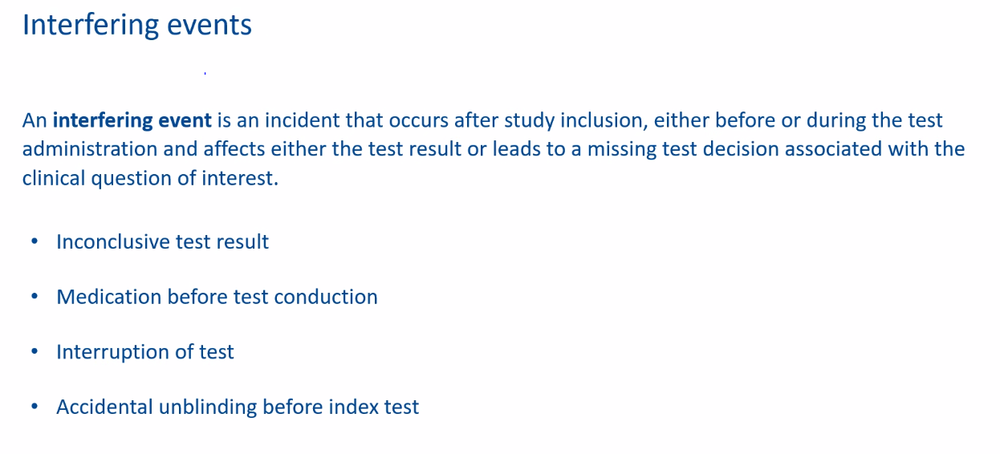
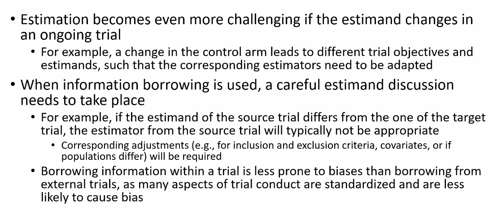

```{r setup, include=FALSE, echo = FALSE,message = FALSE, error = FALSE, warning = FALSE}
knitr::opts_chunk$set(echo = TRUE, fig.width = 10, fig.height = 6)

# <!-- ---------------------------------------------------------------------- -->
# <!--                    1. load the required packages                       -->
# <!-- ---------------------------------------------------------------------- --> 

## if(!require(psych)){install.packages("psych")}

packages<-c("tidyverse", "kableExtra", 
            "gtsummary","inTextSummaryTable",
            "Hmisc","htmltools","clinUtils")

ipak <- function(pkg){
  new.pkg <- pkg[!(pkg %in% installed.packages()[, "Package"])]
  if (length(new.pkg)) 
    install.packages(new.pkg, dependencies = TRUE)
  sapply(pkg, require, character.only = TRUE)
}
ipak(packages)
 


# <!-- ---------------------------------------------------------------------- -->
# <!--                        2. Basic system settings                        -->
# <!-- ---------------------------------------------------------------------- -->
setwd(dirname(rstudioapi::getSourceEditorContext()$path))
getwd()
Sys.setlocale("LC_ALL","English")


## Open the folder
open_folder <-function(dir){
	if (.Platform['OS.type'] == "windows"){
	shell.exec(dir)  
	} else {
	system(paste(Sys.getenv("R_BROWSER"), dir))
  }
}
open_folder(getwd())

## convert backslash to forward slash in R
# gsub('"', "", gsub("\\\\", "/", readClipboard()))

### get the path
# rstudioapi::getSourceEditorContext()$path
# dirname(rstudioapi::getSourceEditorContext()$path)

### set working directory
# getwd()
# setwd("c:/Users/zbai/Desktop")
# Sys.setlocale("LC_ALL","English")

### get the R Version
# paste(R.Version()[c("major", "minor")], collapse = ".")

### convert backslash to forward slash 
# scan("clipboard",what="string")
# gsub('"', "", gsub("\\\\", "/", readClipboard())) 

## Load all r functions
## The directory where all source code files are saved.
source_code_dir <- "C:/Users/baiz/Downloads/Data-Analyst-with-R/00 R Function/ZB Function/"  
file_path_vec <- list.files(source_code_dir, full.names = T)
for(f_path in file_path_vec){source(f_path)}

# <!-- ---------------------------------------------------------------------- -->
# <!--                         3. Import the datasets                         -->
# <!-- ---------------------------------------------------------------------- -->

# <!-- ---------------------------- -->
# <!-- --3.1 Import csv data ------ -->
# <!-- ---------------------------- -->

# pfad <- "~/Desktop/SASUniversityEdition/myfolders/Daten"
# mydata1 <- read.csv(file.path(pfad, "yourcsv_data.csv"), 
#                     sep=";", 
#                     header=TRUE)   

## Import all csv data from folder
# list_csv_files <- list.files(path = "./csvfolder/")
# do.call(rbind, lapply(list_csv_files, function(x) read.csv(x, stringsAsFactors = FALSE)))

# <!-- ---------------------------- -->
# <!-- --3.2 Import xlsx data ----- -->
# <!-- ---------------------------- -->

# library(readxl)
# mydata2 <- read_excel("C:/Users/zbai/Documents/GitHub/R-Projects/SAS/Yimeng/results-text.xlsx")

# <!-- ---------------------------- -->
# <!-- --3.3 Import sas7dbat data - -->
# <!-- ---------------------------- -->

# library(sas7bdat)
# mydata3 <- read.sas7bdat("~/Desktop/SASUniversityEdition/myfolders/Daten/uis.sas7bdat")

## Import all sas7dbat data from SASfolder
# ZB.import.sas.folder("./SASfolder/")

# <!-- ---------------------------- -->
# <!-- --3.4 Import from copyboard --->
# <!-- ---------------------------- -->
# copdat <- read.delim("clipboard")
# Data_D01 <- copdat

# <!-- ---------------------------------------------------------------------- -->
# <!--                           4. Some Tools                                -->
# <!-- ---------------------------------------------------------------------- -->

## To check out vignettes for one specific package
# browseVignettes("sjPlot")      ## sjPlot for Models Summary
# browseVignettes("gtsummary")


# <!-- ---------------------------------------------------------------------- -->
# <!--                           5. Citation                                -->
# <!-- ---------------------------------------------------------------------- -->
# citation("gtsummary")
# <!-- ---------------------------------------------------------------------- -->
```


<!-- ----------------------------------------- -->
<!-- -----------Mind Map of ToC--------------- -->
<!-- ----------------------------------------- -->


```{r mind map,echo = F,message = FALSE, error = FALSE, warning = FALSE}
library(mindr)
input <- rstudioapi::getSourceEditorContext()$path 
input_txt <- readLines(input, encoding = "UTF-8")
## Widget Output
mm_output <- mm(input_txt, 
                output_type = c("widget"),
                root = "")
mm_output$widget
```


<!-- ----------------------------------------- -->
<!-- --------------CSS Define----------------- -->
<!-- ----------------------------------------- -->
<style>
.bold-list-257f96 + ol {
    font-weight: 900;
    color: #257f96;
}
.bold-list-ff9900 + ol {
    font-weight: 900;
    color: #ff9900;
}
</style>
<!-- ----------------------------------------- -->


# Bioconductor Ecosystem Analysis

Reference: https://github.com/tidyomics

Michael Love (University of North Carolina-Chapel Hill, USA)

Pragmatic Biometrics for Transcriptomics: Rigor, Reproducibility, and Readability  

Major advances in sequencing and other biotechnologies have propelled the state of the  art in transcriptomic measurement, to the current state of proling transcriptomes of individual cells, as well as the ability to directly sequence full RNA transcripts. Throughout  changes in technology, accurate biometric analysis requires pragmatic choices in the processing and statistical modeling of transcriptomic measurements, guided by exploratory  data analysis. I will discuss lessons learned from the past decade of transcriptomics, from  rigorous bias correction, to automated mechanisms of ensuring reproducible analysis, and  current eorts at facilitating code readability for data processing and analysis. I will conclude by suggesting how these lessons may be applied to data from new transcriptomic  technologies.

# Innovative Clinical Trial Designs: Estimands and Operating Characteristics

Since the publication of the ICH E9(R1) document in 2019, estimation frameworks have become a fundamental component of clinical trial protocols. At the same time, complex innovative designs are becoming increasingly popular in drug development. However, it is unclear to what extent the estimation framework is applicable to these novel designs. For example, should each subpopulation (e.g., defined by cancer site) be assigned a different estimate in a basket trial? Or could a single estimate for the general population be used (e.g., defined by positivity for a certain biomarker)? In the case of a platform trial, should different estimates be presented for each drug studied? We discuss estimation considerations relevant to different types of complex innovative designs. We consider trials that allow adding or selecting experimental treatment groups, modifying control groups, and selecting or combining populations. We also address potential data-driven, adaptive selection of estimators in ongoing trials and address certain statistical issues related to estimating rather than being estimated, such as borrowing from non-concurrent information


## Note

```{r , echo=FALSE, fig.align="center", out.width = '75%'}

```

**From Traditional Analysis to the Estimand Framework**

Traditional Analysis: Historically, the focus was primarily on the analysis itself, with less emphasis on the precise clinical questions that the analysis aimed to answer.
Estimand Framework: This approach, as recommended by regulatory agencies like the FDA and EMA, focuses on clearly defining the target of estimation (the "estimand") before deciding on the statistical methods for analysis. This framework encourages researchers to specify:
The treatment effect of interest (e.g., difference in means, hazard ratio)
The population in which this effect will be estimated
The handling of post-randomization events (e.g., treatment discontinuation, use of rescue medication)
The method of handling missing data

**Key Concepts Discussed**

Competing Risks: In survival analysis, a competing risk is an event that precludes the occurrence of the primary event of interest. Adjusting for competing risks is crucial to avoid biased estimates of the incidence of the event of interest.
Censoring for Competing Risks: Traditional survival analysis methods, like Kaplan-Meier or Cox proportional hazards models, might not adequately handle competing risks. Alternative methods, such as the Fine and Gray model, are designed specifically for such scenarios.
Estimand Framework in Practice: By defining an estimand that includes considerations for competing risks, researchers ensure that the analysis directly addresses the clinical question of interest. This involves specifying the treatment effect in the presence of competing events and may involve hypothetical strategies for what would have happened in the absence of these competing events.
Time Frame of Interest: Not specifying the time frame implicitly ties the estimate of the treatment effect to the observed data distribution, which might not generalize well to other contexts.
Terminology and Summary Measures: The discussion highlights issues with unclear terminology and the misuse of summary measures, such as risk and hazard ratios. It emphasizes the need for precise communication in clinical research to avoid misunderstandings about what the data show.
Assumptions and Interpretability: The shift to the estimand framework also involves a critical look at the assumptions underlying statistical models (e.g., proportional hazards) and how these relate to the clinical questions of interest. It's important to assess these assumptions at the planning stage of a trial to ensure they are appropriate for the estimand.

**Solutions to Enhance Precise Treatment Effect Definitions**

Clear Definition of Estimands: A crucial step is to adopt and rigorously apply the concept of estimands as outlined by regulatory agencies. This involves:

Clearly defining the target of estimation (estimand) before conducting the analysis.
Specifying the metric of interest (e.g., difference in survival rates, hazard ratio), the population, and how post-randomization events are handled.
Enhanced Communication of Study Objectives: Researchers should ensure that clinical trial objectives and the corresponding statistical analysis plans are communicated clearly, with explicit links between clinical questions and statistical methods.

Adopting Appropriate Statistical Methods: Depending on the trial design and the nature of the data, consider methods that appropriately address the complexities of the data, such as:

Competing risks analysis for survival data when appropriate, to provide a more accurate picture of the risks of different events over time.
Multi-state models for more complex longitudinal data, allowing for the analysis of transitions between different states of health or disease.
Use of Dynamic Prediction Models: These models can offer insights into how risk predictions evolve over time, providing personalized risk assessments for individuals based on their characteristics and treatment received.

Incorporation of Real-world Data: Complementing randomized controlled trial data with real-world evidence can help in understanding the long-term effects and generalizability of treatment effects.

Emphasis on Patient-reported Outcomes: Including and highlighting patient-reported outcomes in the analysis can offer valuable insights into the treatment effects from the patient's perspective, particularly regarding quality of life and symptom management.

Flexible Analytical Approaches: Adopt flexible analytical strategies that can accommodate varying follow-up times and the dynamic nature of clinical data, such as time-varying effects models.

Training and Education: Encourage ongoing education and training for researchers and clinicians in the latest statistical methods and concepts, ensuring they are equipped to design, analyze, and interpret clinical trials effectively.

Interdisciplinary Collaboration: Foster collaboration between clinicians, statisticians, and data scientists to ensure that clinical questions are appropriately translated into statistical questions—and vice versa.


## Example Heart Failure

```{r , echo=FALSE, fig.align="center", out.width = '75%'}


```

The example you provided about a heart failure trial highlights several important considerations in defining clinical questions of interest, especially when dealing with time-to-event endpoints in a trial. The discussion underscores the complexity and the need for precision in specifying the estimand in such trials. Let's explore how to approach the estimand definition in this context, focusing on cardiovascular (CV) death while considering the presence of competing risks, such as non-cardiovascular death.

### Defining Clinical Questions of Interest

When defining clinical questions in a trial with time-to-event endpoints, it's crucial to specify what aspect of the time-to-event data is of interest. This could include:

1. **Probability of an Event at a Certain Time Point**: Interested in the likelihood of an event, such as CV death, occurring by a specific time.
2. **Hazard Rate**: Focus on the rate at which an event occurs per unit of time.
3. **Median Time to Event**: Interested in the time by which 50% of the population has experienced the event.
4. **Mean Time to Event**: The average time to the event, possibly restricted to a specific follow-up period.
5. **Acceleration Factor**: Measures the effect of treatment on speeding up or slowing down the time to event.

Each of these summary measures can provide different insights into the treatment's effect, and the choice among them should be guided by the clinical question of interest, which may vary by stakeholder (patients, prescribers, payers).

### Approach to Estimand Definition in a Heart Failure Trial

In the heart failure trial example, where the primary outcome is a composite of CV death and heart failure hospitalization, with non-cardiovascular death as a key competing event, the approach to defining the estimand should carefully consider the following:

- **Specificity**: Define the outcome of interest (e.g., CV death) clearly, including the time frame for measurement (e.g., probability of CV death within one year).
- **Handling Competing Risks**: Specify how competing risks, such as non-cardiovascular death, will be accounted for in the analysis. This could involve using methods specifically designed for competing risks, like the Fine and Gray model, to ensure accurate estimation of the probability of the event of interest.
- **Population**: Define the patient population in which the treatment effect is being estimated, considering factors like the stage of heart failure, baseline characteristics, and any prior treatments.
- **Treatment Effect Measure**: Choose the most appropriate summary measure based on the clinical question and the stakeholders' needs. For example, patients might be more interested in median or mean time to CV death, while clinicians might focus on the hazard rate or probability of event by a certain time point.
- **Intercurrent Events**: Clearly define how post-randomization events that could affect the interpretation of the treatment effect, such as initiation of additional therapies or loss to follow-up, will be handled in the analysis.

**Conclusion**

Defining the estimand in a clinical trial, especially one involving time-to-event endpoints and competing risks, requires careful consideration of the outcome of interest, the summary measures, the patient population, and how competing risks and intercurrent events are handled. This precise definition ensures that the trial's findings are relevant and interpretable for all stakeholders, from patients to healthcare providers and payers.

 
```{r , echo=FALSE, fig.align="center", out.width = '75%'}
knitr::include_graphics("./02_Plots/Estimands_04.png")

```

The explanation provided delves into the complexities of defining and analyzing treatment effects in clinical trials, especially in the context of competing risks and time-to-event data. It underscores the importance of a nuanced approach to estimand definition, reflecting real-life scenarios where patients may experience various outcomes. Here's a detailed breakdown to enhance understanding:

### Real-Life Replication in Clinical Trials

Clinical trials aim to mirror real-life scenarios where patients might die from disease-specific (CV death) or non-disease-specific causes (non-CV death). This complexity necessitates a comprehensive approach to estimand definition, taking into account the various ways patients' paths can unfold following treatment intervention.

### Principal Stratum and Hypothetical Estimates

- **Principal Stratum for Survivors**: Interest might lie in the effect of treatment on patients who would not die of CV causes regardless of treatment. This subgroup analysis focuses on the "survivors" of non-CV death, aiming to understand treatment effects in a specific stratum of patients.
- **Hypothetical Estimates**: These estimates consider the probability of an event (e.g., CV death) under the assumption that a certain condition is met (e.g., if patients would not die of non-CV causes). This hypothetical scenario helps isolate the effect of treatment on a specific outcome, assuming no impact on competing risks.

### Competing Risks and Summary Measures

The presence of competing risks (e.g., CV vs. non-CV death) requires careful consideration in the analysis to accurately estimate the treatment effect on the event of interest. Summary measures should be chosen based on the clinical question and the relevant time frame, which could be:

- **Univariate**: Focusing on a single outcome, such as the probability of CV death within a specific time frame.
- **Multivariate**: Considering multiple outcomes simultaneously, such as the probability of CV death, non-CV death, or remaining event-free.

### Defining Estimand Attributes

When defining the estimand in a clinical trial setting, particularly with competing risks and time-to-event endpoints, several key attributes need to be specified:

1. **Target Population**: Defined by the clinical context (e.g., patients diagnosed with heart failure).
2. **Treatment Conditions**: The interventions being compared (e.g., drug vs. control).
3. **Variable of Interest**: The state over time, capturing different outcomes (event-free, CV death, non-CV death).
4. **Summary Measure**: Chosen based on the clinical question and the relevant time frame (e.g., probability of CV death up to two years).

### Application to Heart Failure Trial Example

In the heart failure trial example, the question of interest could be: "Compared to control, how much does the drug decrease the probability of CV death up to two years in heart failure patients who can also die from non-CV causes?"

- **Population**: Patients with heart failure.
- **Treatments**: Drug versus control.
- **Variable**: State at a specific time point (event-free, died from CV cause, died from non-CV cause).

This approach allows for a detailed analysis that reflects the different possible events a patient might experience, providing insights into the treatment's effect in a real-world, clinically relevant manner. By distinguishing between different types of events and specifying the summary measure accordingly, researchers can offer more precise and meaningful interpretations of the treatment effects in clinical trials.


Your comprehensive approach to defining clinical questions and specifying estimands in the context of a heart failure trial with time-to-event endpoints is a valuable framework for researchers and clinicians alike. This methodical approach ensures that the clinical trial design is closely aligned with the objectives of the study and addresses the complexities inherent in such trials, particularly those involving competing risks like cardiovascular (CV) death and non-cardiovascular death. Let's delve deeper into each aspect of this approach to further elucidate its significance and application.

### Importance of Precision in Estimand Definition

The precision in defining the estimand is crucial for several reasons:

- **Clarity in Objectives**: It ensures that the clinical trial's objectives are clearly understood by all stakeholders, including researchers, clinicians, patients, and regulatory bodies.
- **Appropriate Statistical Analysis**: It guides the selection of the most appropriate statistical methods for analyzing the data, particularly in handling complex issues like competing risks and censoring.
- **Interpretability of Results**: It facilitates the interpretation of the trial results, making it easier to understand the implications of the treatment effect on patient outcomes.

### Dealing with Competing Risks

Competing risks present a unique challenge in time-to-event analysis because the occurrence of one event (e.g., non-CV death) precludes the occurrence of the event of interest (e.g., CV death). The traditional Kaplan-Meier method may overestimate the risk of the event of interest in the presence of competing risks. Therefore:

- **Selection of Appropriate Models**: The use of models designed to handle competing risks, such as the Fine and Gray model, becomes indispensable. These models provide a more accurate estimate of the subdistribution hazard and the cumulative incidence function for the event of interest.
- **Clinical Interpretation**: Understanding the implications of competing risks is essential for clinicians to make informed decisions about patient care, as it affects the perceived effectiveness and risks of treatments.

### Specifying Summary Measures

The choice of summary measures should reflect the clinical question of interest and the needs of different stakeholders. For example:

- **Probability of an Event**: This measure can inform decision-making by providing a clear estimate of risk at a specific time point.
- **Hazard Rate**: Useful for understanding the immediate risk posed by the condition or treatment, which is crucial for acute conditions or when assessing the quick onset of treatment effects.
- **Mean or Median Time to Event**: These measures offer insights into the expected duration before an event occurs, which can be particularly relevant for chronic conditions where long-term outcomes are a key concern.

### Addressing Intercurrent Events

Intercurrent events, such as initiation of additional therapies or loss to follow-up, can significantly affect the interpretation of the treatment effect. Strategies to handle these events include:

- **Specification in the Estimand**: Clearly defining how such events will be accounted for in the estimand ensures that the analysis remains aligned with the clinical question of interest.
- **Sensitivity Analyses**: Conducting sensitivity analyses to assess the robustness of the findings to different assumptions about intercurrent events can provide additional insights into the treatment's effectiveness.

**Conclusion**

The approach to defining clinical questions and estimands in trials with time-to-event endpoints, especially in the context of competing risks, is critical for the success and interpretability of clinical research. By carefully considering the outcome of interest, the summary measures, the patient population, and the handling of competing risks and intercurrent events, researchers can design trials that provide meaningful, actionable insights into the effects of treatments on patient outcomes. This rigorous approach enhances the relevance and applicability of clinical trial findings, ultimately contributing to better informed clinical decisions and improved patient care.
 
 

### Principal Stratification

Principal stratification is a causal inference framework used to address post-randomization issues by categorizing individuals based on potential outcomes under different treatments, which are not affected by the actual treatment assignment. It's particularly useful in trials where outcomes might be influenced by post-treatment variables.

- **Potential Outcomes and Principal Strata**: This approach relies heavily on the concept of potential outcomes, requiring a belief in counterfactual reasoning. The principal stratum of interest, such as individuals who would not die from non-treatment-related causes regardless of treatment, can be challenging to define without prior knowledge of outcomes, highlighting a limitation in its applicability for primary analysis.
- **Relevance of Principal Strata Questions**: While theoretically interesting, the practical relevance of principal stratification in primary analyses of clinical trials may be limited due to the difficulty in identifying relevant strata a priori. However, it might provide valuable insights for exploratory analyses or specific research questions.

### Handling Intercurrent Events and Competing Risks

Intercurrent events and competing risks are critical considerations in clinical trials, affecting the interpretation and estimation of treatment effects.

- **Intercurrent Events**: These are events that occur after treatment initiation but can alter the course of treatment or outcomes. Handling these events correctly is essential for an accurate estimation of treatment effects. The "while-treated" strategy, which focuses on outcomes while the patient remains on the assigned treatment, may not fully capture the complexities introduced by competing risks.
- **Competing Risks**: Competing risks refer to situations where different types of events can preclude the occurrence of the event of interest, affecting the probability and timing of the primary outcome. The cumulative incidence function is a more appropriate measure in this context than traditional survival analysis techniques, as it accounts for the occurrence of competing events.
- **Treatment Strategies and Cumulative Incidence**: The discussion around the "while-treated" strategy versus approaches that better capture the cumulative incidence of an event illustrates the complexities of analyzing time-to-event data in the presence of competing risks. It's crucial to choose analytical strategies that reflect the clinical questions of interest and accurately represent the mechanism of treatment effects.

## References

Collignon O, Schiel A, Burman CF, Ruifbach K, Posch M, Bretz F. Estimands and Complex Innovative Designs. Clinical Pharmacology & Therapeutics. 2022;112(6):1183-90.


# Causal Inference with Continuous Multiple Time Point Interventions 

By Michael Schomaker  

Currently, there are limited options for estimating the effect of continuous variables and variables measured at multiple time points on outcomes (i.e., via dose-response curves). However, these situations may be relevant: in pharmacology, one may be interested in how outcomes (e.g. viral failure) in people living with HIV and on treatment for HIV change over time under different interventions (e.g. different drug concentration trajectory). . One challenge with causal inference from sustained interventions is that the positivity assumption is often violated. To address motivation violations, we develop projection functions that reweight and redefine interest estimates based on conditional support functions for the respective interventions. With these functions, we can obtain the desired dose-response curve in a region with sufficient support, as well as meaningful estimates that do not require positivity assumptions. We developed a plug-in estimator of type g calculation for this situation. These contrast with using g -computed estimators in a naive way, i.e. applying them to successive interventions without addressing positivity violations. These ideas are illustrated by longitudinal data from HIV-positive children treated with efavirenz-based regimens. Simulations show in which cases the naive g calculation method is appropriate, in which cases it leads to bias, and how the proposed weighted estimation method recovers alternative estimates of interest

```{r , echo=FALSE, fig.align="center", out.width = '75%'}


```

## Motivation - Continous Interventions

The discussion centers on a highly specialized area of causal inference within the context of antiretroviral therapy, focusing on the effects of NNRTI drug concentration on patient outcomes, such as viral load suppression in children. This scenario encapsulates several key concepts and challenges in causal inference, especially when dealing with continuous interventions like drug concentrations, longitudinal observational data, and the presence of time-varying confounders. 

### Causal Inference with Continuous Interventions

1. **Scientific Question Translation to Estimand**: The core scientific question involves understanding how varying drug concentrations (a continuous intervention) influence the probability of a specific outcome, such as viral load failure. This translates into estimating the causal effect of different hypothetical concentration trajectories on the outcome.

2. **Causal Concentration-Response Relationship**: The goal is to elucidate the dose-response curve, which in this context is the relationship between drug concentration and the probability of achieving viral load suppression.

### Challenges in Causal Inference

1. **Time-Varying Confounders**: Variables such as weight and adherence to medication can affect both the drug concentration (intervention) and the outcome (viral load suppression), and these confounders can change over time. This complexity introduces biases that traditional regression methods cannot adequately address.

2. **Treatment-Confounding Feedback Loop**: The dynamic interplay between the intervention (drug concentration) and time-varying confounders exemplifies a situation where the treatment itself can influence the confounders, which in turn affect future treatment levels, creating a feedback loop.

3. **Positivity Violation**: In the context of continuous interventions, the assumption of positivity—every participant has a nonzero probability of receiving every possible level of the intervention under study—is often violated. This is because it's impractical or impossible for some individuals to achieve certain drug concentrations due to physiological or other constraints.

### Methodological Approaches

1. **G-Methods**: Generalized methods like G-computation and inverse probability of treatment weighting (IPTW) have traditionally been applied to binary or categorical interventions. Extending these methods to continuous interventions presents unique challenges but offers a pathway to estimate causal effects in complex scenarios.

2. **Doubly Robust Estimators**: These estimators combine the strengths of outcome modeling and inverse probability weighting to offer more reliable estimates, especially in the presence of model misspecification. Edward Kennedy's work on doubly robust approaches for continuous interventions represents a significant advancement in this area, providing a method to handle the complexity of such data while mitigating the effects of positivity violations.

### Modified Treatment Policies

While not the focus of today's discussion, modified treatment policies represent another strategy to address the challenges of causal inference with continuous interventions. By adjusting the estimand or the analysis approach, researchers can reduce reliance on strict assumptions like positivity, offering a "technical trick" to navigate the complexities of these studies.

### Conclusion

The case study of NNRTI drug concentration effects in an antiretroviral therapy context underscores the intricate challenges and methodological considerations in causal inference for continuous interventions. Addressing these challenges requires sophisticated statistical techniques that can account for time-varying confounders, treatment-confounder feedback loops, and the inherent difficulties of positivity violations. Advances in methodologies like G-methods and doubly robust estimators provide promising avenues for researchers to obtain more accurate and reliable causal estimates, thereby enhancing our understanding of continuous intervention effects in real-world settings.
 
## Estimand 

```{r , echo=FALSE, fig.align="center", out.width = '75%'}


```

The tradeoff in causal inference for continuous interventions, such as drug concentration levels, is clearly outlined. Let's break it down into more detail.

### Estimating the Causal Dose-Response Curve (CDRC)

**Objective**: The goal is to estimate the causal relationship between the continuous intervention (drug concentration) and the outcome (e.g., viral load suppression) as accurately as possible.

**Challenge of Positivity Violations**: In continuous interventions, ensuring that every possible level of intervention has a non-zero probability can be difficult. This is known as the positivity assumption. Violations occur when some levels of the intervention are not represented in the population, or are so sparsely represented that reliable estimation becomes problematic.

### Minimizing Bias from Positivity Violations

**Objective**: To reduce the risk of bias in estimation caused by the lack of data for certain levels of the continuous intervention.

**Tradeoff**: This approach may involve redefining the estimand or research question, potentially moving away from the original scientific inquiry. This could be achieved by using modified treatment policies or focusing the analysis on more densely populated regions of the intervention space.

### The Compromise Approach

**Strategy**: Finding a balance between the two extremes—sticking closely to the original estimand while managing the risk of positivity violations. This might involve accepting some bias in exchange for maintaining the integrity of the research question or utilizing statistical methods that can handle sparser data.

### Methods for Estimating CDRC in the Presence of Positivity Violations

1. **G-Methods**: Including techniques like G-computation and probability of treatment weighting, these methods have been extensively used for binary and categorical interventions. Extending them to continuous interventions is more complex and less explored.

2. **Sequential G-Computation**: A method used to estimate the expected outcome over time, given a series of interventions. It involves iteratively predicting outcomes based on past observations and specified interventions at each time point.

3. **Modified Treatment Policies**: These involve altering the estimand to fit within the regions of the intervention space where positivity holds. It's a way to circumvent the positivity violations by focusing on more realistic or likely intervention levels.

4. **Doubly Robust Estimators**: A contemporary approach that combines outcome modeling with inverse probability weighting to protect against certain types of biases, including those stemming from positivity violations.

### Practical Implications

In the example, the simpler linear dose-response scenario showed that ignoring positivity can sometimes work without introducing bias. However, as the scenario becomes more complex (e.g., survival settings with multiple time points), the risk of bias increases, especially for sparse data regions. Large sample sizes or advanced estimation techniques are necessary to accurately estimate the dose-response curve.

### Conclusion

The main takeaway is that researchers must carefully consider their objectives and the limitations of their data when choosing a method for estimating causal effects in the presence of continuous interventions. There is no one-size-fits-all solution; the best approach may vary depending on the specific context and the availability of data. Finding a compromise between rigorous estimation and practical considerations is often necessary to advance scientific understanding while acknowledging methodological constraints.

## Weighted Estimand

Intricacies of estimating causal dose-response curves (CDRC) in the presence of continuous interventions, considering the challenges posed by positivity violations. Here's a detailed breakdown of the processes and strategies mentioned:

### Estimating CDRC in Continuous Interventions

1. **Estimation Challenge**: When estimating the CDRC, the task is to map out the expected outcome (e.g., viral load suppression) across a range of continuous intervention values (e.g., drug concentrations). However, this becomes challenging when the data for certain intervention levels (especially lower concentrations) is sparse, leading to potential bias.

2. **Positivity Violations**: These occur when the probability of observing a particular level of the intervention, conditional on the covariates, is low or zero, making it difficult to estimate the CDRC accurately for those levels.

3. **Standardization and G-Formula**: The G-formula or g-computation involves standardizing with respect to confounders and integrating them out. This process typically assumes that there is sufficient data across the entire range of the intervention.

4. **Weighting Strategy**: To address areas with insufficient data, a weighting function is introduced where the weight is set to one if the conditional treatment density is sufficient. Otherwise, the weight is a ratio of the conditional and marginal treatment densities. This approach helps to ensure the estimation remains reliable in areas with adequate data and minimizes bias in sparse data regions.

5. **Extension to Multiple Time Points**: The weighting strategy can be extended to cases where there are multiple time points by adjusting the weights according to the presence of conditional support for the treatment densities over time.

### Trade-offs and Compromises

1. **Trade-off**: The main trade-off involves choosing between accurately estimating the CDRC and minimizing the risk of bias due to positivity violations. One can either maintain the original estimand and accept some bias or modify the estimand to reduce the bias, potentially at the cost of altering the research question.

2. **Compromise Approach**: The compromise involves refining the CDRC estimation to focus on regions with sufficient data support, thereby sticking to the actual restriction as much as possible. This strategy aims to provide accurate estimates where possible while acknowledging and adjusting for areas with less data.

### Interpretation and Application

1. **Intervention Strategy**: The intervention is defined in terms of the outcomes it produces, focusing on individual concentration trajectories that generate typical outcomes for the specific patient regimen.

2. **Weighted Curve as a Sensitivity Tool**: The weighted curve acts as a magnifying glass to assess the CDRC in regions with adequate support. This approach avoids relying on parametric extrapolations in regions with sparse data, providing a more reliable estimate of the causal effects where the data is sufficient.

3. **Balance Between Causation and Association**: The method strikes a balance between pure causal inference (which may not be fully possible due to data limitations) and association measures, providing a practical and interpretable estimation of the CDRC that is informed by the data available.

In summary, the process described is a sophisticated method for addressing the complexity of estimating causal effects with continuous interventions in longitudinal data. It incorporates advanced statistical techniques to manage the trade-offs inherent in such analyses, aiming to produce the most accurate and reliable estimates within the constraints of the observed data.

```{r , echo=FALSE, fig.align="center", out.width = '75%'} 

```

## References

Causal Inference for Continuous Multiple Time Point Interventions
https://arxiv.org/abs/2305.06645v2

# The estimand framework for diagnostic accuracy studies

A diagnostic test provides a statement about an individual's target condition. This target condition is evaluated based on diverse clinical information such as symptoms, laboratory values, or physical examinations.[1] Diagnostic accuracy studies assess the precision of a diagnostic test. In these studies, the diagnostic test is compared to the true state, defined by the reference test. Based on the result of the reference test, patients can be assigned to the two target conditions.

A diagnostic study is performed to estimate test accuracy in daily practice. If the study design deviates from practical use, the estimated test accuracy may be biased. Therefore, components of the study objective must be defined a priori to avoid discrepancies between the study and daily practice. For example, the study population should be selected based on the target population. Moreover, various interfering events could occur that can lead to either non-existent test results or influenced test decisions. It should be determined how to handle these events.

The trial objective must be formulated during the planning of a diagnostic study.[2] This objective is then translated into the clinical question of interest. For treatment studies, the estimand framework consists of different attributes to define the estimand, which must be aligned with the stated clinical question of interest.[3] We will present an estimand framework for diagnostic studies, including the attributes target population, index test, target condition, accuracy measurement, and strategies for interfering events.

To illustrate this framework, we will present an application example evaluating a computed tomography (CT) scan to detect lung carcinoma. We will define the estimand for this study and discuss several potential interfering events and strategies to handle them, such as premature termination of the CT scan due to coughing.


```{r , echo=FALSE, fig.align="center", out.width = '75%'} 

```

## EVASCAN Study (Aueret et al., 2013)

Study objective: To assess the accuracy (sensitivity and specificity) of computed  tomographic coronary angiography (CTCA) to detect coronary artery diseases (CAD) in  symptomatic patients with clinical indications for coronary imaging who go through the  procedure completely according to the instructions. A nonassessable segment in the CTCA is counted as a positive test result. 

```{r , echo=FALSE, fig.align="center", out.width = '75%'} 


```

It emphasizes the importance of planning and executing diagnostic studies to ensure that the results are representative of real-world clinical situations and can inform appropriate treatment decisions. Here is a detailed breakdown of the points mentioned:

### Diagnostic Accuracy Studies

- **Objective**: To evaluate the accuracy of a diagnostic test (the index test) in determining the true disease state, as confirmed by a reference standard (assumed to give the true disease state).
- **Processes**: Study participants undergo both the index test and the reference procedure to assess the accuracy of the index test in diagnosing the disease.

### Importance of Planning in Diagnostic Studies

- **Representative Study Design**: Ensuring that the study design reflects the conditions under which the diagnostic test will be used in practice.
- **Diagnostic Accuracy**: Determining the metrics (such as sensitivity and specificity) that will be used to evaluate the test.
- **Avoiding Bias**: Identifying potential sources of bias and strategizing to avoid them.
- **Study Objective**: Defining what the study aims to achieve, which then translates into an estimand that guides the study's conclusions and recommendations.

### The Estimand Framework for Diagnostic Studies

- **Definition**: A precise description of the test accuracy that reflects the clinical question defined by the study objective.
- **Attributes**: The estimand framework includes condition, index test, target population, accuracy measurement, and strategies for handling interfering events.
- **Condition**: The disease or condition the index test aims to detect.
- **Index Test**: The diagnostic test under evaluation.
- **Target Population**: The group of individuals in whom the test is intended to be used.
- **Accuracy Measurement**: The method by which the test's accuracy will be assessed, typically involving sensitivity and specificity.
- **Interfering Events**: Potential occurrences that could affect the diagnostic process or the accuracy of the test, which must be accounted for in the study design.

### Application Example: CT Scan for Detecting Coronary Artery Disease

- **Study Objective**: To assess the accuracy of computed tomographic coronary angiography in detecting coronary artery disease in symptomatic patients who are clinically indicated for coronary imaging, and where a non-accessible segment in the test is considered a positive result.
- **Target Condition**: Coronary artery disease.
- **Index Test**: Computed tomographic angiography.
- **Target Population**: Symptomatic patients indicated for coronary imaging.
- **Handling Interfering Events**: Developing strategies for dealing with events that could interfere with the test's completion or accuracy.


### Interfering Events

```{r , echo=FALSE, fig.align="center", out.width = '75%'} 


```

In diagnostic studies, various factors can complicate the interpretation of test results. An "inconclusive test result" is a common issue where it remains uncertain whether a patient has the disease in question. Other potential complications include communication errors before the test procedure that might affect outcomes or interruptions due to various reasons. For instance, "accidental unblinding" occurs when the result of the reference standard is known before conducting the index test, which could introduce bias.

The term "interfering events" refers to these kinds of complications. Although the original study authors may not have used this specific term, it is crucial to recognize and identify potential interfering events within the data. Examples of such events include:

- **Inconclusive Test Results**: The test does not clearly indicate if the patient has the disease (deceased) or not (not deceased).
- **Communication Errors**: Miscommunications before the test procedure could lead to inaccurate results.
- **Interruptions**: The testing process may be disrupted for various reasons, such as technical issues or patient-related factors.

In the specific context of the study under discussion, the authors noted "non-assessable segments," indicating uncertainty about the disease's presence. Additionally, there were instances of "incomplete or incorrect procedures" and "protocol deviations." To understand these better, it is necessary to investigate the potential reasons behind them. For example:

- **Incomplete Procedures**: These could be due to various causes, such as a patient's claustrophobic reaction or a high heart rate. Distinguishing between these causes is important because some may be independent of the disease (such as claustrophobia), while others (like a high heart rate) might be related to it.
- **Population Considerations**: There might be cases where a patient's movement during a computed tomography angiography (CTA) scan results in blurred images. Here, it is assumed that the blurred segment could still indicate whether the artery is diseased or not, maintaining the test's diagnostic potential despite the interference.

Identifying and categorizing these interfering events is vital for understanding their impact on the study's outcomes and ensuring that the diagnostic accuracy is assessed correctly. It also helps in designing future studies to mitigate such events and improve the reliability of diagnostic procedures.

### Strategie for Interfering Events

```{r , echo=FALSE, fig.align="center", out.width = '75%'} 


```

In the realm of diagnostic studies, developing strategies to address interfering events is crucial for maintaining the integrity of the study results. There are several potential strategies to consider, and it is possible to apply different strategies to different interfering events or to use a single strategy across all events. Here is a detailed explanation of how these strategies could be applied to a hypothetical diagnostic study:

### Interfering Events and Strategies

1. **Variety of Strategies**: There are multiple strategies available for addressing interfering events in diagnostic studies. Some of these strategies may have been derived from established practices, while others might be newly developed for specific scenarios.

2. **Customizing Strategies for Each Event**: Each interfering event can be managed with a tailored strategy that fits the particular challenge it presents. This allows for a nuanced approach that can handle the complexity of real-world diagnostic scenarios.

3. **Consistency Across Events**: Alternatively, one might choose a consistent strategy for all interfering events to simplify the study design and analysis. However, this could potentially overlook the unique aspects of different types of interference.

### Application of Strategies to a Hypothetical Study

Let's consider the application of these strategies in the context of a study aiming to evaluate a diagnostic test:

1. **Non-Assessable Segment Strategy**: In the scenario where a test segment is non-assessable, one might decide to count all such segments as positive test results. This is known as the "indicator we then" strategy, which simplifies the interpretation by treating all indeterminate results as indicative of the disease.

2. **Omission of Certain Events**: For other interfering events, the study might opt not to include them in the analysis. This "principles that" strategy involves excluding records associated with interfering events, thereby focusing only on the unambiguous data.

3. **Secondary Estimand**: To address the limitations of the above approaches, a secondary estimand can be defined that proposes alternative strategies for each interfering event:
   - **Hypothetical Strategy**: For events like a non-assessable segment or protocol deviation due to a claustrophobic reaction, a hypothetical strategy could be employed. This would involve predicting the true test result based on alternative data, such as demographic information.
   - **Treatment-Dependent Strategy**: If early termination of the test occurs due to a high heart rate, which may be related to the disease, a treatment-dependent strategy could be applied. In such cases, the early termination itself could be interpreted as a positive indication of the disease.
   - **Diagnostic Policy Strategy**: For situations like patient movement during the scan, resulting in a blurred segment, the diagnostic policy strategy could be used. This approach involves accepting the test result as valid, despite any deviations from the protocol, and analyzing the data as is.

**Conclusion**

In summary, choosing the right strategy or strategies to address interfering events in diagnostic studies is essential for achieving accurate and reliable results. The strategy must align with the study's objectives and account for the potential impact of each interfering event on the diagnostic accuracy. By considering hypothetical, treatment-dependent, or policy-based strategies, researchers can navigate the complexities of diagnostic testing and produce results that are both informative and applicable to clinical practice.


## Benefits of the Estimand Framework

- **Support in Planning**: The estimand framework provides robust support in the planning phase of diagnostic studies, facilitating a clear definition of study objectives.

- **Interdisciplinary Exchange**: It encourages collaboration between statisticians and clinicians, promoting a comprehensive understanding of the diagnostic process and the factors affecting it.

- **Event Identification and Weighting**: The framework allows for the identification of different interfering events and provides a method for weighting their impact on the study's accuracy.

- **Real-world Applicability**: By carefully defining the study objective and the estimand, the results of the study can be more easily translated to real-world settings, enhancing their practical utility.

## Limitations of the Estimand Framework

- **Theoretical Constraints**: There is a risk of defining multiple estimands prior to the study, some of which may only be theoretical and not practically informative. This could lead to estimands that are not achievable or relevant in real-world settings.

- **Increased Planning Effort**: The application of this framework requires significant planning and coordination between statisticians and clinicians, which can be resource-intensive.

# Estimande in early phase studies, with an example in atopic dermatitis

by Klein, Stefan; Friedrichs, Frauke; Kunz, Michael

The estimand strategy will be presented for an ongoing phase 2a study in atopic dermatitis, comparing an active drug vs. placebo in 72 planned patients, with EASI-75 response as the primary endpoint. We will compare our estimands against the proposals given in Bissonnette et al. (1) for estimands in atopic dermatitis (AD), as well as against the estimand strategy in published phase III studies in AD.

In this particular example, we will discuss some aspects of the estimand concept in proof-of-concept (PoC) studies. Specifically, we will explore scientific objectives in early-phase studies, the impact of different intercurrent event strategies in PoC studies, the use of principal stratum strategy, and a useful choice of analysis population in PoC studies. We will also consider the availability of information on the types of intercurrent events that might occur, methods to keep the assignment of patients to datasets and the assignment of data point sets unbiased, and how the use of the hypothetical strategy might change the choice of endpoints in PoC studies.

## Scientific objectives in POC and POM studies 

```{r , echo=FALSE, fig.align="center", out.width = '75%'} 
 
```

Today's discussion focuses on implementing the estimand framework in the initial stages of clinical drug development, specifically during proof of concept and proof of mechanism studies. Our department bridges the gap between preclinical research and later development stages, which requires us to address different questions than those typically encountered in the latter phases.

One key aspect of early development is validating hypotheses received from preclinical researchers. They often propose that a new compound is effective, and our task is to substantiate or refute this claim. This represents the first scientific question we tackle, which I refer to as "Scientific Question #1." Our goal is to establish that the drug can produce the expected effect under ideal conditions.

However, that's not the only inquiry we pursue. Another crucial aspect is determining whether the anticipated effect observed in ideal conditions would also hold in phase three trials or in real-world settings. This constitutes the second scientific question we must address.

In my view, addressing Scientific Question #1 is the primary goal of a proof of concept trial because there are scenarios where extrapolation to later-stage conditions is challenging. This difficulty arises, for example, when relying solely on surrogate endpoints or if the clinical endpoint used in the PoC study may not fully predict outcomes in later phases. Thus, confirming efficacy under ideal conditions is paramount.

Although there is existing literature on estimands in atopic dermatitis, the focus is predominantly on intercurrent events. The key is usually to understand how these events can affect the interpretation of trial results and how to account for them when planning and conducting early-phase trials.

In summary, early development studies using the estimand framework must grapple with two central scientific questions: first, proving the compound's efficacy in ideal conditions, and second, ensuring that the effects observed are likely to be replicated in broader clinical trials and real-world applications. This dual focus necessitates a thorough planning process that can accommodate the unique challenges of early clinical development.


## Literature recommendations for estimands in AD

```{r , echo=FALSE, fig.align="center", out.width = '75%'} 
 
```

## Estimand in a POC study for atopic dermatitis


1. **Treatment and Interventions**: The use of topical applications such as emollients or moisturizers is standard in managing AD. These are often fundamental in trials to assess their efficacy or as adjunct therapies to primary treatments.

2. **Differentiation of Medication Use**: Stressing the importance of accurately recording which medications were used, when they were used, and distinguishing between disease-specific reasons for their use. This is crucial to avoid introducing bias into the study outcomes.

3. **Study Design**: You mention a "double-blind, randomized, placebo-controlled" design, which is the gold standard for clinical trials. This design minimizes bias, ensures the reliability of the results, and allows for the clear determination of the treatment's efficacy.

4. **Follow-up Duration**: The mention of follow-up assessments at 2, 4, 8, and 12 weeks indicates a thorough approach to monitoring the progression of AD and the treatment's efficacy over time.

5. **Endpoints and Assessment**: Utilizing endpoints from existing guidelines, such as the Eczema Area and Severity Index (EASI), facilitates standardization and comparison across studies. The goal of achieving a significant improvement (e.g., EASI-75) is a common endpoint that indicates a substantial benefit to the patient.

6. **Intercurrent Events**: Addressing how to handle events such as the use of rescue medication is vital. Your approach to differentiate based on the timing of such interventions (e.g., before or after a certain week) and the adoption of different strategies (e.g., treatment policy strategy versus non-responder imputation) for different timing reflects the complexity of managing and interpreting these events in the analysis.

7. **Atopic Dermatitis Overview**: You briefly describe AD, highlighting its chronic nature, typical onset in childhood, and standard treatments. This context is essential for understanding the importance of the trial and the impact of the disease on patients.

8. **Primary Estimate and Scientific Questions**: Focusing on the primary estimate related to a specific scientific question underlines the trial's goal to understand the effect of the treatment under ideal conditions. The differentiation in handling intercurrent events like the use of rescue medication underscores the meticulous planning required to interpret the trial's results accurately.

## Complexities of analyzing efficacy in clinical trials

**Transplant and Hypothetical Strategy**

- **Hypothetical Strategy**: You've implemented a hypothetical strategy to deal with the uncertainty of when the treatment effect would occur, particularly for events happening eight weeks or later. This approach allows for the consideration of what the outcome would have been if the intercurrent event (e.g., use of rescue medication or noncompliance) had not occurred.
- **Imputation Techniques**: When dealing with noncompliance, you've chosen to apply a conservative approach, possibly using techniques like imputation to handle missing data, ensuring that the analysis remains robust despite the potential for missing information.

**Defining the Efficacy Population**

- **Ideal World Condition**: This refers to a scenario where patients adhere to the treatment regimen as prescribed without any deviations. It assumes the treatment is taken regularly and for a sufficient duration, mirroring the conditions under which the clinical trial was designed to operate.
- **ICU 9 Guideline and Medical Set Definition**: Your approach takes cues from established guidelines, focusing on patients who have adhered to the treatment regimen, thereby filtering out those who discontinued early or did not take the treatment regularly.
- **Primary Estimate Population**: By selecting a subset of the trial population that meets these criteria, you aim to isolate the effect of the treatment under ideal conditions, acknowledging that this deviates from a principle stratification but serves as the best estimate given the circumstances.

**Addressing Biases and Ensuring Rigorous Analysis**

-**Supplementary Analyses**: Conducting additional analyses to compare the 'efficacy' and 'as-fast' populations helps identify any potential biases introduced by the selection criteria for the efficacy population.
- **Operational Efficacy**: Emphasizing precise and consistent operational procedures during the trial aims to minimize the need to exclude patients from the analysis, thereby reducing potential biases.

**Trial Design Considerations**
- **Patient Engagement**: Design strategies that encourage patient adherence to the treatment protocol, thus minimizing early discontinuations and noncompliance, are crucial. This not only aids in maintaining a robust analysis population but also reflects the trial's real-world applicability.


**Reflections on the Strategy**

- **Ideal vs. Real World**: You acknowledge the challenges in balancing the need for an 'ideal world' estimate with the realities of clinical trial execution. While the strategies employed (hypothetical and treatment policy strategies) are not without their limitations, they represent a thoughtful approach to capturing the true efficacy of the treatment.
- **Efficacy vs. Protocol Adherence**: The focus is not on protocol violations per se but on whether patients took the treatment as prescribed and for the necessary duration. This distinction is important for understanding the rationale behind defining the efficacy population.

## Early-Phase Trials Using Estimands

### Extrapolation to Real-World Situations

1. **Simplified Estimate for Phase III Trials**: For phase III trials, a more straightforward approach is often utilized, focusing on the treatment policy strategy without stringent considerations for compliance. This approach, incorporating the full analysis (FAS) population and accommodating rescue medication intake, aims to reflect more closely the real-world application of the intervention. It's designed to capture the treatment's effect under conditions that are more representative of routine clinical practice.

2. **Real-World Applicability**: By adopting a treatment policy strategy and a broader analysis population, the results from phase III trials are expected to offer insights into the treatment's effectiveness in a real-world setting. This inclusivity helps stakeholders understand how the drug might perform outside the controlled conditions of a clinical trial.

### Lessons from Early-Phase Trials Using Estimands

1. **Planning Challenges**: Early-phase trials, with their limited prior data, present unique challenges in planning, especially regarding the timing of treatment effects and the impact of potential intercurrent events (e.g., discontinuations, rescue medication use). This uncertainty necessitates a more cautious and flexible approach to trial design and estimand selection.

2. **Complexity of Implementing Estimands**: The use of the estimand framework in early trials requires meticulous planning and clear definitions in the study protocol or statistical analysis plan (SAP). The complexity of adjudicating treatment-related discontinuations or the role of concomitant medications underscores the need for thorough pre-trial planning and possibly the establishment of an adjudication committee.

3. **Adjudication and Bias Avoidance**: Ensuring unbiased outcomes in the presence of intercurrent events necessitates blinding adjudicators to efficacy data, a challenging proposition in smaller studies. This highlights the importance of operational integrity and unbiased decision-making in the interpretation of trial results.


### Advantages of Using Estimands in Early Trials

**Importance of Rigorous Planning**

- **Enhanced Planning for POP Studies**: Precision in planning and clear articulation of estimands are crucial, particularly for patient-oriented trials (POP) where the goal is to understand the treatment's impact on patient-relevant outcomes. Early engagement with the estimand framework can clarify the study's objectives and ensure that the data collected are aligned with these goals.

1. **Clarity in Objectives**: The estimand framework provides a structured approach to define what the trial aims to estimate, offering clarity on the treatment's intended effects and how intercurrent events will be addressed.

2. **Data Utilization**: By clearly defining the treatment effect of interest and how to handle deviations from the protocol, studies can minimize data wastage, which is especially critical in small-scale trials where every data point is valuable.

3. **Informed Decision-Making**: With a clearer understanding of the treatment's potential effects, stakeholders are better positioned to make informed decisions about the development pathway and the applicability of the treatment in a real-world context.

**Reflections on the Addendum and Early Trials**

Your observations suggest that while the estimand framework enhances the precision and applicability of clinical trial results, its implementation in early-phase trials, as outlined in regulatory addendums, presents practical challenges. The ideal world condition, a crucial concept within the framework, can be particularly challenging to operationalize in early trials due to the unpredictable nature of new treatments and limited prior data.

  
## Reference

Bissonnette R, Eichenfield LF, Simpson E, Thaci D, Kabashima K, Thyssen JP, et al. Estimands for atopic dermatitis clinical trials: Expert opinion on the importance of intercurrent events. J Eur Acad Dermatol Venereol. 2023;37:976–983.


# Recoverability of Causal Effects in a Longitudinal Study under Presence of Missing Data

by Holovchak, Anastasiia; Schomaker, Michael

Missing data in multiple variables is a common problem. As part of the CHAPAS-3 trial, we investigated the applicability of a graphical modeling framework for handling missing data to a complex longitudinal pharmacology study of HIV-positive children treated with an efavirenz-based regimen. Specifically, we examine whether the causal effect of interest, defined by a static intervention on multiple continuous variables, can be recovered (consistent estimation) from the available data alone. To date, there is no general algorithm for determining recoverability and decisions must be made on a case-by-case basis. We emphasize the sensitivity of recoverability to even minimal changes in graph structure and present recoverability results for three potentially missing DAGs in the CHAPAS-3 study (Directed Acyclic Graphs) based on clinical knowledge. Furthermore, we propose the concept of closed missingness mechanisms and show that under these mechanisms the available case analysis can be used for consistent estimation of any kind of statistical and causal queries, even if the underlying missingness mechanism is of the MNAR type. The simulation demonstrates how the estimation results change depending on the modeled missing DAG. Our analysis may be the first to show the applicability of missing DAGs to complex longitudinal real-world data, while highlighting sensitivity to hypothesized causal models.


- **Main DAG and Alternative DAG**: These diagrams represent different assumptions about the relationship between variables, including the missingness mechanism. The main DAG reflects the initial assumption, while the alternative DAG incorporates additional considerations, such as the impact of health status on missing visits.
- **Causal Concentration-Response Curve**: The objective is to estimate the counterfactual probability of viral failure over time based on different trajectories of drug concentration. This involves intervening on the drug concentration to see how it would influence viral load, assuming constant exposure throughout the study.

- **Identifiability**: This concept relates to whether a causal effect can be determined from the observed data distribution. In the absence of missing data, standard causal inference methods, like the g-formula or the back-door criterion, can be used to identify the causal effect.
- **Recoverability**: This extends the concept of identifiability to situations with missing data. It assesses whether the causal effect can be estimated from the available (incomplete) data. A key prerequisite for recoverability is the identifiability of the effect in a complete data scenario.


- **Estimating Conditional Distributions**: When data are missing, techniques such as imputation, inverse probability weighting, or other methods might be used to estimate the required conditional distributions. This process relies heavily on the assumptions made about the missingness mechanism and the relationships between variables as depicted in the DAGs.
- **Consistency Assumption**: This assumption states that the counterfactual outcome for an individual, had they received the treatment, coincides with the observed outcome if they indeed received the treatment. This is fundamental for linking the counterfactual model with observable data.

 
- **Sensitivity to Missingness Mechanisms**: Your study aims to explore how sensitive the results are to changes in assumptions about the missingness mechanism. This is crucial for understanding the robustness of your findings and their applicability to real-world settings.
- **Complexity of Estimation**: The complexity arises from the need to estimate several distributions, each potentially affected by missing data. This necessitates a careful consideration of the underlying assumptions and the selection of appropriate statistical methods.

- **Comparison of Analytical Approaches**: The comparison between available case analysis and multiple imputation highlights a fundamental challenge in causal inference studies dealing with missing data. You found that while available case analysis yielded results consistent with the true effect under the main DAG assumption, multiple imputation did not, owing to its incompatibility with the MNAR assumption.

- **Theoretical vs. Practical Recoverability**: The distinction between theoretical recoverability (the potential to estimate the causal effect accurately with perfect knowledge and modeling of the missingness mechanism) and practical recoverability (the real-world feasibility of such estimation) is crucial. Your findings suggest that even small discrepancies in the missingness DAG can lead to significant differences in recoverability and, by extension, the accuracy of the estimated causal effect.


# Comparing propensity score methods combined with multiple imputation for controlling confounding: a case study on mantle cell lymphoma treatment regimens

Randomized trials are considered the gold standard for minimizing confounding factors in treatment effect estimates. However, data from randomized treatment groups are not always available, e.g. when comparing pooled cohorts from different studies, and other methods are needed to control for confounding. In addition to using multiple regression models including confounding variables to control for confounding, a propensity score (PS) method was developed to balance baseline characteristics between treatment groups. The purpose of this case study is to compare adjustment for confounding using multiple regression models alone and combined with optimal matching and inverse probability of treatment weighting (IPTW), with or without multiple imputation (MI), due to missing values in some data The percentage of confounding variables is high. In particular, the focus is on the applicability of methods and differences in their results.

To compare statistical methods for controlling for these confounds, we used two pooled cohorts from two different settings (clinical trials versus usual care) receiving specific treatments for mantle cell lymphoma (MCL). The aim was to compare the clinical outcomes of these two treatment regimens. Multiple Cox regression models were adjusted for the following relevant prognostic factors: MIPI score (clinical prognostic score), Ki67 (cell proliferation marker), and cytology (alone or in combination). Additionally, 1:1 ratio PS Best Match and IPTW are applied. PS was calculated using multiple logistic regression, including gender and MIPI score. Due to the high proportion of missing values in Ki67 and cytology, the PS method was combined with MI using multivariate imputation of chained equations (MICE). After imputing missing values in Ki67 and cytology, these variables can be added to the logistic regression model for PS calculations.

The balance statistics of relevant prognostic factors included in the logistic regression model for PS calculation were slightly better after IPTW than after best matching, especially for Ki67 and cytology when combined with multiple imputation. However, the balancing of individual MIPI variables in both PS methods is still insufficient, which is contrary to the purpose of their application. All analyzes consistently showed that there were no significant differences between the clinical outcomes of the two treatment regimens and that the hazard ratios and their 95% confidence intervals differed minimally between the different confounding control analyses. In summary, this case study demonstrates that PS methods may not always be a suitable alternative to randomization.


 
 
- **Complete Case Analysis**: This straightforward approach involves analyzing only those cases with no missing values. While simple, it risks bias and loss of power due to the exclusion of incomplete cases.
- **Multiple Imputation**: To overcome the limitations of complete case analysis, you employ multiple imputation, generating multiple sets of plausible values for missing data. This enhances the robustness of your analysis by preserving sample size and reducing bias.
- **Calculating Propensity Scores**: You use logistic regression to estimate the propensity score, which is the probability of receiving one treatment over another based on observed baseline characteristics.
- **Matching and Weighting**: To balance the baseline characteristics between treatment groups, you apply optimal matching and inverse probability of treatment weighting (IPTW). These methods aim to create comparable groups for outcome analysis.
- **Combining Propensity Scores with Multiple Imputation**: After imputation, you calculate propensity scores and apply matching or weighting for each imputed dataset. The estimates from these analyses are then pooled using Rubin's rules to obtain final estimates that consider both the variability within and between imputed datasets.
- **Multiple Imputation and Propensity Score Analysis**: The discrepancy in results after IPTW in the imputed datasets suggests a complex interaction between the imputation process and the propensity score analysis. This could be due to the way missing data were imputed, the variables included in the imputation model, or the assumptions underlying the imputation process.
- **Review of Missing Data Assumption**: Given the importance of Ki-67 and psychology in your analysis, a more thorough examination of the missing data mechanism might be warranted. Sensitivity analyses could help assess the impact of different missing data mechanisms (e.g., MAR or MNAR) on your results.
- **Alternative Propensity Score Methods**: Although you've tried various propensity score models without satisfactory balance, exploring other methods such as subclassification or covariate adjustment using propensity scores could offer alternative ways to address imbalance.
- **Handling of Unmeasured Confounding**: The unexpected direction of hazard ratios after adjustment suggests potential unmeasured confounding. Techniques like sensitivity analysis or the use of instrumental variables could help address this issue, though they come with their own assumptions and limitations.


# Randomize the first patient - old, but still most important concept

by Großhennig, Anika1; Koch, Armin1; Beutel, Gernot2; Theodor, Framke1

1Institute of Biostatistics, Hannover Medical School, Germany; 2Department of Hematology, Hemostasis, Oncology and Stem Cell Transplantation, Hannover Medical School, Germany

Already since the first half of the 20th century randomization, replication, and blocking are the three established principles in the design of experiments. They were advocated by Ronald Fisher who also made statistical analysis methods accessible to a broader scientific audience in various editions of his book Statistical Methods for Research Workers, e.g. (1). Although reminders for the need for randomization have been published repeatedly, e.g. (2, 3), there are still many non-randomized trials. Particularly in rare diseases, where the available sample size for a clinical trial is restricted, control groups are often omitted with this argument. To illustrate the importance of randomization we discuss a case study in the field of field of stem cell transplantation (4). Different designs for one and the same research questions and hypothetical and real results are reported and discussed. We argue that randomization techniques should be implemented routinely whenever applicable and even if the available number of patients is small. This discussion is especially relevant in the context of the current draft EMA Reflection Paper on single-arm trials (5).

## Note
 
1. **Clinical Trial Background**: The text begins with a reflection on the outcomes of a clinical trial involving a treatment referred to as "Clara C". Initially, there was optimism because the two-year overall survival rate was 10% better than what was expected based on planning assumptions from the literature. However, the improvement, while better than expected, was not considered significantly impactful. This led to a nuanced evaluation of the treatment's effectiveness and the difficult decision-making process regarding the future of the project after eight years of work.

2. **Randomized Controlled Trial (RCT) Design**: The significance of conducting an RCT is highlighted. RCTs are considered the gold standard for evaluating the efficacy of medical interventions because they minimize bias, allowing for a more accurate comparison between the treatment under investigation and the standard of care. In this scenario, an RCT was conducted with a control group receiving standard care and another group receiving the Clara C treatment.

3. **Trial Outcomes and Interpretation**: The results of the RCT showed that the standard of care performed better than the Clara C treatment, not only failing to demonstrate the superiority of Clara C but also indicating that the standard of care was more effective, although not significantly. This outcome was unexpected and raised questions about the assumptions made during the planning phase of the trial.

4. **Comparison to Pembrolizumab Case**: The text then draws a parallel to the case of pembrolizumab, a drug known for its effectiveness in several indications but which failed to meet post-marketing requirements in a specific indication during a randomized control trial. This example underscores the importance of RCTs in validating the efficacy of treatments, even those already approved based on non-comparative trials.

5. **Challenges in Clinical Research**: The discussion emphasizes the ongoing challenge in convincing stakeholders of the importance of RCTs. Despite their critical role in generating reliable data, obstacles such as convincing physicians, managing small population sizes in trials, and obtaining unbiased estimates of treatment effects persist.

6. **Implications for Future Research and Regulatory Guidance**: The narrative concludes with a call to recognize the importance of RCTs for obtaining unbiased and interpretable results, especially in small population studies. It suggests that relying solely on non-randomized trials or single-arm studies may not provide a comprehensive understanding of a treatment's efficacy, highlighting the necessity of RCTs for conclusive evidence.
 
7. **Trial Design Comparison**: The conversation starts by comparing different research strategies, specifically the use of single-arm trials versus initiating studies with RCTs. The speaker highlights the challenges in interpreting results from single-arm studies due to their inherent lack of a control group, which makes validating the outcomes against planning assumptions difficult.

8. **Thought Experiment on Trial Designs**: A thought experiment is presented where if research on Clara C had started with a single-arm study, the process to reach a conclusive result about the treatment's effectiveness would be lengthy and require a subsequent trial to validate promising results. This approach is contrasted with starting directly with an RCT, which, despite being underpowered, provides an unbiased estimate of the treatment effect and allows for a benefit-risk assessment.

9. **Efficiency and Efficacy of RCTs**: The speaker argues that starting with an RCT, even with a limited number of participants, is more time and resource-efficient than the sequential approach of a single-arm study followed by an RCT. This efficiency comes from the direct comparison allowed in RCTs, providing crucial data on the treatment's efficacy and safety in a shorter timeframe.

10. **Randomization and Its Importance**: Emphasis is placed on the value of randomization in clinical trials. Randomization is critical for minimizing bias and ensuring that the treatment effects observed are not due to underlying differences between the groups. The speaker acknowledges exceptions where dramatic effects are expected from a treatment, but such cases are rare, reinforcing the general preference for RCTs.

11. **Benefit-Risk Assessment**: The ability to perform a comprehensive benefit-risk assessment is highlighted as a key advantage of RCTs. Such assessments are crucial for patient safety and are more robust when based on data from RCTs compared to single-arm studies.

## Summary

* Don't believe in miracles - randomization should always be implemented! 
* Randomization is informative, even if the study is underpowered! 
* Don't perform single-arm trials only due to convenience and be aware that pragmatism is the enemy of science! 

# A holistic approach to improve chronic kidney disease trials - unlocking the potential of hierarchical composite endpoints

Tasto, Christoph, by Bayer AG, Germany

Clinical trials in chronic kidney disease (CKD) often utilize composite endpoints comprising clinical events such as onset of end-stage kidney disease (ESKD) and initiation of kidney function replacement therapy (KFRT), along with a sustained large (e.g., ≥50%) decrease in glomerular filtration rate (GFR). Such events typically occur late in the disease course, resulting in large and long trials in which most participants do not contribute clinical events. More recently, the rate of GFR decline over time (i.e., GFR slope) has been suggested as a more efficient endpoint, and the EMA published a Draft Qualification opinion for GFR slope as a Surrogate Endpoint in CKD trials. This endpoint is considered particularly useful in early CKD stages as well as patient populations with slower CKD progression.

We introduce the use of hierarchical composite endpoints (HCEs) in clinical trials of CKD progression, emphasizing the potential to combine clinical events with the continuous GFR slope, while ranking all components according to clinical importance. Post-hoc analyses of several large CKD trials illustrate the application of the newly developed kidney HCE including bootstrap-based efficiency comparisons with the established endpoints.

The prioritization of clinical outcomes and ability to combine clinical outcomes with GFR slope make the HCE an attractive alternative endpoint that holistically captures CKD progression.

## Note

### Kidney Function and Disease

1. **Kidney as a Filter**: The kidney's primary function is to filter waste products and excess substances from the blood, which are then excreted in the urine. This process helps maintain a stable balance of body chemicals. The basic filtering units of the kidney are the nephrons, and a healthy human kidney contains about 1 million nephrons.

2. **Glomerular Filtration Rate (GFR)**: GFR is a critical measure of kidney function. It indicates how much blood is filtered by the glomeruli (the filtering units within the nephrons) each minute. A healthy GFR varies according to age, sex, and body size, but a GFR under 60 mL/min/1.73 m² for three months or more can indicate chronic kidney disease.

3. **Effect of Kidney Disease**: In CKD, the kidneys' ability to filter blood effectively deteriorates over time. This decrease in kidney function leads to an accumulation of waste products in the blood, which can cause various health issues. Early stages of CKD often have no symptoms, making it difficult to detect without specific tests.

### Clinical Trials in CKD

1. **Challenges in CKD Trials**: Traditional endpoints like time to dialysis or kidney transplantation are not feasible for most CKD trials due to their rarity and the long duration required to observe such outcomes. This has led researchers to look for surrogate endpoints that can predict these major outcomes more quickly and efficiently.

2. **GFR Decline as a Surrogate Endpoint**: A significant decline in GFR from baseline is used as a surrogate endpoint in CKD trials. It aims to predict the risk of reaching end-stage kidney disease (ESKD), requiring dialysis or transplantation. The use of a 30%, 40%, or 57% decline in GFR as a composite endpoint along with ESKD or related death allows for a more nuanced assessment of kidney function over time.

3. **Hierarchical Composite Endpoints (HCEs)**: HCEs are a novel approach in CKD trials that combine continuous measures of GFR decline (the slope of GFR over time) with time-to-event outcomes (like reaching ESKD). This method allows for a comprehensive evaluation of treatment effects, considering both the rate of progression and the occurrence of significant clinical events.

4. **Patient-wise Comparison in HCEs**: In trials using HCEs, each participant in the treatment group is compared to each participant in the control group on a set of predefined outcomes. This comparison helps determine whether the treatment group experiences a slower progression of CKD or fewer adverse outcomes compared to the control group, providing a nuanced view of the treatment's efficacy.

 
### Hierarchical Composite Endpoints (HCEs) in CKD Trials

1. **Hierarchy of Outcomes**: HCEs organize outcomes based on their severity and relevance to the disease progression. In the context of CKD trials, this hierarchy might include, from most to least severe:
   - Cardiovascular death
   - Initiation of dialysis or transplantation
   - End-stage kidney disease (ESKD)
   - Significant declines in GFR (e.g., below 15 mL/min/1.73 m², or declines of 50% or 40% from baseline)

2. **Combining Event and Continuous Endpoints**: This approach integrates both time-to-event outcomes (such as cardiovascular death or initiation of dialysis) and continuous outcomes (like the slope of GFR decline over time). If none of the specified time-to-event outcomes occur within a predetermined timeframe (e.g., three years), the total slope of GFR decline is used for comparison.

3. **Patient-Level Comparison**: The comparison involves assessing each patient in the treatment group against each patient in the control group based on the predefined hierarchy of outcomes. This method helps determine the treatment's efficacy in slowing disease progression or preventing severe outcomes.

4. **Calculation of Odds**: The method you described calculates the odds of a patient in the treatment group having a better outcome than a patient in the control group. This is done by considering wins (where the treatment group fares better), losses (where the control group fares better), and ties (where outcomes are similar).

### Application and Implications

1. **Trial Example**: In the finerenone trial for non-diabetic kidney disease, over 5000 patients were randomized to receive either finerenone or a placebo. The primary endpoint analysis showed a hazard ratio, and a slope analysis was conducted to assess the difference in GFR decline over three years.

2. **Contribution of Components to HCE**: In this trial, various components contributed differently to the overall analysis. For a significant portion of patients, the slope of GFR decline was the primary factor considered, indicating that for these patients, no severe time-to-event outcome occurred during the trial.

3. **Efficiency and Power Analysis**: By performing efficiency comparisons and using bootstrap resampling, the trial demonstrated how HCEs could provide powerful insights into treatment efficacy with varying sample sizes. This approach allows for a nuanced understanding of how treatments can impact the progression of CKD across a spectrum of outcomes.

4. **Implications for Clinical Trials**: The use of HCEs in CKD trials offers a more holistic view of treatment efficacy, incorporating both the prevention of severe outcomes and the modification of disease progression as measured by GFR decline. This method acknowledges the multifaceted nature of CKD and the need for treatments to address both acute and chronic aspects of the disease.
 

### Key Takeaways from HCE Analysis in CKD Trials

1. **Enhanced Efficacy Analysis**: HCEs allow for a prioritized analysis of outcomes, focusing on the most severe events first. This prioritization ensures that the most critical aspects of disease progression are considered foremost in the evaluation of treatment efficacy.

2. **Integration of Diverse Data**: By combining clinical event data with the slope of GFR decline, HCEs provide a comprehensive view of treatment effects. This integration is particularly important in diseases like CKD, where progression can vary widely among patients.

3. **Alignment with Traditional Endpoints**: The results from HCE analyses are well aligned with traditional endpoints in terms of effect direction and magnitude, reinforcing their validity and utility in clinical research.

4. **Potential for Efficiency Gains**: The analysis demonstrates that HCEs could achieve high statistical power with fewer patients than traditional endpoints, indicating significant efficiency gains. For example, achieving 90% power with only 1100 patients in the context of the Fidelio trial highlights the potential of HCEs to streamline clinical research.

5. **Variability Across Trials**: The efficiency and efficacy of HCEs compared to traditional endpoints and GFR slope analysis vary across trials. This variability underscores the importance of carefully considering the expected effects on different components of the HCE before its implementation.

6. **Implementation Resources**: The availability of R implementations and synthetic datasets for HCE analysis facilitates their adoption in clinical research. These resources, along with detailed publications on design considerations and the HCE framework, provide valuable guidance for researchers.

7. **Regulatory Endorsement**: The qualification opinion granted by the EMA for the use of HCEs and the slope endpoint in CKD trials underscores the regulatory acceptance and support for innovative analytical methods in drug development.

 
## 	Summary & Conclusions 

* Kidney HCE enables prioritization of outcomes & combination of clinical events and GFR slope 
* Kidney HCE well aligned with traditional endpoints in 7 CKD RCTs 
* Potential for efficiency gains compared to traditional endpoints 
* Design considerations for Kidney HCE trials are discussed in Little et al. (2023) (e.g. how to avoid transitivity issues)  
 
# Sample size calculation for cluster randomized trial with heterogeneous cluster size within cluster variances

by Franco Castiblanco, Ana Carolina; Brannath, Werner, University of Bremen, Germany

The standard sample size formulae for cluster randomized trials assumed that the within cluster variability is homogeneous among clusters. In practice, however, the within cluster variability may not be constant and the standard formula may be bias. We propose a general sample size formula for cluster randomized trials when the within cluster variability is heterogeneous for both constant and variable cluster-wise sample sizes, and its simplification for two and three level trials. In addition, we propose estimators for the variance components based on conditional means. Furthermore, we conduct simulation study to investigate the behavior of the proposed sample size formula and variance components estimation and we compare it with the standard sample size formulae and the estimation of the variance components via multilevel linear models.

```{r , echo=FALSE, fig.align="center", out.width = '75%'} 

```

## Note

### Understanding Multilevel Trials

Multilevel trials are studies where the data is organized at more than one level, typically involving groups or clusters. In your context, clusters might be healthcare providers, within which patients receive treatment. These trials recognize the natural grouping of data in real-world settings and account for the potential correlation of outcomes within these groups.

### Heterogeneity in Within-Cluster Variances

A key point in your research is addressing the assumption of homogeneity in within-cluster variances. Traditional multilevel models often assume that all individuals within a cluster, and all clusters themselves, have similar variability in outcomes. Your work challenges this by proposing models that allow for heterogeneous variances, acknowledging that individuals and clusters may exhibit different levels of variability due to various factors like differing treatment responses or operational practices among healthcare providers.

### Mixed Models with Random Components

You've introduced a mixed model with two fixed effects (baseline and treatment) and random components accounting for between-cluster and within-cluster variances. By allowing for random variation in the number of subjects per cluster and in the within-cluster variances, your model offers a more nuanced understanding of the data structure in multilevel trials. This approach can lead to more accurate and realistic estimates of treatment effects and the necessary sample sizes for detecting these effects.

### Intraclass Correlation Coefficient (ICC)

The ICC is a crucial statistic in multilevel analysis, measuring the degree of correlation of outcomes within clusters. By incorporating heterogeneous variances into the ICC calculation, you provide a more accurate measure of the similarity of responses within clusters, which is essential for designing trials with sufficient power.

### Hypothesis Testing and Variance Estimation

Your approach to hypothesis testing in this context involves defining a parameter of interest (the difference between intervention means) and approximating its variance. This approximation incorporates the heterogeneous variances and the distribution of cluster sizes, leading to a more accurate estimation of the sample size needed to detect a given effect size.

### Design Effects and Sample Size Calculation

The design effect or variance inflation factor accounts for the clustering in the data, indicating how much larger the sample size must be compared to a simple random sample to achieve the same level of precision. Your method updates this calculation to reflect the heterogeneity in variances, providing a more tailored approach to determining sample size in multilevel trials.

## Summary

1. **Multilevel Trial Design**: You've highlighted the importance of considering the hierarchical structure of data in trial design, where interventions might be applied at one level (e.g., healthcare providers) but outcomes measured at another (e.g., patients).

2. **Heterogeneity in Variances**: By introducing random effects models that account for heterogeneity in variances both within and between clusters, your methodology offers a more realistic representation of data variability. This approach acknowledges the diversity of responses within clusters and the differences in operational practices between clusters.

3. **Intraclass Correlation Coefficients (ICCs)**: Calculating ICCs that reflect the true variability within and between clusters enhances the accuracy of sample size estimates and the power of the study. Your work on updating ICC calculations to include heterogeneous variances is a significant contribution to statistical methodologies for multilevel trials.

4. **Design Effects and Sample Size Calculation**: Your method for calculating design effects and, subsequently, required sample sizes by incorporating heterogeneity and variability across levels could lead to more efficient study designs. This is crucial for ensuring that studies are neither underpowered (risking type II errors) nor unnecessarily large (wasting resources).

5. **Challenges with Estimation**: You've acknowledged the difficulties in estimating parameters within this more complex model, especially with limited pilot data. The exploration of Bayesian estimation methods and interim analyses for sample size re-estimation reflects a thoughtful approach to overcoming these challenges.

**Implications and Future Directions**

Your work has important implications for the design and analysis of multilevel trials:

- **Improved Accuracy**: Accounting for heterogeneity in variances can lead to more accurate estimates of effect sizes and required sample sizes, improving the reliability of trial outcomes.
- **Resource Efficiency**: By providing a method to more accurately calculate needed sample sizes, your approach can help ensure that trials are designed efficiently, using resources judiciously without compromising statistical power.
- **Enhanced Methodological Framework**: Introducing distributions to model heterogeneity and varying cluster sizes enriches the statistical tools available for trial design, offering a more flexible and comprehensive framework for researchers.

## Reference

* S. Eldridge, D. Ashby, and S. M. Kerry. Sample size for cluster randomized trials: effect of coefficient of variation of cluster size and analysis method. International journal of epidemiology, 35 511292—300, 2006. 
* M. Heo and A. C. Leon. Statistical power and sample size requirements for three evel hierarchical cluster randomized trials. Biometrics, 64(4):1256—1262, 2008. doi: 
* F. Lemme, G. J. van Breukelen, M. J. Candel, and M. P. Berger. The effect of heterogeneous variance on efficiency and power of cluster randomized trials with a balanced 2x2 factorial design. Statistical Methods in Medical Research, 2015. doi: 10.1177 0962280215583683. PMID: 25911332. 
* S. Teerenstra, M. Moerbeek, T. van Achterberg, B. J. Pelzer, and G. F. Borm. Sample size calculations for 3-level cluster randomized trials. Clinical Trials, 2008. doi: 10.1177 1740774508096476. PMID: 18827041. 

# Optimal standardization as an alternative to matching using propensity scores

by Glimm, Ekkehard; Yau, Lillian, Novartis Pharma, Switzerland

To compare the effectiveness of different medical treatments in observational studies, or across different clinical studies, it is necessary to eliminate the influence of confounding factors if these are differently distributed in the treatment groups. A popular method for confounder adjustment is inverse probability weighting using propensity scores estimated from logistic regression as weights. While this method achieves "roughly matched" groups, determining when the matching is deemed "close enough" often sparks extensive debates.

In this talk, we propose a novel approach to the matching problem by reframing it as a constrained optimization problem. We explore the conditions under which a perfect match can be achieved, in the sense that the average value of confounders becomes identical in the treatment groups post-matching. We discuss the utilization of different objective functions, such as a function maximizing the effective sample size (ESS), to identify a specific set of weights that satisfy the given constraints. Depending on the chosen objective function, targeted optimizers like LPSOLVE or quadprog in R can be employed to efficiently determine these matching weights.

Our approach is closely related to the matching-adjusted indirect comparison approach by Signorovitch et al (2010). However, we go beyond their suggestion by not insisting on a specific functional form for the matching weights. In addition, the suggested approach can be applied to individual patient data from a treatment groups as well as in situations where in some groups only aggregated data is available.

In the talk, we will introduce the basic idea, apply the proposed approach to a dataset from an observational study, and compare the results with those obtained from propensity score matching.

## PS Matching & MAIC

```{r , echo=FALSE, fig.align="center", out.width = '75%'} 


```

### Propensity Score Matching (PSM)

PSM is a statistical technique widely used to control for confounding in observational studies, making it possible to estimate the causal effect of a treatment. By matching units (e.g., patients) from different treatment groups based on their propensity scores—their probability of receiving each treatment, given their covariates—researchers can create a "balanced" dataset that mimics some properties of a randomized controlled trial.

- **Pros**: Helps to reduce or eliminate the effects of confounding variables.
- **Cons**: Does not guarantee balance on unmeasured confounders and can lead to discarding data if exact matches are not found.

### Matching-Adjusted Indirect Comparison (MAIC)

MAIC is particularly useful when comparing treatments across studies, especially when individual patient data (IPD) is available for one study but only aggregate data for the comparator. This technique adjusts the IPD to make the study populations comparable based on observed characteristics.

- **Pros**: Enables comparisons when IPD is not available for all comparisons and ensures exact matching on adjusted covariates.
- **Cons**: The quality of matching depends heavily on the chosen covariates and can reduce the effective sample size, potentially limiting statistical power.

### Constrained Optimization Framework

By framing these methods as a constrained optimization problem, you're suggesting a novel approach that seeks to identify the best set of weights for each study participant, subject to constraints that ensure the weights lead to comparable groups across studies. This framework allows for a systematic and potentially more efficient way to achieve balance across studies, enhancing the comparability of treatment effects.

- **Objective**: Minimize some loss function related to the difference between groups, subject to constraints ensuring balance on key covariates.
- **Constraints**: Include non-negativity of weights, normalization (sum of weights equals one), and possibly others ensuring balance on measured covariates.
- **Outcome**: A set of weights that can be used to adjust analyses, making the studies more directly comparable.
 
Your unified framework offers a promising avenue for advancing comparative effectiveness research, particularly when direct comparisons via randomized trials are not feasible. This approach could lead to more nuanced and accurate estimates of treatment effects across different populations and study designs. Future research might explore:

- **Algorithmic Developments**: Optimizing the computational strategies for solving these constrained optimization problems, especially with large datasets or complex constraints.
- **Methodological Validation**: Assessing the performance of this framework through simulation studies and real-world applications, comparing its effectiveness to traditional PSM and MAIC methods.
- **Practical Implementation**: Developing software tools and user-friendly interfaces that allow researchers to apply this framework to their comparative studies, potentially integrating with existing statistical software.

## Summary
 
1. **Constrained Optimization as a Framework for Matching**:
    - The approach views the matching process in comparative studies as a constrained optimization problem, which is a flexible and mathematically rigorous framework. This allows for specifying particular matching conditions and finding the best set of weights within those constraints.

2. **Advantages of Optimization Solution (OS) Weights over Propensity Score (PS) Matching**:
    - **Better Goodness-of-Matching**: The OS method provides a more refined control over the matching quality between treatment groups. Unlike propensity score matching, which may only approximate balance, the OS approach can achieve a more precise match based on the specified constraints.
    - **Choice of Objective Function**: The OS method allows researchers to define an explicit objective function, such as maximizing the effective sample size (ESS). This clear objective guides the optimization process directly towards the study's goals.
    - **Exact Matching**: By finding the exact matches, the OS method eliminates the need for lengthy discussions that often accompany PS methods, where there is debate over the subjective assessment of "how close is close enough."

3. **Remaining Questions**:
    - **Probabilistic Interpretation of OS Weights**: While the OS approach provides mathematical precision in matching, it raises questions about how these weights can be interpreted probabilistically. This is important because weights often have implications for the probability of treatment assignment or represent adjustments for confounding.
    - **Propensity Score Convincingness**: The slide also questions the convincingness of the probabilistic interpretation of propensity scores in the context of matching for comparative studies. PS methods are based on the probability of treatment assignment, given covariates, which may not always provide a clear or direct interpretation, especially when it comes to causal inference.

The summary effectively highlights the potential benefits of the OS method for matching in comparative studies, but also points out that the interpretation of the resulting weights may not be straightforward. The probabilistic understanding of such weights is crucial for ensuring that the conclusions drawn from the comparative analyses are not only statistically sound but also meaningful in a real-world context. Further research may be needed to better understand and articulate the implications of OS weights in terms of probabilities, especially in comparison to more traditional propensity score methods, which have a well-established probabilistic interpretation.

## Reference

Dantzig GB (1947) Maximization of a linear function of variables subject to linear inequalities. In Activity Analysis of Production and Allocation, New York-London 1951 (Wiley & Chapman-Hall), pp. 339-347. edited by Koopmans TC. 

Glimm E and Yau L (2022). Geometric approaches to assessing the numerical feasibility for conducting matching-adjusted indirect comparisons. Pharmaceutical Statistics; DOI: 10.1002/pst.2210. 

Signorovitch JE, Wu EQ, Yu AP, et al. (2010). Comparative effectiveness without head- to-head Trials: A method for matching-adjusted indirect comparisons applied to psoriasis treatment with adalimumab or etanercept. Pharmacoeconomics; 28(10) 935-945. 

Yau L and Glimm E (2022). maicChecks: Assessing numerical feasibility for conducting MAIC. R package version 0.1.2. https://CRAN R-project.org/package=maicChecks 


# Estimands and Complex Innovative Designs

by Bretz, Frank, Novartis, Switzerland

Since the release of the ICH E9(R1) document in 2019, the estimand framework has become a fundamental part of clinical trial protocols. In parallel, complex innovative designs have gained increased popularity in drug development. It is currently unclear, however, to which degree the estimand framework applies to these novel designs. For example, should a different estimand be specified for each sub-population (defined, for example, by cancer site) in a basket trial? Or can a single estimand focusing on the general population (defined, for example, by the positivity to a certain biomarker) be used? In the case of platform trials, should a different estimand be proposed for each drug investigated? We discuss relevant estimand considerations pertaining to different types of complex innovative designs. We consider trials that allow adding or selecting experimental treatment arms, modifying the control arm, and selecting or pooling populations. We also address the potentially data-driven, adaptive selection of estimands in an ongoing trial and disentangle certain statistical issues that pertain to estimation rather than to estimands, such as the borrowing of non-concurrent information.

## Note

 
## Estimates & Complex Innovative Designs (CID)

```{r , echo=FALSE, fig.align="center", out.width = '75%'} 
 
```

- **ICH E9 Addendum**: This guideline, which came out about five years ago, introduced the concept of an 'estimate' as a comprehensive description of the treatment effect that aims to answer the trial's primary question. It's about summarizing the expected outcomes at the population level if patients were to undergo different treatment conditions.
- **Relevance to CID**: Although there is extensive literature on estimates, there seems to be less focus on how they apply within the realm of CIDs. Your presentation posits that the principles and methodologies of creating estimates remain relevant regardless of the trial design's complexity.
 
- **Definition and Scope**: CIDs refer to trial designs that may include novel aspects not previously used to establish efficacy in new drug applications. This novelty could be in terms of the design itself or the application of known design features to new indications.
- **FDA Guidance**: The FDA has provided guidance on CIDs, indicating the agency's openness to novel methodologies in confirmatory trials, so long as these new approaches can reliably demonstrate the effectiveness of an intervention.
 

- **Key Message**: One of the take-home messages is that the thought process and principles behind the ICH E9 addendum are indeed applicable to CIDs. This assertion may seem straightforward, but there has been some confusion within the field regarding the extent to which the estimation framework can be integrated with CIDs.
- **Applicability**: Your work aims to clarify that estimates should be a fundamental part of CIDs, ensuring that even in the face of complexity, the treatment effects are quantified in a manner that is consistent with regulatory expectations.


## Adding new Treatment Arm

The process of defining 'estimates' is crucial and should precede the selection of analytical methods in complex, innovative trial designs like basket trials. The case study illustrates the necessity of considering different attributes of 'estimates' and ensuring that the analysis approach aligns with the defined 'estimates'. This structured approach helps ensure that the conclusions drawn from the study are robust and reflective of the trial's objectives, despite the complexities introduced by the innovative design.

- **Phase Three Program**: The case study considers a Phase Three clinical trial program aiming to investigate the efficacy of a drug across different diseases with a similar genetic marker. This could involve separate trials for each condition or a master protocol encompassing all conditions.
- **Master Protocol Design**: Instead of traditional parallel randomized trials for each condition, a master protocol, specifically a basket trial, is considered. This design allows for the study of the drug across multiple diseases within a single overarching trial protocol.
- **Consistent Objectives**: Despite the innovative design, the core objectives of each sub-study within the master protocol remain unchanged compared to if they were separate studies. Therefore, a dedicated discussion for the 'estimates' should occur for each disease type, just as in a traditional setup.
- **Differences in Estimates**: While objectives remain the same, the 'estimates'—which involve the expected outcomes at the population level—will differ due to the diverse diseases and populations targeted in the sub-studies.

### Analysis Approach

- **Bayesian Hierarchical Model**: If it's clinically reasonable to assume similarity across diseases, a Bayesian hierarchical model might be considered for the analysis, aligning with the defined 'estimates'.
- **Sensitivity Analysis**: It's crucial to assess the assumptions within the analysis approach, like those in a hierarchical model. This involves going back to the defined 'estimates' before delving into the specifics of the analytical model.

**Attributes of Estimates**

- **Population**: This attribute will differ for each sub-study since each targets a different disease subtype.
- **Type of Effect**: Likely the same across sub-studies since all patients, despite being from different populations, receive the same treatments.
- **Treatment**: Also consistent, as the intervention is uniform across the sub-studies.
- **Variable**: May differ across sub-studies if the drug targets different aspects of each disease or if the disease manifestations are diverse.
- **Intercurrent Events**: Can be categorized into treatment-specific (likely the same across sub-studies) and population-specific (may differ due to diverse patient populations).

### Estimates and Complex Innovative Designs
 
```{r , echo=FALSE, fig.align="center", out.width = '75%'} 
 
 
```
 
- **Phase Three Program**: The scenario is a Phase Three clinical trial program where the drug's efficacy is tested across different diseases with a genetic alteration. This could lead to separate sub-studies under a master protocol.
- **Master Protocol vs. Traditional Trials**: Traditionally, each disease might have its own separate trial, but under a master protocol (like a basket trial), multiple diseases are included under a single umbrella, which presents unique considerations for 'estimates'.
- **Objective Considerations**: Whether the trial's primary objective is to assess efficacy across an overall population or specific subpopulations affects the estimate discussions. An overall population objective might lead to a single 'estimate' discussion, while distinct subpopulations would require separate discussions for each.
- **Subgroup Analysis**: If the interest lies in subgroup analysis within an overarching population, the estimate discussion would again differ, focusing on specific segments rather than the entire population.

### Adaptations in Trial Designs

- **Adding/Selecting Experimental Arms**: In adaptive trial designs, new treatment arms can be added as the trial progresses. Decisions to stop or continue different arms can be based on interim analysis outcomes.
- **Dedicated Estimate Discussions**: Each comparison between an experimental treatment and the control within the trial would necessitate its own 'estimate' discussion to address the unique aspects of that specific comparison.

**Attributes of Estimates**

- **Treatment Effects**: Each treatment arm's effects would have their unique 'estimate', requiring distinct discussions.
- **Population**: Though generally the same across treatment comparisons, there may be variations if different treatments target different patient severity levels.
- **Variables**: Different treatments might target different disease aspects, necessitating distinct variables for each estimate.
- **Intercurrent Events**: Treatment-specific and population-specific intercurrent events would also influence the estimate attributes, potentially differing across sub-studies.

### Adding or Selecting Treatment Arms

- **Selection at Interim Analysis**: When a treatment arm is selected during an interim analysis, you're effectively choosing an estimand from pre-specified candidate estimands. This is not seen as changing an estimand but rather selecting one that was already considered as a potential outcome.
- **Adding New Treatment Arms**: Introducing a new treatment arm or dose is viewed as adding a new estimand. Again, this is distinguished from the notion of changing an estimand mid-trial, which would raise concerns about the clarity and consistency of the trial objectives.

### Summary adn Remark

1. **Selecting a Treatment at an Interim Analysis**:
   - In a multi-arm multistage trial, an interim analysis might be conducted to determine the continuation of the trial arms based on efficacy, safety, or futility criteria. When a treatment is selected based on this interim analysis, it determines the specific 'estimand' that will be the focus of subsequent analyses. The 'estimand' refers to the precise definition of what is to be estimated from the trial data, which can include the treatment effect or other parameters of interest.

2. **Adding a New Treatment During the Trial**:
   - In a platform trial, where multiple treatments are evaluated in a single, ongoing trial that allows for the addition of new treatments over time, each new treatment introduced requires the definition of a new 'estimand'. This is because the addition of a new treatment arm can bring in a new population or subpopulation, new endpoints, or new comparisons, each requiring clear definition in terms of the treatment effect being estimated.

3. **No Change in Estimand**:
   - Despite the dynamic nature of a trial, such as adding new treatments or selecting treatments at interim analyses, the underlying 'estimand' for each comparison remains unchanged once it is defined. It is a commitment to what the trial seeks to estimate, ensuring consistency in the objective of the study. This implies that while the trial design may be adaptive or flexible, the fundamental research questions—what is being measured and how—are consistently maintained throughout the trial.


## Modifying the Control Arm


### Modifying Control Arms

- **Changes in Standard of Care**: In long-lasting trials, such as master protocol designs, it's possible that the standard of care, which serves as the control arm, might change. This scenario does necessitate a change in the estimand since the comparator is no longer the same.
- **Distinct Estimates for Different Stages**: If the control arm changes during the trial, you effectively have two distinct sets of estimands — one for each stage of the trial. The treatment attribute of the estimand would need to reflect this change.
 

- **Dedicated Estimate Discussions**: For each experimental treatment compared with the initial control arm, a dedicated discussion is needed, leading to distinct estimands for each treatment-control comparison.
- **Stage-Specific Estimates**: With the change of the control arm during the trial, you argue for considering separate estimands for each stage rather than combining them, as combining could lead to interpretational difficulties.

changes in the treatment landscape can impact both the patient population and the occurrence of intercurrent events over the course of the study. Here's a detailed breakdown of the implications for estimands in such scenarios:

### Impact of New Lines of Therapy

- **Population Changes**: The introduction of a new line of therapy during a trial may change the profile of the patients being recruited. This could happen for various reasons, such as changes in clinical practice, availability of new therapies, or updates in treatment guidelines. This shift would mean that the population in the second stage of the trial could be different from the first stage, which needs to be accounted for in the estimands.
- **Intercurrent Events**: With a new control treatment and a potentially different patient population, the likelihood and nature of intercurrent events—events after treatment initiation that affect either the interpretation or the presence of outcomes—could also change. These events must be factored into the estimand to ensure that it accurately reflects the potential outcomes of interest under the new conditions of the trial.

### Analysis Considerations

- **Changing Estimands**: In situations where there is a significant shift in the standard of care or the patient population, it may be necessary to revise the estimand. This is because the original estimand might no longer accurately represent the effect of the treatment under the new conditions.
- **Pre-specification**: Any potential changes to the estimand should be pre-specified as much as possible to maintain the integrity of the trial and to ensure that the estimand remains aligned with the objectives of the trial.
- **Alignment with Estimand**: The methods used to analyze the trial data must be in alignment with the revised estimand. This ensures that the analysis accurately captures the treatment effect as it is now defined and maintains the validity of the trial's conclusions.
- **Discussion and Documentation**: Detailed discussions and thorough documentation are required when an estimand is changed. These discussions should cover why the change is necessary, how the new estimand differs from the original, and the implications for the analysis and interpretation of the trial results.

## Points to consider on estimation

 
```{r , echo=FALSE, fig.align="center", out.width = '75%'} 
  
  
```

### Multiple Objectives and Estimands

- **Master Protocol**: In a master protocol, particularly one that is a platform trial, there are often several sub-studies targeting different subpopulations or disease types, each with its own specific objectives.
- **Dynamic Nature of Platform Trials**: Unlike traditional trials, platform trials can evolve over time by adding new treatment arms. This dynamic nature means that not all estimands are defined at the trial's outset.

### Defining New Estimands

- **Addition of New Treatments**: As new sub-studies are added to a platform trial, new estimands need to be defined to correspond to these additions. It's critical to have mechanisms in place that allow for the upfront description of these estimands before recruitment for the new treatment arms begins.

### Challenges with Adaptive Designs

- **Selection Processes**: The use of interim analyses to potentially stop or select treatment arms introduces additional complexities, especially when it comes to defining reliable estimands, confidence intervals, and hypothesis tests.
- **Bias and Multiplicity**: The selection of estimands may introduce bias and is closely related to multiplicity issues that arise when multiple hypotheses are tested. This needs careful management to maintain the validity of the trial's conclusions.

### Changing Estimands During a Trial

- **Comparator Arm Changes**: If there's a change in the comparator arm during a trial, this essentially alters the estimand. The estimator then needs to be adapted to accurately reflect this change, ensuring the estimate remains relevant and interpretable.

### Information Borrowing

- **Borrowing from Source Trials**: When information from previous trials or different stages of the current trial is used, a thorough estimand discussion must take place to account for any differences between the trials, such as population or outcome measures.
- **Adjustments for Differences**: If populations differ or trial designs have changed over time, adjustments may be necessary for inclusion/exclusion criteria and covariates to ensure the borrowed information is applicable to the current trial's context.

### Bias in Master Protocol Designs

- **Standardization**: The standardization inherent in master protocol designs can help minimize bias, particularly when information is borrowed within the trial rather than from external sources.

## Case Study: Phase Three basket trial 

Phase Three basket trial designed to assess the safety and efficacy of a marketed product for new indications across three different types of allergies.

- **Phase Three Program**: The program is aimed at testing a product for new indications across three subtypes of a disease—in this case, allergies. Each subtype requires a dedicated discussion and analysis but is housed under a unified master protocol.
- **Basket Trial Design**: This design allows for a streamlined process where patients are enrolled and randomized within the same trial infrastructure but across different sub-studies depending on their specific type of allergy.

```{r , echo=FALSE, fig.align="center", out.width = '75%'} 
   
```

### Basket Trial Design and Estimands

- **Multiple Sub-Studies**: The trial includes different sub-studies for each type of allergy, each requiring its own estimand and specific discussion, due to the unique characteristics of each allergy type.
- **Protocol Complexity**: One of the main challenges is incorporating all necessary details into a single protocol without overwhelming the document, while also ensuring that the protocol includes all required elements for each estimand.

- **Operational Efficiency**: Conducting a single trial with multiple sub-studies offers logistical simplicity and potential for improved data quality, as patients are treated concurrently at the same centers.
- **Data Quality**: The standardization of trial procedures across different sub-studies can lead to better comparability and quality of data.

### Trial Objectives and Estimands

- **Consistent Objectives**: Despite the innovative design, the objectives for the basket trial are the same as they would be for three separate trials.
- **Distinct Discussions**: The team recognized the need for separate and distinct discussions for each of the three sub-studies, leading to different estimands for each type of allergy.

- **Protocol Development**: A significant challenge was how to integrate the details of the three sub-studies into one master protocol without making it overly complex.
- **Estimand Attributes**: Although the investigational product and comparator were consistent across sub-studies, the outcome variables differed due to the unique characteristics and measurement methods for each allergy type.
- **List of Intercurrent Events**: The intercurrent events considered were treatment-related rather than population-related, implying they were consistent across all sub-studies.
- **Common Events**: These included discontinuation of the investigational product, use of prohibited medications, and lack of efficacy.
- **Population Differences**: Although all sub-studies fall under the same protocol, the patient populations differ, as each sub-study targets a different type of allergy with its own inclusion and exclusion criteria.
- **Outcome Variables**: Each type of allergy has specific ways of being measured, leading to different outcome variables for each sub-study.
- **Intercurrent Events**: Treatment-related intercurrent events are standardized across the sub-studies, as they are not population-specific. These could include discontinuation of the investigational product, prohibited medication use, or lack of efficacy.


- **Trial Participation Encouragement**: Even if no further treatment was offered, participants were encouraged to stay in the trial, affecting the imputation strategy for the data analysis.
- **Different Outcome Variables**: Due to the nature of the different allergies, each sub-study needed to measure disease-specific outcomes, necessitating different variables for each estimand.
- **Data Analysis and Imputation**: The data analysis plan, including the approach to missing data imputation, had to be carefully considered to handle the potential differences in intercurrent events and to maintain the integrity of each sub-study's estimands.

### Analysis Considerations

```{r , echo=FALSE, fig.align="center", out.width = '75%'}  
  
```

1. **Treatment Effect Estimates**:
   - The slide emphasizes the need for treatment effect estimates for comparing the investigational product against the comparator for each of the three sub-study populations. This implies that there will be individual assessments for each sub-group within the trial.

2. **Pre-specified Testing Strategies**:
   - There are pre-defined testing strategies for both primary and secondary endpoints within each sub-study. These are established at a particular level of significance (denoted by alpha, α), ensuring that the analysis is statistically rigorous.
   - **Multiplicity**: The analysis plan accounts for the fact that, while the trial has an overarching structure, each sub-study is analyzed individually. There is a decision not to adjust for multiplicity across sub-studies, but within each sub-study, a testing scheme controls the familywise error rate for primary and secondary endpoints.

3. **Interim Analysis for Subtype 3**:
   - **Interim Analysis**: An interim analysis was planned for the third sub-study due to anticipated longer enrollment and follow-up times. This analysis allowed for the potential early stopping of the trial arm if deemed futile or for efficacy reasons, with the possibility of sample size adjustments based on the interim data.
   - An interim analysis is planned after the primary analysis for Subtypes 1 and 2 is completed, with several key considerations:
     - The trial may be stopped early if the treatment is deemed futile, which would be based on the information available across all disease subtypes.
     - There is also the potential for early stopping due to efficacy or for making sample size adaptations specific to Subtype 3.
     - An appropriate adjustment for multiplicity is required to account for these interim decisions, which may affect the overall error rate.

4. **Main Analysis with Retrieved Drop-Out (RDO) Data**:
   - The main analysis will utilize RDO data, which is collected after study treatment discontinuation. This approach is used to handle missing data and maintain the integrity of the dataset.
   - If there is insufficient RDO data, the missing data will be multiply imputed. This method will rely on a copy-reference for the investigational product arm and will operate under a missing-at-random assumption for the comparator arm.
   -The trial proactively planned for handling missing data, with intentions to use available data fully and to keep patients in the trial even if they discontinued the treatment. Imputation strategies were pre-specified for insufficient data scenarios.
    

## Reference

Collignon, Schiel, Burman, Rufibach, Posch, Bretz (2022) Estimands and Complex Innovative Designs. Clinical Pharmacoloqv & Therapeutics 112(6). 1183-1190 


# Multiplicity Issues in Platform Trials – adjusting for what? Looking forward and benefiting from the past

by Koenig, Franz; Posch, Martin; Zehetmayer, Sonja, Medical University of Vienna, Österreich

Platform trials have been proposed where several randomized clinical trials with related objectives are combined to a single trial with a joint master protocol to improve efficiency by reducing costs and saving time. Treatment arms can enter and leave the study at different times during its conduct, possibly depending on previous results or available resources and the total number of treatment arms in a platform trial is not fixed in advance. One big advantage of platform trials is the sharing of one or several control arms.

As many hypotheses will be eventually tested, we will discuss whether an adjustment for multiplicity is indeed needed in the context of platform trials. In addition to the two extreme positions of no adjustment at all or requiring strict control of the familywise error rate, control of other error rates such as the False Discovery Rate (FDR) will be scrutinized. Particular attention has to be given as the total number of hypotheses being tested is usually unknown in the planning phase and interim analyses might complicate matters further. Another issue is how the information of already collected data might impact the planning of treatments to be added.

We compare the impact on sample sizes needed and power also depending on which error rate should be controlled, e.g., the experiment-wise error rate or control of the FDR.

## Adjustment for Multiplicity

 
### DESIGN 1:

- **Single Study with Multiple Comparisons**: This design is a single clinical trial that includes two different comparisons, for instance, a placebo group versus Drug A and a placebo group versus Drug B.
- **Multiplicity Concerns**: In this design, because there are multiple comparisons being made within the same study, there is a concern for multiplicity — the increased chance of a Type I error due to conducting multiple statistical tests.
- **Error Correction**: It is typical in this design to apply a statistical correction to account for the increased chance of at least one Type I error. This correction ensures that the overall probability of making a Type I error across all tests stays at the desired level, often 5%.

### DESIGN 2:

- **Two Separate Studies**: Here, two separate clinical trials are conducted, each testing a placebo against a different drug (Drug A in one study and Drug B in the other).
- **Chances for Success**: Each study provides an independent chance for success, and the results from one do not affect the interpretation of the other.
- **Type I Error Correction**: Unlike Design 1, there is no correction for Type I error across the two studies. Each study is treated independently, with its own chance of Type I error.

### DESIGN 3:

- **Platform Trial with Substudies**: This design involves a platform trial that includes substudies within it. Each substudy compares a placebo group against a different drug (Drug A in one substudy and Drug B in another).
- **Multiplicity Concerns**: Similar to Design 1, there are multiple comparisons within the overall trial structure. This raises the question of whether there should be a correction for Type I error due to the multiplicity.
- **Error Correction**: The image questions whether there is a correction for Type I error in this design. It implies that the decision to correct may not be as clear-cut as in Design 1 because the substudies within a platform trial may be more independent of one another compared to multiple comparisons within a single trial.

In summary, the discussion in the image revolves around how different clinical trial designs handle the problem of multiplicity and whether they incorporate methods to control the overall Type I error rate. These considerations are crucial when designing trials and analyzing their results, as they affect the reliability and validity of the conclusions drawn from the trial data.

### Adjustment Needed?

```{r , echo=FALSE, fig.align="center", out.width = '75%'}  
  
```

- **Traditional Approach**: Traditionally, in separate trials, multiplicity adjustments were not typically made because each trial was treated independently.
  
- **Contemporary Views on Platform Trials**: In the current era, particularly in platform trials where multiple sub-studies are conducted under one overarching protocol, the approach to multiplicity is more nuanced. The question is whether to adjust for multiplicity when sub-studies share control arms or when multiple hypotheses are tested within a single trial framework.

- **Inferential Independence**: A key term in this discussion is whether hypotheses are inferentially independent. If the truth of one hypothesis is unrelated to the truth of another, they are considered inferentially independent. This distinction affects whether multiplicity adjustments are deemed necessary.

- **Statistical Practice**: Over the last few years, there's been a leaning towards not adjusting for multiplicity in the context of platform trials, treating each sub-study as independent, which aligns with the practice of individual trial analysis.
  
- **Guideline References**: You mentioned referring back to EMA guidelines which emphasize the control of the familywise error rate to avoid false-positive conclusions. This point stresses that while the industry may lean towards a more pragmatic approach, regulatory guidelines still uphold the principle of controlling the Type I error rate across a family of tests.

- **Risk Quantification**: You introduced the idea of a risk framework to quantify the risk of false positives by controlling the overall Type I error rate. This approach would provide a structured way to assess the cumulative risk of false positives across a range of trials.

## Balance between controlling the Type I error (false positive rate) and maintaining adequate power to detect a true effect

- **Best Use of Resources**: The argument is about where the focus should be — should more resources be devoted to reducing the chance of a false positive (Type I error) or to increasing the power of the trial?
- **Efficiency Gains**: You suggest that platform trials may offer higher efficiency by sharing control groups, allowing for cost savings or the possibility of reallocating those savings to improve other aspects of the trial, such as maintaining power.

- **Separate Trials**: When conducting separate trials, each with its own control group, the power to detect an effect typically remains constant regardless of the number of treatments being tested.
- **Platform Trials**: In a platform trial, the power can vary. With optimal allocation and shared controls, the power can be increased even if multiplicity adjustments are made. This leads to the idea that the efficiency gains from a platform trial could be used to offset the power loss from multiplicity adjustments.

- **Adjusting for Multiplicity**: Even after adjusting for multiplicity in a platform trial, you can often retain higher power compared to separate trials. The question raised is why not leverage the benefits of a platform trial to allow for a less stringent correction for multiplicity?
- **Alternative Error Control**: Instead of traditional Type I error control, you could adopt a slightly higher error rate or utilize other forms of error control, such as false discovery rate control.

- **Dynamic Nature**: Platform trials introduce complexity since new arms can be added over time, which complicates the use of standard multiple testing procedures that typically require a predefined number of hypotheses.
- **Online Methods**: Methods that allow for the use of data as it is collected, without pre-specifying the number of trials, are proposed. However, these methods might not allocate the same significance level across all hypotheses, which can be problematic.

- **False Discovery Rate**: The FDR depends on the number of hypotheses tested and the number falsely rejected. Conventional methods to control the FDR assume a fixed number of hypotheses and simultaneous availability of all p-values.
- **Online FDR Control**: New methods, termed "online control," are required for platform trials. These may necessitate a predefined order of testing and decisions based on data available at each step.

- **Interim Analysis**: With interim analyses, additional complexities arise. For example, if a treatment is stopped early for efficacy in an interim analysis, subsequent p-values and significance levels may need to be adjusted.


## Added Treatments

You're addressing the complexities of incorporating new data into ongoing trials and the statistical methodologies that can benefit from such data. The central theme is the innovative use of shared control data to enhance the efficiency and robustness of platform trials. You also stress the importance of maintaining strict control over the Type I error rate, while acknowledging that platform trials offer unique opportunities to adapt and optimize based on the data as the trial progresses.

- **Integrating New Treatment Arms**: In platform trials where new treatments may be added over time, you discuss how to make use of the data already collected from existing arms.
- **Frequency-Based Decisions**: You mention the potential use of local control data models, which will be discussed later. This approach might involve leveraging data from control arms that are shared across different substudies within the platform trial.


- **Challenges with New Data**: Using non-current control data presents difficulties in strictly controlling the Type I error rate, which must then rely on certain assumptions.
- **Modifying Testing Strategies**: The data already collected can be used to modify the testing strategy or even to recalibrate the sample size calculations for efficiency.
- **Quality of Data**: You emphasize that the data collected within the platform trial is of high quality due to consistent endpoints, estimands, and trial procedures across substudies, making it more valuable than historical control data.

### Sample Size Calculation with Added Treatments

- **New Treatment Addition**: You provide a basic example where a new treatment is added to a trial. This addition occurs after the control data has already been collected, and the assumption is that the sample size needed for the new treatment arm can be determined based on this existing data.
- **Variability in Sample Sizes**: There's a caution against the potential for very variable sample sizes, particularly early in the addition process. Towards the end, the potential sample size tends to become more stable.
- **Independence of True Alternatives**: The sample size calculation doesn't depend on the number of true alternative treatments; it remains independent.
- **Robustness Against Incorrect Initial Assumptions**: The approach also holds up even if the initial sample size calculation was based on incorrect assumptions.

### Power and Dynamic Trial Inclusion

- **Average Power**: The average power of the trial looks good, not quite at the 80% mark but around 77%. However, the variability in power depends on the number of treatments included dynamically.
  
- **Sample Size Variability**: Including new treatments dynamically, such as after every set number of controls, results in a broad range for the resulting sample size, which can pose challenges for budgeting and planning.

- **Average Power vs. Individual Treatment Power**: While average power is an important metric, it's not the main characteristic of interest since it only applies to certain situations. There's a notable drop in power after the first few treatments, suggesting that the decision to use data from the trial itself for updates needs to be made carefully.

### Adaptive Design and Interim Analysis

- **Adaptive Design Considerations**: With adaptive design, you're not just conducting a final analysis for each treatment arm but also incorporating interim analyses.
  
- **Adjusting Alpha Levels**: When hypotheses are rejected during interim analyses, the alpha level for subsequent tests may be increased, providing a mechanism to maintain the overall Type I error rate.

- **Sample Size Reassessment**: Since interim analyses might involve unblinding data, there's an opportunity to reassess and possibly update the sample size based on conditional power arguments.

- **Using Control Data**: For conditional power calculations, there's a consideration whether to use only concurrent control data or all control data collected so far. The latter can provide a more precise variance estimate under certain assumptions.

- **Power Enhancement**: By utilizing conditional power calculations, you can potentially increase the power above the target threshold of 80%, even if you're controlling for the false discovery rate.

### Dependence on Number of Treatments

- **Power Curve Dependence**: The power curve is dependent on the number of treatments tested in the trial. With more treatments, the power to detect an effect dissipates, which is illustrated by different power curves depending on the number of treatments.

- **Power Discrepancy**: There's a contrast in power between having multiple treatments versus just one. With multiple treatments, power is higher compared to when only one treatment is tested.

## Summary
 
- The concept of study-wise T1E rate control is not directly applicable to platform trials, especially if they are perpetual in nature.
- Control of the FWER rate at treatment or substudy level seems to be a pragmatic approach.
- But is there a consensus on what to consider “independent”?
- Online FDR fits exploratory platform trials
- Benefiting from the past: The structure of platform trials helps to estimate sample sizes as past observations can be used in the planning phase of a new arm
  - Overlap of treatments has a high influence.
  - For very early treatments, planning is more difficult.
  - Sample size reassessment might be a good choice.


# Modeling strategies for analysing platform trials with non-concurrent controls

by Bofill Roig, Marta

Medical University of Vienna, Austria

Platform trials evaluate the efficacy of multiple treatments, allowing for late entry of the experimental arms and enabling efficiency gains by sharing controls. The control data is divided into concurrent (CC) and non-concurrent controls (NCC) for arms that join the trial later. Using NCC for treatment-control comparisons can improve the power but might cause biased estimates if there are time trends. Several approaches have been proposed to utilise NCC while aiming to maintain the integrity of the trial. Frequentist model-based approaches adjust for potential bias by adding time as a covariate to the regression model. The Time Machine considers a Bayesian generalised linear model that uses a smoothed estimate for the control response over time. The Meta-Analytic-Predictive prior approach estimates the control response by combining the CC data with a prior distribution derived from the NCC data.

In this talk, we review the analysis approaches proposed for incorporating NCC in the treatment-control comparisons of platform trials. We investigate the operating characteristics of the considered approaches by means of a simulation study, focusing on assessing the impact of the overlap between treatment arms and the strength of the time trend on the performance of the evaluated models. We furthermore present the R-package `NCC` for the design and analysis of platform trials. We illustrate the use of the above-mentioned approaches and show how to perform simulations in various settings through the `NCC` package.

## Control Groups in Platform Trials

- **Platform Trials**: These are multi-stage trials where new treatment arms enter and exit at different times. Unlike traditional trials where one treatment is compared to one control, platform trials allow for multiple treatments to be evaluated simultaneously against a shared control group.
  
- **Types of Control Data**: You differentiate between concurrent controls (patients randomized while the treatment is being evaluated) and non-concurrent controls (patients randomized before the treatment entered the trial).

- **Bias Due to Time Trends**: In platform trials, time trends within the trial may introduce bias. The critical question is whether non-concurrent controls can be used in analysis and, if so, how to do it without introducing bias.

```{r , echo=FALSE, fig.align="center", out.width = '75%'}  
  
```

### Analysis Methods

- **Separate Approach**: This method uses only concurrent data from the period when the treatment under evaluation is active in the platform.
  
- **Pooled Approach**: This approach naively pools all non-concurrent control data together without adjustments.
  
- **Model-based Approaches**: Recent methods propose using regression models that adjust for time to incorporate non-concurrent controls, aiming to mitigate bias from time trends.

### Frequency and Bayesian Regression Models

- **Frequency Regression Model**: To illustrate this method, you use an example where the trial duration is divided into two periods: before and after the second treatment arm enters the trial. The goal is to compare treatment arm 2 (R2) against the control using both concurrent and non-concurrent controls.
  
- **Bayesian Model "Time Machine"**: This model is not described in the text but is mentioned as another method you will focus on.


### Summary


- You conclude by stating that the study-wise Type I Error (T1E) rate control is not directly applicable to platform trials, especially perpetual ones.
  
- **Control of Familywise Error Rate (FWER)**: Controlling the FWER at the treatment or substudy level is a practical approach.
  
- **Independence in Hypotheses**: You question the consensus on what is considered "independent" in the context of platform trials.
  
- **Online False Discovery Rate (FDR)**: Online FDR is suggested as suitable for exploratory platform trials.
  
- **Leveraging Past Data**: The structure of platform trials allows for the use of past observations in planning new arms, though the overlap of treatments influences this approach.
  
- **Challenges with Early Treatments**: Planning for very early treatments in platform trials is more complex, making sample size reassessment a potentially good strategy.


## Frequentist Regression Methods

```{r , echo=FALSE, fig.align="center", out.width = '75%'}  
  

```


### Frequentist Regression Methods Overview:

The trial is divided into two periods, with Arm 1 present in both, while Arm 2 enters in Period 2. The control arm is also present throughout. The regression method aims to account for the effect of time on treatment effects without assuming any interaction between time and treatment—meaning the time effect is uniform across all groups.

### Hypothesis Testing Problem:

The hypothesis testing problem is centered around the treatment effect of Arm 2 versus the control arm, with the null hypothesis \( H_0: \theta_2 = 0 \) stating that there is no effect, and the alternative hypothesis \( H_1: \theta_2 > 0 \) suggesting a positive effect.

### Model Description:

The model is a regression-based approach where the expected outcome \( E(Y) \) is modeled as a function of several terms:

- \( \eta_0 \): The mean response in the control arm.
- \( \theta_k \): The treatment effects, where \( k \) denotes the treatment arm.
- \( \phi \cdot I(S = 2) \): The time effect during Period 2, indicated by \( S \) being equal to 2. \( I \) is an indicator function that takes the value of 1 when the condition \( S = 2 \) is true and 0 otherwise.

The model assumes that the period effect is additive on the model scale and constant within each period. It's important to note that there is no time-treatment interaction assumed, meaning the time effect is applied equally to all groups in the platform.

The diagram represents a platform trial over two periods with different arms:

- Arm 1 starts in Period 1 and continues into Period 2.
- Arm 2 enters the trial in Period 2.
- The control arm is present across both periods.

Sample means are denoted for each arm and period:

- \( \bar{y}_{0,1} \) and \( \bar{y}_{0,2} \) represent the sample means for the control arm in Periods 1 and 2, respectively.
- \( \bar{y}_{1,1} \) and \( \bar{y}_{1,2} \) for Arm 1 in Periods 1 and 2.
- \( \bar{y}_{2,2} \) for Arm 2 in Period 2.

### Treatment Effect Estimator:

The treatment effect estimator for Arm 2 (\( \hat{\theta}_2 \)) is calculated using the difference between the sample mean of Arm 2 in Period 2 (\( \bar{y}_{2,2} \)) and a model-based estimate of the control response in Period 2 (\( \bar{y}^*_{0,2} \)).

### Model-Based Estimate of the Control Response:

The model-based estimate of the control response in Period 2 (\( \bar{y}^*_{0,2} \)) is a weighted average where:

- \( \bar{y}_{0,2} \) is the actual observed sample mean of the control arm in Period 2.
- \( q \) is the weight given to the observed control response in Period 2.
- The time trend estimate \( (\bar{y}_{1,2} - \bar{y}_{1,1}) \) is the difference in sample means of Arm 1 across the two periods. This difference accounts for any time trends that may affect the outcome regardless of the treatment.

The weight \( q \) is calculated using the harmonic mean of the sample sizes of the control arm in both periods and Arm 1 in both periods, where \( n_{0,1}, n_{0,2}, n_{1,1}, \) and \( n_{1,2} \) represent the sample sizes for the control arm and Arm 1 in Periods 1 and 2, respectively.


## Bayesian Time Machine

```{r , echo=FALSE, fig.align="center", out.width = '75%'}  
  
```

This model aims to create smoothing in the control response over time to account for temporal drifts that could affect the outcome. 

- **Control Arm**: This is the group of patients receiving standard treatment or placebo in the trial.
- **Arm 1 and Arm 2**: These are the groups of patients receiving the experimental treatments being tested in the trial.
- **Time Bucket (C)**: The trial duration is divided into time buckets to model changes over time.

### Hypothesis Testing Problem

- \( H_0: \theta_2 = 0 \): The null hypothesis states that there is no treatment effect for Arm 2 compared to the control.
- \( H_1: \theta_2 > 0 \): The alternative hypothesis states that there is a positive treatment effect for Arm 2 compared to the control.

### Bayesian Model Description

- \( E(Y) \): Expected outcome (response) being modeled.
- \( \eta_0 \): Baseline control response (mean outcome for control arm).
- \( \theta_k \): Treatment effect of Arm \( k \) (k=1,2) compared to the control.
- \( I(T = k) \): Indicator function, which is 1 if the treatment is \( k \) and 0 otherwise.
- \( \psi_c \): Drift over time for time bucket \( B = c \), modeling how the control response changes over time.
- \( I(B = c) \): Indicator function for time bucket effect, which is 1 if the time bucket is \( c \) and 0 otherwise.
- \( \psi_1 = 0 \), \( \psi_2 \) follows a normal distribution with mean 0 and precision \( 1/\tau \), and subsequent \( \psi_c \)'s follow a normal distribution centered at \( 2\psi_{c-1} - \psi_{c-2} \), with the same precision \( 1/\tau \). This creates a smoothing effect over time buckets, assuming that changes from one time bucket to the next are similar to previous changes, providing a way to adjust for time trends.

### Priors in the Bayesian Model

- **Gamma Prior on \( \tau \)**: This prior controls the variance of the time bucket effect, with higher values of \( \tau \) indicating less variability in the drift over time.
- **Normal Priors on Control Response and Treatment Effects**: These priors reflect the belief about the distribution of the control response and treatment effects before seeing the data.

## Reference

The extracted text from the image is as follows:

1. Bofill Roig, M., Krotka, P., Burman, C.-F., Glimm, E., Gold, S. M., Hees, K., Jacko, P., Koenig, F., Magirr, D., Mesenbrink, P., Viele, K., & Posch, M. (2022).
On model-based time trend adjustments in platform trials with non-concurrent controls. BMC Medical Research Methodology.

2. Krotka, P., Hees, K., Jacko, P., Magirr, D., Posch, M., & Bofill Roig, M. (2023).
NCC: An R-package for analysis and simulation of platform trials with non-concurrent controls. SoftwareX.

3. Berry, S. M. (2022).
The Bayesian Time Machine: Accounting for temporal drift in multi-arm platform trials. Clinical Trials.

4. Marschner, I. C., & Schou, I. M. (2022).
Analysis of adaptive platform trials using a network approach. Clinical Trials. ©

5. Lee, K. M., & Wason, J. (2020).
Including non-concurrent control patients in the analysis of platform trials: is it worth it? BMC Medical Research Methodology.

6. Bofill Roig, M., et al. (2023).
On the use of non-concurrent controls in platform trials: A scoping review. Trials.

7. Bennett, M., & Mander, A. P. (2020).
Designs for adding a treatment arm to an ongoing clinical trial. Trials.

# Performing subgroup analyses in HTA applications

by Grouven, Ulrich; Skipka, Guido, IQWiG, Germany

The performance of subgroup analyses is an important component in the preparation of HTA reports by the Institute for Quality and Efficiency in Health Care (IQWiG). The legal requirements explicitly oblige the Institute to conduct subgroup analyses with regard to age, sex, and disease severity [1].

The historical development of the methodological procedure for conducting subgroup analyses is outlined and the current methodological procedure described in IQWiG's methods paper is presented [2]. The starting point is to consider possible heterogeneity between subgroups and to perform an interaction test based on Cochran's Q statistic [3]. An alternative is to perform an F-test in the context of a meta-regression [4].

The concrete stepwise procedure for performing subgroup analyses and for deriving benefit statements is described in detail and illustrated with concrete examples from IQWiG's benefit assessment. Possible problems and limitations are discussed.

 
```{r , echo=FALSE, fig.align="center", out.width = '75%'}  
  
```

1. **Testing for Interaction (Heterogeneity):** The first step involves using statistical tests (e.g., the Cochran Q test) to identify significant differences in treatment effects across subgroups. A standard significance level of 5% is used. If the test is not significant, it suggests that the treatment effect is consistent across subgroups, and thus, no further subgroup analysis is necessary. If the test is significant, it indicates potential differences in treatment effects across subgroups that warrant further analysis.

2. **Minimum Requirements for Subgroup Analysis:** If heterogeneity is significant, the analysis proceeds with additional criteria to ensure reliability. These criteria include having at least 10 people in each subgroup, at least 10 events for binary data and survival times, and a significant and relevant effect in at least one subgroup. These pragmatic rules aim to ensure sufficient reliability and relevance of the results.

3. **Combining Conclusions Across Outcomes:** After determining the significance of subgroup effects and ensuring that minimum requirements are met, separate conclusions for subgroups are derived based on outcomes. These conclusions are then combined into an overall conclusion across all relevant endpoints.

4. **Historical Perspective and Empirical Investigation:** You've also highlighted a shift from a previous, more complex algorithm for subgroup analysis that used two threshold values (5% and 20%) to the current, simplified approach. This change was motivated by the desire to reduce complexity and resource requirements while maintaining the ability to detect relevant interactions. An empirical investigation into dossier assessments in 2015, involving 100 separate analyses, revealed that the simplified approach is effective, as only a small fraction of cases indicated potential subgroup effects.
 
```{r , echo=FALSE, fig.align="center", out.width = '75%'}  
   
  
```

The remarks point to the complexity that arises when dealing with more than two subgroups. It mentions the need for pairwise statistical tests and the approach to take when pairs are not statistically significant, suggesting that they could be summarized into one group if it's meaningful. Additionally, it discusses the difficulties in interpreting interactions between more than one subgroup characteristic, indicating that separate analyses might be necessary for combined subgroups, though such analyses are rarely available and decisions must be made on a case-by-case basis.

when dealing with more than two subgroups, the research team must determine whether it is meaningful and medically sensible to combine certain subgroups, based on the results of statistical tests. When there is effect modification across more than one subgroup characteristic, such as age and gender, the interpretation of these interactions becomes complex. Separate analyses for combined subgroups might be necessary, but such detailed analyses are rarely available due to their complexity and the infrequency with which these situations occur. Therefore, decisions are made on a case-by-case basis.

# Using meta-regression for investigating subgroups in a meta-analysis

by Röver, Christian1; Kramer, Malte2; Friede, Tim1

1University Medical Center Göttingen; 2German Rheumatism Research Center, Berlin

Meta-analyses commonly include reports of additional subgroup-analyses, which may be useful as a sensitivity analysis, or to investigate whether a subset alone may provide sufficient (or consistent) evidence. Technically, the default procedure often is to perform separate analyses, overall and for data subsets.

Given that meta-analysis methods often perform poorly when only few studies are involved, matters get worse when study numbers are reduced to subsets. As performance issues commonly relate to the estimation of between-study heterogeneity (while the main focus is on overall effects), a promising approach may be to reduce model complexity by considering a single, common heterogeneity parameter. On the technical side, this means approaching subgroup analyses as a meta-regression problem (Röver and Friede, 2023). This methodological approach has been advocated previously (Dias et al., 2013), but is still rarely implemented in practice (Donegan et al., 2015).

We investigate the alternative approaches from both frequentist and Bayesian viewpoints and demonstrate the potential performance gains, as well as sensitivity to potential assumption violations using simulations as well as a larger number of published meta-analyses from the Cochrane Database of Systematic Reviews.

## Note

```{r , echo=FALSE, fig.align="center", out.width = '75%'}  
  
```

broader rationale for frequently examining subgroups, highlighting the importance of such analyses in:

1. Conducting sensitivity analyses to ensure the robustness of the results.
2. Determining if the results are driven by a particular subgroup or medication.
3. Assessing whether there is a substantive difference between the medications, indicative of interaction effects.
4. Explaining the heterogeneity or variability observed in the treatment effect estimates.

The decision on which analytical method to use may depend on the specific research question at hand. Whether a joint analysis of all studies, separate analyses for each subgroup, or a meta-regression approach is most suitable can depend on the assumptions made about the commonality of effects and heterogeneity.

The different models you mentioned—joint analysis, separate subgroup analysis, and meta-regression—reflect varying assumptions about the data. These models differ by the number of parameters they estimate:

- Joint analysis assumes a common effect and common heterogeneity.
- Separate analysis assumes subgroup-specific effects and heterogeneity.
- Meta-regression assumes individual effects for subgroups with a common heterogeneity parameter, leading to a \( d + 1 \) parameter estimation for \( d \) subgroups.

These considerations determine the underlying data model and whether the approach is Bayesian or frequentist, which are methodologies for statistical inference. The key is that these considerations focus on the likelihood of the data model itself, not on the inferential framework used to draw conclusions from the data.


### Advantages of Meta-Regression:
1. **Better Estimation of Heterogeneity:** Meta-regression may provide a more accurate estimation of heterogeneity among studies, which in turn could lead to a better estimation of the effects.
2. **Shorter Confidence Intervals:** By obtaining a better estimate of heterogeneity, the confidence intervals around the effect estimates could be narrower, implying more precision.
3. **Exploration of Differences Between Subgroups:** It facilitates the investigation of differences between subgroups, which can be integral for understanding the medication's varying effects.

### Disadvantages of Meta-Regression:
1. **Additional Assumptions:** The method requires the assumption of a common heterogeneity parameter across studies, which may not always hold true.
2. **Partial Integration of Subgroups:** Subgroups are not treated in complete isolation; the second subgroup's effect is still partially integrated into the overall heterogeneity estimate.

You also indicated that the meta-regression approach is not new and has been previously suggested and advocated in the literature.

Regarding the results illustration, you've mentioned the comparison of Bayesian and frequentist methods, denoting them in different colors, and how the meta-regression leads to shorter confidence intervals and potentially more accurate heterogeneity estimates compared to separate analyses. The frequentist approach, in particular, sometimes yields peculiar estimates for heterogeneity.

To assess how these methods compare in real-world settings, you've mentioned an empirical analysis using a database of systematic reviews. The goal was to examine the actual application of overall analyses versus subgroup analyses, particularly focusing on binary endpoints and log odds ratios. The median sizes of the overall meta-analyses versus the subgroups within these analyses were contrasted, highlighting that subgroups are inherently smaller.

Lastly, you hoped to see fewer estimates of zero heterogeneity, which would imply better estimation of variability in effect sizes. For Bayesian analyses, this expectation was not consistently met, but the frequentist meta-regression approach seemed to show a reduction in zero heterogeneity estimates, which can be considered a success in terms of the methodology's ability to capture true heterogeneity.

### Expectations from Meta-Regression:
1. **Shorter Confidence Intervals:** Meta-regression is expected to produce shorter confidence intervals compared to separate subgroup analyses. This is due to the integration of additional evidence from multiple studies, leading to a more precise estimate of the overall effect size.
2. **Better Interval Estimation:** Despite having fewer zero heterogeneity estimates, which could theoretically lengthen confidence intervals, the meta-regression's synthesis of evidence still results in shorter intervals.
3. **Improved Heterogeneity Estimation:** The intervals for heterogeneity estimates also become shorter, indicating a more precise estimation of variability among studies.

### Realistic Settings and Empirical Data:
- The actual data from systematic reviews suggest that meta-regression works as expected, providing shorter intervals for the overall effect.
- The ratios of interval lengths from separate analyses being longer than those from meta-regression support the method's efficacy.

### Simulation Studies:
- **Simulation with Assumptions Met:** Meta-regression performance was assessed in an ideal scenario where its assumptions are met, showing improved coverage probabilities closer to the nominal level (typically 95% for confidence intervals).
- **Simulation with Violated Assumptions:** The simulations also tested scenarios where the assumption of common heterogeneity is violated, such as different levels of variance in subgroups. Interestingly, even when the assumption is violated, the coverage does not drastically change, indicating robustness of the meta-regression method.
- **Effect of Violating Assumptions:** Separate analyses show little effect when the heterogeneity assumption is violated, as evidenced by mostly horizontal lines in the results, indicating stability across varying levels of subgroup heterogeneity.

### Conclusions and Recommendations:
- **Meta-regression Usage:** Based on the results, there is a recommendation that meta-regression should be considered more often in subgroup analyses within meta-analyses.
- **Better Confidence Interval Coverage:** Meta-regression is anticipated to yield better confidence interval coverage and more accurate effect estimations.
- **Robustness:** The method appears robust even when the assumption of common heterogeneity among subgroups is not strictly met.

## Reference

Malte Kramer. Between-trial heterogeneity in meta-regression. MSc thesis, Universität Göttingen, 2022. 
https : / / medstat . umg. eu/en/overview/publications/diploma —master—and—bachelor/. 
 

# Diagnostic Accuracy Studies: Basic and Advanced Statistical Methods 

See Clinical Trial Diagnostic Study 
 
# Session Info

```{r , echo=FALSE, fig.align="center", out.width = '25%',fig.cap=" "}
knitr::include_graphics("logo.png")
sessionInfo()
```
 
