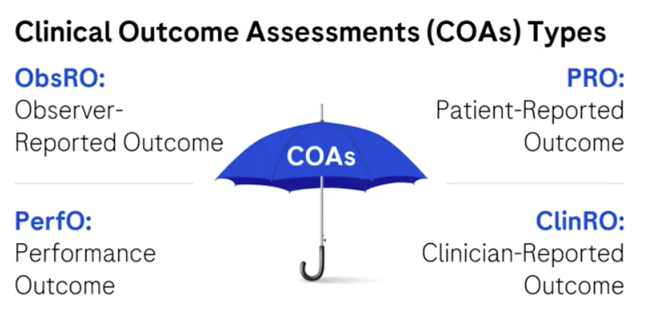
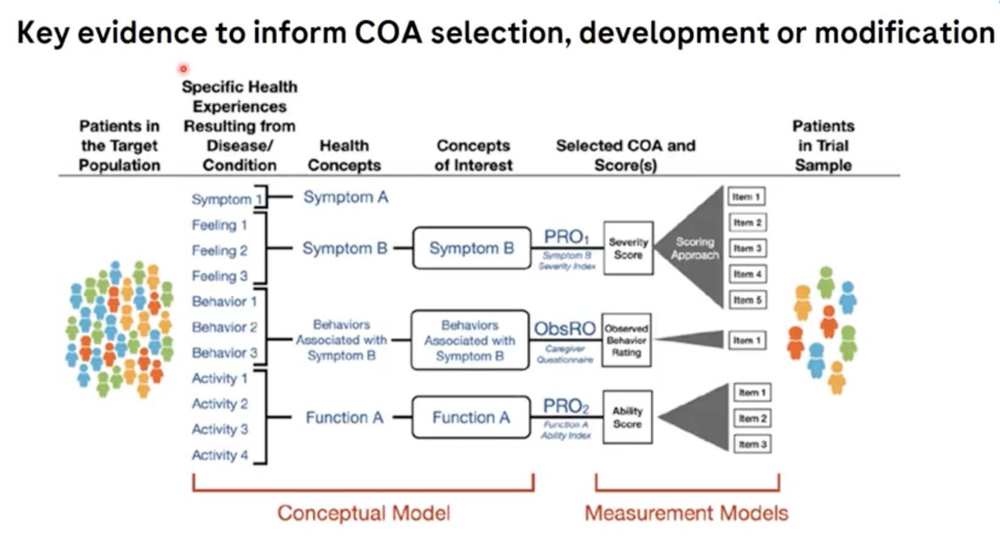

```{r setup, include=FALSE}
knitr::opts_chunk$set(echo = TRUE)
```


# Introduction of COAs and Patient Experience Data

## What is a Clinical Outcome Assessment (COA)?

A **Clinical Outcome Assessment (COA)** is a tool used to measure a patient's health condition and how it affects the way they **feel**, **function**, or **survive**. COAs are essential in **patient-centered outcomes research**, especially in clinical trials, where understanding the impact of treatment from the **patient’s perspective** is as important as traditional clinical measures like lab results or imaging.

---

**Why COAs Matter**

Imagine a scenario where a doctor tells a patient their lab results are "perfect," yet the patient still struggles with pain, fatigue, or anxiety. These **subjective experiences** are not always captured in traditional clinical assessments but are **critical to understanding treatment benefit**. This is where COAs come in.

---

**FDA Definition of a COA**

According to the **FDA**, a COA is:

> *“A measurement of a patient’s symptoms, overall mental state, or the effects of a disease or condition on how the patient functions.”*

In simpler terms, a COA reflects **how a patient feels, functions, or survives** as a result of a health condition or treatment.

---

**Types of COAs**




There are **four main types** of COAs:

1. **Patient-Reported Outcome (PRO)**

   * Comes **directly from the patient** without interpretation.
   * Can be self-reported or reported during an interview (but only the patient’s exact words are recorded).
   * Best for capturing **symptoms** or **subjective experiences** known only to the patient (e.g., pain, fatigue).
   * Example: **Numeric Rating Scale** for pain intensity.

2. **Observer-Reported Outcome (ObsRO)**

   * Provided by **someone who regularly observes the patient**, like a caregiver or parent.
   * Especially useful when the patient **cannot self-report**, e.g., infants or those with cognitive impairments.
   * Should reflect **what is observed**, not interpreted.
   * Example: **FLACC Scale** (Face, Legs, Activity, Cry, Consolability) for assessing pain in children.

3. **Clinician-Reported Outcome (ClinRO)**

   * Based on observation and **clinical judgment** by a trained health professional.
   * Involves interpretation of **visible signs**, **behaviors**, or **events** related to the disease.
   * Cannot measure **subjective symptoms** like pain that are only known to the patient.
   * Example: Documentation of a **stroke**, **heart attack**, or **skin lesion**.

4. **Performance Outcome (PerfO)**

   * Based on a **standardized task** performed by the patient.
   * Measures **functional performance** such as walking speed or memory recall.
   * Can be administered by a trained person or done independently by the patient.
   * Example: **Timed 25-Foot Walk**, **Word Recall Test**.

---

**Emerging Category: Passive Monitoring**

* Not yet a formal COA type but **proposed as a fifth category**.
* Involves **continuous, passive data collection** via sensors or wearables in everyday life.
* Example: Tracking **walking distance** or **speed** using a fitness tracker.

---

**Modes of COA Data Collection**

* **Paper-based**
* **Electronic (eCOA)** – via tablets, apps, or web platforms.
* **Digital Sensors/Wearables** – automatically collecting performance or behavior data.
 
## How COA Evidence Fits into the Drug Development Process

Clinical Outcome Assessment (COA) evidence plays a critical role across all stages of the drug development lifecycle. Below is a detailed breakdown of how COA evidence is integrated from **preclinical** stages to **post-approval**, with a focus on the role of a **Patient-Centered Outcomes Research (PCOR) Scientist**.

---

**Preclinical Stage**

* **Goal:** Understand the **lived experience** of patients and caregivers.
* **Method:** Use **qualitative research** (e.g., interviews, focus groups) to explore:

  * Symptoms
  * Functional impacts
  * Treatment burdens and experiences
* **Purpose:** Inform early hypotheses and help identify what **matters most** to patients, guiding the selection of relevant outcomes and endpoints later.

---

**Phase I Trials**

* **Goal:** Begin identifying relevant **outcome measures** and **endpoints**.
* **Activities:**

  * Determine **appropriate types of COAs** (e.g., PROs, ObsROs).
  * Identify **patient experience data** that can be collected.
  * Plan for **future evidence needs** based on the lived patient experience.
* **Role of COAs:** Inform early trial design and ensure the outcomes collected are **meaningful to patients**.

---

**Phase II Trials**

* **Goal:** **Develop, modify, and validate** COA measures.
* **Activities:**

  * Conduct **qualitative and quantitative research** to:

    * Refine outcome measures.
    * Ensure **fit-for-purpose** COA instruments.
    * Validate endpoints and **patient experience evidence**.
* **Importance:** This step ensures the tools used to assess outcomes are **scientifically robust** and **clinically relevant** for the target population.

---

**Phase III Trials**

* **Goal:** Generate **pivotal evidence** to support:

  * **Regulatory approval** (e.g., FDA, EMA)
  * **Health Technology Assessment (HTA)** and payer decisions
* **COA Evidence Usage:**

  * Included in **clinical study reports**, **regulatory submissions**, and **value dossiers**.
  * Supports **label claims** and **access/reimbursement decisions**.
* **Impact:** Demonstrates that a treatment improves how a patient **feels, functions, or survives**.

---

**Post-Approval (Lifecycle Management)**

* **Goal:** Support **real-world value**, **uptake**, and **continued access**.
* **Activities:**

  * Collaborate with **medical affairs** and **market access teams**.
  * Generate **real-world evidence (RWE)** using COAs.
  * Inform **label extensions**, **reimbursement renewals**, or **clinical practice adoption**.
* **COA Role:** Strengthen the **patient-centered narrative** in clinical care and ensure long-term treatment success from the patient's perspective.

---

**Summary Table: Role of COA Evidence Across Drug Development**

| Stage         | Focus                                      | COA Contributions                                             |
| ------------- | ------------------------------------------ | ------------------------------------------------------------- |
| Preclinical   | Understanding patient experience           | Identify symptoms, impacts, and treatment needs               |
| Phase I       | Identify outcomes and endpoints            | Select COA types, plan evidence collection                    |
| Phase II      | Develop and validate COAs                  | Create fit-for-purpose, validated measures                    |
| Phase III     | Regulatory and market evidence             | Provide support for approval and access decisions             |
| Post-Approval | Lifecycle management and real-world uptake | Support reimbursement, guideline inclusion, and patient value |
 
 
## External environment for COA science

 

The external environment for Clinical Outcome Assessment (COA) science is shaped by **regulatory agencies**, **methodological frameworks**, and **health technology assessment (HTA) bodies**. Each organization contributes **guidance documents**, **methodological expectations**, and **standards** that ensure COA data are meaningful, valid, and fit-for-purpose throughout the drug development process.

---

**1. FDA Considerations**

The U.S. Food and Drug Administration (FDA) plays a leading role in shaping COA standards:

* **2009: PRO Guidance**

  * Title: *Patient-Reported Outcome Measures: Use in Medical Product Development to Support Labeling Claims*
  * This was the foundational document establishing how PROs (a type of COA) can support regulatory labeling claims.

* **2018–Present: Patient-Focused Drug Development (PFDD) Series**

  * The FDA released a **four-part guidance series** to incorporate patient perspectives into drug development.

  **PFDD Guidance Documents:**

  1. **Collecting Comprehensive and Representative Input**

     * Finalized: *June 2020*
     * Focus: Gathering patient input systematically.
  2. **Methods to Identify What Is Important to Patients**

     * Finalized: *February 2022*
     * Focus: Determining symptoms, impacts, and outcomes that matter to patients.
  3. **Selecting, Developing, or Modifying Fit-for-Purpose COAs**

     * Finalized: *June 2022*
     * Focus: Creating or refining COAs to match patient needs and trial objectives.
  4. **Incorporating COAs into Endpoints for Regulatory Decision-Making**

     * Draft: *April 2023*
     * Focus: How to use COAs in endpoints that support approval and labeling.

* **2020: Qualification Process for Drug Development Tools**

  * Title: *Qualification Process for Drug Development Tools – Guidance for Industry and FDA Staff*
  * Purpose: Lays out the process for formally qualifying a COA tool for use in clinical development.

* **2021: PROs in Cancer Trials (Draft)**

  * Title: *Core Patient-Reported Outcomes in Cancer Clinical Trials – Guidance for Industry*
  * Status: Draft
  * Focus: Recommended PRO measures and their implementation in oncology studies.

---

**2. EMA (European Medicines Agency) Considerations**

The EMA has issued guidance documents to promote COA use, especially in the context of **health-related quality of life (HRQoL)** and **oncology**.

* **2005: HRQoL Guidance**

  * Title: *Use of Health-Related Quality of Life Measures in the Evaluation of Medicinal Products*
  * Focus: Integrating patient quality-of-life data into drug evaluations.

* **2016: Oncology Appendix**

  * Title: *Appendix 2 to the Guideline on the Evaluation of Anti-Cancer Medicinal Products in Man*
  * Focus: Emphasizes the **use of PROs in oncology**.

---

**3. CDE (China Center for Drug Evaluation) Considerations**

China’s regulatory body has issued multiple documents in 2022 addressing **patient-centered clinical trials** and COA implementation:

* **September 2022:**

  * *Guidelines for the Application of PROs in Drug Clinical Research*
  * Focus: How to apply PROs in trials to align with regulatory expectations.

* **December 2022 (Drafts):**

  * *Technical Guidelines for Designing Patient-Centered Trials*
  * *Guidelines for Implementing Patient-Centered Trials*
  * *Guidelines for Benefit-Risk Assessment in Patient-Centered Trials*

These guidelines signal CDE’s commitment to integrating COA science into clinical research in China.

---

**4. HTA (Health Technology Assessment) and Reimbursement Agency Considerations**

COAs also support **market access**, **pricing**, and **reimbursement** decisions. Key organizations include:

* **NICE (UK)**

  * Released: *Methods of Health Technology Evaluation*
  * Role: Evaluates the **value of treatments** including PRO evidence in decision-making.

* **IQWiG (Germany)**

  * Released: *IQWiG General Methods (Version 6)*
  * Role: Outlines how patient-relevant outcomes are included in evaluations for reimbursement.

* **EUnetHTA 21 (EU-Wide HTA Collaboration)**

  * Released: *Endpoints Practical Guideline*
  * Finalized: *January 2023*
  * Focus: Guidance on **endpoint selection**, including the use of COAs for EU-level HTA.

---

**Summary Table: Key External COA Guidance by Organization**

| Organization | Year         | Guidance Title / Focus                                                          |
| ------------ | ------------ | ------------------------------------------------------------------------------- |
| FDA (USA)    | 2009         | PROs for labeling claims                                                        |
| FDA          | 2020         | Qualification of drug development tools                                         |
| FDA          | 2020–2023    | PFDD guidance series (4 documents)                                              |
| FDA          | 2021 (draft) | PROs in cancer trials                                                           |
| EMA (EU)     | 2005         | HRQoL in drug evaluation                                                        |
| EMA          | 2016         | PROs in oncology                                                                |
| CDE (China)  | 2022         | Guidelines for PROs, patient-centered trial design and benefit-risk assessments |
| NICE (UK)    | Ongoing      | Methods of health technology evaluation                                         |
| IQWiG (DE)   | Ongoing      | IQWiG General Methods, Version 6                                                |
| EUnetHTA 21  | 2023         | Endpoints practical guidance for EU-level assessments                           |

## Patient Experience Data


**Why Integrate the Patient Voice in Clinical Trials?**

* The **patient voice** is increasingly important in the **external regulatory environment**.
* **FDA (U.S.)**: Under the **21st Century Cures Act**, all new drug approvals must include a summary of any patient experience data submitted and reviewed.
* **EMA (Europe)**: Issued a **draft regulatory science strategy** to systematize integration of the patient voice across drug development.
* **HTA bodies** (e.g., NICE, IQWiG, CADTH) now emphasize **patient-centered outcomes** and **PED** in reimbursement and access decisions.

---

**What Is Patient Experience Data (PED)?**

PED captures **patients' perspectives**, including:

* **Signs and symptoms** experienced
* **Disease course** over time and its impact on **daily function and quality of life**
* **Experiences with treatments**, including side effects and burden
* **Views on outcomes**, including importance and trade-offs between benefit and risk
* **Personal values and priorities** regarding treatment goals

PED reflects the **lived experiences** of patients, and their **needs and preferences**.

---

**Sources of Patient Experience Data**

PED can be generated through:

* **Qualitative research**: Interviews, focus groups
* **Observational studies**
* **Preference studies**: Quantitative assessments of what patients value
* **Clinical Outcome Assessments (COAs)**:

  * Patient-reported outcomes (PROs)
  * Clinician-reported outcomes (ClinROs)
  * Observer-reported outcomes (ObsROs)
  * Performance outcomes (PerfOs)
* **Digital health technologies**:

  * Sensors
  * Wearables

---

**PED Across the Drug Development Lifecycle**

PED provides insights at **every stage** of development:

| Stage                     | Role of PED                                                                   |
| ------------------------- | ----------------------------------------------------------------------------- |
| **Preclinical**           | Understand disease natural history and patient-defined targets                |
| **Phase I–III**           | Select trial **endpoints** that reflect what matters to patients (e.g., COAs) |
| **Regulatory Submission** | Define what is **clinically meaningful** improvement to patients              |
| **Post-approval**         | Identify **benefit-risk trade-offs** patients are willing to make             |

---

**FDA's Patient Experience Data Checklist**

* FDA provides a **structured checklist** for tracking and documenting PED use.
* This checklist supports **transparent reporting** and regulatory submissions.
* It is used to guide development teams in:

  * What data was collected
  * How it was collected
  * How it was used in decision-making

---

**Summary**

* Integrating the **patient voice** is not only ethical and scientifically meaningful but also increasingly required by **regulatory authorities**.
* **Patient Experience Data (PED)** captures what matters most to patients—symptoms, impacts, treatment experiences, and outcome preferences.
* PED plays a critical role in:

  * Designing meaningful endpoints
  * Supporting regulatory submissions
  * Enabling informed risk–benefit discussions
  * Maximizing clinical relevance and patient engagement across the lifecycle
 
# COAs selected, Developed, Modified and Validated

## Qualitative Researh

### What qualitative evidence is needed by health authorities?



* **Patient Perspective First**: Understanding the patient's experience with a disease or condition is the foundation of COA development.
* The **FDA’s roadmap** guides the development of fit-for-purpose COAs. It requires:

  * A clear **concept of interest** (how patients feel, function, or survive),
  * A defined **context of use** (the patient population and trial setting),
  * A **rationale** supported by **evidence** for why a COA is selected.

---

**Developing the Conceptual Model**

* Input sources include:

  * Patient and caregiver interviews,
  * Literature on the natural history of the disease,
  * Healthcare provider input,
  * Differences in subpopulations or healthcare environments.
* These help define **concepts of interest**, which feed into the **conceptual model** — a structure showing how various patient experiences are grouped and understood.

---

**Conceptual Framework vs. Conceptual Model**

* A **Conceptual Model** visualizes the patient experience, showing how different symptoms or impacts relate to broader health concepts.
* A **Conceptual Framework** includes:

  * The **conceptual model**,
  * A **measurement model**, which shows how the COA collects data (e.g., items, tasks) and generates scores.
* It’s particularly helpful when **multiple concepts of interest** or **COAs** are involved.

---

**From Patient Input to Measurement Strategy**

* Begin with qualitative research such as:

  * **Literature review**,
  * **Concept elicitation interviews**, if necessary.
* Select the **concept of interest** and review **existing measures**.
* If no existing tool is suitable, adapt or develop a new one.
* Conduct **cognitive debriefing** of the tool with patients.
* Then, assess **psychometric properties** to ensure the tool is reliable and valid.

---

**Seven Key Steps in COA Strategy Development**

1. Conduct qualitative literature review.
2. Perform concept elicitation interviews (if needed).
3. Identify and define concepts of interest.
4. Review existing COA instruments.
5. Adapt or develop a COA if needed.
6. Perform cognitive debriefing.
7. Assess psychometric properties.

*Note*: In some cases, existing literature may suffice, and interviews or new instrument development may not be necessary.

---

**Conclusion**

* Qualitative evidence plays a vital role in developing COAs.
* A COA is only **fit-for-purpose** if it is supported by solid **qualitative and quantitative evidence**.
* Starting with the **patient voice** ensures that the assessment reflects real-world treatment impact and supports regulatory expectations.
 
### 7 Key Steps in COA Strategy Development

 

**Step 1: Qualitative Literature Review**

* Aim: Identify existing qualitative evidence regarding patient experiences with the disease or condition.
* Method:

  * Develop a comprehensive search strategy (e.g., PubMed, MEDLINE).
  * Use clinical/methodological keywords and subject headings.
  * Apply predefined screening criteria to select relevant articles.
* Additional sources:

  * Blogs, forums, and social media can supplement traditional literature.
* Output: A foundational understanding of disease-related symptoms and impacts from the patient's perspective.

---

**Step 2: Concept Elicitation Interviews**

* Purpose: Fill gaps not addressed by the literature.
* Participants: Patients, caregivers, healthcare providers (HCPs).
* Focus:

  * Frequency, duration, severity of symptoms.
  * Impacts on daily living, work, relationships, finances.
* Interview format:

  * Open-ended and semi-structured.
  * Begin with broad questions to elicit spontaneous responses.
  * Follow-up with probes for specific concepts.
* Tools: Use a semi-structured discussion guide to ensure all key areas are explored.

---

**Step 3: Develop the Conceptual Model**

* Data Source: Interview transcripts from Step 2.
* Analysis:

  * Code transcripts thematically using a predefined dictionary.
  * Identify themes and quantify concept frequency.
* Conceptual Saturation:

  * Point at which no new themes emerge, confirming sample adequacy.
* Output: Conceptual model showing relationships between symptoms, impacts, and concepts of interest.
* Example: Models for diseases like early-onset Parkinson’s and Angelman syndrome, structured into motor/non-motor symptoms and quality-of-life impacts.

---

**Step 4: Review Existing COAs**

* Purpose: Identify and evaluate instruments that measure selected concepts of interest.
* COA types:

  * Patient-Reported Outcomes (PROs)
  * Clinician-Reported Outcomes (ClinROs)
  * Observer-Reported Outcomes (ObsROs)
  * Performance Outcomes (PerfOs)
* Evaluation criteria:

  * Suitability for the target population.
  * Coverage of the relevant concepts.
  * Psychometric validity.
  * Alignment with FDA’s PFDD (Patient-Focused Drug Development) guidance.

---

**Step 5: Adapt or Develop a COA Instrument**

* Adaptation:

  * Modify existing tools for new context of use (e.g., change wording, format, or response options).
* Development:

  * When no suitable tool exists, create a new one from scratch using qualitative inputs.
  * Validate with iterative testing.
* Example: SMAIS (SMA Independence Scale) development included:

  1. Literature review.
  2. Two rounds of qualitative interviews (concept elicitation + cognitive debriefing).
  3. Refinement based on patient quotes and experiences.
* Output: A draft measure ready for testing and further validation.

---

**Step 6: Cognitive Debriefing**

* Goal: Ensure the instrument is understandable, relevant, and interpretable for the target population.
* Methods:

  * Conduct with new participants (different from earlier interviews to avoid bias).
  * Match intended trial modality (e.g., paper, eCOA).
  * Include language and cultural validation for international use.
* Think-Aloud Approach:

  * Ask about clarity of instructions, length, recall period, and meaning of items.
  * Revise items based on feedback; confirm changes in a second round.
* Output: Validated instrument ready for psychometric evaluation.

---

**Step 7: Psychometric Evaluation**

* Plan: Develop a psychometric/statistical analysis plan.
* Key properties to assess:

  * **Content Validity**: Alignment with patient-expressed concepts.
  * **Construct Validity**:

    * *Convergent validity*: Correlation with similar constructs.
    * *Divergent validity*: Low correlation with unrelated constructs.
    * *Known-groups validity*: Differences between expected subgroups.
  * **Reliability**:

    * *Test-retest reliability*: Stability over time.
    * *Inter- and intra-rater reliability*: Consistency across or within raters (for ClinROs).
  * **Responsiveness**:

    * Ability to detect change over time.
  * **Item Analysis**:

    * Descriptive stats, floor/ceiling effects.
* Final output:

  * A scoring algorithm is defined.
  * Incorporated into the **conceptual framework**.
 
 
## Quantitative Researh

**What is Psychometrics and Why Is It Important?**

* **Definition**:
  Psychometrics is the scientific discipline focused on the **theory and techniques of psychological and social measurement**. It deals with:

  * Constructing and validating measurement instruments (e.g., COAs),
  * Measuring theoretical constructs like **quality of life**, **functioning**, or **symptom severity**,
  * Ensuring that data collected is **valid**, **reliable**, and **interpretable**.

* **Relevance in Clinical Trials**:

  * Psychometrics provides the **framework and techniques** for developing and validating COAs.
  * Regulatory bodies like the **FDA** require that any **Patient-Reported Outcome (PRO)** instrument be **well-defined and reliable** to support labeling claims.
  * Without psychometrically sound measures, **clinical trial results may lack credibility or fail regulatory scrutiny**.

### Classical test theory (CTT) and Item response theory (IRT)


**Classical Test Theory (CTT)**

* **Core Principle**:
  Observed Score = True Score + Random Error
  CTT assumes every test score reflects a true score plus some measurement error.

* **Key Concepts**:

  * **Reliability**: Measures consistency of scores

    * *Internal reliability*: Consistency across items (e.g., Cronbach's Alpha)
    * *Test-retest reliability*: Consistency over time
    * *Inter-rater reliability*: Consistency between different raters
    * *Intra-rater reliability*: Consistency within the same rater

  * **Validity**: Measures how well the instrument assesses what it's supposed to measure

    * *Content Validity*: Relevance and representativeness of items
    * *Construct Validity*:

      * *Convergent Validity*: Correlation with similar constructs
      * *Discriminant Validity*: Low correlation with unrelated constructs
      * *Known-group Validity*: Detects expected differences between groups
    * *Criterion Validity*: Instrument's ability to predict related outcomes

      * *Concurrent Validity*: Correlates with other current measures
      * *Predictive Validity*: Predicts future outcomes
    * *Responsiveness*: Instrument’s ability to detect changes over time

* **Common Outputs in CTT**:

  * *Intraclass Correlation Coefficient (ICC)*: For test-retest and rater reliability
  * *Cronbach’s Alpha / Ordinal Alpha*: For internal consistency
  * *Standard Error of Measurement*: Estimate of error in the observed score
  * *Factor Analysis*: Evaluates instrument dimensionality
  * *Statistical Tests*: t-tests, ANOVA, regression for validity testing
  * *Floor/Ceiling Effects*: Assesses the instrument’s range and sensitivity

---

**Item Response Theory (IRT)**

* **Definition**:
  IRT is a family of statistical models that define the relationship between:

  * A person's response to an item,
  * The characteristics of the item,
  * The person’s **latent trait level** (e.g., depression, physical function).

* **Key Assumptions**:

  * Responses are driven by **latent traits**.
  * Items and persons exist on a **shared, unobservable scale**.
  * Assumptions include **dimensionality** and **local independence**.

* **Uses in COA Development**:

  * Evaluating model, item, and person fit.
  * Supporting **scoring** and **scaling** for better interpretability.
  * Assessing **differential item functioning** (DIF) across subgroups.
  * Developing **item banks** and enabling **Computerized Adaptive Testing (CAT)**.

* **Types of IRT Models**:

  * **Dichotomous Models** (binary response items):

    * *Rasch Model* (1-parameter)
    * *2-Parameter Logistic Model*
  * **Polytomous Models** (ordered categorical responses):

    * *Partial Credit Model (PCM)*
    * *Rating Scale Model (RSM)*
    * *Graded Response Model (GRM)*

* **Model Fit Evaluation**:

  * *Item Fit*: Whether each item behaves as expected
  * *Person Fit*: Whether individual responses align with model assumptions
  * *Overall Fit*: Based on discrepancies between observed and expected patterns

* **Interpretation Example**:

  * A patient with a **latent trait estimate** of 2.1 (above the mean) endorses most items, indicating strong symptoms or capabilities, depending on the scale.
  * IRT provides more **granular insight** than total scores alone (as in CTT).

---
 
Here’s a **clear comparison table** summarizing the features of **Classical Test Theory (CTT)** vs **Item Response Theory (IRT)** based on the material you provided:

| Feature                                 | **Classical Test Theory (CTT)**                                                  | **Item Response Theory (IRT)**                                                      |
| --------------------------------------- | -------------------------------------------------------------------------------- | ----------------------------------------------------------------------------------- |
| **Regulatory familiarity**              | Long-standing dominant paradigm; traditionally prioritized by health authorities | Gaining popularity in recent years, but less historically dominant                  |
| **Focus**                               | Test-level information                                                           | Item-level information                                                              |
| **Score representation**                | Total score (sum of item scores)                                                 | Estimated *latent trait* value (θ)                                                  |
| **Item & person parameter dependency**  | Dependent on the specific test and sample used                                   | Sample-independent and test-independent estimates                                   |
| **Standard Error of Measurement (SEM)** | Same SEM for all individuals                                                     | Person-specific SEM (varies with ability/trait level)                               |
| **Test length impact**                  | Longer tests generally more reliable                                             | Shorter tests can be more reliable if items are well-targeted                       |
| **Practicality**                        | Easier to implement, fewer assumptions                                           | More complex modeling, requires larger samples and statistical expertise            |
| **Application in COA**                  | Widely used in clinical trials for validation and reliability testing            | Used for deeper item analysis, adaptive testing (CAT), and refining COA instruments |

**Key takeaway**:

* **CTT** is simpler, well-understood by regulators, and effective for traditional validation.
* **IRT** provides more precision at the item level, supports modern approaches like adaptive testing, and allows for sample/test independence — but it’s more complex to implement.
 


### Example Study Setup


* **Goal**: Assess psychometric properties of an instrument to support item selection in a clinical trial.
* **Data**:

  * 10,000 simulated respondents
  * 10 items, each scored on a **4-point Likert scale** (0 = *Not at all*, 3 = *Very much*)
  * Higher scores represent **greater severity** of a health problem.
* **Approach**:

  * **Classical Test Theory (CTT)**
  * **Item Response Theory (IRT)** using **Partial Credit Model (PCM)**
* **Analyses**:

  * Internal reliability (Cronbach’s Alpha, Ordinal Alpha)
  * Construct validity (Confirmatory Factor Analysis, CFA)
  * Item-level statistics (descriptives, inter-item and item-total correlations)
  * IRT analyses (item fit, parameter estimates, item-person map)

---

**Step-by-Step Analysis & Key Outputs**

1. **Internal Reliability**

   * **Cronbach’s Alpha** = 0.83
   * **Ordinal Alpha** = 0.89 (more appropriate for ordinal/Likert data)
   * Threshold: ≥ 0.70 = acceptable; ≥ 0.80 = good.
   * No items needed removal — all items contributed positively.

2. **Construct Validity**

   * **CFA (1-factor model)** confirmed **unidimensionality**:

     * All factor loadings > 0.30.
     * Model fit indices showed good fit.
   * This step is crucial before applying IRT (which assumes unidimensionality).

3. **Item-Level Descriptive Statistics**

   * Mean scores ranged **0.71–2.28**.
   * No **ceiling** or **floor** effects observed.
   * Higher mean = easier to endorse higher response options.

4. **Inter-Item Correlation**

   * Ideal range: **0.15–0.50**.
   * All item pairs were within range — no redundancy.

5. **Item-Total Correlation (CTT Discrimination)**

   * All items > 0.30 → good discrimination between high- and low-construct individuals.

6. **IRT Item Fit**

   * Fit statistic range: **0.5–1.5** = good fit; >2 = poor.
   * Mean infit MNSQ = 0.92; mean outfit MNSQ = 0.92 → excellent fit.
   * No misfitting items detected.

7. **IRT Item Difficulty**

   * Range: **-1.00 to 1.42 logits**.
   * Example:

     * *Item 7* = most difficult
     * *Item 8* = easiest
   * All items had **ordered categories** — patients with higher severity more likely to endorse higher categories.

8. **Item-Person Map**

   * Visual alignment of:

     * **Person distribution** (top)
     * **Item difficulty estimates** (bottom)
   * Items matched well to the sample — no item too easy/difficult for the population.

---

**Practical Takeaways**

* **From CTT**: The test is internally consistent, unidimensional, and well-balanced in difficulty.
* **From IRT**: Items function as expected, difficulty covers the population well, and measurement error varies by person ability level.
* **For COA Development**:

  * Use **CTT** for initial reliability/validity checks.
  * Use **IRT** for deeper item-level diagnostics and to fine-tune or shorten the instrument without sacrificing reliability.
 

# Common COA Application in Clinical Trials

## PRO-CTCAE

**1. Introduction & Background**

* **PRO-CTCAE** = *Patient-Reported Outcomes version of the Common Terminology Criteria for Adverse Events*.
* Developed by **NCI** as a **patient-reported companion** to the clinician-reported CTCAE.
* Motivation:

  * Clinician reports can miss up to **50%** of adverse events detected by patients themselves.
  * Improves AE detection & precision.
  * Encouraged by FDA for understanding treatment-related symptoms; may contribute to **drug label** or **Project Patient Voice**.
* **Structure**:

  * 78 CTCAE symptoms deemed suitable for self-report → 124 items in the PRO-CTCAE library.
  * Each symptom: 1–3 questions on **presence**, **frequency**, **severity**, and/or **interference**.
  * “Worst severity” in the past 7 days is used.

---

**2. PRO-CTCAE Items & Scoring**

* **Measurement attributes**:

  1. **Presence** – 21 terms, Yes/No (e.g., “unusual darkening of skin”).
  2. **Severity** – 51 terms, 5-point scale (None → Very Severe; e.g., “pain at its worst”).
  3. **Amount** – 2 terms, 5-point scale (Not at all → Very much; e.g., “hearing loss”).
  4. **Frequency** – 25 terms, 5-point scale (Never → Almost constantly; e.g., “vomiting”).
  5. **Interference** – 25 terms, 5-point scale (Not at all → Very much; e.g., “urge to urinate”).
* Items are **organized by body system** in the item bank; some symptoms have multiple attributes (e.g., severity + interference).

---

**3. Item Selection Guidance**

* Selection hierarchy:

  1. **Best**: Based on AEs observed in **Phase 1** or early Phase 2.
  2. If no Phase 1: Based on AEs known from **mechanism of action** or **preclinical tox**.
  3. Novel MoA: Include AEs common to other treatments for same disease & route of administration.
  4. Phase 1 in a single indication: Include AEs specific to that disease.
  5. Most broad: For novel MoA, include AEs common to other treatments for the disease & route.
* Earlier-phase, targeted data = **more streamlined selection**.

---

**4. Reconciliation & Sharing of Data**

* **Regulatory stance (FDA)**:

  * No expectation to reconcile patient reports with clinician CTCAE.
  * PRO-CTCAE **not used** as the basis for AE reporting.
* **Possible uses**:

  * Clinicians could review patient responses before visits → improves AE reporting & symptom management.
  * Between-visit reporting (e.g., Days 8 & 15 of a cycle) could inform timely clinician follow-up.
* **Protocol design**: Any sharing/review process should be **pre-specified and transparent**.

---

**5. Published Research Examples**

1. **Longitudinal symptom grade plots** – Show AE course over time (e.g., alopecia ↑ steadily; mucositis peaked early then declined with symptom control).
2. **Clinician vs. patient AE reporting** – Patients report more/narrower-scope symptoms for:

   * Nausea, vomiting, dermatitis, pain, fatigue, anxiety, depression, appetite loss, tinnitus.
3. **Pedometer + PRO-CTCAE tracking in stem cell transplant** – Longitudinal AE grade patterns.

* **Value**: Highlights differences in detection between patients & clinicians; shows symptom trends over time.

---

**6. Key Takeaways**

* **PRO-CTCAE**:

  * Fills gaps in AE reporting.
  * Adds patient voice to tolerability measurement.
  * Offers structured, attribute-based symptom capture.
* **Implementation success** relies on:

  * Careful item selection.
  * Clear protocol on data sharing.
  * Understanding regulatory expectations.
* **Research shows**:

  * Patient reports often detect different or earlier AEs.
  * Data visualization can aid interpretation and clinical decision-making.

## Interpreting and summarizing COA data in Clinical Study Reports


**1. Analysis Sets**

* Full Analysis Set (FAS): Similar to the ITT population, includes all randomized participants regardless of treatment received. Commonly used for time to deterioration, mean change from baseline, and other analyses.
* Safety Analysis Set (SAS): Includes all participants who received at least one dose of protocol treatment. Often used for PRO-CTCAE, the Columbia Suicide Severity Rating Scale, and other scales.

---

**2. Common COA Outputs and Interpretation**

**Completion rate by visit**
Tracks how many patients completed the questionnaire, scale, or item at each visit and the number of missing questions.
Interpretation points:

* Is compliance at or above 70%?
* Is compliance similar across arms and over time?
* Are there differences between treatment groups?
* Provide a list of reasons for missing data.
  The number of completed items should meet the COA manual requirements for scoring.

**Visit summary and change from baseline**
Summarizes mean, mean change, standard deviation, median, quartiles, and min/max values.
Interpretation points:

* Were baseline values similar between arms?
* Were changes clinically meaningful?
* Did scores improve, worsen, or remain stable over time?
  Example: In EORTC QLQ-C30, higher scores for functioning/global health indicate better status, and lower scores for symptoms indicate less burden. In one case, no meaningful worsening was observed through Cycle 10, with improvement after chemotherapy.

**Time-to-event analysis**
Includes time to deterioration (TTD) or time to the first of two consecutive deteriorations (TTCD), based on a meaningful change threshold. Kaplan–Meier curves, hazard ratios, and p-values are presented.
Example: In one study, no difference was seen between arms, and median TTD was not reached.

**Responder analysis**
Shows the proportion of patients with an improvement beyond the meaningful threshold.
Example: More than 70% improved by at least five points by Week 5, with 68% maintaining improvement up to Week 21.

**Mixed-effects model with repeated measures (MMRM)**
Analyzes longitudinal data with fixed effects, covariates, and repeated measures over time.
Interpretation points:

* Compare LS mean scores between arms at each time point.
  Example: Patients in Arm B reported better quality of life; the fixed treatment effect represents the causal effect for a typical trial patient.

**Cumulative distribution function (CDF)**
Displays the distribution of changes from baseline across all possible thresholds.
Interpretation points:

* A vertical line marks the meaningful threshold.
  Example: A ≥10-point improvement was reported by 60% of Arm A versus 20% of Arm B, with clear visual separation favoring Arm A.

---

**3. Key Interpretation Tips for CSRs**

* Compare baseline values between arms.
* Link results to meaningful change thresholds.
* Highlight consistency or variability over time.
* Discuss both statistical and clinical significance.
* Use multiple output types together for a complete interpretation.


