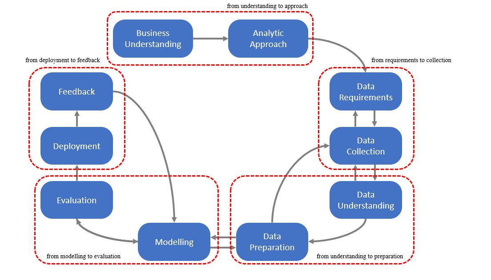
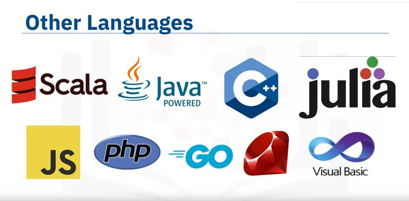

```{r setup, include=FALSE, echo = FALSE,message = FALSE, error = FALSE, warning = FALSE}
knitr::opts_chunk$set(echo = TRUE)

# <!-- ---------------------------------------------------------------------- -->
# <!--                    1. load the required packages                       -->
# <!-- ---------------------------------------------------------------------- --> 

## if(!require(psych)){install.packages("psych")}

packages<-c("tidyverse", "knitr", "papeR")
ipak <- function(pkg){
  new.pkg <- pkg[!(pkg %in% installed.packages()[, "Package"])]
  if (length(new.pkg)) 
    install.packages(new.pkg, dependencies = TRUE)
  sapply(pkg, require, character.only = TRUE)
}
ipak(packages)
# <!-- ---------------------------------------------------------------------- --> 


# <!-- ---------------------------------------------------------------------- -->
# <!--                        2. Basic system settings                        -->
# <!-- ---------------------------------------------------------------------- -->
setwd(dirname(rstudioapi::getSourceEditorContext()$path))
getwd()
Sys.setlocale("LC_ALL","English")
```


```{r mind map,echo = F,message = FALSE, error = FALSE, warning = FALSE}
## Convert to mind map text, markdown outline, R script, and HTML widget ####
library(mindr)
# text -> widget
# input <- c("# Chapter 1", "## Section 1.1", "### Section 1.1.1", "## Section 1.2", "# Chapter 2")
# mm(from = input, root = "mindr")


input <- rstudioapi::getSourceEditorContext()$path 
## file.show(input) # Open the input file with the default program, if any
input_txt <- readLines(input, encoding = "UTF-8")
## Convert to mind map text, markdown outline, R script, and HTML widget ####
mm_output <- mm(input_txt, 
                output_type = c("widget"),
                root = "")
mm_output$widget


```


#  What is Data Science?

**Summary**

1. Data Scientists need programming, mathematics, and database skills, many of which can be gained through self-learning.

2. Companies recruiting for a Data Science team need to understand the variety of different roles Data Scientists can play, and look for soft skills like storytelling and relationship building as well as technical skills.

3. High school students considering a career in Data Science should learn programming, math, databases, and, most importantly practice their skills.

## Introduction of Data Science

Data Science is the field of exploring, manipulating, and analyzing data, and using data to answer questions or make recommendations.

As Data Science is not a discipline traditionally taught at universities, contemporary data scientists come from diverse backgrounds such as engineering, statistics, and physics.

```{r , echo=FALSE, fig.align="center", out.width = '100%',fig.cap=""}

```

The use cases for deep learning include speech recognition and classifying image at a large scale.

According to Dr. White, if someone is coming into a data science team, the first skills they would need are: knowing basic probability and some basic statistics, knowing some algebra and some calculus, understanding relational databases, knowing how to program, at least have some computational thinking.

According to Dr. White, the industrial world is shifting to a new trend, and for high school students to be on the right side of this new trend, his advice to them is:

* take a course in probability
* learn how to program
* learn some math
* try to start experimenting with building small systems that work and are useful
* learn statistics
* Netflix uses machine learning to recommend movies to you based on movies you have already watched and liked or disliked.

So the very first step is measurement. If companies have existing data, then they should start looking at it and cleaning it. If they don't have existing data, then they need to start collecting it. >> I think to look for a team who love to work as a data scientist. >> The first stop is to have employees, that they are interested on data science. because if you don't have interest in your company, you will not have engagement. >> Companies should remember, that it's key to have a team. So it's not one data scientist, but a team of them, that each of them have strengths in different areas of data science. 

## The Final Deliverable

The ultimate purpose of analytics is to communicate findings to the concerned who might use these insights to formulate policy or strategy. Analytics summarize findings in tables and plots. The data scientist should then use the insights to build the narrative to communicate the findings. In academia, the final deliverable is in the form of essays and reports. Such deliverables are usually 1,000 to 7,000 words in length. In consulting and business, the final deliverable takes on several forms. It can be a small document of fewer than 1,500 words illustrated with tables and plots, or it could be a comprehensive document comprising several hundred pages. Large consulting firms, such as McKinsey and Deloitte,I routinely generate analytics-driven reports to communicate their findings and, in the process, establish their expertise in specific knowledge domains.

## Recruiting for Data Science
 
**Curiosity is one of the most important skills that a data scientist should have in addition to sense of humor and story telling.**
 
When the companies are hiring people for a data science team, maybe a data scientist or an analyst, or a chief data scientist, the tendency would be to find the person who has all the skills, that they know the domain-specific knowledge. They're excellent in analyzing structured and unstructured data. And they're great at presenting and they've got great storytelling skills. So if you put all this together, you will realize you're looking for a unicorn. And your odds of finding a unicorn are pretty rare. I think what you need to do to is to see, given the pool of applicants you have, who has the most resonance with your firm's DNA. Because you can teach analytics skills, anyone can learn analytics skills if they dedicate time and effort to it. But what really matters is who's passionate about the kind of business that you do. Someone could be a great data scientist in the retail environment, but they may not be that excited about working in IT related firms or working with gigabytes of weblogs. But if someone is excited about those weblogs, if someone is excited about health-related data then they would be able to contribute to your productivity much more so. And I would say if I'm looking for someone, if I have to put together a data science team, I would first look for curiosity. Is that person curious about things not just for data science but anything like, are they curious about why this room is painted a certain way, why do the bookshelves have books, and what kinds of books? They have to have a certain degree of curiosity about everything that is in their vision, that they look at. The second thing is do they have a sense of humor because, you see, you have to have a lighthearted about it. If someone is too serious about it, they probably would take it too seriously, and would not be able to look at the lighter elements. The third thing I think, and I think the last thing that I would look for if I had to have a hierarchy, the last thing I would look for are technical skills. I would go through the social skills, curiosity, and sense of humor. The ability to tell a story. The ability to know that there is a story there. And then once all is there then I would say, well, can you do the technical side of it? And if there is some hope or some sign of some technical skills, I would take them because I can train them in whatever skills they need. But I cannot teach curiosity. I cannot teach storytelling. I cannot certainly, instill sense of humor in anyone. >> I think there's no hard and fast rule for hiring data scientists. I think it's going to be a case by case thing. I would say there has to be some sort of technical component, somebody should be able to work with and manipulate the data. They should be able to communicate what they find in the data. I find quite often nobody really cares about the r-square or the confidence interval. So you have to be able to introduce those things and explain something in a compelling way. And they also have to find somebody who is relatable, because data science,
 
it been typically new means that the person in that role has to make relationships and they have to work across different departments. >> If these data scientist has a good mathematics and statistics background.>> They have to consider like problem solving abilities and analysis. The scientist needs to be good in analyzing problems.>> The persons they are hiring, they should love to play with data. And then they know how to play with the data visualization. They have analytical thinking.>> When a company is hiring anyone to work on a data science team, they need to think about what role that person is going to take. Before a company begins, they need to understand what they want out of their data science team. And then they need to hire to begin it. As they grow a data science team, they need to understand whether they need engineers, architects, designers to work on visualization. Or whether they just need more people who can multiply large matrices. >> From a skills point of view, let's focus on the technical skills and in that case, first thing would be what kind of a technical platform would you like to adopt? Let's say you want to work in a structured data environment and let's say you want to work in market research. Then the type of skills you need are slightly different than someone who would like to work in big data environments. If you want to work in the traditional market research data, structure data environment, your skills should be some statistical knowledge and some knowledge of basic statistical algorithms, maybe some machine learning algorithms. And these are the tools that you would like to develop. If you want to work in big data, then there's the other aspect of it and that is to be able to store data. So you start with the expertise in storing large amounts of data. And then you look into platforms that allow you to do that. The next step would be to be able to manipulate large amounts of data, and the final step would be to apply algorithms to those large sets of data. So it's a three-step process. But most likely it starts, most importantly, it starts with where you would like to be, in what field, in what domain. In terms of platforms, let's you want to be in the traditional predictive analytics environment, and you're not working with big data, then R or Stata, or Python would be your tools. If you're working mostly with unstructured data, then Python is most suitable than R. If you're working with big data, then Hadoop and Spark are the environments that you will be working with. So it all depends upon where you would like to be and what kind of work excites you and then you pick your tools. In addition to technical skills, the second aspect of the data science is to have the ability to communicate. The communication skills or presentation skills. I call them story telling skills, that is that you have your analysis done, now can you tell a great story from it? If you have a very large table, can you synthesize this and make it more appealing that when it goes on the screen, or is it part of a document that it just speaks? It sings the findings and the reader just gets it right there. So the ability to present your findings, either verbally, or in a presentation, or in a document. So those communication and presentation skills are equally important as the technical skills are. When you have a grading side, when you're presenting your results, imagine you're driving on a mountain and then there's a sharp turn. And you can't see what's beyond the turn. And then you make that turn and then suddenly, you see a tremendous valley in front of you. And this great sense of awe, that I didn't know that, right? So when you present your findings and you have this great finding and you communicate it well, this is what people feel because they were not expecting it. They were not aware of it, and then this great sense of happiness that now I know. And I didn't know this, now I know. And then it empowers them, it gives them ideas, what they can do with this knowledge, this new insight. It's a great sense of joy. And you are able as a data scientist, you are able to share with your clients because you enabled it.


# Tools for Data Science
 

## Languages of Data Science

Data science requires programming. 

+ Visual programming
+ Open source 
+ Commercial software - leverage open source software
+ Cloud computing 

+ python, R, SQL (recommended)
+ Scala, Java, C++, julia

It depends on what problems you need to solve. 

### Roles in Data Science

+ Business Analyst
+ Database Engineer
+ Data Analyst
+ Data Engineer
+ Data Scientist
+ Research Scientist
+ Software Engineer
+ Statistician
+ Product Manager
+ Project Manager


### python

+ People who already know how to program
+ People who want to learn to program
+ Over 80% of data professional worldwide
+ Python is used heavily in data science, AI, and machine learning, web development, and IoT 

It is a:

+ General purpose language 
+ Large standard library

**Python in Data Science**

1. Scientific computing libraries like Pandas, Numpy, Scipy, and Matplotlib
2. For AI: PyTorch, TensorFlow, Keras, and Scikit-learn
3. NLP: NLTK (some sort of toolkit)

### R

Learning up to three languages can increase your salary.

It is not open source like Python, rather it is a free software.

+ The Open Source Initiative (OSI) champions open source
    + business focused
    + open source software can be modified without sharing the modified source code depending on the open source license
+ the Free Software Foundation (FSF) defines free software
    + more focused on a set of values
    + Free software can always be run, studied, modified, and redistributed with or without changes
    + 

Easy to translate from math to code. It is popular in academia. It integrates well with other computer languages. And has stronger object-oriented programming facilities than most statistical computing languages. 

### SQL
+ SQL = Structured Query Language

How it works:  
+ a non-procedural language
+ scope is limited to querying and managing data

+ it is developed at IBM


A combination of *clause*, *expressions*, *predicates*, *queries*, and *statements*.


**What makes SQL great**

+ Knowing SQL willhelp you get jobs as a business and data analyst and is a must in data engineering and data sceince.
+ When performing operations with SQL the data is accessed directly (without any need to copy it beforehand). This can considerably speed up workflow executions.
+ SQL is the interpreter between you and the database
+ SQL is a ANSI standard, which means if you learn SQL and use it with one database you will be able to easily apply your SQL knowledge with many other databases

SQL databases available:  
+ MySQL
+ PostgreSQL
+ SQLite
+ Oracle
+ IBMDB2
+ MariaDB

### Other Languages

+ Scala
    + provides support for FP
    + extension to Java
    + Scalable Language
    + Apache Spark: designed to be faster than Hadoop
+ Java 
    + tried-and-true general-purpose OOP language
    + Hadoop - manages data processing and storage for big data applications running in clustered systems
+ C++ 
    + extension of C
    + develop programs that feed data to customers in real-time
    + TensorFlow
    + MongoDB - a NoSQL database for big data management
    + Caffe - a deep learning algorithm repository
+ julia
    + designed at MIT in 2012
    + speedy development like Python or R while producing programs that run as fast as C or Fortran programs would
    + Julia DB
+ JS
    + extends beyond the browser with Node.js and other serve side approaches
    + `TensorFlow.js`
    + `R-js`: makes linear algebra possible in Typescript
+ php
+ GO
+ Ruby
+ Visual Basic


```{r , echo=FALSE, fig.align="center", out.width = '100%',fig.cap=""}

```


## Categories of Data Science Tools


The ones with green labels can be done via cloud service.

+ Data Asset Management:
    + Data Management: process of persisting and retrieving data
    + Data Integration and Transformation: Extract, Transform, and Load - the process of retrieving data from remote data management systems
        + also, transforming data and loading it into a local data management system
    + Data Visualization: part of an initiaal data exploration process, as well as being part of a final deliverable
    + Model Building: Create a machine learning or deep learning model using an algorithm with a lot of data
    + Model Deployment: Make models available to third-party applications
    + Model Monitoring and Assessment: ensures continuous performance quality checks on the deployed models
+ Code Asset Management: uses versioning and other collaborative features to facilitate teamwork
+ Development Environments: IDE, tools that help the data scientists to *implement, execute, test, and deploy* their works
    + Execution Environments: tools where data processing, model training, and deployment take place


### Open Source Tools for Data Science

In part one of this two-part series, we’ll cover data management, open source data integration, transformation, and visualization tools. The most widely used open source data management tools are relational databases such as MySQL and PostgreSQL; NoSQL databases such as MongoDB Apache CouchDB, and Apache Cassandra; and file-based tools such as the Hadoop File System or Cloud File systems like Ceph. Finally,Elasticsearch is mainly used for storing text data and creating a search index for fast document retrieval. The task of data integration and transformation in the classic data warehousing world is called ETL, which stands for “extract, transform, and load.” These days, data scientists often propose the term “ELT” – Extract, Load, Transform“ELT”, stressing the fact that data is dumped somewhere and the data engineer or data scientist themself is responsible for data. Another term for this process has now emerged: “data refinery and cleansing.” Here are the most widely used open source data integration and transformation tools: Apache AirFlow, originally created by AirBNB; KubeFlow, which enables you to execute data science pipelines on top of Kubernetes; Apache Kafka, which originated from LinkedIn; Apache Nifi, which delivers a very nice visual editor; Apache SparkSQL (which enables you to use ANSI SQL and scales up to compute clusters of 1000s of nodes), and NodeRED, which also provides a visual editor. NodeRED consumes so little in resources that it even runs on small devices like a Raspberry Pi. We’ll now introduce the most widely used open source data visualization tools. We have to distinguish between programming libraries where you need to use code and tools that contain a user interface. The most popular libraries are covered in the next videos. A similar approach uses Hue, which can create visualizations from SQL queries. Kibana, a data exploration and visualization web application, is limited to Elasticsearch (the data provider). Finally, Apache Superset is a data exploration and visualization web application. Model deployment is extremely important. Once you’ve created a machine learning model capable of predicting some key aspects of the future, you should make that model consumable by other developers and turn it into an API. Apache PredictionIO currently only supports Apache Spark ML models for deployment, but support for all sorts of other libraries is on the roadmap. Seldon is an interesting product since it supports nearly every framework, including TensorFlow, Apache SparkML, R, and scikit-learn. Seldon can run on top of Kubernetes and Redhat OpenShift. Another way to deploy SparkML models is by using MLeap. Finally, TensorFlow can serve any of its models using the TensorFlow service. You can deploy to an embedded device like a Raspberry Pi or a smartphone using TensorFlow Lite, and even deploy to a web browser using TensorFlow dot JS. Model monitoring is another crucial step. Once you’ve deployed a machine learning model, you need to keep track of its prediction performance as new data arrives in order to maintain outdated models. Following are some examples of model monitoring tools: ModelDB is a machine model metadatabase where information about the models are stored and can be queried. It natively supports Apache Spark ML Pipelines and scikit-learn. A generic, multi-purpose tool called Prometheus is also widely used for machine learning model monitoring, although it’s not specifically made for this purpose. Model performance is not exclusively measured through accuracy. Model bias against protected groups like gender or race is also important. The IBM AI Fairness 360 open source toolkit does exactly this. It detects and mitigates against bias in machine learning models. Machine learning models, especially neural-network-based deep learning models, can be subject to adversarial attacks, where an attacker tries to fool the model with manipulated data or by manipulating the model itself. The IBM Adversarial Robustness 360 Toolbox can be used to detect vulnerability to adversarial attacks and help make the model more robust. Machine learning modes are often considered to be a black box that applies some mysterious “magic.” The IBM AI Explainability 360 Toolkit makes the machine learning process more understandable by finding similar examples within a dataset that can be presented to a user for manual comparison. The IBM AI Explainability 360 Toolkit can also illustrate training for a simpler machine learning model by explaining how different input variables affect the final decision of the model. Options for code asset management tools have been greatly simplified: For code asset management – also referred to as version management or version control – Git is now the standard. Multiple services have emerged to support Git, with the most prominent being GitHub, which provides hosting for software development version management. The runner-up is definitely GitLab, which has the advantage of being a fully open source platform that you can host and manage yourself. Another choice is Bitbucket. Data asset management, also known as data governance or data lineage, is another crucial part of enterprise grade data science. Data has to be versioned and annotated with metadata. Apache Atlas is a tool that supports this task. Another interesting project, ODPi Egeria, is managed through the Linux Foundation and is an open ecosystem. It offers a set of open APIs, types, and interchange protocols that metadata repositories use to share and exchange data. Finally, Kylo is an open source data lake management software platform that provides extensive support for a wide range of data asset management tasks. This concludes part one of this two-part series. Now let’s move on to part two.

In this section, we’ll cover the development environment, open source data integration, transformation, and visualization tools. One of the most popular current development environments that data scientists are using is “Jupyter.” Jupyter first emerged as a tool for interactive Python programming; it now supports more than a hundred different programming languages through “kernels.” Kernels shouldn’t be confused with operating system kernels. Jupyter kernels are encapsulating the different interactive interpreters for the different programming languages. A key property of Jupyter Notebooks is the ability to unify documentation, code, output from the code, shell commands, and visualizations into a single document. JupyterLab is the next generation of Jupyter Notebooks and in the long term, will actually replace Jupyter Notebooks. The architectural changes being introduced in JupyterLab makes Jupyter more modern and modular. From a user’s perspective, the main difference introduced by JupyterLab is the ability to open different types of files, including Jupyter Notebooks, data, and terminals. You can then arrange these files on the canvas. Although Apache Zeppelin has been fully reimplemented, it’s inspired by Jupyter Notebooks and provides a similar experience. One key differentiator is the integrated plotting capability. In Jupyter Notebooks, you are required to use external libraries in Apache Zeppelin, and plotting doesn’t require coding. You can also extend these capabilities by using additional libraries. RStudio is one of the oldest development environments for statistics and data science, having been introduced in 2011. It exclusively runs R and all associated R libraries. However, Python development is possible and R is therefore tightly integrated into this tool to provide an optimal user experience. RStudio unifies programming, execution, debugging, remote data access, data exploration, and visualization into a single tool. Spyder tries to mimic the behaviour of RStudio to bring its functionality to the Python world. Although Spyder does not have the same level of functionality as RStudio, data scientists do consider it an alternative. But in the Python world, Jupyter is used more frequently. This diagram shows how Spyder integrates code, documentation, visualizations, and other components into a single canvas. Sometimes your data doesn’t fit into a single computer’s storage or main memory capacity. That’s where cluster execution environments come in. The well known cluster-computing framework Apache Spark is among the most active Apache projects and is used across all industries, including in many Fortune 500 companies. The key property of Apache Spark is linear scalability. This means, if you double the number of servers in a cluster, you’ll also roughly double its performance. After Apache Spark began to gain market share, Apache Flink was created. The key difference between Apache Spark and Apache Flink is that Apache Spark is a batch data processing engine, capable of processing huge amounts of data file by file. Apache Flink, on the other hand, is a stream processing image, with its main focus on processing real-time data streams. Although engine supports both data processing paradigms, Apache Spark is usually the choice in most use cases. One of the latest developments in the data science execution environments is called “Ray,” which has a clear focus on large-scale deep learning model training. Let’s look at open source tools for data scientists that are fully integrated and visual. With these tools, no programming knowledge is necessary. Most important tasks are supported by these tools; these tasks include data integration, transformation, data visualization, and model building. KNIME originated at the University of Konstanz in 2004. As you can see, KNIME has a visual user interface with drag-and-drop capabilities. It also has built-in visualization capabilities. Knime can be be extended by programming in R and Python, and has connectors to Apache Spark. Another example of this group of tools is Orange. It’s less flexible than KNIME, but easier to use. In this video, you’ve learned about the most common data science tasks and which open source tools are relevant to those tasks. In the next video, we’ll describe some established commercial tools that you’ll encounter in your data science experience.
 
+ Data Asset Management:
    + Data Management
        + Relational databases: MySQL and PostgreSQL
        + NoSQL databases: MongoDB, Apache, CouchDB, and Apache Cassandra
        + File-based tools: Hadoop File System or Cloud File systems like Ceph
        + Storing text data and creating a serach index for fast document retrieval: Elasticseasrch
    + Data Integration and Transformation (ETL)
        + or "ELT" or "data refinery and cleansing"
        + Apache AirFlow
        + KubeFlow
        + Apache Kafka
        + Apache Nifi
        + Apache SparkSQL
        + NodeRED
    + Data Visualization
        + Hue: create visualization from SQL queries
        + Kibana
        + Apache Superset
    + Model Deployment
        + Apache PredictioIO
        + Seldon - supports every framework like TensorFlow, Apache SparkML, R, and scikit-learn
        + MLeap
        + TensorFlow
    + Model Monitoring and Assessment
        + ModelDB
        + Prometheus
        + IBM AI Fairness 360
        + IBM Adversarial Robustness 360 Toolbox
        + IBM AI Explainability 360 Toolkit
    + **Data Asset Management**
        + Apache Atlas
        + OPEI Egeria
        + Kylo
+ Code Asset Management: 
    + Git
+ development environment
    + Jupyter
    + Apache Zeppelin
    + RStudio
    + Spyder
    + When your data doesn't fit into a single computer's storage or main memory capacity → cluster execution environments
        + Apache Spark
            + linear scalability
            + a batch data processing engine, capable of processing huge amounts of data file by file
        + Apache Flink
            + stream processin image 
        + Ray
            + clear focus on large-scale deep learning model training
+ open source data integration
    + KNIME
    + Orange
+ transformation
+ visualization tools

### Commercial Tools for Data Science

+ Data Management:
    + Oracle Database 
    + Microsoft SQL Server
    + IBM Db2


When we focus on commercial data integration tools, we're talking about "ETL" tools. We
+ Gartner Magic Quadrant, Informatica Powercenter, IBM InfoSphere DataStage
+ SAP
+ Oracle
+ SAS
+ Talend
+ Microsoft
+ Watson Studio Desktop 

Commercial environment - data visualizations are utilizing business intelligence, or "BI", tools.

+ Tableau
+ Microsoft Power BI
+ IBM Cognos Analytics

When asking "How can different columns in a table relate to each other?" - Watson Studio Desktop


### Cloud Based Tools for Data Science

+ Fully Integrated Visual Tools and Platforms
    + Watson Studio + Watson OpenScale
    + Azure Machine Learning 
    + H20.ai driverless AI


SaaS - Software as a Service
- the cloud provider operates the tool for you in the cloud. 

e.g. 

+ AWS DynamoDB - NoSQL Database that allows storage and retrieval of data in a key-value or a document store format
    + JSON
+ Cloudant - database as a service
    + based on the open source Apache CouchDB
+ Db2 (IBM)

When it comes to commercial data integration tools, we talk not only about “extract, transform, and load,” or *“ETL”* tools, but also about “extract, load, and transform,” or *“ELT*,” tools. This means the transformation steps are not done by a data integration team but are pushed towards the domain of the data scientist or data engineer. 

+ Informatica Cloud Data Integration
+ IBM's Data Refinery (part of IBM Watson Studio)


## Libraries for Data Science

+ Python Libraries
    1. Scientific computing Libraries in Python
        
        Libraries can sometimes be called "frameworks".
        + Pandas: Dataframe
            + built on Numpy
        + NumPy: Arrays & matrices
    2. Visualization Libraries in Python
        + Matplotlib: plots & graphs, most popular
        + Seaborn
            + based on Matplotlib
            + heat maps, time series, violin plots
    3. High Level- Machine Learning and Deep Learning (meaning that you don't have to worry about the details, which also means that it is hard to improve)
        + Scikit-learn: for ML: regression, classification
        + Keras: Deep Learning Neural Networks 
        + TensorFlow: Deep Learning: Production and Deployment
        + PyTorch: Deep Learning: used for experimentation
    4. Deep Learning Libraries in Python
+ Libraries Used in other languages
    + Apache Spark: process data in parallel
        + pandas
        + numpy
        + scikit-learn
    + Scala
        + Vegas
        + Big DL: for deep learning
    + R
        R has been the de-facto standard for open source data science but it is now being superseded by Python.
        
        + Ggplot2
        + Keras, TensorFlow

### Application Programming Interfaces (API)

What is an API: lets two pieces of software talk to each other. 


API Libraries
+ TensorFlow

REST API
+ REST API
    + enabling you to communicate using the Internet, taking advantage of storage, greater data access, AI algorithms, and many other resources.
    + RE = Representational
    + S = State
    + T = Transfer
    + your program = client


 An API lets two pieces of software talk to each other. For example you have your program, you have some data, you have other software components. You use the API to communicate with the other software components.You don’t have to know how the API works, you just need to know its inputs and outputs. Remember, the API only refers to the interface, or the part of the library that you see. The “library” refers to the whole thing. Consider the pandas library. Pandas is actually a set of software components, many of which are not even written in Python. You have some data. You have a set of software components. We use the pandas API to process the data by communicating with the other software components. There can be a single software component at the back end, but there can be a separate API for different languages. Consider TensorFlow, written in C++. There are separate APIs in Python, JavaScript, C++ Java, and Go. The API is simply the interface. There are also multiple volunteer-developed APIs for TensorFlow; for example Julia, MATLAB, R, Scala, and many more. REST APIs are another popular type of API. They enable you to communicate using the internet, taking advantage of storage, greater data access, artificial intelligence algorithms, and many other resources. The RE stands for “Representational,” the S stands for “State,” the T stand for “Transfer.” In rest APIs, your program is called the “client.” The API communicates with a web service that you call through the internet. A set of rules governs Communication, Input or Request, and Output or Response. Here are some common API-related terms. You or your code can be thought of as a client. The web service is referred to as a resource. The client finds the service through an endpoint. The client sends the request to the resource and the response to the client. HTTP methods are a way of transmitting data over the internet We tell the REST APIs what to do by sending a request. The request is usually communicated through an HTTP message. The HTTP message usually contains a JSON file, which contains instructions for the operation that we would like the service to perform. This operation is transmitted to the web service over the internet. The service performs the operation. Similarly, the web service returns a response through an HTTP message, where the information is usually returned using a JSON file. This information is transmitted back to the client. The Watson Speech to Text API is an example of a REST API. This API converts speech to text. In the API call, you send a copy of the audio file to the API; this process is called a post request. The API then sends the text transcription of what the individual is saying. The API is making a get request. The Watson Language-Translator API provides another example. You send the text you would like to translate into the API, the API translates the text and sends the translation back to you. In this case we translate English to Spanish. In this video, we’ve discussed what an API is, API Libraries, REST APIs, including Request and Response. 

### Open Data Sources

+ https://datacatalogs.org
+ kaggle.com/datasets
+ datasetsearch.research.google.com
+ Governmental, intergovernmental, organization websites
    + https://data.un.org
    + https://www.data..gov/
    + https://www.europeandataportal.eu/en/

**Community Data License Agreement**  
+ CDLA-Sharing: Permission to use modify data; publication only under same terms
+ CDLA-Permissive: Permission to use and modify data; no obligations


### Machine Learning Models

+ Model
    + Data can contain a wealth of information
    + ML uses algorithms (models) to identify patterns in data (model training)
    + A model must be trained on data before it can be used to make predictions
        + learn from past data
    + types
        + supervised
        + unsupervised
        + reinforcements

+ Supervised
    + data is labeled and model trained to make correct predictions
    + regression 
        + predict real numerical values
        + home sales prices, stock market prices
    + and classification problems
        + classify things into categories
        + email spam filters, fraud detection, image classification
+ Unsupervised
    + Data is not labeled
    + model tries to identify patterns without external help
    + clustering
        + purchase recommendation
    + Anomaly detection
        + identifies outliers in a data set, such as fraudulent credit card transactions or suspicious online log-in attempts
+ Reinforcements
    + conceptually similar to human learning processes
    + learn from rewards (successful outcomes)
    + GO, Chess, 


+ Deep Learning
    + Emulate how the human brain works
    + Applications
        + NLP
        + Image, audio, and video analysis
        + Time series forecasting
        + etc
    + requires typically very large datasets of labeled data and is compute intensive
    + Models
        + build from scratch or download from public model repositories
        + Built using frameworks
        + popular model repositories
            + most frameworks provides a "model zoo"s
            + ONNX model zoo


# Data Science Methodology

# Python for Data Science, AI & Development
 
# Machine Learning with Python

By just putting in a few hours a week for the next few weeks, this is what you’ll get.

1) New skills to add to your resume, such as regression, classification, clustering, sci-kit learn and SciPy 
2) New projects that you can add to your portfolio, including cancer detection, predicting economic trends, predicting customer churn, recommendation engines, and many more.
3) And a certificate in machine learning to prove your competency, and share it anywhere you like online or offline, such as LinkedIn profiles and social media.

<!-- ---------------------------------------------------------------------- -->

<!--               Example for including figure in local path               -->

<!-- ---------------------------------------------------------------------- -->


<!-- ---------------------------------------------------------------------- -->

