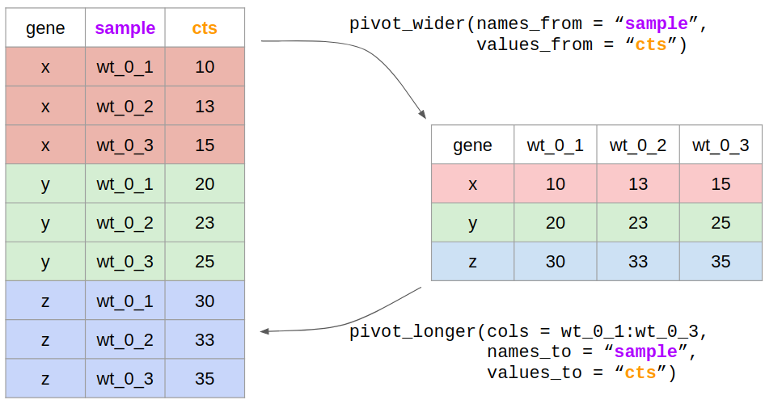

```{r setup, include=FALSE}
knitr::opts_chunk$set(echo = TRUE, rows.print = 10)
```

[back to lesson's homepage](https://tavareshugo.github.io/data-carpentry-rnaseq/)


# Lesson Objectives

* Apply adequate visualisation methods to explore:
    * Variation of data within samples (sample distributions) 
    * Covariation between samples (sample correlations)
    * Understand properties of count data such as the relationship between mean and variance
* Reformat data from wide to long format (and vice-versa)
* Join tables

#### Further resources

* Article giving an overview of best practices for RNAseq analysis:
    * Conesa et al. (2016) [A survey of best practices for RNA-seq data analysis](https://doi.org/10.1186/s13059-016-0881-8), Genome Biology 17, 13
* Book chapter from Susan Holmes & Wolfgang Huber's _Modern Statistics for Modern Biology_:
    * [High-Throughput Count Data](https://www.huber.embl.de/msmb/Chap-CountData.html)


# Setup

In your project's directory, create a new script called `02_eda_count_data.R`
("eda" stands for "Exploratory Data Analysis"), and start with the following code:

```{r, message = FALSE}
##### setup ####

# load packages
library(tidyverse)

# read the data
raw_cts <- read_csv("./data/counts_raw.csv")
trans_cts <- read_csv("./data/counts_transformed.csv")
sample_info <- read_csv("./data/sample_info.csv")
test_result <- read_csv("./data/test_result.csv")
```


# Variation within samples

We will start our data exploration by understanding how our expression data are 
distributed in each sample. We could do this, for example, using frequency polygons 
(similar to histograms) for our expression data found in the `trans_cts` object.

```{r, echo=FALSE}
trans_cts %>%
  pivot_longer(-gene, names_to = "sample", values_to = "cts") %>% 
  left_join(sample_info, by = "sample") %>% 
  ggplot(aes(cts, colour = replicate)) + 
  geom_freqpoly(binwidth = 1) + 
  facet_grid(rows = vars(strain), cols = vars(minute))
```


To produce the plot above, we need to do a few things:

1. Convert our table of counts (`trans_cts`) to "long" format, i.e. with 3 
columns: `gene`, `sample`, `cts`, rather than one column per sample
3. Join this table with the `sample_info` table 


### Reshaping data to "long" format

There's two functions that allow us to convert tables from a "wide" to a "long" 
format and vice-versa: `pivot_longer()` and `pivot_wider()`.



What we want in our case is to go from a "wide" to "long" table, so we use 
`pivot_longer()`, which needs four things:

* The data, i.e. our table of gene expression
* The names of the columns that we want to gather in this way
* A name for the new column that will contain the old column names (the "names_to" column)
* A name for the new column that will contain our expression counts (the "values_to" column)


Like so:

```{r}
# "gather" the counts data
trans_cts_long <- trans_cts %>% 
  pivot_longer(cols = wt_0_r1:mut_180_r3, 
               names_to = "sample", 
               values_to = "cts")

trans_cts_long
```

If we wanted to do the reverse, we could use the `pivot_wider()` function:

```{r}
trans_cts_long %>% 
  pivot_wider(names_from = "sample", values_from = "cts")
```

----

**Exercise:**

> Convert the `raw_cts` created above to a "long" format using the `pivot_longer()` function

[Link to full exercise](00_exercises.html#21_reshape_table)

----

```{r, echo=FALSE}
raw_cts_long <- raw_cts %>% 
  pivot_longer(wt_0_r1:mut_180_r3, names_to = "sample", values_to = "cts")
```


### Joining tables together

The next thing we want to do is to add information about each sample to our 
gene expression table.

```{r}
sample_info
```

We can do this by _joining_ the `trans_cts_long` table with the `sample_info` table.

Joining tables is an important task that is often needed in multi-layered data.

There are several different kinds of joins that can be performed. Here's a couple:


Look at the "Combine Data Sets" section of the 
[dplyr cheatsheet](https://www.rstudio.com/wp-content/uploads/2015/02/data-wrangling-cheatsheet.pdf) 
to understand them better.

In our case, we know that all samples in our counts table also occur in the `sample_info` 
table, so there's a few different kinds of joins that would work. 

For safety, let's use `full_join()`, to ensure we retain all data from both tables:

```{r}
trans_cts_long <- full_join(trans_cts_long, sample_info, by = "sample")

trans_cts_long
```

We can join tables by more than one column, which is not necessary here.


### Visualise data distribution

Now that we have our expression data in a "tidy" format, we can explore our 
gene's expression distribution:

```{r}
trans_cts_long %>%
  ggplot(aes(cts, colour = replicate)) + 
  geom_freqpoly(binwidth = 1) + 
  facet_grid(strain ~ minute)
```

----

**Exercise:**

> * Produce a similar plot for the raw count data. (hint: you might want to try 
log-transforming the data).
> * Try out other ways to visualise these data, for example as a boxplot.

[Link to full exercise](00_exercises.html#22_join_tables)

----


# Covariation between between samples

Scatter plots are useful e.g. to visually inspect similarity (correlation) between variables.

For this type of plot, the "spread" version of our counts table is useful. For example, 
let's look at the correlation between two replicates of WT at 0 min:

```{r}
trans_cts %>% 
  ggplot(aes(wt_0_r1, wt_0_r2)) + geom_point() +
  geom_abline(colour = "brown")
```

As we can see, these are very tightly correlated, which might be expected given these 
are biological replicates of the same strain and treatment! 

----

**Exercise:**

> Compare the expression between a WT cell at T0 and T30. What can you conclude from this?

[Link to full exercise](00_exercises.html#23_scatterplot)

----


Because we have so many samples, it would be nice to get an overview of the correlation 
across all samples. One way to do this is with a correlation plot. The `corrr` 
package provides with several convenience functions to calculate and visualise 
correlations. We won't go into details in this lesson, but do check the 
[package's documentation](https://cran.r-project.org/web/packages/corrr/vignettes/using-corrr.html)
if you are interested in knowing more. Here is a quick example:

To achieve our goal, we first have to calculate the gene expression correlation 
between every pair of samples. We can use the `cor()` function to do this, and 
give it our table of gene counts:

```{r}
# Calculate all correlations 
trans_cts_corr <- trans_cts %>% 
  # remove the column "gene", which we do not want to calculate correlation on
  select(-gene) %>% 
  # we use Spearman's correlation, a non-parametric metric based on ranks
  cor(method = "spearman")

# Visualise the correlations between the first 5 samples
trans_cts_corr[1:5, 1:5]
```
Now, we can use the `rplot()` function to help us visualise this:

```{r, message=FALSE}
library(corrr)

rplot(trans_cts_corr) +
  theme(axis.text.x = element_text(angle = 45, hjust = 1))
```


# Properties of count data

So far we have looked at RNA-Seq data that has been preprocessed for us (`trans_cts`) 
using a sophisticated method (`DESeq2`). 

In the following, we will also take a look at the raw normalised data (`raw_cts`) and 
compare these to the transformed version to explore what is achieve by it.

Make sure that you have a "tidy" version of these raw normalised counts:

```{r}
raw_cts_long <- raw_cts %>% 
  pivot_longer(-gene, names_to = "sample", values_to = "cts") %>% 
  full_join(sample_info, by = "sample")
```

The summary function is quite handy here as a first approach to exploring differences 
between raw and normalized counts.

```{r}
summary(raw_cts_long$cts)
summary(trans_cts_long$cts)
```

Raw and normalized data live on VERY different scales - the `raw_cts_long` has a 
few very large count values while most values are comparatively small. Partially,
this is because the transformed counts are on a log-scale. Let's visualise 
the correlation between two samples like we did above, but for these raw counts:

```{r}
raw_cts %>% 
  ggplot(aes(wt_0_r1, wt_0_r2)) + 
  geom_point()
```

As you see, the range of values is very large and we can hardly see the relationship 
between these data. In this case, it helps to either log-transform the data beforehand
(e.g. using `mutate()` to modify the columns we want to), or change the axis scales 
directly on the plot:

```{r}
# We add a "pseudocount" of 1 to the count data because otherwise log(0) = -Inf
raw_cts %>% 
  ggplot(aes(wt_0_r1 + 1, wt_0_r2 + 1)) + 
  geom_point() +
  scale_x_continuous(trans = "log2") + 
  scale_y_continuous(trans = "log2")
```

From this, we can already see that the raw data seem more variable (especially 
for low values) than the normalised data. Let's examine the relationship between 
mean and variance of each gene across all samples:

```{r}
# Summarise the data and then plot
raw_cts_long %>% 
  # for each gene
  group_by(gene) %>% 
  # get mean and variance
  summarise(mean_cts = mean(cts),
            var_cts = var(cts)) %>% 
  # plot one against the other
  ggplot(aes(mean_cts, var_cts)) +
  geom_point() +
  geom_abline(colour = "brown") +
  scale_x_continuous(trans = "log2") + 
  scale_y_continuous(trans = "log2")
```

This positive relationship between mean and variance is very typical of count data.
Count data are often modelled using a Poisson model; however in poisson-distributed 
data one expects the mean and variance to be the same. As can be seen from the 
plot above, although the variance increases with the mean, they are not the same 
(this is indicated by the x=y identity line in brown). This is why you need to be 
careful to apply specialised statistical methods (such as those provided by `DESeq2`) 
that model these properties of the data (more specifically, `DESeq2` uses a 
negative binomial model, which allows for different scaling of the variance in 
count data).

Compare this with the normalised data:

```{r}
trans_cts_long %>% 
  group_by(gene) %>% 
  summarise(mean_cts = mean(cts),
            var_cts = var(cts)) %>% 
  ggplot(aes(mean_cts, var_cts)) +
  geom_point()
```

In conclusion, these mean-variance plots verify that `DESeq2`'s transformation 
approach is effectively achieving its main goal: to stabilize the variance, as 
the transformed data do no longer show a (strong) dependency between a gene’s mean 
and its variance.


----
[back to lesson's homepage](https://tavareshugo.github.io/data-carpentry-rnaseq/)
