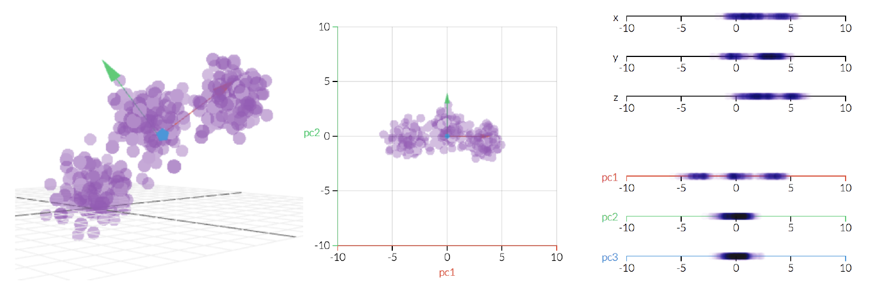

```{r setup, include=FALSE}
knitr::opts_chunk$set(echo = TRUE, rows.print = 10)
```

[back to lesson's homepage](https://tavareshugo.github.io/data-carpentry-rnaseq/)

# Lesson Objectives

* Gain an intuitive understanding of principal component analysis (PCA)
* Use PCA to derive information about structure in multi-dimensional datasets such as RNAseq
* Apply PCA using R's `prcomp()` function 
* Understand how to access data from list-like objects
* Apply several data manipulation functions to convert these objects into tidy tibbles (and produce visualisations of interest)

#### Further resources

* Short article about PCA using transcriptome data:
    * Jake Lever, Martin Krzywinski & Naomi Altman (2017) [Principal component analysis](https://www.nature.com/articles/nmeth.4346),
Nature Methods 14, 641–642
* StatQuest videos by Josh Starmer (watch all of them!): 
    * [Principal Component Analysis (PCA), Step-by-Step](https://youtu.be/FgakZw6K1QQ)
    * [PCA - Practical Tips](https://youtu.be/oRvgq966yZg)
* Book chapters from Holmes & Huber _Modern Statistics for Modern Biology_:
    * [Multivariate Analysis](https://www.huber.embl.de/msmb/Chap-Multivariate.html)
    * [Multivariate methods for heterogeneous data](https://www.huber.embl.de/msmb/Chap-MultivaHetero.html)
    (gives alternatives methods to PCA)


# Setup

In your project's directory, create a new script called `03_pca_samples.R`, 
and start with the following code:

```{r, message = FALSE}
##### setup ####

# load packages
library(tidyverse)

# read the data
trans_cts <- read_csv("./data/counts_transformed.csv")
sample_info <- read_csv("./data/sample_info.csv")
```


# PCA basics

Having expression data for thousands of genes can be overwhelming to explore! 
This is a good example of a multi-dimensional dataset: we have many 
variables (genes) that we want to use to understand patterns of similarity 
between our samples (yeast cells).

There are several methods to help summarise multi-dimensional data, here 
we will show how to use PCA (principal component analysis). 

PCA is a transformation of high-dimensional data into an orthogonal basis such that 
first principal component (PC, aka "axis") is aligned with the largest source of 
variance, the second PC to the largest remaining source of variance and so on. 
This makes high-dimensional data more amenable to visual exploration, as we can 
examine projections to the first two (or few) PCs.

 
[Link to the original animation](http://setosa.io/ev/principal-component-analysis/)

There are three basic types of information we obtain from a PCA:

* *PC scores* - these are the coordinates of our samples on the new PC axis
* *Eigenvalues* - these represent the variance explained by each PC. 
We can use these to calculate the proportion of variance in the original data 
that each axis explains.
* *Variable loadings* (eigenvectors) - these reflect the "weight" that each variable has on a particular 
PC. These can be thought of as the correlation between the PC and the original variable.


# Running PCA using `prcomp()`

To compute a PCA in R we can use the `prcomp()` function. This function takes a 
matrix of data, where the _columns_ are the _variables_ that we want to use to 
transform our _samples_, which should be the _rows_ of the matrix. 

In our case, we want to look for similarities across our yeast cells (_samples_ = _rows_) 
based on gene expression (_variables_ = _columns_). For that reason, we need 
to provide a _transposed_ version of our table to the `prcomp()` function:

```{r}
# Create a matrix from our table of counts
pca_matrix <- trans_cts %>% 
  # make the "gene" column become the rownames of the table
  column_to_rownames("gene") %>% 
  # coerce to a matrix
  as.matrix() %>% 
  # transpose the matrix so that rows = samples and columns = variables
  t()

# Perform the PCA
sample_pca <- prcomp(pca_matrix)
```

----

**Exercise:**

> Examine the output of the `prcomp()` function.

[Link to full exercise](00_exercises.html#31_Examine_prcomp()_output)

----

#### A note about matrices

A `matrix` is another type of object in R. 
Matrices are a bit similar to `data.frame`, but they only contain values of a 
single type, in this case numeric values (whereas in a `data.frame` different 
columns can contain different types of data). 

In bioinformatics packages you will often have data stored in these matrix objects. 
It is therefore useful to know how to access values in them and how to convert them 
to a `data.frame`.

You can access values in a matrix using `[rows, columns]` notation:

```{r}
# Look at the first 10 rows and first 5 columns of the matrix
pca_matrix[1:10, 1:5]
```

To convert this matrix into a `tibble` object we can use the function `as_tibble()`:

```{r, results=FALSE}
# Convert matrix to tibble
as_tibble(pca_matrix)
```

But now we've lost our sample names (which were the row names of the matrix)! 
If we look at the function's help (`?as_tibble`), we can see that there's a way 
to solve this problem:

```{r, results=FALSE}
# Convert matrix to tibble - add colnames to a new column called "gene"
as_tibble(pca_matrix, rownames = "sample")
```

Now you know how to convert a `matrix` to a `data.frame`, which can be a very handy 
trick to have!


#### Important note

Often it is a good idea to _standardize_ the variables before doing the PCA. 
This is often done by _centering_ the data on the mean and then _scaling_ it by 
dividing by the standard deviation. This ensures that the PCA is not too influenced 
by genes with higher absolute expression. By default, the `prcomp()` function 
does the centering but not the scaling. See the `?prcomp` help to see how to change 
this default behaviour. In this case, because we are using the 
transformed data, this is not too much of an issue, but try re-running the PCA 
with the _centered_ and _scaled_ data to see how it changes it. 

Note that _scaling_ is particularly recommended if your variables are on different 
scales.

We talk more about standardizing gene expression data in the 
[gene clustering lesson](04b_rnaseq_clustering.html).


### Variance explained by PCs

The first important question to ask after we do a PCA is how many PCs we have and 
how much variance they explain.

We need to extract the variance explained by each PC from our `sample_pca` object.
`prcomp()` returns an oject of its own class. To access individual elements from 
this object, we use the `$` notation, similarly to how you can access individual 
columns from a _data.frame_. 

We've seen this in the [previous exercise](00_exercises.html#31_examine_prcomp()_output) 
and already created an object with the data we are interested in:

```{r}
pc_eigenvalues <- sample_pca$sdev^2
```

This is a _vector_ with variance explained by each of the `r length(pc_eigenvalues)` 
PC axis. But to make a plot with _ggplot2_ we need to have data in a data.frame/tibble. 

Here's one way we can do this:

```{r}
# create a "tibble" manually with 
# a variable indicating the PC number
# and a variable with the variances
pc_eigenvalues <- tibble(PC = factor(1:length(pc_eigenvalues)), 
                         variance = pc_eigenvalues) %>% 
  # add a new column with the percent variance
  mutate(pct = variance/sum(variance)*100) %>% 
  # add another column with the cumulative variance explained
  mutate(pct_cum = cumsum(pct))

# print the result
pc_eigenvalues
```

Notice that we've encoded the `PC` variable as a _factor_ because this is really 
a categorical variable (the identifier of the principal component).

This table can now be used to produce a _Scree Plot_, which shows the fraction 
of total variance explained by each principal component. We will show both the 
variance explained by individual PCs as well as the cumulative variance, using a 
type of visualisation known as a [pareto chart](https://en.wikipedia.org/wiki/Pareto_chart):

```{r}
pc_eigenvalues %>% 
  ggplot(aes(x = PC)) +
  geom_col(aes(y = pct)) +
  geom_line(aes(y = pct_cum, group = 1)) + 
  geom_point(aes(y = pct_cum)) +
  labs(x = "Principal component", y = "Fraction variance explained")
```

You can see how successive PCs explain less and less of the total variance in the 
original data. Also note that `r length(sample_pca$sdev)` components are enough to 
virtually explain _all_ of the variance in our dataset. This makes sense in this 
case since we only have `r nrow(sample_info)` biological samples.


### Visualising samples on PC space

Next, we turn to visualising our samples on the new PC coordinates. 
Again, we had already extracted this from our `prcomp` object in the 
[previous exercise](00_exercises.html#31_examine_prcomp()_output): 

```{r}
# The PC scores are stored in the "x" value of the prcomp object
pc_scores <- sample_pca$x
```

This object is of class _matrix_, so we need to first convert it to a data.frame/tibble
for _ggplot2_. 

```{r}
pc_scores <- pc_scores %>% 
  # convert to a tibble retaining the sample names as a new column
  as_tibble(rownames = "sample")

# print the result
pc_scores
```

And now we can do a PC plot:

```{r}
pc_scores %>% 
  # create the plot
  ggplot(aes(x = PC1, y = PC2)) +
  geom_point()
```

This is a very simple plot, but already we can see there is some structure in our 
data, suggesting clusters of samples that are more similar to each other.


----

**Exercise:**

> Recreate the plot below. Save the plot in an object called `pca_plot`

[Link to full exercise](00_exercises.html#32_Annotating_PC_plot)

```{r, echo=FALSE}
# The PC scores are stored in the "x" value of the prcomp object, which is a matrix
pca_plot <- sample_pca$x %>% 
  # convert it to a tibble retaining the sample names as a new column
  as_tibble(rownames = "sample") %>% 
  # join with "sample_info" table 
  full_join(sample_info, by = "sample") %>% 
  # create the plot
  ggplot(aes(x = PC1, y = PC2, colour = factor(minute), shape = strain)) +
  geom_point()
pca_plot
```

----

From this plot, we can see that:

* samples seem to cluster by time-point (is it related to time of exposure to 
stress? Or perhaps cell cycle phase, if it was not controlled for?)
* T120 and T180 seem to be undistinguishable using PC1 and PC2 (but they might 
be distinguishable if we explore other PC axis!). 
* the genotype does not drive major changes in the transcriptome (but, again, 
it doesn't mean that no genes differ between the genotypes, just that they don't 
explain most of the variance captured by PC1 and PC2)


### Exploring correlation between genes and PCs

Finally, to be able to interpret our PC-axis we could ask the question of 
which genes have the most influence on each PC axis. This information is contained 
in the variable loadings of the PCA, within the `rotation` value of the `prcomp` object.

We have already extracted this from our `prcomp` object in the 
[previous exercise](00_exercises.html#31_examine_prcomp()_output): 

```{r}
pc_loadings <- sample_pca$rotation
```

Similarly to the PC scores, this object is a _matrix_, which we can convert to a
data.frame/tibble for plotting and data manipulation: 

```{r}
pc_loadings <- pc_loadings %>% 
  as_tibble(rownames = "gene")

# print the result
pc_loadings
```

Because we have `r nrow(pc_loadings)` genes, it would be too much to visualise all 
of them at once. Instead, let's try and answer the question:
"What are the top 10 genes with highest loading on PC1 and PC2?"

There are different ways to do this, here we show one way, which would work for 
any number of PCs we are interested in:

```{r}
top_genes <- pc_loadings %>% 
  # select only the PCs we are interested in
  select(gene, PC1, PC2) %>%
  # convert to a "long" format
  pivot_longer(matches("PC"), names_to = "PC", values_to = "loading") %>% 
  # for each PC
  group_by(PC) %>% 
  # arrange by descending order of loading
  arrange(desc(abs(loading))) %>% 
  # take the 10 top rows
  slice(1:10) %>% 
  # pull the gene column as a vector
  pull(gene) %>% 
  # ensure only unique genes are retained
  unique()

top_genes
```

Now, we can use this list of gene names to subset the eigenvalues table:

```{r}
top_loadings <- pc_loadings %>% 
  filter(gene %in% top_genes)
```


----

**Exercise:**

> Recreate the plot below. Save the plot in an object called `loadings_plot`

[Link to full exercise](00_exercises.html#33_Visualise_variable_loadings)

```{r, echo=FALSE}
loadings_plot <- ggplot(top_loadings) +
  geom_segment(aes(x = 0, y = 0, xend = PC1, yend = PC2), 
               arrow = arrow(length = unit(0.1, "in")),
               colour = "brown") +
  geom_text(aes(x = PC1, y = PC2, label = gene),
            nudge_y = 0.005, size = 3) +
  scale_x_continuous(expand = c(0.02, 0.02))
loadings_plot
```

----

Using the [`patchwork`](https://patchwork.data-imaginist.com/) 
package, we put these two plots side by side to get a 
more complete and interpretable view of our PCA analysis:

```{r, fig.width=8, fig.height=3}
library(patchwork)

# Adjust some aspects of each plot
pca_plot <- pca_plot + 
  coord_fixed(ratio = 0.4) + 
  labs(title = "PC scores") +
  theme(legend.position = "none")

loadings_plot <- loadings_plot + 
  coord_fixed(ratio = 0.4) + 
  labs(title = "PC loadings")

# Put them together
(pca_plot | loadings_plot) + plot_annotation(tag_levels = "A")
```

Notice how we've forced our PC1 axis to be around twice as long as the PC2 
axis (with `coord_fixed()`. 
This is because the variance explained by PC1 is about twice 
as large as the variance explained by PC2.


### Extra: Quick visualisation using `autoplot()`

This was all very useful to understand how PCA works and how to fully explore 
its results. However, it can sometimes be convenient to produce these graphs 
quickly. 

We can use the `autoplot()` function from the `ggfortify` package to do this:

```{r}
library(ggfortify)
autoplot(sample_pca)
```

There's also information about how much variation each principal component axis 
explains. 

We can annotate this plot further by providing the `autoplot()` function with 
our sample information data (see `?autoplot.prcomp` for more information):

```{r}
autoplot(sample_pca, data = sample_info, colour = "minute", shape = "strain")
```

Finally, you _could_ easily add information about loadings to the plot by adding the 
options `loadings = TRUE, loadings.label = TRUE`. But don't do it, because we 
have thousands of genes, so the plot would be un-interpretable (and probably 
crash your computer)!

```{r, eval=FALSE}
# Example using iris dataset
autoplot(prcomp(iris[, -5]), data = iris, colour = "Species",
         loadings = TRUE, loadings.label = TRUE)
```


### Extra: Tidying the `prcomp()` output with the `{broom}` package

One useful package that is part of the `{tidyverse}` collection is the `{broom}` 
package, which is used to convert the output of statistical objects into tibbles.

Although `{broom}` doesn't recognise objects from every statistical object, it does 
work with `prcomp` objects, and we could have used it instead of tidying our data 
manually. 

Here is how we could have used it:

```{r, eval=FALSE}
library(broom)

# PC variances (eigen values)
tidy(sample_pca, matrix = "eigenvalues")

# variable loadings
tidy(sample_pca, matrix = "loadings")
```


# Final thoughts

PCA is an essential and very powerful technique for exploratory data analysis of 
multivariate data. As you see from this example, we can quickly see how our 
data is _structured_, based on transcriptome-wide signatures. 

Note that lack of clustering in a PCA does not mean nothing is happening. Imagine an 
RNAseq experiment where only a dozen genes changed due to your treatment. Because 
there's few genes, transcriptome-wide you might not capture structure in the data. 

In summary, although this analysis gives some indication of how much influence a 
particular gene has along each PC, it is not a replacement for specialised 
[statistical models](https://genomebiology.biomedcentral.com/articles/10.1186/s13059-014-0550-8) 
and [tools](https://master.bioconductor.org/packages/release/workflows/vignettes/rnaseqGene/inst/doc/rnaseqGene.html) 
that assess specific hypothesis for differential expression between conditions.

Finally, it's worth pointing out that PCA is a linear algorithm. 
There are other methods for non-linear dimensionality reduction, 
which can sometimes perform better than PCA (but perhaps less easily interpretable). 
Two common methods are called _UMAP_ and _t-SNE_. 
These can be found in the [`uwot`](https://cran.r-project.org/web/packages/uwot/index.html) and 
[`Rtsne`](https://cran.r-project.org/web/packages/Rtsne/) packages, respectively.


----
[back to lesson's homepage](https://tavareshugo.github.io/data-carpentry-rnaseq/)
