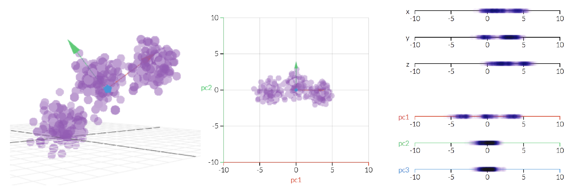

```{r setup, include=FALSE}
knitr::opts_chunk$set(echo = TRUE)
```


## Data preparation

Quick recap of how to download data from a URL and load it into R.

```{r}
rm(list = ls())
library(tidyverse)
library(ade4)
library(ggplot2)

# Download the data provided by your collaborator
dir.create("data")
download.file("https://github.com/tavareshugo/data_carpentry_extras/blob/master/rnaseq_visualisation/rnaseq_data.RData?raw=true", destfile = "data/rnaseq_data.RData")

# Load the data
load("data/rnaseq_data.RData")

```


What have we downloaded?
```{r}
ls()
```

```{r}
head(norm_cts)
```

Let's recapitulate some of the data manipulation which we have seen in the previous session

```{r}
norm_cts_tbl <- as_tibble(norm_cts, rownames = "gene")
norm_cts_long <- norm_cts_tbl %>% 
  gather(sample_id, cts, SRR1039508:SRR1039521)
```

## Histograms

Histograms are a tool to get to know your data better and e.g. learn about their distributions.

```{r}
ggplot(norm_cts_long, aes(x=cts)) + geom_histogram(binwidth=1)
```

Now we know for sure that this data is not following a Gaussian distribution (as people who have worked with RNA-Seq data before may have expected).

We can also check whether data distributions look similar across samples.

```{r}
ggplot(norm_cts_long, aes(x=cts, fill=sample_id)) + geom_histogram(binwidth=1, position="dodge")
```

#### Conclusion
From the histogram plot one can conclude that data distributions are not Gaussian, but quite similar across samples.


## Scatter plots

So far we have looked at RNA-Seq data that Hugo has preprocessed for us (thus `norm_cts`) using a sophisticated method (DESeq2). In the following, we will also take a look at the raw data (`raw_cts`) and compare these to the normalized version to explore some properties of the data normalization applied.

Let's start by preparing the raw data the same way we have done for the normalized count data.

```{r}
raw_cts_tbl <- as_tibble(raw_cts, rownames = "gene")
raw_cts_long <- raw_cts_tbl %>% 
  gather(sample_id, cts, SRR1039508:SRR1039521)
```

The `summary` function is quite handy here as a first approach to exploring differences between raw and normalized data.

```{r}
summary(norm_cts_long)
summary(raw_cts_long)
```

Observations
- raw and normalized data live on VERY different scales
- the `raw_cts_long` has a few very large count values while most values are actually small (<10).


Scatter plots are useful e.g. to visually inspect similarity (correlation) between variables.

```{r}
ggplot(norm_cts_tbl, aes(x=SRR1039508, y=SRR1039509)) +  geom_point()

ggplot(raw_cts_tbl, aes(x=SRR1039508, y=SRR1039509)) +  geom_point()
```

#### Exercise:
Due to the few extreme counts in the raw data, our scatter plot may be more informative on a log scale (Look for the "Scales" section in the ggplot2 cheat sheet)...


#### Examining the mean-variance relationship

```{r}
mean_var_raw <- raw_cts_long %>% 
  group_by(gene) %>%
  summarise(g_mean = mean(cts), g_var = var(cts))
```

```{r}
ggplot(mean_var_raw, aes(x=g_mean, y=g_var)) + geom_point()
```

#### Exercise
Relabel the axes of the plot to "Mean" and "Variance" (Hint: Look for the "Labels" section of the ggplot2 cheat sheet).

This plot reveals a strong dependency between a gene's mean count (expression) and its variance (statisticians would call this heteroscedasticity) - which can be a problem in many downstream comparisons across genes.

Let's do a mean-variance plot for the normalized data...

```{r}
# a bit more convoluted data preparation for plotting the normalized counts
mean_var_norm <- norm_cts_long %>% 
  group_by(gene) %>%
  summarise(g_mean = mean(cts), g_var = var(cts))

ggplot(mean_var_norm, aes(x=g_mean, y=g_var)) + geom_point()
```

#### Exercise:
Make the dots transparent by providing an `alpha` argument to `geom_point()`.

#### Conclusion
These mean-variance plots verify that Hugo's (ie. DESeq2's) normalization approach is effectively achieving its main goal: to stabilize the variance, as the normalised data do no longer show a (strong) dependency between a gene's mean and its variance.


## Principal Component Analysis (PCA)
PCA is a transformation of high-dimensional data into an orthogonal basis such that first principal component (PC, aka "axis"") is aligned with the largest source of variance, the second PC to the largest remaining source of variance and so on. This makes high-dimensional data more amenable to visual exploration, as we can examine projections to the first two (or few) PCs.

image:  
[Link to the original animation](http://setosa.io/ev/principal-component-analysis/)

In R there are several possibilities to compute a PCA. Here we will use the implementation from the ade4 package (which provides many more ordination methods).

```{r}
pc_obj <- dudi.pca(t(norm_cts), scannf = F, nf = 5)
pc_frame <- pc_obj$li

head(pc_frame)
```

Let's convert the PCA result (obtained from the original matrix) into a tibble - recalling some of the things we've used previously.

```{r}
pc_tbl <- as_tibble(pc_frame, rownames = "sample")
head(pc_tbl)
```


```{r}
sample_pc <- full_join(sample_info, pc_tbl, by = c("sample" = "sample"))
head(sample_pc)
```


#### Visualizing the PCA
Since the PCA "rotated" our data so that the first two dimensions (PCs) correspond to the largest sources of variance in our data, plotting these can be a very useful exploratory tool.

```{r}
ggplot(sample_pc, aes(x=Axis1, y=Axis2)) + geom_point()
```

We can colour the samples by treatment.

```{r}
ggplot(sample_pc, aes(x=Axis1, y=Axis2)) + geom_point(aes(colour = factor(dex)))
```

This clearly shows that the first principal component separates the samples by the treatment.

We can also colour by cell line...

```{r}
ggplot(sample_pc, aes(x=Axis1, y=Axis2)) + geom_point(aes(colour = factor(cell)))
```

... which reveals that this corresponds to the second pricipal component.

#### Exercise
Encode the treatment by plot colour and the cell line by  shape (by supplying another argument to `geom_point(aes(...))`.)

#### Conclusion
Together this illustrates how PCA can reveal the dominant sources of variation in a data set and whether these relate to the biological signal of interest or potentially to technical differences.


#### Bonus level
For RNA-Seq experts: the data normalization routine mentioned above was aware of both the treatment and cell groupings and might have contributed to the separation seen. As an exercise you could repeat the above PCA on the raw counts.


