```{r setup, include=FALSE, echo = FALSE,message = FALSE, error = FALSE, warning = FALSE}
knitr::opts_chunk$set(echo = TRUE)

# <!-- ---------------------------------------------------------------------- -->
# <!--                    1. load the required packages                       -->
# <!-- ---------------------------------------------------------------------- --> 

## if(!require(psych)){install.packages("psych")}

packages<-c("tidyverse", "knitr", "papeR")
ipak <- function(pkg){
  new.pkg <- pkg[!(pkg %in% installed.packages()[, "Package"])]
  if (length(new.pkg)) 
    install.packages(new.pkg, dependencies = TRUE)
  sapply(pkg, require, character.only = TRUE)
}
ipak(packages)
# <!-- ---------------------------------------------------------------------- --> 


# <!-- ---------------------------------------------------------------------- -->
# <!--                        2. Basic system settings                        -->
# <!-- ---------------------------------------------------------------------- -->
setwd(dirname(rstudioapi::getSourceEditorContext()$path))
getwd()
Sys.setlocale("LC_ALL","English")
```


```{r mind map,echo = F,message = FALSE, error = FALSE, warning = FALSE}
## Convert to mind map text, markdown outline, R script, and HTML widget ####
library(mindr)
# text -> widget
# input <- c("# Chapter 1", "## Section 1.1", "### Section 1.1.1", "## Section 1.2", "# Chapter 2")
# mm(from = input, root = "mindr")


input <- rstudioapi::getSourceEditorContext()$path 
## file.show(input) # Open the input file with the default program, if any
input_txt <- readLines(input, encoding = "UTF-8")
## Convert to mind map text, markdown outline, R script, and HTML widget ####
mm_output <- mm(input_txt,
                output_type = c("widget"),
                root = "")
mm_output$widget


```


# Drug Discovery

You will get an understanding of novel target discovery, mechanism of action, as well as what makes a good new chemical entity that could potentially become a drug chemical. You will also learn the impact of big data on the discovery process. You will have case study that describes the steps from target to preclinical compound. In addition, you will learn about drug delivery system and the role they play in new drug discovery and development. In conclusion, we hope that you will enjoy the course and that it will help you in your career development. 

## Pharma & Biotech Industry

1. the patents and the product lifecycle so, when the drug was launched to the time that the patent expires has been shortened
2. Search was on a drug for a pricing formula that is just right, that is really a big issue for pharma. You don't want to underprice because then you leave money on the table, but if you overprice you have major issues.
3. There's a number of other issues, the consumer are paying higher deductible, care is moving more to the community, patients are becoming a lot more informed with the Internet. **Biosimilar** which already has been launched in Europe and in other countries, in India and China and other places first were launched in the US actually at the end of 2015. So we expect that this is going to have a major impact. 
4. The access to the Internet has really changed the way healthcare is being practiced.


Business models have to change from that standpoint. And they are now a lot more open based on collaborations. We will talk about the holistic model in a minute. Pharma will need to go beyond the medicine. They are looking to be paid for outcome, not products. Is the patient out of the hospital quicker? Is the patient basically doing better long-term, rather than having to come back Into the clinic? They are going to have to adopt to more flexible pricing strategies. R&D is going to have to go beyond the lab. I mean, they are going to have to think about both diagnostics, biomarkers and then monitoring of the disease. They are going to have to look at virtualizing R&D, potentially, working with the networks, working with academia, working with biotech companies, working with network centers


**Creating a Sustainable Business**: in order to have a sustainable business, you have to innovate. Without innovation, as we saw, generics comes in, take off your market and you end up basically fighting 

nnovation is key for this business, let's talk about different levels of innovation. Well, the first one is one that we call really disruptive innovation. Unfortunately, in the pharmaceutical business or in any business disruptive innovation is really tough. But in the Pharma business, it means either curing or preventing the disease and showing reduction in mortality and or morbidity, that is really the end goal. Just treating the symptoms is not sufficient when you have disruptive innovation and especially if you're first in class and best in class. You are going to be able to command to some extent of course, whenever pricing you want. And people are going to prescribe your drug because you are curing the disease or you're preventing the disease which is even more difficult.

Incremental innovation is the second step, there are many things in incremental innovation. You could improve the quality of life and you'll have a lecture on actually, from macroeconomics and quality of life, so I'm not going to spend too much time on that later on. You could potentially reduce the cost of care, let's say you develop a drug that basically decreases the overall cost. You can have a drug that is safer with less side effects, therefore it's easier to use and overall makes the quality of life better, reduce the cost of the overall basic treatment and then potentially improve patient compliance. What I mean by this is basically improve the fact that the patient is taking their pills regularly instead of three times a day it could be a once a day, once a week, once a month. Therefor getting a better clinical outcome at the end of the day. There as well you probably will be able to get better pricing. You'll have to have comparative studies, obviously, because you are going to have to compare yourself against treatment that already exists but that's going to viewed as high value.

## Patient-Centric Drug Discovery and Commercialization

it's completely inflexible in a sense that the FDA and EMEA has very specific cookbooks. And you have links to the FDA website, I didn't look for any links to the NEA. But they have all their regular, their regulation as to what you need to do to develop a drug. The inflexibility also doesn't just come from the regulatory agencies, it also comes sometime from imposed pharmaceutical processes you know, a lot of people like processes. Well, sometimes you need to take a process, throw it out the door and rethink, it's very expensive. I told you, you know, the numbers are now on the order of $1 billion. Again, it depends what you're developing. If you're developing a drug that has only 1,000 patients, or you're developing a drug that has One hundred million patients. The trials you're going to have are very different. And the cost is also going to be different. But lets assume for now that, you know, it's going to be over a billion dollars. Not everybody can do this, which is also another reason why the venture capital community has exited the drug discovery business, because it was too long, too expensive, and too prone to failure.


```{r , echo=FALSE, fig.align="center", out.width = '100%',fig.cap=""}
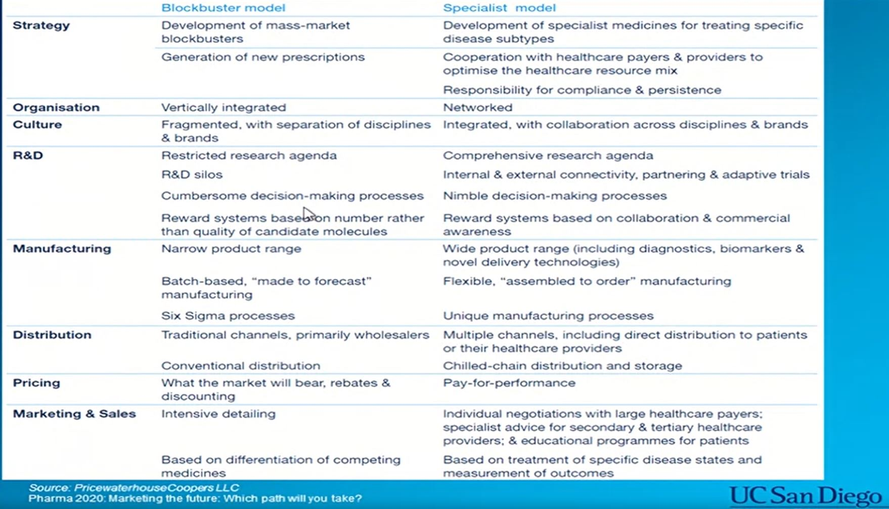
```
 


```{r , echo=FALSE, fig.align="center", out.width = '100%',fig.cap="Value Chains"}
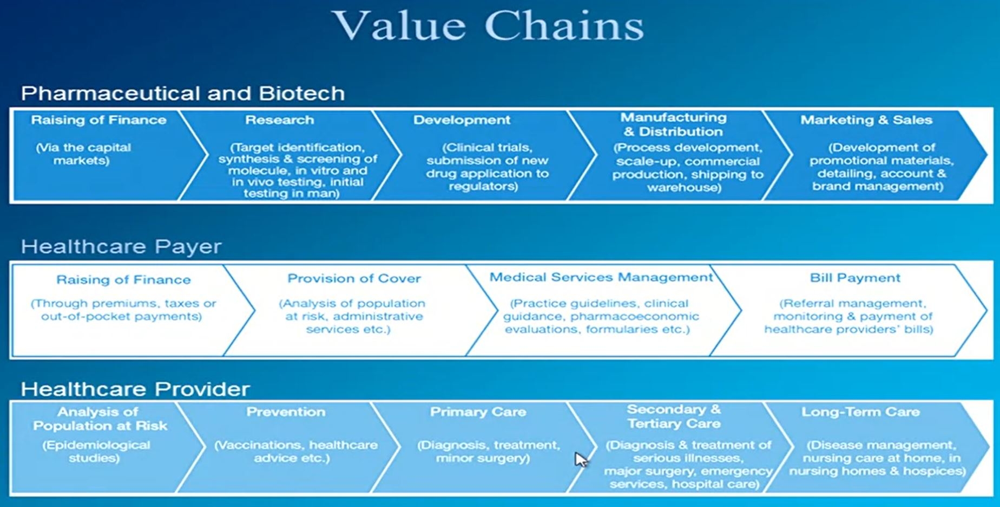
``` 
 

## Drug Discovery: Proteomics, Genomics

<!-- 蛋白质组学、基因组学  -->


Paradigm for so long with respect to small molecules of one drug, one target, one disease. This kind of data just says, how can that possibly work?

Why is the single silver bullet mentality bad for the drug development process?: Compounds often bind to more than one target.


## Compound Selection & Preclinical Studies

the current general time frames around all the dynamics, within the pharmaceutical industry. There are three main processes, There is the discovery stage, the early research stage, the point of identifying a target, all the way through research and early development, testing, to the point of filing an initial drug application. 

**we have to balance the cost with getting the right information. and even in spite of that we don't, still don't get it right.**

**Iterative Process** the previous speaker, he was talking about targets and, and, and what not. On the far right hand side of the screen here these are generally concepts, particularly in the small molecule chemists' minds, different options that they're going to explore when they start synthesizing new molecules. They're going to look at shapes of the molecules. Some may start with fragments of molecules to generate leads. Others will do virtual screening approaches, computational type applications. In other words, they'll have a database of information of different molecules in one, two, three dimensional images, and they'll look at which ones give them the best profile based on perhaps, the three dimensional fit and how it interacts with the target. others come up, where we use De Novo design, and all of these concepts are usually driven by the philosophy of that chemist. Compound screening, so they all. So, so, coming out of these applications the chemist are going to generate molecules and they're going to enter the process. You got the designed elements, and then they're going to to introduce it against known ligands or cell assays that are specific to the target that they chose. If information is available, on the, the crystal structure of that protein, and that's what this co-crystal complexes are, it fits in the structure based drug design concept.


## Challenges in Fragment Based Drug Discovery for Protein Kinases

There are three general approaches to drug discovery today, and those depend on what kind of a hypothesis you are going to take. Are you going to view a biological system as something you want to modulate as you begin to try to treat a particular condition? Why do you want to go after a particular target because you have a strong belief that the target has an important role in the disease in question. The most successful method to date is shown on the right-hand side here, phenotypic drug discovery. You set up a cell-based assay and add small molecules, potentially large molecules for that matter, and look for evidence of an effect on cells that you believe is going to translate to a beneficial effect on the clinic. At the opposite end of the spectrum, one is taking a molecular or targeted approach, where you believe you know enough about the disease and enough about the target biology to try to interfere directly with the action of the target in the human body and build molecules for that specific purpose and this is where a fragment based structure guided approach comes in. Typically using a variety of complementary biophysical tools some of which are a listed here. In, in their acronym form. So, to recap, Phenotypic drug discovery remains the most successful route. but there is tremendous, interest and effort going on in targeted, drug discovery, particularly the fragment based. discovery, which may or may not rely on a bi-, on biochemical screening as an in-, intermediate step. This, but the biochemical approach came earlier this decade and in the 90's with high throughput screening and large combinatorial libraries generally viewed as as having been over hyped shall we say? And typically today both the biochemical and the molecular are combined if one's going to take a targeted approach. So let's talk briefly about the causes of attrition in the pharmaceutical industry. This histogram coming from a paper in Nature Review's Drug Discovery, published by Kola and Landis in 2004 is instructive. Although the snapshots were taken at the beginning of the 90s and again in 2000, they still apply today. So if we look at the reasons why a drug discovery effort is going to fail in the pharmaceutical industry, you can see that there's a significant fraction of and as yet unaddressed fraction of the failures that comes due to lack of efficacy. An by that I mean you engage the, the target. You, you block the effect of the target in the body. Yet, it doesn't cure the disease, or it doesn't help you manage the disease. That's an reflection of the fact that one doesn't understand the target well enough, I would argue. You can see there are, are other causes of attrition where there have been dramatic, advances over the last, 20 or so years. And particularly in pharmacokinetics, and bio availability, and I'll come onto some reasons why I think that's the case. So getting the drug to the target is no longer the problem. The significant 40% attrition rate problem that it was 20, 30 years ago. The two key reasons for failure today are lack of efficacy and toxicity. And by toxicity I mean both animal toxicology, which you can see has actually increased between 1991 and 2000 and clinical safety, meaning human toxicology, which is this, remained essentially unchanged. combined their count for about a third, efficacy accounts for about a third and then there are a variety of other causes, some of them economic, such as cost of goods etcetera which are making up the remaining third. And the question that I'll address with you today is how medicinal chemists can help address this one third of attrition in the pharmaceutics industry that comes from toxicology be it a human or animal. So a statement of the problem here how many of you are familiar with the Lipinski's rule or have you heard of them at least. A, a modest show of hands, that's that's good. So, I, I bring up Lipinski because he and his colleagues demonstrated in the 1990s, using data from a large pharmaceutical company, that it was possible to make certain predictions about whether or not a small molecule was going to be cell-penetrant, was actually going to be orally bio available. And they come up with this rule of 5 that suggests that if your molecular weight's below 5, this measure of lipid felicity c log P is, greater than 5, and then you have an appropriate number of hydrogen bond donors and acceptors. that you're you're going to have a, a compound which is which is absorbed. So this led, this realization and the publication of a series of very influential papers led to the realization that there was this rule of five in the pharmaceutical industry. And that came unfortunately to be a, a rule for a drug. And that's, I'll show you that that's not the case. But bear with me for a moment as we sort of, think about the problem at hand. If you consider all of them, all of the small molecules of molecular weight less than 500, the ones that are going to cross the intestinal barrier readily, according to Lipinsky and co-workers, they contain the typical elements of carbon, nitrogen, oxygen, florine and of course, hydrogen.
 

```{r , echo=FALSE, fig.align="center", out.width = '100%',fig.cap="Value Chains"}
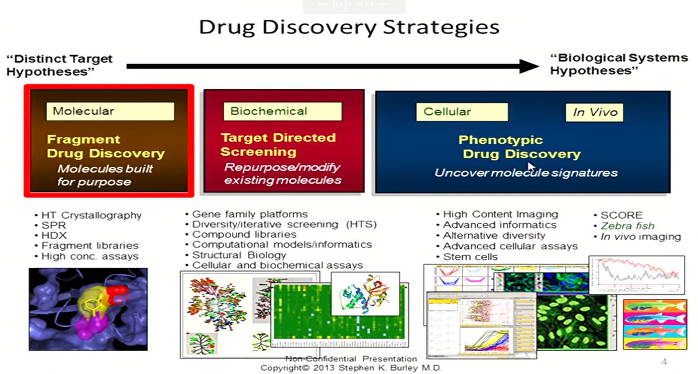
``` 
 
 
Below are two examples of successful drug discovery and development which has used structure-based approaches.

1.Gleevec

http://www.jyi.org/issue/gleevec-highlighting-the-power-of-rational-drug-design/

2. Viracept

Viracept (Nelfinavir Mesylate, AG1343):  A Potent, Orally Bioavailable Inhibitor of HIV-1 Protease
Stephen W. Kaldor , Vincent J. Kalish , Jay F. Davies , II, et al., J. Med. Chem., 1997, 40 (24), pp 3979–3985, DOI: 10.1021/jm9704098


## Key Concepts in Drug Delivery

1. ADME, absorption, distribution, metabolism, elimination
2. Pharmacokinetics, so pharma meaning drug, kinetics meaning rates of processes. How quickly things happen. So, kinetics typically accounts for how the drug travels through the body. And then Pharmacodynamics, the dynamics are the effects that the drug has. So what the drug does to the body, like relieves pain or lowers, lowers blood pressure or lowers cholesterol or something like that. So those are the two broad categories, Pharmacokinetics, Pharmacodynamics. And within kinetics, we have absorption. So you have to give a dose of the drug and it has to be absorbed typically somehow in to your systemic circulation or your bloodstream. Once its in the bloodstream, it has to be distributed to various places in the body, hopefully to the side of action where it will have its desired therapeutic effect.


 
# Drug Development

process to take a pre-clinical candidate from an initial new drug application, or IND, to an new drug application, or NDA. You will get an overview of the regulatory process as well as the clinical trials that are involved for submission of an NDA. You will have lectures from all phases of clinical development, from Phase 1, Phase 2, including proof of concept studies referred as POC, all the way to late stage clinical development. Phase 3 or commonly called pivotal clinical trials.

## EMA

EMA, the European Medicines Agency. It encompasses about 30 EU members states as well as Iceland, Liechtenstein, and Norway. Each EU member has its own procedures and authorization, and authorization processes can be obtained in multiple ways through the EMEA. Now, if you ask me a ton of questions about this I'm not going to. [LAUGH]. All of your answers, I just wanted to give you, just a very cursory look of, of what the EMEA is, and how it's very different from the FDA in terms of their approval procedures. Okay? So, it's known as the community. Centralized is known as the community authorisation procedure. 


## Institutional review board

An institutional review board (IRB), also known as an independent ethics committee (IEC), ethical review board (ERB), or research ethics board (REB), is a committee that applies research ethics by reviewing the methods proposed for research to ensure that they are ethical. Such boards are formally designated to approve (or reject), monitor, and review biomedical and behavioral research involving humans. They often conduct some form of risk-benefit analysis in an attempt to determine whether or not research should be conducted.[1] The purpose of the IRB is to assure that appropriate steps are taken to protect the rights and welfare of humans participating as subjects in a research study. Along with developed countries, many developing countries have established national, regional or local Institutional Review Boards in order to safeguard ethical conduct of research concerning both national and international norms, regulations or codes.

A key goal of IRBs is to protect human subjects from physical or psychological harm, which they attempt to do by reviewing research protocols and related materials. The protocol review assesses the ethics of the research and its methods, promotes fully informed and voluntary participation by prospective subjects capable of making such choices (or, if that is not possible, informed permission given by a suitable proxy), and seeks to maximize the safety of subjects. While its composition varies, it often includes a balance of academia and non-academia members. This serves to provide a greater scope of understanding which helps ensure ethics in research.

IRBs are most commonly used for studies in the fields of health and the social sciences, including anthropology, sociology, and psychology. Such studies may be clinical trials of new drugs or devices, studies of personal or social behavior, opinions or attitudes, or studies of how health care is delivered and might be improved.


# Drug Commercialization

the process of how to launch market and sell a drug, as well as many other facets in the commercial aspects of making a drug successful. We will cover topics ranging from pharmacoeconomics, intellectual property and freedom to operate, marketing strategy, managed markets, portfolio management and business models.


## Pharmacoeconomics in Drug Development

the docier has to include pharmacoeconomic data. It has to be able to say, alright you're asking this price, what are you giving me for this price? What's the value of your product? You know, what is better than the other product? So it's beyond just the clinical data, clinical safety and efficacy. It's economic and quality of life data. And that's what I'm going to show you some examples of. So it's not just an exercise, an academic exercise. This is absolutely required to get your drug marketed and to be reimbursed. You can get your drug approved in certain countries to be marketed but the country will not pay for it. It's not reimbursed yet until you submit a pharmacoeconomic, dossier and it's accepted and your price is accepted. Okay, so here's a model. This is called the ECHO model, on the bottom here. ECHO model is the Economic, Clinical and Humanistic Impact model

And it sort of sums up the whole thing with drug development and what we're trying to do with pharmaeconomics. So every clinical trial starts with a disease state. And it combines a group of patients with the disease state with a drug and we observe some clinical effect. And the clinical effect we observe is safety first, were there any huge adverse events, you know, are we doing any harm to the patients first? And then if we're not then the next thing to look at is efficacy. Does the drug actually work? Is it producing a reduced symptoms or improved mortality, improved morbidity? So this is where your typical clinical trial ends, all right. But then the pharmacoeconomic part comes next and says, okay. Because of those safety and efficacy effects that I observed, what happens? So what? And the so what is so what happened to the humanistic outcomes? This is health related quality of life. Yeah, what happened to the patient's quality of life because of the improved safety and efficacy? What happened to their satisfaction? You know, and economic outcomes. Because of this improved safety and efficacy, what happened to economic outcomes?

direct costs are things like the drug, things that you actually outlay money for and say all right, this is directly related to either the treatment or to the disease itself. So the drug is directly related.


```{r , echo=FALSE, fig.align="center", out.width = '100%',fig.cap="Value Chains"}
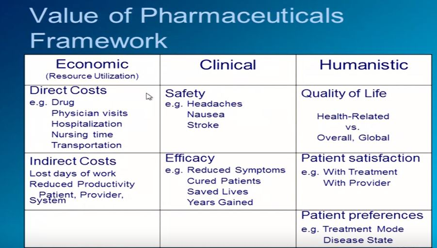
``` 


```{r , echo=FALSE, fig.align="center", out.width = '100%',fig.cap="Value Chains"}
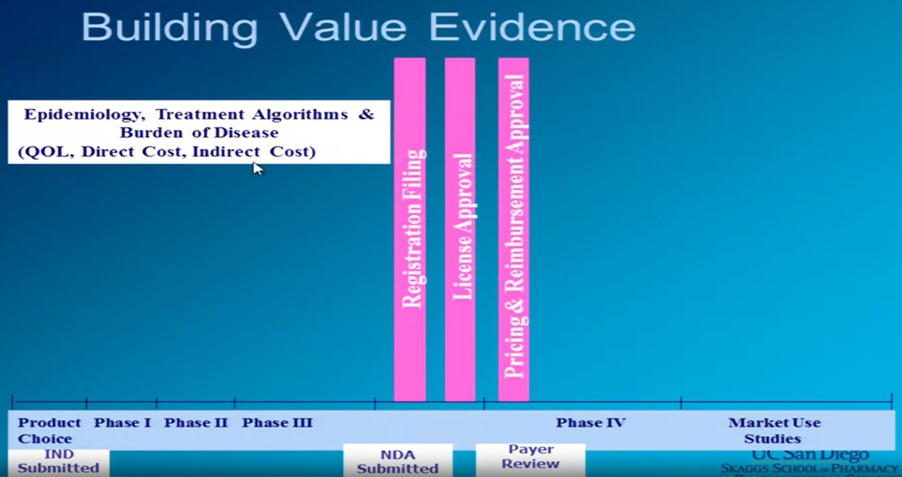
``` 

Summary oh, well some of the at value evidence summary here is that target value that I talked about that's really based on future products. It's not so much based on what's out there now and you're probably doing a lot of back of the envelope type things when you're way back in developments. the other thing you should take home from this is it takes many different studies to build this ins-, this evidence. You know, studies of the burden of disease, but also of the, the, the treatment of it. So the treatment effect. And it just, it takes a lot of money. And it takes a lot of people to do this, both inside a company and outside of the company. So, there's a lot of people with inside, but then there's all, a lot of consultants, that are outside, are working on these types of things. And then, there are just a few complications, and I've just picked a couple of them. I'm going back to how I said there was a Pharmacoeconomic Dossier required. Well, it's not just, it's required in those different countries, but different countries. Maybe they want you to compare to different things. So in the US maybe it's the best available product. Canada, they want the most used or the lowest cost. France wants, love France, most used or likely future product. So even who you're doing the analyses against is different in each one of these analyses. Types of analyses. The US only really wants cost effective analysis, CUA. Most other countries want everything. cost, some of them do not want medical social services, Australia doesn't really want productivity costs. So there are differences there. And there are some differences in efficacy and effectiveness. So there are lots and lots of these different analyses just for your one product, because you've gotta convince a lot of different payers that are in different systems. And then the, which is not showing up here for some reason. It's not just dollars. Remember, I showed you this? But, this equation has to hold up against other. Currencies in other countries. It's not just the difference between Euros and you know, yen, it's also the practice of medicine. The practice of medicine and the comparators, and how things are done. The costs are different in each one of the countries, and even different parts of countries. So the whole value equation could be different, and you have to look at that.

And the, the last thing is that whatever you have, this whole communication of this. We talked about there has to be a certain level of understanding of the methods and there's a lot of things with expert review there's things to think about about timing of these types of analyses and when you publish them because it really does relate to your price. All of this must be through the medical peer viewed journal for people just like you asked. So it's not biased. Or at least it's been through a peer review process. And then another thing is your first prod, your first indication, you do your first analysis. That might not be your finest or your largest market that you're going to have for your product. So you may have a lot of pharmacoeconomic analyses at one price for a small market to begin with. But as you're, you're you do more studies, you've got a whole nother market. And you've gotta do the analyses there with the price usually that you started with. And, and as soon as a new competitor comes out, the whole, the whole ball game changes. Because there's another compar-, there's another benchmark that you have to do that for, but, and actually all these complications are why I like doing this. 

## Intellectual Property Strategy & BioSimilars

primarily about pharmaceutical patent, because I think these are quite important, that's what we are talking about. The first one is what I call composition of matter. These are the best patents you can get. It claims an active chemical substance, new chemical entity, and it's either defined by the name, the structure or both. And it's the same also for biologics where you have composition of matter. These are really the best that you can have. The second best is potentially the product by process pattern. Let's say you don't have the patent on the compound, but you have a patent on the process to manufacture the drug. If somebody else has another process, and you have a process that's different and they don't have a composition of matter. You might be actually able to sell that product using your novel process, and that's sometimes a problem in litigations. You have put pure process patent, which are claim other chemical processes use to manufacture. So very often, when you have a patent that is first of all a composition of matter patent. You, in addition to that you will file actually process patent. So, nobody can copy your process because each patent is going to be attributed for each component, and one might expire before the other. For example, your composition of matter patent could expire before your process patent. And if you have basically wrapped up all the processes that would be to manufacture a certain compound or a certain drug. Then, you could potentially block anybody else to enter the market formulation patents, we talked about this as well. Doctor Best actually mentioned this in another lecture, specialty pharma does this very, very well. Injectable Tylenol, injectable Paracetamol. There's a company here in San Diego that filed a patent on injectable Paracetamol and they actually got a patent approved. They actually were able to raise quite a sustainable amount of money on that method of use, and that's something that's also very interesting. If you did not, let's say study a certain and a certain indication, and you were not diligent enough in you patent to apply. And to say well, we have already some data and an indication, but we're not going to pursue it. And somebody else comes in and say, well, you know, I looked at this patent. We can actually have a new IP file for a method of use, for another indication. you can lose substantial amount of dollars when with that. 

What are the primary indications for all of these biologics? Primarily diabetics, oncology and Rheumatoid Arthritis. These are the really three big areas that the address in terms of billions of dollars, this comes from IMS Health. there is other development in the orphan drug disease. I'm not going to cover that today. But that's also another area where biologics are being developed. Alright. So, that gives you a brief overview of the biologics market. A growing market. becoming leader in their field with really strong emphasis from primary or the large pharma companies. So, let's talk about biosimilars. What are they? Let's take a look at the definition. This comes from the US FDA that we can access, as Doctor Trio was mentioning earlier, and there's a lot of good information there. Biosimilar is a biological product that is highly similar to a US-licensed reference biological product notwithstanding minor differences in clinically inactive components. And for which there are no clinically meaningful differences between the biological product and the reference product in terms of the safety, purity, and potency of the product. What a mouthful, okay? I wanted to read it for you because basically, what's going to happen is, on the contrary of a small molecule, which can be extremely well defined in terms of purity, the biologics is not always extremely well defined. And actually, a lot of the companies have been playing tricks. Because what they have done is they have improved, let's say, the production process of their biologics. And file new IP. And then, they say, hey wait a minute, that's not a same product, that's a new one. So, we need another 20 years now, okay? And that's what they are right now fighting. And I'll show through this presentation, some of the issues and some of the major problems that are going to happen, that are happening here in the US. Very different in Europe, very different in the rest of the world. But in the US, it's a big issue.

Let's look at what happens in Europe. Europe is quite different. They are looking at the demonstration of bio-similarity. They won't comparability exercise to ensure similar quality, safety, and efficacy. So they want also small trials. It has to be intended or the same use and the same dosing. So if you have, and that's the difference between also biosimilar. And you may have heard the term of bio better. Some big companies are talking about bio better. Well, what if we tweak it a little bit. And we change the duration of of the pharmacodynamic of the drug. Well, then you are talking about a brand new drug. You're not talking about the old drug. So you have to find now complete new application. So that's also very different. But here we are talking about a pure generic. And in a similar physio chemical characteristic. In non-clinical and clinical data requirements. You actually just have to show bio-equivalence. There's a set number of criteria that you have to show in terms of purity and product and everything else, and the protection and so on. But you don't have to do clinical trials for Biologics both European EMA, and the FDA requires that you have a clinical trial. Now it depends on the size of the trial you're going to have to do, and that's also another very important point


## Marketing Pharmaceuticals & Biotechnology Drugs

**Market share is going to be in sales, are going to be driven obviously by you know, the broadest indications. The more patients, the more you're going to sell. but to be honest, if you have a targeted patient population and you are the only drug. You're probably going to be much more successful as well.**


**Marketing’s role is to increase SALES**

* Marketing & brand development start early at Phase I
* New Product Planning and Product Management: Group charged with commercializing developing brands
* Payers require Pharmacoeconomic data before reimbursing products

**Marketing The 4 Ps**

1. Product
  + Develop differentiated brand positioning: Product label approved by FDA, EMEA
  + Build brand plan and articulate strategic imperatives to deliver brand including
    * Key brand messages
    *  Communication strategy for each stakeholder
    *  Pricing and promotions strategy
    *  Linked to clinical strategy
  + Develop physician/patient programs to build compliance and persistency
  + Define brand portfolio and architecture
  + Brand positioning specifies
    * Clear target
    * Defines what the product is and does
    * Provides distinctive reason to believe benefit are true and bring value
2. Place or Market
  + Segment key customers & target key stakeholders (Who are we marketing to)
  + Identify unmet needs & size volume opportunity (Are we going after mass market? Specialty market, orphan diseases)
  + Understand current brand & competitor equity (Who is the competition? Benchmarking)
  + Define product opportunity & economic value proposition (Do we have better efficacy, safety, dosing, pharmacoeconomics?)
  + Develop S.W.O.T. Analysis (Strengths, Weaknesses, Opportunities and Threats)
  + Market Shift: Pharma Changes Strategy
    * Move from General Practitioner and Family Practice market to specialty market
    * Going after orphan indications
    * Portfolio moving from small molecules to biologics and macromolecules
    * Why: High price per treatment, Cheaper & different promotion mix, Smaller sales force, Lower cost of entry, cheaper clinical trials, Faster to market, Fast track approvals, True unmet medical needs
3. Price
  + Pricing Strategy: How is the brand perceived vs. competition on
relevant parameters?
  + Price Elasticity: Is it Sustainable? Biologic and orphan drugs pricing reaches stratosphere!
4. Promotion
  + Launching The Drug: Promotion
  + Customize interaction mix for key customers: Physicians, patients, managed markets, Partner with payers
  + Optimize communication delivery vehicles
  + Maximize preferred access while minimizing discounts
  + Set clear sales targets for brands
  + Measure both volume and brand equity performance
  + Understand impact of programs on revenue, return on investments
  + Monitor customer satisfaction
  + Promotion is one-way communication
  + Promotion is regulated & limited by FDA and other regulatory agencies


**Regulatory Rules**

FDA: Office of Prescription Drug Promotion
  + Mission: "To protect the public health by assuring prescription drug information is truthful, balanced and accurately communicated.”
  + Accomplished through:
    – Comprehensive surveillance
    – Enforcement
    – Education program
    – Fostering better communication of labeling and promotional information to both healthcare professionals and consumers.

**FDA: Prescription Drug Advertising Must**
  + Be accurate
  + Balance the risk and benefit information
  + Be consistent with prescribing information approved by FDA
  + Only include information that is supported by strong evidence

**Common Violations**
  + Omitting or downplaying of risk
  + Overstating the effectiveness
  + Promoting off-label, or unapproved, uses
  + Misleading drug comparisons

**The New Marketing Model**

The Four Cs: The customer’s perspective
  + Customer
    – Profiling, patient stratification, payers, physician, government
    – What does each customer want
  + Cost
    – Maximize customer value: Pharmacoeconomics
    – Reimbursement: Outcomes trials early before, during & after launch
  + Convenience
    – On the customer’s term
    – Online detailing, ordering, mobile aps
  + Communication
    – Two way communication, Internet ie: www.Sermo.com
    – Building meaningful interaction and relationships

**New markets**

  + Specialty market, dominant growth driver of global pharma industry
  + Oncology forecast to be world’s leading pharmaceutical sector

**Changed environment requires new commercial model**

  + Greater attention to payers & to gaining market access
  + Greater investment in outcomes trials before, during and after launch

**Address Payers Effectively: 7 Steps**

1. Identify & understand the funding flows for the disease area
2. Identify the decision makers controlling these funds
3. Understand what motivates decision makers and criteria
4. Adapt product development based on insights into decision making criteria
5. Develop value dossiers tailored to each type of payer, segmented both by group and motivation type
6. Before & during launch, target the segmented payers with appropriate communication; Using digitally-based commercialization approaches
7. Monitor the impact of all activities

## Managed Markets and Sales Strategy

what the managed care strategy really revolves around. First on is, what's the access goal? So, how widely available do you want to make your medication? Number two, what are the key accounts that you want to contract with? Number three, what's the value proposition of the drug and number four, what contracting strategies do you want to put in place?


What is a Value Proposition?

* A unique value (value-add) that a product offers to its customers
* In drug development and marketing, the value proposition asks the question, “What incremental benefit is provided over other alternative s and at what cost?”

| Relationship of Sales and Marketing Strategy               |                                                                                             |
|------------------------------------------------------------|---------------------------------------------------------------------------------------------|
| Marketing Strategy                                         | Sales Strategy                                                                              |
| What can we achieve through promotion of this product?     | What is the optimal approach for executing the sales component of the marketing strategy?   |
| What is the product’s potential?                           | What is the optimal selling process (or model) based on product potential and customer mix? |
| Who are our customers?                                     | How many representatives do we need to reach key target customers?                          |
| What is our positioning in the target market?              | How should we structure the sales force?                                                    |
| What key messages do we need to deliver to drive adoption? | How should the sales force be trained?                                                      |


Sales Targeting

• Identification of key physician targets – factors:
– Total prescriptions (TRx) and new prescriptions (NRx) written
– Accessibility
– Relationship with company and industry in general
– Effect of managed care formularies on the ability to prescribe a drug
– Adoption sequence
– Tendency use a wide palette of drugs
– Colleague influence
– Specialty

## Strategic Alliances

**Why Should Pharma, Biotech & Academia Form Strategic Alliances?**

For academic institutions, very often is to translate the research that's being done in the lab, so you can actually provide novel medicine. For biotech, very often, it's a source of capital. It's also something to have access to knowledge and capabilities, especially on the development or the manufacturing or the commercial side. And for a pharma, it's primarily to keep their drug pipeline full.

* Academic Institutions: Research Translation!
* Biotech: Source of Capital!
* Pharma: Keep their drug pipelines full!

**Academic Motivations for Alliances with Pharma & Biotech**

Additional funding source, not enough grant money

* Exchange of scientific expertise
* Create collaborative knowledge
* Capitalize on innovation
* Gain access to drug development capabilities
* Translate research to applications
* Address unmet medical needs
* Opportunity to bring new drugs to patients: “Bench to Bed side”
* Cooperative technology development rather than only technology transfer

**Pharma & Biotech Motivations for Alliances with Academics**

* Gain access to transformative innovation
* Opportunity to diversified drug & technology portfolio
* Access to break through research and disruptive science
* New targets and new pathway expertise
* In vivo disease model expertise
* Access to patient database

what are the pharma motivation to develop alliances, including merger and acquisitions? Well, for mergers and acquisitions, it allows them to basically acquire new products without having to do any of the research

**Biotech Motivations for Alliances with Pharma?**

* Get access to non dilutive capital
* Risk sharing
* Accelerating new product development
* Access to clinical development, manufacturing & marketing
* Globalization & gaining access to new markets
* Better acceptability to regulatory agencies
* Enhance visibility & credibility
* Demonstrate high value & help to secure additional financing
* Built in exit strategy acquisition

**Pharma Motivations to Develop Alliances Including M&A**

* Acquiring new products & technological capabilities
* Replenishing their drug pipelines or Change research priorities
* Increasing innovation
* Be more efficient and reduce costs
* Cheaper & faster to acquire next blockbuster
* Keep revenues growing as fast as investors expect it
* Accelerate translation of innovative discoveries from bench to clinic
* 2015 low interest rates, made capital cheap for many companies
* Tax advantages


strategic alliances and merger and acquisitions are quite different. Very often, as I mentioned, what you are looking for in a strategic alliance Is really a joint R&D, or a joint R, joint product development, potentially joint manufacturing if you're doing pharma to pharma, joint marketing. And as well, long-term sourcing of agreement from the perspective that you really want to be in it together. I'm not going to go over informal collaborations on contractual agreement. Which means fee for service, we will cover the different type of alliances and they include non-equity alliance, equity alliance, joint venture, collaborations with academia, I won't cover to much measure in acquisition, because from an academic standpoint it's not always, there's not really much M&A from that standpoint, you'd never see A company really acquiring [INAUDIBLE] .I've seen in the tech world companies acquiring or actually, taking the whole department of [INAUDIBLE] institutions. But, that's a different story.


**The Different Types of Alliances**

* Research collaborations
* Drug development alliances
* Joint ventures
* Asset swaps
* Equity partnerships
* In-Licensing
* Marketing co-promotions
* Network alliances


 

## Business Models and Portfolio Management 

So first, the innovator business model. Innovator is all about new chemical entities and new biological entities. It usually involves very high R&D investments. One specificity of this model is that the revenue from the compound usually only occurs during the patent's life. Top innovator players include Roche, Novartis, Sanofi, Pfizer, J&J, Merck, and AbbVie.

The second business model is the generic business model. After the innovator's patents have expired, the generic company can make a copy. The drug is usually significantly cheaper than the innovator's version, why? Because there is no need to redo all the clinical data. And usually, the generic comes with a price discount in the range of 10% to 95%.

third, the OTC model. So the drug is also a generic, but with a very safe product profile, and the patient can obtain the drug without a prescription. So here, direct-to-consumer communication is key. And top players are Proctor and Gamble, GSK, and J&J.


```{r , echo=FALSE, fig.align="center", out.width = '100%',fig.cap="Value Chains"}
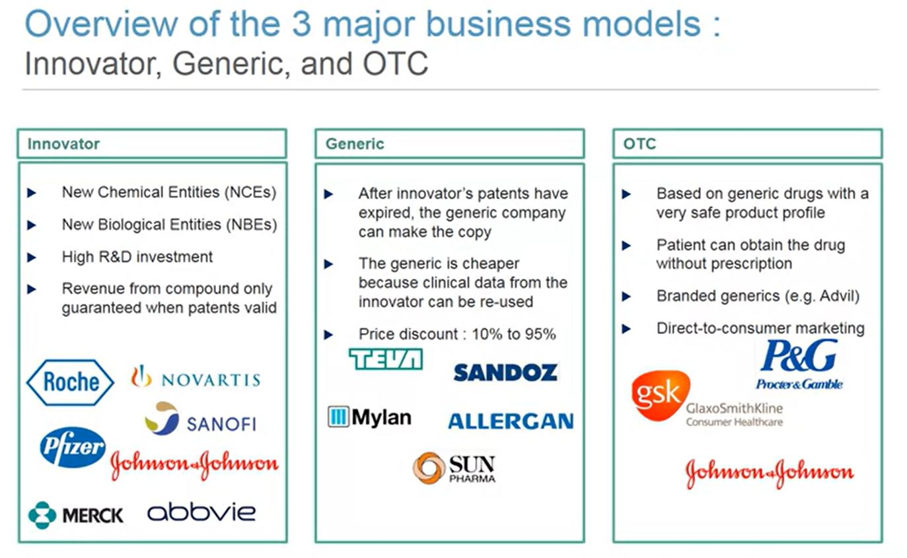
``` 

The strategy of the innovator is innovation based. One key feature is that sales are limited by the patent's life. Hence, there is a need to constantly refuel the pipeline


```{r , echo=FALSE, fig.align="center", out.width = '100%',fig.cap="Value Chains"}
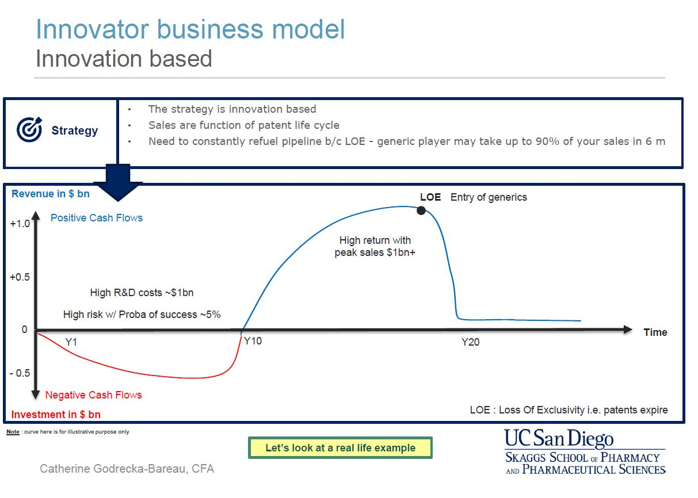
``` 

```{r , echo=FALSE, fig.align="center", out.width = '100%',fig.cap="Value Chains"}
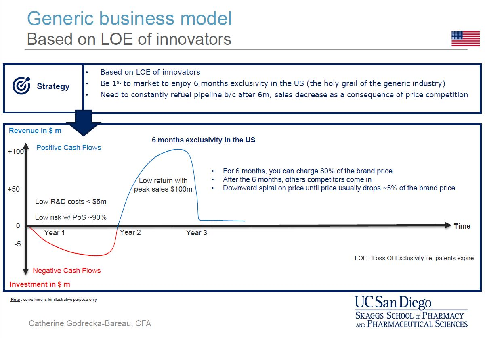
``` 

```{r , echo=FALSE, fig.align="center", out.width = '100%',fig.cap="Value Chains"}
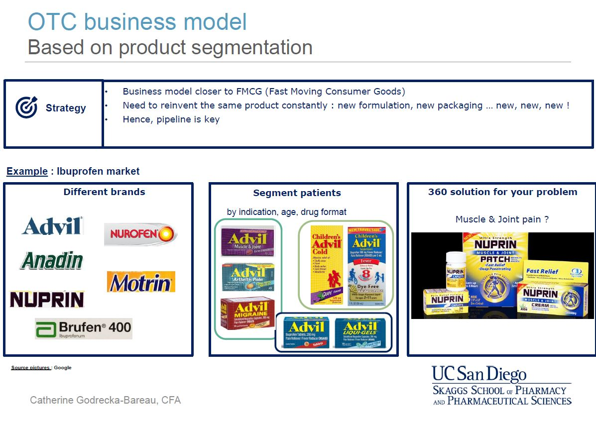
``` 

**Key take-aways**

* 3 major business models: Innovator, Generic, OTC
* 3 waysto refuela pipeline : In-House, In-Licensing, CompanyAcquisition
* The Net PresentValue (NPV) measureisthe golden standard usedto prioritizecompounds in a portfolio
* A well-balanced portfolio between short term projects and long-term projects is key for a healthy business
* Portfolio selectionisa product of cross-functional analysis that results in a decision matrix where risk and reward are balanced and the final selection of candidates is also function of the budget available


## Academic Industry partnership "Various models, Various outcomes"

Real challenges putting pressure on the traditional R&D model within Pharma

```{r , echo=FALSE, fig.align="center", out.width = '100%',fig.cap="Value Chains"}
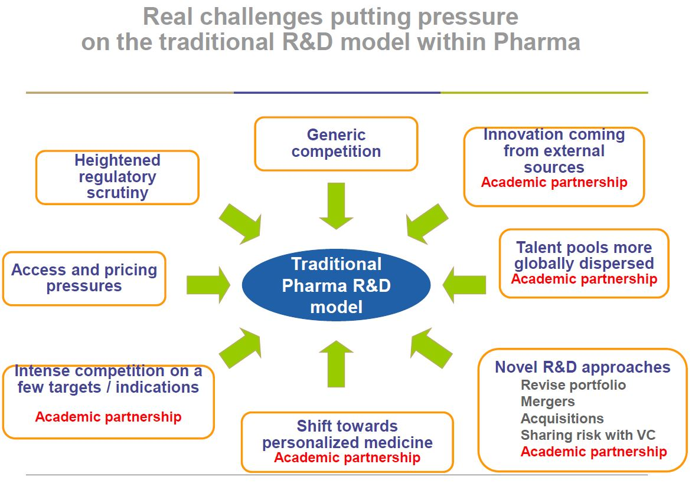
``` 

**Examples of what could be attractive for Pharma**

* Opportunity to diversify portfolio
* Access to leading research and disruptive science (potential game changer)
* Data exchange
* Target and new pathway expertise
* In vivo disease model expertise
* Access to database of patient

**Examples of what could be attractive for Academics**

* Translational applications of discovery
* Synthesis capacity + scale up
* Capacity to run parallel development
* Access to multidisciplinary development team
* Ability to move forward new investigational compounds, assay development.
* Access to chemistry library, HTS

**What should always be mutually discussed and agreed**

* Ownership of intellectual property
* Financial return arrangement
* Resource manpower
* Team contribution
* Deadlines
* Budget
* Deliverable

```{r , echo=FALSE, fig.align="center", out.width = '100%',fig.cap="Value Chains"}
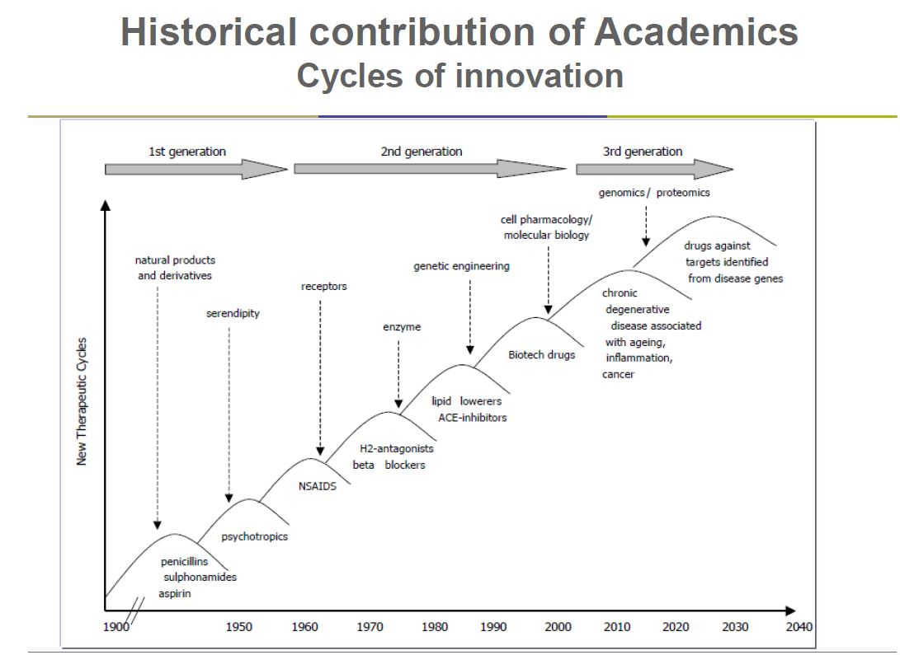
``` 

**Growing area of Innovation Potential game changer with Academic partners**

* MAbs.
    + Cancer, infectious disease, as well as inflammation and immune disorders. MAbs have also revolutionized our ability to diagnose disease
* Biomarkers technologies, Pharmacogenomics
    + Technology breakthroughs are accelerating the pace of biomarker discovery based on proteomics, genomics, metabolomics and imaging
    + Improved read-out of drug action
    + Companion diagnosis
    + Ability to segment a drug to the right patient population…and obtain reimbursement
* Stem Cells
    + Beyond cell therapy: Disease in a dish. Using various sources of stem cells that have been induced to differentiate into the specific type of cell required to repair damaged or destroyed cell populations or tissues. Deeper understanding of physiological & pathological control mechanisms
* RNA Interference
    + Using a cellular pathway to silence specific genes by preventing the translation of the proteins they encode
* Microfluidics, Nanotechnology
    + “From Lab in a chip, to lab in the body” : smaller sample volumes enabling more to be done with less (biopsies, electrolytes, protein, …)
    + Single cell highly multiplexed omic and phenotypic analysis
    + Drug delivery system
* Next generation DNA sequencing: nanopore/ nanochannel, electronic detection
* Imaging technologies: in vivo molecular analyses for interaction as well as temporal and spatial dynamics, medical imaging understanding of pathophysiology
* Analytical tools, computational science, big data integration, emergence of multiple predictive models, decision support system
* Drug Devices
    + Diagnostic tools, E medicine, Non invasive devices
    + Combination: Two or more regulatory-approved components as a single entity (coated stent)
    
**Clinical collaboration with Academics**    


* Clinical investigation (Drug devlpt)
    + Investigational drug phase (directly monitored Phase 1 or 2 or via CRO)
    + Sponsor IND Principal investigator, multi-centric trial,
    + Investigator IND
    + Registry of special population (long term follow-up)
    + Compassionate access
* Clinical investigation (Basic Medicine)
    + Prospective or retrospective cohorts, pharmaco-economic studies
    + Translational Medicine (Biological target identification, Phase 0, Biomarker identification/validation)
    + Exploratory trial (Proof of concept)
    + BioBanking investment : Clinical sample management can accelerate discoveries, lower the costs of research, identify disease mechanisms, and reduce the length and size of clinical trials
* Educational grants
    + Fellowship programs, workshop, conference, exchange of scientists


**Models widely used between Academics and Industry**

* Strategic Alliance with one University
    + Several investigators or global deal focused on particular disease
    + Master agreement,
    + Sponsor Research Agreement,
    + Discovery award system and Request For Proposal system
    + High level of exchange of material
    + Human aspect , alliance manager aspect.
    + Joint steering committee
    + Long term commitment if high level of feedback and deliverable
    + Necessity of a win-win situation
    + Could include project team within Pharma with Academic leadership
    + Go /No-go decision should be anticipated
* orporate Venture Capital (CVC)
    + Company helps Academic experts to start company focused on specific problem or platform, with additional support of private investors (could by in kind or cash investment)
    + Need clear timelines and exit predefined terms
* Corporate mini-lab within academic structure (biocluster)
    + Specific specialized platform developed within university by academic scientist and Pharma.
    + Pharma can provide devlpt capacity and resource + eventually manpower.
    + Collaborative research agreement. Leverage academic expertise
    + Allow proximity research with daily interaction
* Institute creation supported by Pharma
    + Pharma provides large donation to establishes a new center within institute with multiple investigators addressing the same problem. Sponsor may additionally funds the team that solves problem first. Competitive mode. (Gilead-Yale School Med, cancer therapy; GSK –Harvard Stem Cell)
* Competition, challenging RFP
    + Company solicits ideas/challenges from academic scientists, and selects most promising for further support (SRA or discovery award)
    + Competitive model
    + Award for possible drug candidate with a contribution of pharma to use computational molecule screen and to validate target based assays. (Eli Lilly Model; GSK Pharma in Partnership model)
* Industry/Government funded research centers.
    + Coalition Against Major Diseases (CAMD) a consortium under the Critical Path Institute. CAMD members (Academics, Pharma, Agencies, Patient advocacy group, & Research foundation contribute collectively)
    + Allow clarification of disease model, biomarker validation, and epidemiology (degenerative or rare disease)
    + CIRM model with Federal fund
Emerging models between Academic and Industry
* Academic Drug Discovery Centers (ADDC)
    + Industry entrepreneurs forming academic units, with commercial support. Mixed-ventures, scale down pharma model for small molecule discovery, synthetic chemistry, HTS, PK.
    + In general focus on orphan diseases (Moulder Center for Drug Discovery Research MCDDR Temple University).
    + Supports from Pharma are possible
* Risk sharing models
    + Companies and academic institutions share the control of a research project and split the contribution of resources and assets
    + Projects will involve co-development partners, such as contract research organizations (CROs), whose work will increase the technology probability of finding a corporate partner to bring the new products to market. (Evotec collab with Harvard and Howard Hugues Medical Institute to develop betacell regeneration program. All partners contribute financial resources or FTE/technology)
    
    
**Summary**

* Traditional relationships between Academy and Industry are being re-defined
* Collaboration between Pharma and Academics is natural and necessary for the benefit of all, including the patient (yourself)
* Innovative partnership models allow both Pharma & Academics to better find a way to work together
* There is not only one model, but several adaptation of various models
* Alliance Management, timeline and deliverables are key in the development of the relationship
* Failure is part of research and not an issue. Exit is fine if anticipated.
* High level of communication with the partner facilitate flexibility and allow to move to a next level of model when the relationship develops.

```{r , echo=FALSE, fig.align="center", out.width = '100%',fig.cap="Value Chains"}
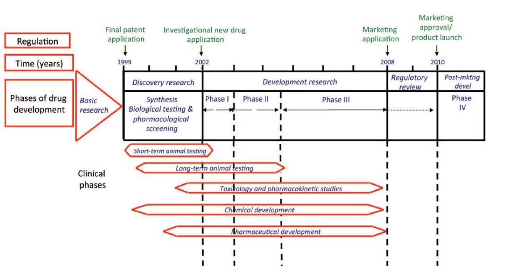
``` 


    